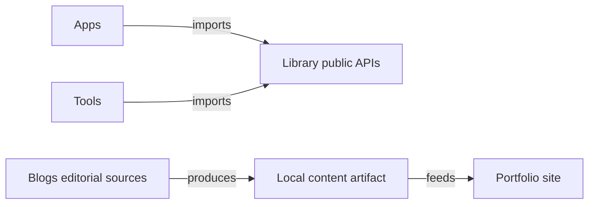

# TH-M Workspace

## Purpose

This Bun and Nx monorepo owns Thomas Valadez's personal sites, editorial work,
content-generation tools, and the small libraries that support them. Each
runnable project owns its source, tests, configuration, and generated output.

The root is also an Obsidian vault. Setup, commands, verification, and skill
routing live in the [workspace agent contract](AGENTS.md).

## Boundaries

The root owns workspace vocabulary and routing. Projects own implementation,
tests, and local contracts. A grouping directory is not an executable or an
Nx project unless its package manifest defines one. Repository conventions
describe responsibility; runtime permissions require separate enforcement.

## Ontology

| Owner | Meaning |
| --- | --- |
| [`apps/`](apps/README.md) | Deployable personal products and their content. |
| [`libs/`](libs/README.md) | Reusable, non-deployable capabilities with typed public APIs; `blogs` owns the essays' editorial content and publication pipeline. |
| [`tools/`](tools/README.md) | Local authoring and inspection tools, including explicit content generators. |
| [`netlify/`](netlify/README.md) | Delivery documentation and remaining hosting setup for app-owned artifacts. |
| [`.agents/skills/`](.agents/skills/README.md) | Reusable repository procedures selected for a task. |

An **app** produces a site artifact, a **tool** provides local authoring or
content generation, and a **library** provides reusable capabilities or content
without owning a deployable product. Nx
projects are configured in their package manifests; structural directories are
documentation and routing boundaries rather than coordinator projects.

### Ownership and identity

| Concept | Encoded by | Responsibility |
| --- | --- | --- |
| Project | `package.json` → `nx.name` | Source, tests, targets, and artifacts with one accountable owner. |
| Package | Manifest `name` and `exports` | Supported consumer interface, usually `@th-m/<name>`. |
| Domain | Existing `domain:*` tag and owner README | The owned subject, such as knowledge, blogs, or design. |
| Runtime | Existing `runtime:*` tag and export contract | Where an entrypoint can execute. A React-free `core` export may have narrower dependencies than its package. |
| Target | Package script and Nx metadata | An operation such as `test`, `gen`, or local `publish`. |
| Artifact | Owner-defined output path | Generated result with explicit consumers, derived from authoritative source. |

Keep the existing `apps/<name>`, `libs/<name>`, and `tools/<name>` grammar.
A new project expresses a real public API, runtime, ownership, or verification
boundary, not taxonomic symmetry. Existing IDs and tags come from manifests,
not guesses from paths. Tags alone do not enforce imports or permissions.

### Relationships

Apps and tools consume library public APIs. Libraries may consume libraries
while preserving runtime compatibility and avoiding dependency cycles; they
never import app or tool source. Shared behavior belongs in a library.

`blogs` owns prose and publication selection; `portfolio` owns site composition.
Drafts, evidence, and notes remain private unless explicitly exposed by the
owner's publication contract. Import dependencies, artifact flows, and agent
delegation are different relationships.

### Documentation and agents

| Surface | Owns | Routes to |
| --- | --- | --- |
| README | Purpose, boundaries, concepts, relationships, and their representations | AGENTS for operation. |
| AGENTS | Local workflow, required checks, invariants, skills, and child contracts | README for meaning; skills for reusable procedures. |
| SKILL | Task selection, reusable procedure, inputs, and expected results | Owner contracts for local obligations. |
| Role graph | Named team, role IDs, responsibilities, and delegation parents | Team skill for coordination; owner contracts for local work. |
| Plan/investigation | Proposed work, evidence, decisions, and unfinished acceptance | Maintained contracts for current behavior. |
| Delegated task | Bounded assignment with a responsible role and owner | Coordinator for integration and completion. |

Parents route; children add local detail without copying parent definitions.
Skills organize work but never become production-code owners. A role is reusable
responsibility, a task is one assignment, and evidence supports a claim.

[`agents-graph.json`](agents-graph.json) is the canonical **Thom Blog** role
roster. Its version-1 graph retains the architect, researcher, writer, designer,
and developer roles. The [team skill](.agents/skills/thm-team/SKILL.md) supplies
the reusable coordination procedure. Graph parents are delegation relations,
not a task schedule, and tool deny lists describe requested restrictions;
this repository has no graph runner or permission-enforcement adapter.

The [team investigation](libs/blogs/agent-team-investigation.md) remains a
runtime proposal. Repository skills provide procedures, not a scheduler,
durable execution service, or permission system.

## Key Terms

- **Owner:** the nearest app, tool, or library responsible for source, tests,
  configuration, and operational documentation.
- **Publish:** build an app- or library-owned local artifact in `dist`; it does
  not deploy remotely.
- **Generate (`gen`):** derive owner-defined artifacts from explicit input;
  supported outputs and targets vary by owner.
- **Start:** launch the local authoring or development experience.
- **Canonical verification:** the owning project's `typecheck` and unit `test`
  targets.
