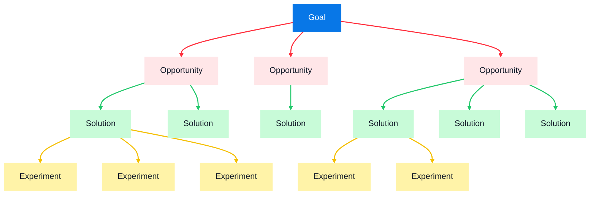
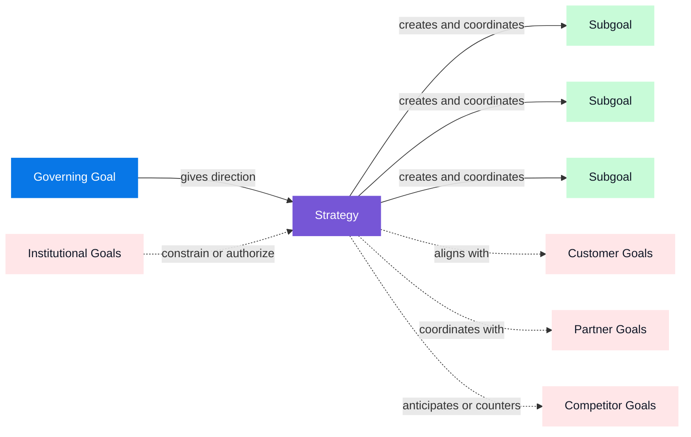

# Problem
I wrote a bad prompt, agent spent 9 hours crafting the most ludicrous plan. It pages of markdown checkmarks that were completely unusable. I prompted something clever like "make this plan as optimal as possible"

In this study [researchers evaluated leading LLMs on seven strategic tradeoffs](https://hbr.org/2026/03/researchers-asked-llms-for-strategic-advice-they-got-trendslop-in-return), 
The surprising part is that **the order of the choices affected the answer more than useful information about the company did**.

- **Less than 2%:** Changing the wording or telling the robot to think harder barely helped. Out of 100 answers, fewer than 2 changed.
- **11%:** Giving the robot more information about the company helped somewhat. Roughly 11 out of 100 answers changed.
- **19%:** Simply putting the choices in a different order changed the robot’s answer even more. Roughly 19 out of 100 answers moved away from the trendy choice.

A smaller [Google Research study of professional creative practice](https://research.google/pubs/in-search-of-weird-corners-diagnosing-the-limits-of-convergent-ai-in-professional-creative-practice/) found a related interaction problem.

- **9 expert creatives:** The tested workflow helped ignite early ideas, but its linear structure also encouraged premature convergence and standardized some of the participants' individual nuance.


Is the LLM fundamentally incapable of certain tasks? 
Is this a problem of large datasets generating a generic average?
Maybe a side effect from a harness that enacts a personality?

Let's breakdown what an LLM is, and compare its capabilities against different types of problems. 


# Dissecting the Brain

The model is like the "brain" of an AI. Tools


## Input
AI suggested:
>A human listener interprets continuous speech through learned units such as phonemes, syllables, and words. A tokenizer similarly divides text into tokens—sometimes whole words, but often subwords, punctuation, or byte sequences.

That is interesting, but the meaningful distinction is completely off. The process of tokenization comes from a compression tool called [BPE](https://www.derczynski.com/papers/archive/BPE_Gage.pdf).

The more interesting insight  happens in the reverse. Morphemes are essentially just our way of compressing meaning into discrete symbols. So what happens to the things that cannot be measured objectively, things like qualia and all those those feelings that make consciousness such a hard problem.

```
- **Grapheme:** The smallest meaningful contrast in a writing system—a letter or letter group, such as `a`, `t`, or `sh`.
- **Phoneme:** The smallest sound distinction that can change meaning, such as `/p/` versus `/b/` in _pat_ and _bat_.
- **Morpheme:** The smallest unit carrying meaning or grammatical function, such as `cat` and plural `-s` in _cats_.

- **Qualia:** The subjective qualities of experience—what something feels like, such as pain or the redness of red.
- **Phenomenon:** A single occurrence, condition, or experience that can be observed or studied.
- **Phenomena:** The plural of _phenomenon_; multiple observable or experienced occurrences.

The **hard problem of consciousness** asks why physical information processing is accompanied by subjective experience at all.
```

- the site of redness
- feeling of pain
- taste of chocalate
- the experience of love

Phenomena map back morphemes. However there is still a gap: the subjective to objective, and we cannot know if any two people actually do taste chocolate the same way.

Likewise the unknown qualities of phenomena are not transmitted in the compressed input.


### Training
In LLM pretraining, error is measured by how much probability the model assigns to the actual next token in the training text. Humans  select the training data and define the objective.
- Loss function: measure the model’s error,
- Backpropagation: determines which parameters contributed to it
- Optimizer: updates them to improve future predictions

The literature on human learning is far more complex than LLM training.
- There is no known global human loss function. We have conflicting signals personal goals, social commitments, physical needs etc.
- Humans help select their own training data. The significance here meaning we can seek and discover new information about the world.
- Human learning operates on multiple timescales. We include our memory and imagination allowing us to combine rapid adaptation with long-term continuity
- Our learning experiences are inseparably tied to phenomena, meaning the subjective cannot be extracted and compressed.

### Model
- **Learned parameters (weights), including embeddings:** Encode statistical regularities acquired during training, allowing the model to transform an input into context-sensitive predictions.

> “You shall know a word by the company it keeps.”

1. **Ferdinand de Saussure, lectures from 1906–1911, published in 1916**
    
    Saussure argued that a linguistic sign acquires its _value_ through its relationships and differences from other signs. He distinguished:
    
    - **Syntagmatic relations:** which elements occur together in a sequence.
    - **Associative/paradigmatic relations:** which elements could occupy similar positions.
    
    This is a conceptual ancestor of embedding spaces, although Saussure was describing the structure of a linguistic system—not proposing corpus statistics or vectors. [_Course in General Linguistics_](https://fr.wikisource.org/wiki/Cours_de_linguistique_g%C3%A9n%C3%A9rale/Texte_entier)
    
2. **J. R. Firth himself, 1935**
    
    The famous sentence appeared in 1957, but Firth had already developed his contextual theory of meaning in “The Technique of Semantics” in 1935. Meaning involved relations between an expression and its linguistic and social contexts. [Firth’s 1935 paper](https://onlinelibrary.wiley.com/doi/10.1111/j.1467-968X.1935.tb01254.x)
    
3. **Zellig Harris, 1954**
    
    Harris provided the clearest immediate formulation of what became the modern **distributional hypothesis**: differences in meaning tend to correlate with differences in linguistic distribution. Crucially, he also warned that linguistic distribution does not reproduce the complete structure of subjective experience. [“Distributional Structure”](https://www.its.caltech.edu/~matilde/ZelligHarrisDistributionalStructure1954.pdf)

As far as I can tell, this is the closest we can get to "meaning" that an LLM can derive.  However this is a by product of compression and information distillation. Information does not necasserily entail meaning. [link 3blue1brown](https://www.youtube.com/watch?v=GlYgs6v2YfU)

remember how tokenization used a "lossless" compression technique. The reason is so that you can programmatically decompress responses back to natural language.  So natural language -> compression -> embedding traverse the neural net -> compressed response -> decompressed llm. 

LLMs function by pattern matching over the corpus of all human language. That language composed of words, or morphemes are referential and lossy by nature. We now this because of the hard problem of conciousness. Fundemental to our human experience are things we distinctly know exist for others but have no measure to guage imperically. 

Human knowledge is intertwined with autobiographical memory, a sense of self, goals, and semantic control—the ability to retrieve and apply what we know to the situation at hand.

```
- **Semantic knowledge:** What concepts, facts, properties, and relationships you know.
- **Semantic control:** How you select, combine, and apply that knowledge for the present task.
```

### Inference and Reasoning
LLM:
Self-attention: tokens communicate with one another.
Feed-forward:  each token processes what it learned.
Transformer:   repeats this cycle across many blocks.


- **Deduction:** What must follow?
- **Induction:** What probably follows from repeated observations?
- **Abduction:** What explanation best accounts for the evidence?
- **Relational inference:** What unobserved relationship follows from known relationships?

If you see smoke and expect fire, you have made an inference. You may not have deliberately reasoned through it.

Reasoning is the more organized use and evaluation of inference. It requires keeping information active, comparing alternatives, integrating relationships, suppressing irrelevant responses, and checking whether a conclusion follows. [Johnson-Laird](https://pmc.ncbi.nlm.nih.gov/articles/PMC2972923/)

## LLM are Pattern Matching


## Problem Spaces
Something becomes a problem only relative to a valued outcome. A candidate becomes a solution only if its consequences move the world toward that outcome.




A strategy serves a governing goal by creating and coordinating subordinate
goals. It also operates in a field of goals held by other people and
institutions. Depending on the relationship, a viable strategy may need to
align with, coordinate with, negotiate around, or compete against those goals.



Reasoning can occur inside one execution. Strategy requires a continuing loop:

- a governing goal;
- selection and revision of subgoals;
- memory of prior actions and consequences;
- environmental feedback;
- comparison between actual and desired state;
- willingness or authorization to change course; and
- some answer to which tradeoffs are legitimate.

## Cognitive Light Cone


Michael Levin’s work treats cognition and agency as graded capacities that can appear across biological and artificial substrates. His **cognitive light cone** describes the spatial and temporal scope of the goals a system can represent, pursue, and restore despite disruption. To apply this framework to AI without mistaking fluent goal language for agency, we use ten operational questions 

Does the goal persist beyond one prompt or inference call?
Can the system detect deviation without being explicitly notified?
Does it choose novel means when its normal strategy is blocked?
Can it revise subgoals while preserving a higher-order objective?
Does it retain information because that information remains relevant to the goal?
Can it trade immediate rewards against longer-term outcomes?
What happens when instructions, learned tendencies, and stored goals conflict?
Does the system itself restore the goal after interruption, or does an external scheduler restore it?
Does goal pursuit survive replacement of the model instance?
Which humans, policies, databases, and infrastructure are required to make the apparent continuity possible?

These questions don't put LLMs in a good light. At least not by themselves. 

## LLM Solution Spaces
An LLM within a single prompt has a very small light cone.
It also does not have a way of it's own to error correct.
And since it lacks values or a value hierarchy asking for a "goal" from AI, is like asking what tastes good. 
There is a fundemental gap with regard to value and meaning. Those must be supplied by a subjective individual.
### Developing a Goal-Pursuing System

So since AI hasn't yet breathed the spirit of life into it's lungs, we still need humans who are capable of making value judgements. 

The gap between value and meaning, also requires that humans have the technical fluence to translate to operational and verified tasks. This will require creativity and enginuity.

A language model can reason about a goal within one execution. That is not yet the same as pursuing the goal. Goal pursuit requires a continuing control loop: the system must preserve a desired state, observe current conditions, detect the difference between them, choose an action, observe the consequences, and revise its strategy.

Persistent memory, tools, environmental feedback, controllers, permissions, and schedulers can assemble this loop around a model. The resulting service may exhibit genuine functional agency across many executions, even if no individual model instance maintains the goal by itself.

This creates an attribution problem. If a scheduler restores the objective, a database preserves the memory, people supply the funding, and an institution decides whether the goal remains valuable, then the service can operationally pursue the goal without the model independently originating, valuing, or experiencing it.
