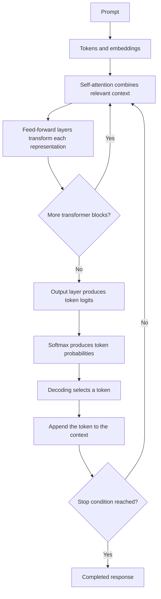

# How an LLM Turns Context Into a Response

An LLM does not usually construct an entire response and then reveal it. It
generates a response one token at a time, repeatedly transforming the current
context into a probability distribution over what might come next.

Consider the prompt:

> The capital of France is



## 1. Tokens Become Numerical Representations

The tokenizer divides the prompt into tokens. Each token ID is mapped to an
**embedding**: a learned vector of numbers that the model can process. Position
information is also added so the model can distinguish the order of the
tokens.

```text
“The”  “capital”  “of”  “France”  “is”
  ↓        ↓        ↓       ↓       ↓
vectors representing each token and its position
```

At first, the vector for `France` identifies that token, but it does not yet
fully represent what `France` means in this sentence. Transformer blocks make
these representations contextual.

## 2. Self-Attention Combines Relevant Context

Self-attention lets each position determine which available positions are
relevant to interpreting it. From every token representation, the model
produces three new vectors:

- **Query:** What information is this position looking for?
- **Key:** What kind of information does this position contain?
- **Value:** What information should this position contribute if selected?

The model compares a position's query with the keys of the available tokens.
Stronger matches receive larger attention weights. It then constructs a
weighted combination of their values.

At the final position in the example, attention might emphasize `capital` and
`France`:

```text
“capital” ───────┐
                 ├──→ contextual representation at “is”
“France” ────────┘
```

The resulting representation no longer reflects only the isolated word `is`.
It now carries information resembling:

> Complete a statement about the capital associated with France.

A transformer uses multiple **attention heads**, allowing it to track several
kinds of relationships at once, such as syntax, reference, position, topic,
and conceptual association. A **causal mask** prevents a position from
attending to future tokens that have not yet been generated.

## 3. Feed-Forward Layers Transform the Result

Attention communicates and combines information between token positions. The
feed-forward network then transforms each contextualized token representation
independently.

```text
contextual representation
  ↓
expand into a larger feature space
  ↓
activate relevant learned features
  ↓
combine them into a refined representation
```

The operation is approximately:

\[
\operatorname{FFN}(x) = W_2\,\operatorname{activation}(W_1x + b_1) + b_2
\]

The matrices \(W_1\) and \(W_2\), and the biases \(b_1\) and \(b_2\), contain
parameters learned during training. In this example, the feed-forward network
might strengthen features associated with a factual completion, a
country–capital relationship, France, and the expectation of a place name.

This does not imply that one parameter contains the fact “Paris is the capital
of France.” Such associations are generally distributed across many
parameters, attention heads, and layers.

## 4. Transformer Blocks Repeat the Operations

A transformer contains many blocks that alternate attention and feed-forward
operations:

```text
self-attention → feed-forward → self-attention → feed-forward → …
```

Each block progressively refines the token representations. Attention gathers
contextually relevant information; feed-forward layers transform what that
information implies.

**Residual connections** preserve the earlier representation around each
operation, allowing a layer to add a refinement instead of replacing
everything already represented. **Normalization** helps keep those
representations numerically stable as they pass through the network.

## 5. The Final Representation Becomes Token Probabilities

After the last transformer block, the representation at the final position
summarizes information relevant to predicting the next token. An output layer
converts it into one raw score, called a **logit**, for every token in the
vocabulary.

| Possible token | Illustrative logit |
| --- | ---: |
| `Paris` | 9.2 |
| `Lyon` | 4.1 |
| `France` | 2.8 |
| `blue` | -1.3 |

Softmax converts these logits into a probability distribution:

| Possible token | Illustrative probability |
| --- | ---: |
| `Paris` | 96% |
| `Lyon` | 2% |
| `France` | 1% |
| Everything else | 1% |

## 6. Decoding Selects the Next Token

Decoding determines which token to use from the probability distribution.

- **Greedy decoding:** Selects the highest-probability token.
- **Sampling:** Selects randomly according to the predicted probabilities.
- **Temperature:** Controls how concentrated or varied the selection is.
- **Top-k sampling:** Restricts selection to the *k* most probable tokens.
- **Top-p sampling:** Restricts selection to a group of tokens whose cumulative
  probability reaches a chosen threshold.

Suppose decoding selects `Paris`. That token is appended to the context:

> The capital of France is Paris

The model then repeats the operation to predict what comes after `Paris`,
perhaps a period:

```text
“The capital of France is”
              ↓
           “Paris”
              ↓
              “.”
              ↓
        next token …
```

Generation continues until the model selects a stopping token or reaches
another limit. Implementations commonly use a **key-value cache** to reuse
attention information from earlier tokens rather than recalculating all of it
from scratch during every step.

## How the Process Moves Toward a Response

- **Self-attention** gathers information relevant to the current context.
- **Feed-forward layers** transform that information into more useful internal
  features.
- **Repeated transformer blocks** progressively refine the representations.
- **The output layer and softmax** turn the final representation into token
  probabilities.
- **Decoding** selects a continuation and adds it to the context.
- **Repetition** lets every generated token influence the prediction that
  follows it.

The model therefore moves toward a coherent response through accumulated,
context-conditioned predictions. It does not necessarily compose the complete
answer in advance; each selected token changes the context from which the next
token is predicted.
