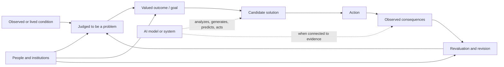

# Solutions, Meaning, and Value

## Draft 3 Outline

### Status

This is a structural experiment derived from Draft 2. Draft 2 remains source
material for the technical comparisons. The retired product-opportunity outline
in `notes/` is not the governing direction for this version.

### Governing question

> How could I predict—before wasting time and tokens—what kinds of problems an
> AI system is actually equipped to solve?

### Working thesis

> An AI output becomes a solution only within a larger loop that identifies a
> problem, supplies a valued outcome, evaluates consequences, and revises its
> judgment. AI can perform meaningful functions throughout that loop, but its
> suitability for a problem depends on which parts are present in the model,
> which are supplied by surrounding systems, and which still depend on human
> experience, values, and accountability.

Functional similarity between humans and AI does not establish mechanistic or
experiential identity. That philosophical boundary matters, but the practical
question does not require proving whether AI is conscious. It requires locating
the experience, memory, goals, feedback, valuation, and authority a particular
problem demands.

### Reader promise

By the end, the reader should have a practical way to decide whether a task is:

- well suited to a model;
- well suited to an AI system with memory, tools, and feedback;
- useful only as a human–AI collaboration; or
- unsafe or incoherent to delegate because the system has not been given the
  information, value criteria, continuity, or authority the task requires.

## 1. The Expensive Category Error

Open with the author's actual frustration: a week of tokens spent trying to
force a model through work it was poorly configured to do. Then introduce the
two videos that supplied evidence after the fact:

- [*Researchers Asked LLMs for Strategic Advice. They Got “Trendslop” in
  Return*](https://hbr.org/2026/03/researchers-asked-llms-for-strategic-advice-they-got-trendslop-in-return)
- [*In Search of “Weird Corners”: Diagnosing the Limits of Convergent AI in
  Professional Creative Practice*](https://research.google/pubs/in-search-of-weird-corners-diagnosing-the-limits-of-convergent-ai-in-professional-creative-practice/)

Use the video titles as the provocative hook, but not as the article's factual
language. The studies concern bounded failures in strategic recommendation and
creative workflow; they do not establish that AI lies, cannot create, or is
globally inferior to humans.

Ask the central practical question:

> Could I have predicted the mismatch from the structure of the problem and the
> structure of the system, before seeing the benchmark or burning the tokens?

Do not begin with determinism, AI girlfriends, or a universal consciousness
debate. Preserve that material as a possible later example of felt and normative
meaning, but keep the opening attached to the problem-fit question.

## 2. A Solution Is Already a Value Judgment

The first conceptual move is to challenge the apparently neutral word
*solution*.

A condition does not identify itself as a problem. A changed condition does not
identify itself as better. An action is only a solution relative to both a
problem description and a valued outcome.



The diagram should not imply that AI can participate only in solution
generation. It can help observe, frame, predict, act, and evaluate when the
larger system provides the relevant channels. The claim is that no candidate
solution supplies its own governing value premise.

### The value bridge

This is the bridge the article must carry through every later section:

> **Problem-solving capacity is instrumental value. It inherits its importance
> from the problem being solved and the outcome being pursued. A theory of
> solutions therefore needs a second account of why the problem matters, why
> the outcome is better, and whose judgment governs the tradeoffs.**

James Lindsay's problem-solving theory says that a good or service is valuable
in relation to its ability to solve problems for people. That is a useful
product and engineering intuition, but it does not terminate the inquiry. It
raises the next questions: which people, which problems, which consequences,
and why those outcomes should count as improvements.

Introduce the relevant theories briefly and defer their detail to
[`notes/theories-of-value.md`](../notes/theories-of-value.md):

- Marx asks how commodity value is constituted and regulated within capitalist
  production.
- Menger asks how goods acquire subjective importance through need satisfaction
  and scarcity.
- Lindsay centers a good's capacity to solve a consumer's problem.
- Dewey treats valuation as inquiry that forms and revises ends inside a
  problematic situation.
- Service-dominant logic locates value in use and context, co-created with the
  beneficiary.
- Sen asks whether people gain substantive capabilities to do and become things
  they have reason to value.
- Axiology asks what is intrinsically, prudentially, or normatively good rather
  than merely useful as a means.

Transition: to know which parts of this loop an AI can perform, first specify
what is meant by *the AI*.

## 3. What System Are We Evaluating?

Establish the system boundary before making claims about capability, memory,
goals, or agency.

```text
AI system =
    trained model
  + runtime context
  + persistent memory
  + retrieval
  + tools and sensors
  + controller and delegated objective
  + environmental feedback
  + people, policies, permissions, and infrastructure
```

Distinguish at least:

1. one transformer inference pass;
2. a model operating within a context window;
3. an agent loop with tools and external records;
4. a deployed service with schedulers, monitoring, and permissions; and
5. the organization that funds, directs, evaluates, and restarts the service.

The attributed capacity changes with the boundary. A base model may be
stateless between invocations while the service has durable records. The
service may appear to pursue a multi-year goal because an institution preserves
the goal and repeatedly instantiates the model.

Key line:

> Before asking whether AI can solve a problem, identify the system being asked
> to remember it, care about it, act on it, and notice when the world changes.

## 4. A Functional Map of Human and AI Cognition

Present the comparison as functional roles, not equivalent components. The
categories in Draft 2 are valuable, but they mix resources, processes,
artifacts, and higher-level capacities. Make that asymmetry explicit.

### 4.1 Captured data versus situated experience

Reuse the Draft 2 explanation of data selection, tokenization, encoding, and
embeddings, but compress the implementation detail.

Core distinction:

- Tokenization segments already captured information.
- Human perception is continuous, multimodal, embodied, affectively weighted,
  and coupled to action.
- A record about a condition is not the condition as lived.

Problem-fit implication: a model is weakest when decisive evidence is tacit,
unrecorded, bodily, locally changing, or available only through participation.
Additional sensors and tools can reduce an information gap without establishing
phenomenal experience.

### 4.2 Training and adaptation versus human learning

Reuse the loss, backpropagation, optimizer, biological credit-assignment, and
consolidation material.

Core distinction:

- Training produces durable parameter changes under a designed objective.
- Context changes current behavior without ordinarily changing model weights.
- External memory changes the assembled system without necessarily changing the
  model.
- Human experience, action, learning, and consolidation remain intertwined
  across time.

Problem-fit implication: determine whether the task requires temporary
adaptation, durable memory, continual learning, or revision from real-world
consequences. Do not treat all four as the same capability.

### 4.3 Learned parameters and records versus memory and knowledge

Rename Draft 2's “Model vs Knowledge” section because its own analysis arrives
at a more precise analogy.

Core distinction:

- Trained parameters are durable dispositions produced by past optimization.
- A weight is not a fact, just as a synapse is not a belief.
- Usable AI knowledge can depend on parameters, active context, retrieved
  records, procedures, and tools.
- Persistence is not autobiographical recollection, and retrieval is not
  ownership of an experience.

Problem-fit implication: inspect what must persist, how it will be retrieved,
who maintains it, and what happens when the model instance is replaced.

### 4.4 Inference-time computation versus reasoning

Retain this as the strongest technical distinction from Draft 2.

Core distinction:

> Inference is the execution process. Reasoning is a higher-level function that
> some inference-time computation can realize.

A model can perform functionally recognizable reasoning through context,
autoregression, intermediate representations, search, code, tools, and
verification. A generated explanation is not necessarily a faithful causal
record of that computation.

Problem-fit implication: reasoning competence is conditional on framing,
premises, goal criteria, verification, and access to corrective feedback. One
successful inference episode does not establish persistent agency.

### Section synthesis

End the comparisons with a recurrent cognitive loop rather than a static list:

> **Sense → perceive → attend → remember → simulate → reason → act → learn.**

Knowledge supports the loop. Goals and affect direct it. Metacognition monitors
it. Qualia describes whether and how any of it is experienced. An AI system may
implement selected functions through different mechanisms, but task suitability
depends on whether the required loop is actually closed.

## 5. Where Meaning and Value Enter the Loop

Separate kinds of meaning that are often collapsed:

| Level | Working question |
| --- | --- |
| **Statistical information** | Does one signal reduce uncertainty about another? |
| **Semantic meaning** | What does the representation refer to or distinguish? |
| **Functional significance** | Does the information affect success relative to a goal? |
| **Phenomenal meaning** | Does it feel significant, painful, beautiful, or urgent to a subject? |
| **Normative value** | Is the goal worth pursuing, and are its consequences acceptable? |

The article can make bounded claims about the first three without resolving
machine consciousness. Functional significance is testable by intervention:
remove or corrupt the information and observe whether goal achievement
deteriorates.

But functional success does not establish felt or normative significance:

```text
acts as if it cares ≠ experiences caring
achieves a supplied goal ≠ establishes that the goal is worth pursuing
```

Return to the value bridge: a system may optimize a criterion perfectly while
the criterion poorly represents the experience or value it was meant to serve.

## 6. From Reasoning to Strategy

Define strategy using the existing research note:

> Strategy is the goal-directed coordination of cognitive operations and
> actions over time. It can combine inference, prediction, planning, valuation,
> action selection, and revision in response to feedback.

Reasoning can occur inside one execution. Strategy requires a continuing loop:

- a governing goal;
- selection and revision of subgoals;
- memory of prior actions and consequences;
- environmental feedback;
- comparison between actual and desired state;
- willingness or authorization to change course; and
- some answer to which tradeoffs are legitimate.

An AI can implement part of a strategy without originating the governing end
or bearing its consequences. This is where the value bridge becomes an agency
question: who supplies the goal stack, and to whom do the results matter?

## 7. The Cognitive Light Cone

Introduce Michael Levin's Cognitive Light Cone as a framework for measuring the
spatial and temporal scope of goals a system can robustly pursue. It concerns
functional agency, not proof of consciousness.

Condense the ten experimental questions from Draft 2 into four reader-facing
tests:

### Persistence

- Does the goal survive one prompt, one execution, or replacement of the model
  instance?
- What restores it after interruption?

### Error correction

- Can the system detect deviation without being explicitly told?
- Does it use consequences to revise its behavior?

### Flexible pursuit

- Can it choose novel means when blocked?
- Can it revise subgoals while preserving a higher-order objective?

### Ownership and boundary

- Which model, controller, memory, scheduler, person, policy, and institution
  supply persistence and authority?
- Which layer determines whether the goal remains valuable?

Governing conclusion:

> An AI service can exhibit a large operational light cone while that light
> cone still belongs to the assembled institution rather than the model. Measure
> the agency of the specified system, then attribute its goals only after
> locating the source of their persistence, authority, value, and consequences.

## 8. Strategy and Creativity as Test Cases

Return to the sources promised in the opening. They become demonstrations of
the framework rather than universal verdicts on AI.

### 8.1 Strategic advice and “trendslop”

Use the HBR research to examine a task where:

- the relevant goal is contested or incompletely specified;
- several strategic tensions can be rational under different conditions;
- local organizational evidence matters;
- the recommendation must balance consequences across time; and
- polished language can conceal dependence on prompt order or culturally common
  strategic patterns.

Interpretation: the model can organize reasons and generate alternatives, but a
plausible recommendation is not evidence that the system independently grounded
the goal, obtained the decisive local facts, or selected the acceptable
tradeoff.

### 8.2 Creativity and premature convergence

Use the Google “Weird Corners” study to examine a task where discovery may
require:

- sustaining ambiguity;
- preserving personal or situated nuance;
- exploring low-probability directions;
- receiving constructive friction; and
- delaying convergence on a clean answer.

Interpretation: next-token generation can produce novelty, but a workflow
optimized for helpful resolution may close the search before the human has
discovered what is worth pursuing.

### Combined lesson

These cases were predictable from the framework. Both depend on more than
producing coherent possibilities. They require a well-specified goal or a
productive way to revise it, situated evidence, evaluative judgment, feedback,
and control over when to converge.

## 9. A Practical Test for AI Problem Fit

Give the reader a compact diagnostic before delegating work.

### Problem and value

1. Who experiences or identifies the problem?
2. What outcome would count as better, and according to whom?
3. Are the governing values explicit, contested, or hidden inside a metric?

### Evidence and world connection

4. Does the system have the current evidence required to frame the problem?
5. Can it observe consequences, or only manipulate a static representation?

### Memory and learning

6. What must persist across steps, sessions, or months?
7. Can the system update from feedback in the way the task requires?

### Reasoning and verification

8. Can candidate outputs be checked against external constraints?
9. Is failure detectable, reversible, and inexpensive?

### Agency and accountability

10. Which system maintains the goal and notices deviation?
11. Who is authorized to change the goal, accept a tradeoff, or act?
12. Who bears the consequences when the solution is wrong?

Offer a simple classification:

- **Strong fit:** the goal is specified, evidence is available, outputs are
  verifiable, feedback is timely, and failure is reversible.
- **Collaborative fit:** framing or value judgments remain human, while AI
  expands search, analysis, implementation, and testing.
- **System-design problem:** the model may be capable, but memory, tools,
  feedback, permissions, or evaluation are missing.
- **Delegation failure:** the task asks the system to invent governing values,
  infer unavailable lived context, or assume accountability it cannot hold.

## 10. Closing: Locate the Missing Function

Return to the wasted tokens. The mistake was not simply overestimating
intelligence. It was treating a model as though it contained the complete loop
required by the problem.

Candidate closing:

> The question is not whether AI can solve problems. It clearly can. The
> question is which parts of the problem-solving loop it actually contains—and
> which parts are being silently supplied by you.

An AI does not have to think like a human to be useful. It does not have to be
proved unconscious for its limits to be measurable. But a solution-shaped
answer is not yet a solution. It becomes one only when it connects a real
condition to a valued outcome, survives contact with consequences, and remains
answerable to someone capable of revising the goal.

End on the Cognitive Light Cone:

> AI can enlarge the cognitive light cone of a person or institution without
> inheriting the experience, values, or responsibility that gave the work its
> direction.

## Drafting Decisions Still Open

- Decide whether the AI-companionship example earns a short place under
  phenomenal meaning or remains a separate future essay.
- Keep the value-theory survey compact in the article; use the detailed note as
  the research base.
- Decide how much transformer implementation detail the intended audience needs
  after each comparison has been tied to a problem-fit consequence.
- Validate every empirical claim and replace video-title rhetoric with the
  primary-source language before publication.
- Consider whether the final article should retain “Solutions, Meaning, and
  Value” or adopt a title that foregrounds predicting AI problem fit.
