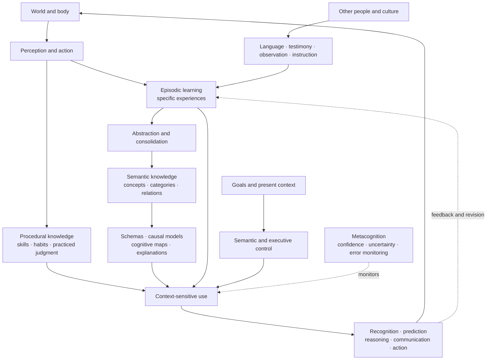

# Human Knowledge

## Research Synthesis

Human knowledge is not a stored collection of facts. It is a family of
capacities that lets a person recognize, remember, explain, predict, perform,
communicate, and act.

A second distinction is essential:

> The brain can represent beliefs, models, and associations whether they are
> true or false. In the philosophical sense, knowledge requires some reliable
> connection to truth; neuroscience generally measures what a person can
> represent and use, not whether it genuinely qualifies as knowledge.

## Functional Map



## Varieties of Human Knowledge

| Form | Meaning | Principal cognitive basis |
| --- | --- | --- |
| **Knowing that** | Propositional or factual knowledge: “Water freezes near 0°C under ordinary pressure.” | Semantic memory, language, evidence, and inference |
| **Knowing how** | Skills such as riding a bicycle, interviewing a customer, or debugging software | Procedural learning and practiced perception–action loops |
| **Knowing by experience or acquaintance** | Familiarity with a person, place, pain, material, or situation | Episodic, perceptual, affective, and social experience |
| **Knowing what happened** | Temporally and spatially situated personal events | Episodic and autobiographical memory |
| **Knowing relationships** | Categories, schemas, causal models, and structural connections | Semantic cognition, hippocampal–cortical integration, and abstraction |
| **Knowing what one knows** | Confidence, uncertainty, and awareness of limitations | Metacognition and performance monitoring |
| **Collective knowledge** | Practices and explanations distributed across communities, institutions, and artifacts | Language, teaching, imitation, testimony, and cumulative culture |

Philosophers distinguish propositional knowledge, knowledge-how, and knowledge
by acquaintance, but there is no universally accepted analysis of what makes a
true belief count as knowledge. See [“The Analysis of
Knowledge”](https://plato.stanford.edu/entries/knowledge-analysis/) in the
*Stanford Encyclopedia of Philosophy*.

## How Conceptual Knowledge Is Represented

Semantic memory contains general knowledge about objects, people, actions,
relations, words, and culture without requiring recollection of one particular
learning episode.

A prominent account is the **hub-and-spoke model**:

- Modality-specific “spokes” represent visual, auditory, motor, emotional, and
  other features.
- Bilateral anterior temporal regions act as a transmodal hub that integrates
  these features into coherent concepts.
- Frontal and posterior temporal control systems select whichever aspect of a
  concept is relevant to the current task.

For example, knowledge of a hammer can involve its appearance, weight, sound,
typical hand movement, function, linguistic name, and relationship to other
tools. Conceptual knowledge is the coordinated structure, not any single
feature. See Lambon Ralph et al., [“The neural and computational bases of
semantic cognition”](https://www.nature.com/articles/nrn.2016.150).

The model has substantial support from semantic dementia, lesion studies,
neuroimaging, and brain stimulation. But the exact role of the anterior
temporal lobe, the degree to which representations are amodal, and the
organization of abstract concepts remain debated. A large meta-analysis
identified a much broader semantic network involving temporal, parietal,
prefrontal, posterior cingulate, and medial limbic regions. See Binder et al.,
[“Where is the semantic system? A critical review and meta-analysis of 120
functional neuroimaging studies”](https://pubmed.ncbi.nlm.nih.gov/19329570/).

## Representation Is Not Enough: Knowledge Requires Control

Possessing a concept does not guarantee that the relevant part will be
retrieved at the right time.

Semantic control selects and shapes knowledge according to present goals. If
someone asks whether a piano is heavy, musical, expensive, or flammable, the
same concept must be interrogated differently.

A recent meta-analysis associates semantic control especially with a
left-focused network including:

- inferior frontal gyrus;
- posterior middle and inferior temporal cortex; and
- dorsomedial prefrontal cortex.

Damage can leave much conceptual content available while impairing the ability
to retrieve or apply the contextually appropriate meaning. See Jackson, [“The
neural correlates of semantic control
revisited”](https://pubmed.ncbi.nlm.nih.gov/33059049/).

This produces an important distinction:

```text
semantic representation = what relationships are available
semantic control = which relationships are activated and used now
```

## How Experiences Become General Knowledge

Specific experience and general knowledge are intertwined.

A person may first remember a particular dog barking. Across encounters,
commonalities are extracted: dogs bark, have characteristic shapes, behave in
certain ways, and require particular responses. The episodic details may fade
while the generalized knowledge remains.

Research suggests interaction among:

- the hippocampus, which rapidly binds relational episodes;
- neocortical systems, which integrate regularities across experiences;
- the anterior temporal semantic system;
- medial prefrontal systems associated with schemas and prior knowledge; and
- replay and consolidation processes that reorganize what was learned.

The clean separation between episodic and semantic memory is increasingly
questioned: the systems remain distinguishable but interact extensively. See
Renoult et al., [“From Knowing to Remembering: The Semantic-Episodic
Distinction”](https://pubmed.ncbi.nlm.nih.gov/31672430/).

Existing knowledge also changes new learning. Schema-congruent information is
often easier to integrate, while sufficiently novel or surprising information
can attract attention and produce stronger learning. Schemas therefore make
learning more efficient but can also distort interpretation toward what
someone already expects. See Van Kesteren et al., [“How schema and novelty
augment memory formation”](https://pubmed.ncbi.nlm.nih.gov/22398180/).

## Knowledge as Relations, Maps, and Causal Models

Human knowledge is not merely a collection of independent propositions. It
contains relationships:

- this object belongs to that category;
- this event tends to follow another;
- this action can produce that outcome;
- this person occupies a particular social role;
- this concept is analogous to another; and
- this route leads from one state to another.

Research on cognitive maps suggests that hippocampal, entorhinal, and
prefrontal systems may organize both spatial and non-spatial relational
knowledge. Such structures support shortcuts, inference, transfer, and flexible
planning—not merely recall. See Behrens et al., [“What Is a Cognitive Map?
Organizing Knowledge for Flexible
Behavior”](https://pubmed.ncbi.nlm.nih.gov/30359611/).

Causal knowledge goes further than correlation. It represents how
interventions might change outcomes. Human causal thinking appears to use
probabilistic relations but also mechanisms, narratives, and mental
simulations. See Holyoak and Cheng, [“Causal Learning and Inference as a
Rational Process”](https://www.annualreviews.org/content/journals/10.1146/annurev.psych.121208.131634),
and Sloman and Lagnado, [“Causality in
Thought”](https://www.annualreviews.org/content/journals/10.1146/annurev-psych-010814-015135).

## Knowledge Is Partly Grounded—but Not Reducible to Sensation

Grounded-cognition theories argue that conceptual knowledge draws on
perceptual, motor, affective, interoceptive, and situated-action systems.
Thinking about kicking, for example, can partially recruit systems related to
action.

Strong versions claiming that concepts are nothing but sensory-motor
reenactments are not well supported. Completely disembodied accounts are also
difficult to reconcile with modality-specific evidence. Hybrid accounts
involving both distributed modal content and convergence or integration
systems currently fit much of the evidence. See Barsalou, [“Grounded
Cognition”](https://www.annualreviews.org/content/journals/10.1146/annurev.psych.59.103006.093639),
and Meteyard et al., [“Coming of age: a review of embodiment and the
neuroscience of semantics”](https://pubmed.ncbi.nlm.nih.gov/21163473/).

Abstract knowledge is especially unresolved. Concepts such as justice,
probability, ownership, and strategy may draw differently on language, social
interaction, emotion, interoception, analogy, and more concrete conceptual
structures. See Borghi et al., [“Varieties of abstract concepts: development,
use and representation in the
brain”](https://pubmed.ncbi.nlm.nih.gov/29914990/).

## Knowledge Is Socially Distributed

Very little human knowledge is produced independently.

People learn through:

- direct exploration;
- observation and imitation;
- explicit instruction;
- testimony;
- language;
- tools and written records;
- institutions and norms; and
- participation in skilled communities.

Cumulative culture allows modifications to be preserved and improved across
generations, producing skills and technologies that no individual could
independently invent or completely understand. See Legare, [“The Development
of Cumulative Cultural
Learning”](https://www.annualreviews.org/content/journals/10.1146/annurev-devpsych-121318-084848),
and Dean et al., [“Human cumulative culture: a comparative
perspective”](https://pubmed.ncbi.nlm.nih.gov/24033987/).

This means human knowledge exists at several scales:

```text
individual competence
+ interpersonal trust and testimony
+ shared practices
+ external artifacts
+ institutional verification
= culturally usable knowledge
```

## Metaknowledge Is Useful but Unreliable

Humans estimate whether they know, how confident they should be, and when they
need more evidence. These estimates guide research, help-seeking, and
decisions.

But confidence is an inference about one’s own cognitive performance, not a
transparent reading of accuracy. Confidence and task performance can diverge.
See Fleming, [“Metacognition and Confidence: A Review and
Synthesis”](https://www.annualreviews.org/content/journals/10.1146/annurev-psych-022423-032425).

Thus:

```text
feeling certain ≠ being correct
retrieving fluently ≠ understanding
being able to explain ≠ possessing a true explanation
```

## Major Open Questions

- **Representation:** What is the exact neural code for a concept or
  relationship?
- **Grounding:** How do sensory, motor, affective, linguistic, and amodal
  components combine?
- **Abstract concepts:** How are concepts without obvious physical referents
  acquired and represented?
- **Compositionality:** How does the brain combine familiar concepts into
  effectively unlimited new thoughts? See Frankland and Greene, [“Concepts and
  Compositionality: In Search of the Brain’s Language of
  Thought”](https://www.annualreviews.org/content/journals/10.1146/annurev-psych-122216-011829).
- **Semantic development:** How do particular episodes become stable,
  generalized knowledge?
- **Schema balance:** How does prior knowledge accelerate learning without
  preventing genuine revision?
- **Causal understanding:** How are causal mechanisms distinguished from
  correlations and narratives?
- **Tacit knowledge:** Why can people perform or recognize things they cannot
  adequately verbalize?
- **Social epistemology:** How do trust, authority, institutions, and culture
  improve or corrupt knowledge?
- **Metacognition:** Why are some people and domains well calibrated while
  others produce overconfidence?
- **Understanding:** Is understanding simply interconnected explanatory
  knowledge, or a distinct cognitive achievement? See [“Understanding”](https://plato.stanford.edu/entries/understanding/)
  in the *Stanford Encyclopedia of Philosophy*.
- **Truth:** Neuroscience can identify representations and successful behavior,
  but it cannot determine truth solely by inspecting brain activity.

## Defensible Formulation for the Article

The current phrase “situated, motivated, fallible lived knowing” captures part
of the idea, but it combines several different claims. A more precise version
would be:

> Human knowing is a context-sensitive capacity built from semantic and
> episodic memory, practiced skills, perception and action, causal and
> relational models, testimony, and cumulative culture. It allows people to
> recognize, explain, predict, communicate, and act. The internal beliefs and
> models supporting those abilities remain fallible; calling them knowledge
> additionally requires a reliable connection to truth.

The key distinction is:

> **Information can be stored. Knowledge must be organized and usable.
> Understanding additionally requires grasping meaningful relationships among
> what is known.**
