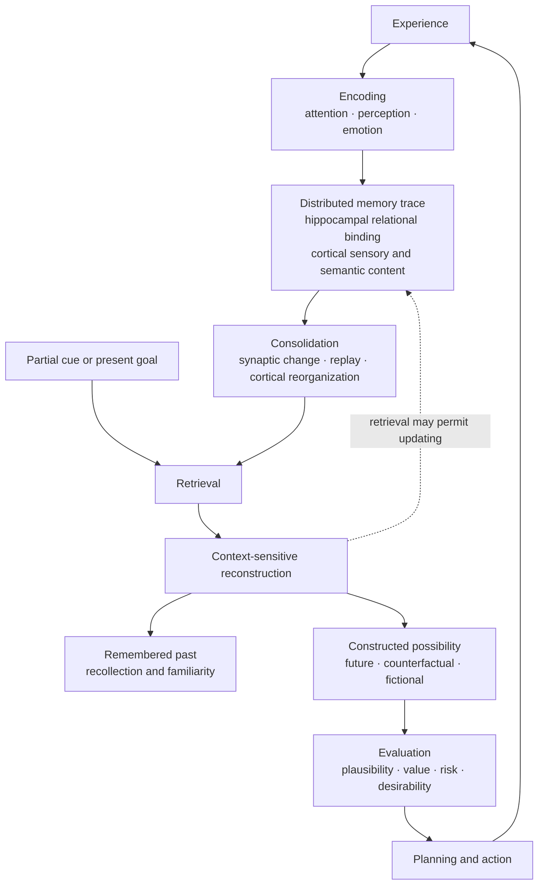

# Memory and Imagination

## Research Synthesis

Human memory and imagination form a coupled constructive system. Memory does
not simply replay stored experience; it reconstructs experience from
distributed traces. Imagination uses many of the same mechanisms to recombine
those traces into possible events that have never occurred.

That flexibility supports planning, counterfactual reasoning, creativity, and
self-projection—but also makes human memory vulnerable to distortion.

For this comparison, **analog data retrieval** means an agent that retrieves
stored records or similar prior examples. It does not refer to analog
electronics.

## Functional Map

## How Memory Works

Memory is not one faculty. Neuroscience distinguishes at least:

- **Working memory:** temporarily maintains information for current action or
  thought.
- **Episodic memory:** personally experienced events situated in time and
  place.
- **Semantic memory:** facts, concepts, and general knowledge.
- **Procedural memory:** learned skills and habits.
- **Emotional and conditioned memory:** learned associations involving reward,
  threat, or affect.

These systems depend on partly different but interacting brain networks. The
medial temporal lobe—including the hippocampus—is particularly important for
forming new declarative memories, while skills and habits rely more heavily on
basal-ganglia and cerebellar systems. Long-term content is distributed across
cortical systems rather than stored as a complete recording in one location.
See Squire and Wixted, [“The Cognitive Neuroscience of Human Memory Since
H.M.”](https://www.annualreviews.org/content/journals/10.1146/annurev-neuro-061010-113720).

A simplified episodic-memory cycle is:

1. **Encoding:** Attention selects parts of an experience. The hippocampus
   helps bind people, objects, places, time, and context into a relational
   event.
2. **Consolidation:** Synaptic changes and hippocampal–cortical interaction
   stabilize and reorganize the memory. Replay during rest and sleep appears
   important.
3. **Retrieval:** A partial cue can reinstate parts of the earlier neural
   pattern. The result is reconstructed using stored traces, semantic
   knowledge, expectations, and the present context.
4. **Updating or forgetting:** Retrieval can sometimes make a memory
   modifiable, while interference and active forgetting alter its later
   accessibility.

Research on engram cells provides evidence for neuronal ensembles
participating across encoding, consolidation, retrieval, and forgetting,
although much of the strongest cellular evidence comes from animal research.
See Guskjolen and Cembrowski, [“Engram neurons: Encoding, consolidation,
retrieval, and forgetting of
memory”](https://www.nature.com/articles/s41380-023-02137-5).

Emotion is not merely metadata added afterward. Amygdala activity can modulate
the consolidation of emotionally arousing experiences, helping determine what
remains salient. See McGaugh, [“The amygdala modulates the consolidation of
memories of emotionally arousing
experiences”](https://pubmed.ncbi.nlm.nih.gov/15217324/).

## How Imagination Works

Imagination is broader than visual imagery. It includes constructing:

- possible personal futures;
- alternative pasts;
- fictional scenes;
- other people’s perspectives;
- novel combinations and ideas; and
- possible actions and their consequences.

Episodic imagination appears to reuse a “core network” also involved in
remembering: the hippocampus and parahippocampal cortex, medial prefrontal
cortex, posterior cingulate and precuneus, lateral parietal cortex, and lateral
temporal regions. Remembering and imagining overlap substantially, but they are
not identical processes. See Addis et al., [“Constructive episodic simulation
of the future and the past”](https://pubmed.ncbi.nlm.nih.gov/19041331/).

The constructive episodic simulation hypothesis proposes that episodic memory
evolved—or at least functions—not only to preserve the past but to extract and
recombine its elements into possible futures. See Schacter and Addis, [“The
cognitive neuroscience of constructive memory: remembering the past and
imagining the future”](https://pubmed.ncbi.nlm.nih.gov/17395575/).

Hippocampal-amnesia patients have sometimes produced fragmented imagined
scenes lacking spatial coherence, suggesting that the hippocampus helps bind
disparate elements into a coherent setting. See Hassabis et al., [“Patients
with hippocampal amnesia cannot imagine new
experiences”](https://pubmed.ncbi.nlm.nih.gov/17229836/). However, patient
findings are inconsistent, so it remains unsettled whether the hippocampus is
universally necessary for imagination or necessary only for particular
components such as episodic-detail access, recombination, scene construction,
or encoding the simulation. See Addis and Schacter, [“The hippocampus and
imagining the future: where do we
stand?”](https://pubmed.ncbi.nlm.nih.gov/22291625/).

Imagination also requires control and evaluation. During creative idea
production, default-network activity associated with internally generated
content interacts with executive-control and salience networks that constrain,
select, and evaluate ideas. See Beaty et al., [“Default and Executive Network
Coupling Supports Creative Idea
Production”](https://pubmed.ncbi.nlm.nih.gov/26084037/).

## What Memory and Imagination Afford Beyond Retrieval Alone

| Capacity | Human memory and imagination | Retrieval-only agent |
| --- | --- | --- |
| **Reconstruction** | Builds a context-sensitive event representation from partial traces | Returns an existing record or similar case |
| **Novel recombination** | Combines details from different experiences into an event that never occurred | Retrieval alone cannot return a record that does not exist |
| **Counterfactual simulation** | Represents what might happen or what could have happened | Can retrieve precedents but does not, by retrieval alone, simulate alternatives |
| **Prospection** | Projects the self into a possible future and connects it to present decisions | Can retrieve future-relevant information without “pre-experiencing” it |
| **Valuation** | Simulations interact with affect, goals, bodily state, identity, and social commitments | Similarity or relevance scores do not themselves establish desirability or felt stakes |
| **Creative construction** | Generates candidates and evaluates novelty, appropriateness, and personal value | Retrieval supplies ingredients but not the constructive or evaluative process |
| **Memory updating** | New experience can alter consolidation, accessibility, associations, and future behavior | Stored records remain unchanged unless a separate update mechanism is provided |
| **Autobiographical continuity** | Episodic memory connects events to a temporally extended self | A sequence of logs can provide continuity of information without establishing recollection or self-awareness |

Episodic future thinking can measurably affect choices. A meta-analysis found
that vividly imagining future events reduced preference for immediate rewards,
although the effect depended on how the task and imagined events were
constructed. See Ye et al., [“A meta-analysis of the effects of episodic future
thinking on delay discounting”](https://pubmed.ncbi.nlm.nih.gov/34841982/).

The most distinctly human feature currently supported by evidence is not mere
scenario generation. It is **autonoetic consciousness**: the first-person sense
that *I experienced this* or *I may experience this*. That produces the
phenomenology of mentally reliving and “pre-living” events. Its mechanisms and
measurement remain contested. See Tulving, [“Episodic memory and autonoetic
consciousness: a first-person
approach”](https://pubmed.ncbi.nlm.nih.gov/11571027/), and Ozdes et al., [“What
is autonoetic consciousness?”](https://pubmed.ncbi.nlm.nih.gov/39216189/).

## Known Gaps

Several major questions remain unresolved:

- **The representational code:** We do not know precisely how a specific human
  memory’s content is represented across cells, synapses, and distributed
  networks.
- **Remote memory:** Researchers still debate whether vivid episodic memories
  permanently require the hippocampus or gradually become supported primarily
  by neocortex.
- **Pattern separation and completion:** These are influential models for
  distinguishing similar events and reconstructing events from partial cues,
  but a systematic review found substantial limitations in human experimental
  tests. See Liu et al., [“Tests of pattern separation and pattern completion
  in humans”](https://pubmed.ncbi.nlm.nih.gov/26663362/).
- **Reconsolidation:** Considerable evidence is consistent with retrieved
  memories becoming modifiable, but human findings are inconsistent and often
  permit alternative explanations. See Elsey, Van Ast, and Kindt, [“Human
  memory reconsolidation: A guiding framework and critical review of the
  evidence”](https://pubmed.ncbi.nlm.nih.gov/29792441/).
- **Memory accuracy:** We lack a complete account of when constructive
  retrieval preserves useful structure and when it creates false details.
- **Hippocampal function in imagination:** Scene construction, relational
  binding, detail recombination, and simulation encoding remain competing or
  complementary explanations.
- **Network coordination:** We do not fully understand how spontaneous
  generation, executive control, salience, and valuation interact during
  imagination.
- **Phenomenology:** Neural overlap between remembering and imagining does not
  explain why either has a first-person experiential character.
- **Real-world benefit:** Laboratory imagination can affect decisions, but
  vividness does not guarantee realism, creativity, wisdom, or effective
  strategy.

## Critical AI Qualification

The defensible comparison is with **retrieval alone**, not with every AI
system.

A generative agent equipped with a world model, persistent state, planning,
valuation, environmental feedback, and online learning can implement
functional analogues of recombination, counterfactual search, planning, and
memory updating. Therefore:

> Retrieval is not episodic remembering, but biological imagination is not the
> only conceivable mechanism for generating and evaluating possible states.

The narrower distinction is stronger:

> Current systems can retrieve records and generate possible scenarios. Those
> behaviors do not by themselves establish autobiographical recollection,
> first-person mental time travel, felt stakes, or a continuing subject for
> whom an imagined outcome matters.
