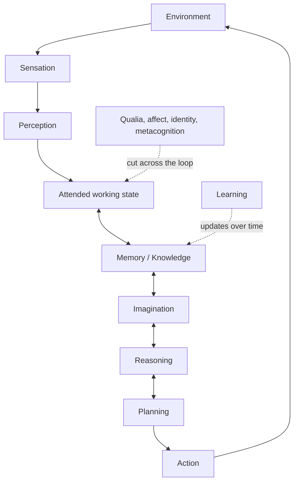

# Research Conclusion: Cognitive Loop and Human–AI Comparison

> Source status: user-supplied research conclusion. Validate individual empirical claims and add primary citations before publication.

## Categories as a recurrent loop

The existing categories are strong, but they mix different kinds of things:

- **Inputs:** sensory modality
- **Interpretation:** perception
- **Active state:** attention and working memory
- **Persistent state:** memory and knowledge
- **Operations:** imagination, reasoning, and planning
- **Change over time:** learning
- **Control:** goals, agency, and action
- **Experience:** qualia

They work better as a recurrent loop than as stacked layers:



Learning updates the persistent system over time. Qualia, affect, identity, and metacognition cut across the loop.

## Three important distinctions

### 1. Sensation is not a canonical sense count

There is no canonical number of human senses. Counts vary according to whether researchers combine or separate pain, temperature, touch, balance, proprioception, and internal bodily sensing. A safer classification is:

- **Exteroception:** the external environment.
- **Proprioception and vestibular sensing:** bodily position, motion, and balance.
- **Interoception:** the body’s internal physiological condition.

Interoception itself includes sensing, interpreting, and integrating internal signals; it is not simply one additional sensor.

### 2. Qualia is not a sense on top of senses

Qualia refers to the phenomenal character of experience—what seeing red, feeling pain, or hearing music is like. Philosophers distinguish this from **intentionality**, meaning what a thought or representation is about. Human “meaning” likely needs several distinct concepts:

- **Semantic content:** what something represents.
- **Grounding:** how it connects to perception, action, and the world.
- **Salience and valence:** why it matters, positively or negatively.
- **Narrative significance:** how it relates to goals, identity, and relationships.
- **Phenomenal character:** what experiencing it feels like.

Some philosophical theories argue that phenomenal experience grounds other forms of meaning, but that is not settled.

### 3. A base model is not an AI system

```text
AI system =
    trained model
  + runtime context
  + persistent memory
  + retrieval
  + tools and sensors
  + controller/objective
  + environment feedback
```

A frozen base LLM is generally stateless between independent invocations. An agent system can store, retrieve, update, and discard records across interactions. That can produce functional memory without establishing autobiographical recollection or a continuing subjective self.

## Revised companion table

| Capability | Human | Current AI | Reductive-danger callout |
| --- | --- | --- | --- |
| **Sensation and perception** | Biological sensing of external and internal conditions, followed by perceptual integration. | Sensors, tokenizers, and encoders transform text, images, audio, and other signals into computational representations. | ⚠ There is no authoritative human sense count. Encoded modality is not evidence of felt sensation. |
| **Attention and working state** | Selects and temporarily maintains information relevant to current thought or action. | Context window, activations, attention computations, cache, and controller state. | ⚠ Transformer “attention” is a specific mathematical mechanism, not a complete equivalent of human attention or working memory. |
| **Memory** | Multiple interacting systems, including working, episodic, semantic, and procedural memory; episodic memory connects experience with self and subjective time. | Parameters, runtime context/cache, external records, retrieval indexes, and learned memory-management policies. | ⚠ A base model may be stateless while the surrounding system has persistent memory. Persistence is not necessarily recollection. |
| **Learning and adaptation** | Changes in capability through experience, instruction, observation, action, reward, and biological plasticity. | Pretraining, post-training, reinforcement learning, in-context adaptation, memory updates, and continual or online training. | ⚠ Learning is broader than model training. In-context adaptation can change behavior without changing weights; continual weight learning remains vulnerable to forgetting. |
| **Knowledge and world model** | Semantic, episodic, and procedural competence situated within a body, culture, and history. | Distributed parameterized regularities combined with active context, retrieved records, and tools. | ⚠ Knowledge is not normally stored as one fact per weight or node. Features may be distributed across neurons and combined in superposition. “Lossy, distributed, query-dependent map” is safer. |
| **Imagination and simulation** | Constructs representations not presently perceived; recombines memory into counterfactual, social, spatial, and future possibilities. | Conditional generation, counterfactual sampling, latent simulation, search, and world-model rollouts. | ⚠ “Self-initiated versus prompted” is not a reliable boundary: humans can be prompted, and agents can initiate internal simulations under an assigned objective. Functional simulation does not establish felt imagery. |
| **Reasoning and problem solving** | Inference, analogy, causal testing, decomposition, planning, evaluation, and strategy revision. | Model executions organized through decomposition, search, verification, code, tools, and environmental feedback. | ⚠ In machine learning, inference simply means using a trained model to produce an output. Reasoning is a structured use of inference, and greater reasoning capability does not guarantee greater reliability. |
| **Metacognition** | Monitors confidence, knowledge, errors, goals, and strategies; sometimes revises them. | Confidence estimates, critics, verifier models, reflection loops, and self-descriptions. | ⚠ Functional self-monitoring and verbal introspection do not by themselves establish phenomenal self-awareness. |
| **Agency and action** | Forms goals under biological needs, affect, identity, relationships, and social norms; acts within and is affected by the world. | Receives objectives, generates subgoals, and uses tools, APIs, or actuators through a controller. | ⚠ Autonomous-looking action can be engineered without proving intrinsic motivation, felt stakes, or consciousness. |
| **Phenomenology and qualia** | Subjective “what-it-is-like” character of experience. | No accepted empirical demonstration of phenomenal consciousness in current systems. | ⚠ This is not another processing layer. One theory-based assessment concluded that current systems do not satisfy its consciousness indicators, while also finding no obvious technical barrier to future systems doing so. |

## Three mappings, refined

### Learning → training

Better:

```text
AI adaptation =
    parameter learning
  + in-context adaptation
  + persistent-memory updating
  + environment feedback
```

Training changes the model. Context and memory can change the system’s behavior without changing the model.

### Knowledge → weights and nodes

Better:

```text
AI usable knowledge =
    parameterized dispositions
  + current context and activations
  + retrieved external records
  + available procedures and tools
```

“Weights and nodes” sounds too much like a conventional database. The map remains a useful metaphor, provided it is described as distributed, compressed, fallible, and dependent on how it is queried.

### Reasoning → inference

Better:

```text
Inference = executing the model
Reasoning = organizing computation toward a solution
```

Reasoning may employ repeated inference, search, decomposition, simulation, checking, retrieval, and action. Therefore:

```text
reasoning ⊂ inference-time computation

reasoning ≠ inference
```

## Best compact mnemonic

> **Sense → perceive → attend → remember → simulate → reason → act → learn.**

Knowledge supports the entire cycle. Goals and affect direct it. Metacognition monitors it. Qualia describes whether and how any of it is subjectively experienced.

## Governing thesis

> **Humans and AI can exhibit overlapping cognitive functions through radically different mechanisms; functional similarity does not establish mechanistic or experiential identity.**
