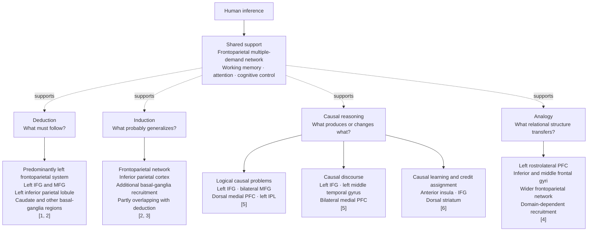

# Forms of Reasoning and Associated Brain Networks

The evidence supports overlapping networks with different regional
emphases—not four isolated “reasoning centers.”

## Interpretation

| Form | Principal cognitive demand | Commonly associated regions |
| --- | --- | --- |
| Deduction | Maintaining premises, applying constraints, checking validity | Predominantly left frontoparietal cortex, IFG, MFG, IPL, caudate |
| Induction | Detecting regularities and estimating uncertain conclusions | Frontoparietal multiple-demand network, IPL, basal ganglia |
| Analogy | Retrieving relations and integrating them across domains | Rostrolateral PFC, inferior/middle frontal cortex, wider frontoparietal network |
| Causal reasoning | Constructing and updating cause–effect models | Depends strongly on task: frontal-parietal for logical problems, frontotemporal for discourse, insular-striatal for causal learning |

## References

1. Prado, Chadha, and Booth (2011), [“The brain network for deductive
   reasoning: a quantitative meta-analysis of 28 neuroimaging
   studies”](https://pubmed.ncbi.nlm.nih.gov/21568632/).

2. Wertheim and Ragni (2018), [“The Neural Correlates of Relational Reasoning:
   A Meta-analysis of 47 Functional Magnetic Resonance
   Studies”](https://pubmed.ncbi.nlm.nih.gov/30024328/). This directly compares
   deduction and induction.

3. [“A Cortical Surface-Based Meta-Analysis of Human Reasoning”
   (2021)](https://pubmed.ncbi.nlm.nih.gov/34180523/). It found that deduction
   and induction share substantial activation with the multiple-demand system.

4. Hobeika et al. (2016), [“General and specialized brain correlates for
   analogical reasoning: A meta-analysis of functional imaging
   studies”](https://pubmed.ncbi.nlm.nih.gov/27012301/).

5. Feng et al. (2021), [“Neural Correlates of Causal Inferences in Discourse
   Understanding and Logical Problem-Solving: A Meta-Analysis
   Study”](https://pubmed.ncbi.nlm.nih.gov/34248525/).

6. Dorfman et al. (2021), [“Causal Inference Gates Corticostriatal
   Learning”](https://pubmed.ncbi.nlm.nih.gov/34244363/).

## Evidentiary Caveat

These are **task-associated activation patterns**. They do not demonstrate that
a region exclusively performs one kind of reasoning. The material being
reasoned about—verbal, spatial, semantic, social, or experiential—can alter the
observed network as much as the formal inference type itself.
