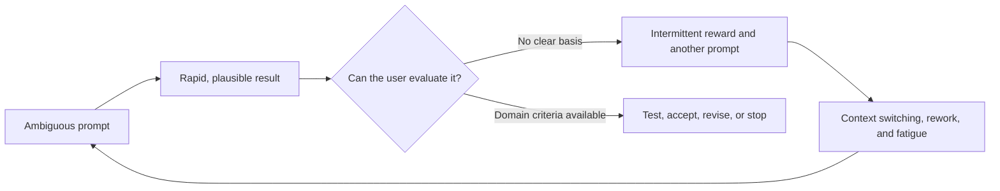
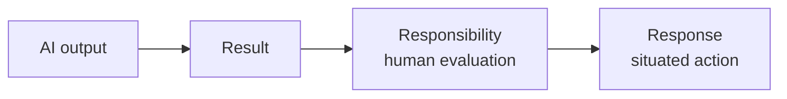

# Understanding Is the Bottleneck

## Editorial Status

The title remains unchanged. This outline is centered on understanding as a
general human and organizational capability: how people turn abundant output
into a useful model, evaluate what matters, and keep solutioning connected to
evidence and customer experience.

## Overview

AI makes drafts, analyses, prototypes, and implementations abundant. The scarce
organizational capability is increasingly the ability to interpret that output:
to understand what a team has learned, connect it to customer experience, frame
the right problem, and determine which proposed solution deserves a test.

Producing more answers does not resolve this bottleneck. People must listen
across roles, separate evidence from interpretation, preserve consequential
disagreement, and build a working model that others can test and revise. The
useful output is not merely another artifact. It is a greater shared capacity
to reason and act.

This requires technical and product judgment, but it also requires empathy.
Customers do not experience a roadmap, architecture, or ticket queue. They
experience a situation. A team cannot reliably solve for them unless it remains
close to that situation and can recognize which consequences matter.

## Core Thesis

When producing output is expensive, execution limits progress. When plausible
output becomes abundant, shared understanding limits progress.

People and teams respond by strengthening their ability to:

- observe customers and systems more accurately;
- distinguish evidence from interpretation;
- name the problem before converging on a solution;
- surface important disagreements and missing context;
- translate insight into testable action;
- learn from consequences; and
- retain that learning so the next decision starts from a stronger model.

The advantage comes from making solutioning more capable and distributed while
keeping meaning, evidence, and accountability intact.

## Relationship to the Series

This is the third essay:

1. **Solutions, Meaning, and Value** establishes the human stakes that make an
   opportunity worth pursuing.
2. **Truth, Entropy, and Inference** explains why AI can be fluent and coherent
   in some domains while remaining weakly grounded in others.
3. **Understanding Is the Bottleneck** defines the human and organizational
   capability needed to direct and evaluate abundant output.
4. **The Knowledge Factory** turns that capability into an organizational
   operating system.

## Intended Reader

Developers, designers, researchers, product practitioners, founders, and
leaders who use AI-generated work or help a group improve its decisions and
problem-solving capacity.

## Key Terms

- **Understanding:** a provisional working model of the relevant people,
  entities, relationships, causes, constraints, and consequences that supports
  better prediction and action.
- **Solutioning:** the collective capability to frame a problem, generate
  interventions, test them, and revise the model—not merely the act of proposing
  features.
- **Distillation:** compressing many observations into a useful model while
  preserving uncertainty, dissent, provenance, and consequential detail.
- **Customer empathy:** disciplined contact with how a situation is experienced,
  including the customer's goals, costs, habits, fears, incentives, and trust.

## Editorial Guardrails

- Do not present an expert, leader, or AI system as an oracle that possesses
  understanding on behalf of everyone else.
- Do not romanticize empathy as intuition. It must be informed by observation,
  evidence, participation, and correction.
- Do not use “solutioning” to mean premature brainstorming before the problem is
  understood.
- Do not argue for endless analysis. Action and feedback are part of
  understanding.
- AI can contribute to interpretation and discovery; the narrower claim is that
  people and institutions remain accountable for which model guides action.
- Do not present AI coding as a demonstrated cause of addiction, psychosis, or
  burnout. Distinguish personal accounts, a self-selected survey, expert
  interpretation, correlational findings, and prospective hypotheses.

## Section Notes

### 1. When Output Outruns Understanding

Open with a tension: AI coding can feel simultaneously productive,
exhilarating, compulsive, and exhausting. In Scott Tolinski's
[“The True Cost of AI Coding”](https://www.youtube.com/watch?v=iPUn1Fnfn0k),
Adam Elmore describes intense late-night AI use preceding the worst burnout of
his 17-year development career. The pull was not only to finish a task, but to
keep the model working and get to the next prompt. His experience eventually
included disrupted sleep, exhaustion, and a loss of his former excitement for
programming. Treat this as one person's account, not as causal evidence for a
general population.

Tolinski also reports an exploratory survey of nearly 1,300 developers. The
respondents were self-selected, the survey was still collecting data when the
video was produced, and the results should not be generalized to all
developers. Within that respondent group:

- 46% said they regularly continued prompting past their intended stopping
  time;
- among those who overran their stopping time, 58% reported moderate or greater
  changes to sleep, compared with 17% among those who stopped on time;
- 65% reported often or daily pressure to produce more because AI made more
  output possible;
- 59% felt their coding skills were diminishing; and
- 54% reported less genuine enjoyment or flow from coding.

These associations do not establish direction or cause. Sleep disruption might
increase compulsive use; compulsive use might disrupt sleep; workplace pressure
or another variable might contribute to both. Use the survey to establish that
the experience deserves investigation, not that the mechanism has already been
proven.

[Dr. Courtney Tolinski](https://phases.fm/) interprets part of the pull as a
variable-reward system: an imperfect result creates anticipation that one more
prompt might produce the ideal solution. The slot-machine comparison is closer
to **variable-ratio operant conditioning** than classical Pavlovian
conditioning. Do not call this `psychosis` as a clinical diagnosis. If
developers' colloquial phrases such as “AI psychosis” or “cyber psychosis” are
used, identify them as provocative descriptions of an intense or compulsive
work pattern.

Do not reduce the whole phenomenon to a dopamine story. The interviews suggest
several interacting pressures:

- time saved in generation can be replaced by more review, decisions,
  supervision, and context switching;
- higher output can become a new managerial baseline rather than reclaimed
  time;
- supervising generated code can weaken the flow, craft, and professional
  identity some developers valued in writing it;
- job insecurity can make stopping feel professionally dangerous; and
- people differ: boundaries, active review, specialized goals, and control over
  work conditions can make AI use energizing rather than depleting.

The [2026 Stanford AI Index](https://hai.stanford.edu/assets/files/ai_index_report_2026.pdf)
is useful context for this pressure, not evidence about mental health. It
reports a study in which developers with GitHub Copilot completed 26% more pull
requests, while also reviewing evidence that productivity effects vary by task
and expertise. Faster production is real in some settings; it does not tell us
whether the additional output is valuable, sustainable, or psychologically
healthy.

The article's contribution is a narrower hypothesis: the intermittent-reward
loop may become especially destabilizing when the user lacks **evaluative
closure**—the domain knowledge, tests, constraints, and authority needed to
predict, inspect, and stop on valuable output. Prompting then becomes repeated
guessing instead of controlled inference. An occasional success rewards another
attempt, but the user may be unable to explain why it worked, reproduce it, or
recognize when continued iteration is making the system worse.

Connect this to Rossi, Fraccaro, and Manzotti's open-access commentary,
[“The brain side of human-AI interactions in the long-term: the ‘3R
principle’”](https://www.nature.com/articles/s44387-025-00063-1). Their framework
distinguishes an AI **Result** from a human **Response** through
**Responsibility**: a person must actively interpret, evaluate, and take
responsibility for the result before acting on it. The authors hypothesize that
passive AI reliance may weaken activity-dependent plasticity while active
co-creation may preserve it, but they explicitly call for prospective studies.
Use the 3R principle as a conceptual bridge, not as proof that AI coding has
already degraded developers' brains:

This produces the opening question: **does AI-assisted development become more
compulsive and exhausting when people can generate results faster than they can
understand, evaluate, and turn into responsible responses?**

The question is organizational as well as personal. When output accelerates but
understanding does not, people inherit more artifacts to inspect, more decisions
to make, and more uncertainty about when the work is good enough. A workplace
that treats generation as the bottleneck will demand still more output. One
that recognizes understanding as the bottleneck will build the context,
evaluation, boundaries, and shared judgment that let people stop responsibly.

Source leads and perspectives for this opening:

- [Dr. Courtney Tolinski](https://phases.fm/), PhD, LP, NCSP, for the
  mental-health and variable-reward interpretation.
- [Adam Elmore](https://x.com/adamdotdev) for the opening burnout account.
- [Mark Erikson](https://bsky.app/profile/acemarke.dev) and his
  [blog](https://blog.isquaredsoftware.com/) for the shift from writing code to
  supervising output and retaining decision control.
- [Miranda Heath](https://mirandaheath.website/) for research perspectives on
  software-developer burnout and AI-agent use.
- [Aaron Francis](https://aaronfrancis.com/) for the counterexample of
  sustainable use through boundaries, offline life, and narrower ambition.
- The [2026 Stanford AI Index](https://hai.stanford.edu/assets/files/ai_index_report_2026.pdf)
  for productivity and labor-market context.
- Rossi, Fraccaro, and Manzotti's [3R principle](https://www.nature.com/articles/s44387-025-00063-1)
  for the result–responsibility–response distinction and its stated research
  limitations.

If the published article describes anxiety, depression, sleep disruption, or
loss of functioning, include a short resource note: readers can consult a
licensed mental-health professional or [ADAA](https://adaa.org/); people in
crisis in the United States can call or text [988](https://988lifeline.org/),
and immediate danger requires emergency services.

### 2. What Understanding Adds

After the opening, widen to a team producing more than ever: research summaries,
dashboards, customer transcripts, prototypes, pull requests, and AI-generated
options. The team's problem is no longer a lack of artifacts. It is an inability
to determine what all the artifacts mean together.

Moving from output to understanding requires five operations:

1. listen for evidence and lived stakes;
2. separate observations from proposed explanations;
3. name the consequential relationships and disagreements;
4. return a clearer, testable problem frame to the team; and
5. expand who can reason from that frame.

The result is not merely a decision. It is a provisional model that increases
the group's capacity to predict, test, and solve.

### 3. Distillation Is Not Summarization

A summary makes material shorter. Distillation identifies which distinctions
must survive compression for a decision to remain sound.

Good distillation preserves:

- whose experience is represented;
- what was directly observed;
- what is inferred;
- what remains disputed;
- which constraints are hard or negotiable;
- which tradeoffs are being accepted; and
- what evidence would overturn the current model.

AI can summarize at scale. People must determine the criteria by which a
summary becomes meaningful context for the present decision.

### 4. Keep Problem Framing Close to the Work

Extract the solvable structure from noisy organizational experience without
extracting the right to solve from the people closest to the work.

The failure mode is a gate: teams collect evidence, but only a small authority
layer may frame problems or authorize solutions. This destroys context,
increases queueing, and teaches engineers to wait for tasks.

The alternative is shared capability. Teams receive the context, decision
boundaries, problem-framing tools, and authority needed to propose and test
solutions inside explicit constraints.

### 5. Build Shared Problem-Solving Capacity

Describe practices that make understanding easier to build and share:

- problem briefs that distinguish symptoms, causes, stakes, and assumptions;
- shared domain vocabulary;
- decision records with evidence and rejected alternatives;
- pre-mortems and adversarial review;
- customer contact across product, design, and engineering;
- small experiments with explicit learning goals;
- retrospectives that update the model, not only the process; and
- coaching that asks better questions before supplying answers.

The goal is for more people to recognize a poorly framed request, surface a
missing constraint, and connect technical choices to customer consequences.

### 6. Empathy Is Part of the Evidence System

Customer empathy is how teams remain connected to stakes that do not appear in
telemetry alone. A metric can show abandonment; empathy helps investigate the
confusion, fear, broken trust, interrupted workflow, or competing obligation
behind it.

Empathy should be operationalized through contact:

- interviews and observation;
- support and sales evidence;
- usability sessions;
- participation in the workflow where possible;
- attention to non-users and excluded users; and
- follow-up after a solution changes behavior.

The point is not that customers dictate features. It is that solutioning begins
with an accountable interpretation of their situation.

### 7. Five Dimensions of Product Understanding

Use a compact model:

1. **Human:** goals, experience, behavior, trust, and consequences.
2. **Domain:** entities, relationships, rules, exceptions, and language.
3. **System:** architecture, dependencies, state, failure modes, and operations.
4. **Economic:** incentives, opportunity cost, distribution, and sustainability.
5. **Epistemic:** evidence quality, uncertainty, assumptions, and disconfirming
   tests.

No one person needs every fact. The group needs enough shared understanding
across these dimensions to predict what an intervention will change and
recognize when the prediction fails.

### 8. AI Can Accelerate Understanding—and Simulate It

AI can search, cluster observations, generate hypotheses, identify missing
questions, compare explanations, and propose tests. These are real
contributions to understanding.

It can also generate a polished explanation before the organization has earned
the model. Fluency can conceal missing customer contact, weak evidence, or an
undefined term. Therefore every important synthesis should expose:

- its source evidence;
- its assumptions;
- plausible competing explanations;
- its confidence and limits; and
- the next observation that would discriminate among alternatives.

### 9. When Verification Outruns Understanding

Use recent AI-assisted mathematics as a clean case study. The examples connect
back to **Truth, Entropy, and Inference**: mathematics is unusually
pattern-dense because its definitions, symbols, proof practices,
counterexamples, and formal verification systems supply precise constraints
and unusually strong rejection signals.

The important development is not merely that models can generate plausible
proofs. Agentic systems can produce conjectures, proof attempts,
counterexamples, programs, intermediate lemmas, and—in some cases—formal
certificates at a rate no mathematical community could read line by line. Much
of this machine-generated corpus may be mechanically filtered, discarded, or
retained without a person ever reading it end to end.

Keep the terminology precise. These artifacts are **synthetic mathematical
work** or a **machine-generated corpus**. They become **synthetic training
data** only when they are retained and used to train, fine-tune, or otherwise
condition future systems.

Separate three operations that are easy to collapse:

1. **Generation:** search produces candidate claims, proofs, counterexamples,
   code, and intermediate artifacts.
2. **Verification:** experts, tests, or proof assistants determine whether an
   artifact satisfies stated formal constraints.
3. **Interpretation and governance:** people determine whether the
   formalization matches the intended problem, what the result teaches, how
   significant it is, who should receive credit, and which questions deserve
   further pursuit.

A formal certificate can establish that a derivation follows from encoded
definitions and axioms. It does not by itself establish that the encoding
faithfully represents the informal question, that the result contributes human
understanding, or that it was worth the resources and attention devoted to it.

The recent OpenAI unit-distance result is useful because its proof was checked
by external mathematicians, while OpenAI's own account still concludes that
people choose important problems and interpret their significance:
[“An OpenAI model has disproved a central conjecture in discrete
geometry”](https://openai.com/index/model-disproves-discrete-geometry-conjecture/).
The [Leiden Declaration on Artificial Intelligence and
Mathematics](https://leidendeclaration.ai/) supplies the complementary
qualification: mathematical practice values not only correctness but also
understanding, depth, significance, attribution, transparency, and human
control over research direction. Use the
[video explainer](https://www.youtube.com/watch?v=iuZPTE5qsJY) as the narrative
lead, but verify each named result against its paper or another primary source
before publication.

Candidate compact passage:

> Mathematics may be the clearest case of output outrunning understanding. It
> is unusually pattern-dense and increasingly machine-verifiable: models can
> generate conjectures, proof attempts, counterexamples, programs, and formal
> certificates faster than a mathematical community could read them line by
> line. Verification can filter this machine-generated corpus for formal
> validity, but it cannot by itself determine whether the formalization matches
> the intended question, whether a result is significant, or which questions
> deserve pursuit. The bottleneck moves from producing candidate knowledge to
> interpreting and governing it.

### 10. Understanding Is Organizational, Not Merely Individual

An insight trapped in one person's head is a throughput constraint. Shared
understanding becomes visible through language, models, decisions, tests,
interfaces, and repeated behavior.

The organization needs mechanisms that let teams retrieve why a decision was
made, trace concepts to evidence, see where contexts differ, and update the
model after outcomes arrive. This is the bridge to the knowledge factory.

### 11. Action Completes the Loop

Understanding is demonstrated by better prediction and revision, not by the
feeling of clarity. Teams must act at a scale that makes learning affordable,
observe the result, and update their shared model.

Use the loop:

> Observe → interpret → frame → propose → test → experience consequences →
> revise.

The discipline is to improve the loop's fidelity and speed without allowing
speed to erase meaningful context.

### 12. Understanding Is a Skill to Look For

As generated output becomes cheaper, the ability to turn it into a grounded,
testable model becomes more valuable. Organizations should look for, develop,
and reward people who can:

- synthesize across customer, product, engineering, and business evidence;
- teach problem framing and experimental reasoning;
- distribute decisions with clear constraints;
- protect contact between builders and customers;
- make assumptions and disagreement inspectable;
- build durable context rather than presentation theater; and
- recognize when AI-generated coherence has outrun comprehension.

This capability is not confined to management. It may appear in an engineer who
finds the missing constraint, a designer who connects behavior to lived
experience, a support specialist who recognizes a recurring causal pattern, or
a researcher who distinguishes evidence from a compelling story. Leadership is
one place to look for the skill, but the organizational advantage comes from
making it common across roles.

## Visual Notes

1. **The evaluative-closure loop:** ambiguous prompt → plausible result →
   inability to evaluate → intermittent reward → more prompting and fatigue,
   contrasted with a path to testing and stopping.
2. **The 3R bridge:** AI output → result → human responsibility → situated
   response.
3. **Understanding as a multiplier:** team signals flow through distillation and
   return as shared context, clearer boundaries, and greater team autonomy.
4. **Gated versus distributed solutioning:** a queue through one decision-maker
   contrasted with multiple teams operating inside shared context.
5. **The understanding loop:** observe → interpret → frame → test → revise.

## Experiment TODOs

- [ ] Create a test app with tasks that are computationally simple but difficult
  for a person to complete. Identify the points where the user cannot proceed—the
  “user can't” experience—then have AI redesign that experience and evaluate
  whether the intervention helps the user succeed.

## Research Queue

- Primary research on variable-ratio reinforcement, compulsive technology use,
  automation bias, cognitive load, and developer burnout. Look specifically for
  evidence that distinguishes an intermittent-reward hypothesis from a merely
  provocative analogy.
- The final questionnaire, sampling method, analysis, and dataset—if
  published—for Tolinski's developer survey. Do not promote its percentages
  from an exploratory source lead into final population claims without that
  methodological review.
- Research separating the effects of output volume, review load, context
  switching, managerial expectations, skill offloading, and loss of flow in
  AI-assisted development.
- Prospective evidence testing passive versus actively engaged AI use, rather
  than treating the 3R commentary's neuroplasticity hypothesis as an observed
  long-term effect.

## Candidate Closing Line

> In an age of abundant answers, the scarce skill is building enough shared
> understanding to know what deserves to be solved—and whether an answer
> survives contact with the world.
