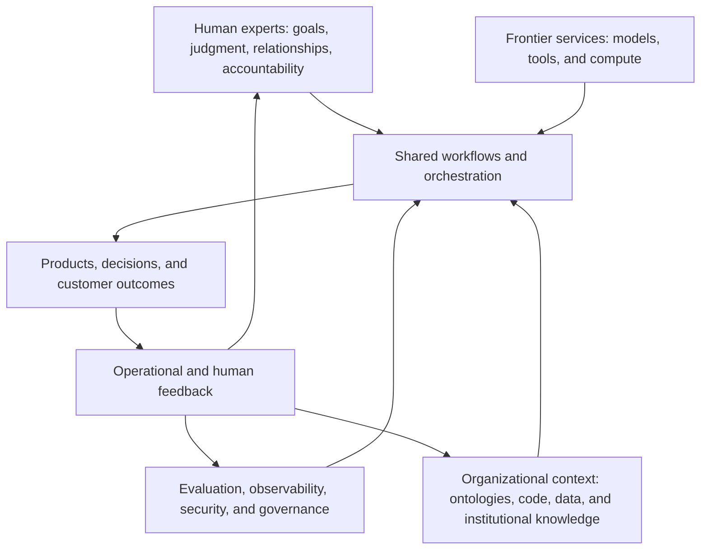

# The Knowledge Factory: Capital as the New Multiplier

## Overview

The Industrial Revolution mechanized portions of physical labor. AI may now mechanize portions of knowledge work: drafting, translating intent into an initial implementation, searching large bodies of information, checking routine conditions, and coordinating repeatable workflows.

This post explores what that shift could mean for software organizations. The central question is not simply whether AI will replace developers. It is whether shared capital—not just additional seats—will become a more important multiplier of human expertise.

Here, **capital** means the reusable systems that make each expert more effective: models, tools, ontologies, proprietary and permissioned data, evaluation suites, workflows, infrastructure, and accumulated institutional knowledge. The argument should remain exploratory. AI does not turn a company into a literal factory, and people are not interchangeable production units. The analogy is useful only insofar as it helps distinguish one-time effort from assets that improve many future efforts.

The human-centered version of the thesis is: organizations may gain more by asking how to amplify their experts than by asking how to remove them.

## Core Thesis

As routine implementation becomes faster and cheaper, the economic bottleneck may move upward—from producing code toward choosing problems, modeling domains, establishing standards, coordinating systems, exercising judgment, and earning trust.

In that environment, a capable individual remains valuable, but the infrastructure surrounding that individual matters more. One engineer with access to a mature internal platform, a well-maintained domain ontology, high-quality organizational context, reliable evaluation, and trusted collaborators can do work that no generic model can reproduce on its own. The advantage comes from the combination of human expertise and reusable capital.

This suggests a change in the unit of investment:

- The old question: **How many people can we add?**
- The emerging question: **What shared capabilities will multiply the people we already have and the people we hire next?**

The article should not claim that capital and seats are mutually exclusive. New experts may be the highest-return investment when the constraint is judgment, domain knowledge, discovery, relationships, or accountability. Shared infrastructure may be the better investment when the constraint is repeated setup, fragmented knowledge, avoidable coordination, or routine implementation. Most organizations will need both.

## Article Positioning

### Reader promise

Give technical and organizational leaders a framework for thinking about AI investment beyond tool licenses and headcount reduction. By the end, the reader should be able to distinguish rented model capability from durable organizational capital, reason about total cost rather than headline productivity, and ask which investments would genuinely expand expert capacity.

### Tone

- Curious rather than predictive.
- Economically literate without pretending to precision.
- Optimistic about leverage without minimizing transition costs or risk.
- Explicit that humans provide intent, judgment, accountability, relationships, and care.
- Skeptical of both “AI changes nothing” and “AI makes expertise unnecessary.”

## Section Notes

### 1. From Mechanized Labor to Mechanized Knowledge Work

Open with the industrial analogy. Industrial machinery did not eliminate human contribution; it changed where human effort was applied. Workers increasingly designed processes, operated and maintained machinery, managed exceptions, inspected quality, coordinated supply, and decided what should be produced. The distribution of tasks changed, as did the kinds of capital that determined output.

AI could produce a similar reallocation in knowledge work. It can already accelerate bounded activities such as generating a first draft, producing routine variants, navigating a codebase, or turning a clear specification into an initial implementation. But those tasks sit inside a larger human system. Someone must identify the need, understand the context, frame the work, validate the result, resolve ambiguity, and accept responsibility for consequences.

Use the analogy to frame a question, not to assert a historical law. Knowledge is not a standardized physical input, good software is not an undifferentiated manufactured good, and expert judgment cannot be measured solely in units of output. The comparison is about the role of reusable productive assets, not about reducing people to factory labor.

### 2. Capital Substitution: What Is Actually Being Replaced?

Clarify that **capital substitution** does not have to mean replacing a person. More often, capital first substitutes for tasks, waiting, rework, and coordination overhead. A shared system might eliminate the need for every engineer to rediscover the same convention, manually assemble the same context, or repeat the same low-risk transformation. The recovered capacity can be used for deeper discovery, system design, customer contact, reliability, mentorship, or simply a more sustainable pace.

Separate three effects that are often conflated:

1. **Task substitution:** automation performs a bounded activity that a person previously performed.
2. **Expert augmentation:** a person uses automation to explore more options, work across a broader surface area, or get faster feedback.
3. **Organizational capital formation:** the organization captures knowledge, standards, and feedback in a form that benefits many people over time.

The third effect is the heart of the post. A generic assistant can improve one session. A shared knowledge factory improves the environment in which future sessions occur.

Also note the limits. Some automated tasks will reduce demand for particular forms of labor, and the distributional consequences should not be hand-waved away. Yet it is too strong to infer from task automation that the surrounding role disappears. Jobs are bundles of technical work, tacit knowledge, relationships, judgment, and responsibility. The composition of the bundle may change before the bundle itself does.

### 3. An Illustrative 50-Engineer Thought Experiment

Use the deliberately simple figures discussed for the article. Every number in this section is **illustrative, not current market pricing, a benchmark, a forecast, or an ROI claim**.

```text
50 engineers × $20,000 annual AI spend = $1,000,000 per year
50 engineers × $50,000 annual AI spend = $2,500,000 per year
```

Against those hypothetical per-seat costs, a $1 million internal cluster can appear to have a simple payback near or below one year. The word **appear** matters. That conclusion holds only if the internal system actually replaces equivalent external spending and produces equivalent useful output for the team.

The comparison must not equate raw token volume with value. A private system may be cheaper yet less capable, harder to maintain, poorly utilized, or unable to handle exceptional workloads. The organization may still need frontier services, and the cluster's operating costs continue after acquisition. Conversely, private infrastructure may create additional value through privacy, latency, specialization, availability, or tighter integration with organizational knowledge.

The example should make four points:

- The figures are a thought experiment rather than a claim about current pricing.
- Avoided subscription spending counts only when the internal system can genuinely replace it.
- Compare cost per useful output, not cost per token or theoretical capacity.
- Shared infrastructure is meant to multiply the 50 experts, not turn their work into assumed headcount savings.

### 4. Total Cost of Ownership

A knowledge factory has more costs than model tokens or software licenses. Treat total cost of ownership as a portfolio of continuing obligations:

- **Acquisition:** licenses, inference, compute, storage, and vendor contracts.
- **Integration:** identity, permissions, repositories, data sources, workflow changes, and legacy systems.
- **Knowledge maintenance:** keeping documentation, ontologies, policies, examples, and retrieval sources current.
- **Evaluation and verification:** test suites, human review, red teaming, quality measurement, and incident analysis.
- **Security and governance:** access control, provenance, privacy, regulatory review, auditability, and intellectual-property safeguards.
- **Operations:** reliability, observability, vendor management, model migrations, support, and capacity planning.
- **Adoption:** training, process redesign, change management, and temporary productivity loss while practices evolve.
- **Risk and optionality:** incorrect outputs, correlated failure, vendor lock-in, switching cost, and the cost of preserving a viable exit path.

For an owned cluster, explicitly include hardware acquisition, financing or depreciation, power and cooling, networking, physical space, operations staff, model deployment and updates, security, reliability, utilization rate, hardware obsolescence, opportunity cost, and continued frontier-model use for workloads the internal system cannot serve well.

Make the maintenance point explicit. Data, workflows, and ontologies are not capital merely because they exist. They become productive capital when people curate them, connect them to real work, monitor their use, and improve them through feedback.

### 5. Mapping the Industrial Factory to an AI Knowledge Factory

Use a mapping to clarify the metaphor while showing where it breaks down.

| Industrial-era system | AI-era knowledge-work analogue | Human role that remains essential |
| --- | --- | --- |
| Power and machinery | Frontier models, compute, and general-purpose tools | Select capabilities, set constraints, and judge fitness for use |
| Factory floor | Integrated development and knowledge environment | Design the work system and manage exceptions |
| Jigs, dies, and process specifications | Ontologies, schemas, templates, policies, and reusable workflows | Encode domain distinctions and revise them as reality changes |
| Raw materials and inventory | Permissioned data, code, documents, and organizational context | Establish rights, provenance, relevance, and meaning |
| Assembly line | Orchestration across models, tools, data, and people | Decide which steps may be automated and where review belongs |
| Quality control | Automated evaluation, tests, observability, and human review | Define quality, investigate failures, and accept accountability |
| Maintenance | Platform operations, knowledge stewardship, and model migration | Preserve reliability and improve the system over time |
| Supply relationships | Partner networks, customer context, rights, and trust | Build and sustain relationships that cannot be downloaded |

Call out the limits immediately after the table. Software problems are often ambiguous, demand changes during discovery, and quality can be contextual rather than uniform. The “output” may be a decision, a conversation, or a newly understood problem—not a standardized object. The metaphor is most useful for thinking about investment and compounding, and least useful when it suggests that judgment can be fully specified in advance.

### 6. Commodity Implementation and the Rising Value of Context

If AI reduces the cost of routine implementation, implementation does not become worthless. Instead, differentiation may move toward the things that determine what implementation should exist and whether it works in the real world:

- A faithful model of the domain.
- Access to high-quality, appropriately permissioned data.
- Clear product judgment and problem selection.
- Integration with existing systems and organizational constraints.
- Reliable evaluation and operational feedback.
- Customer relationships, reputation, rights, and trust.
- The ability to coordinate technical and nontechnical stakeholders.

This connects the post to the larger series. Code can be copied more easily than a living network of knowledge and relationships. An ontology is valuable not as a static diagram but as a maintained agreement about what distinctions matter. Data is valuable not as sheer volume but when its origin, meaning, permissions, and limits are understood. Trust is valuable because consequential decisions require people and institutions willing to stand behind them.

### 7. Shared Infrastructure Versus Frontier Services

Distinguish the capability an organization can rent from the capital it must develop.

**Frontier services** provide rapidly improving general capability: language and code generation, reasoning, multimodal input, tool use, and large-scale inference. For most organizations, consuming these services will be more rational than training a frontier model. Model quality may improve while unit prices fall, so excessive investment in replicating commodity capability can become stranded capital.

**Shared internal infrastructure** connects general capability to the organization’s actual work: identity, permissions, domain knowledge, repositories, product telemetry, workflows, evaluation, observability, and feedback. This layer can compound because it encodes how the organization operates and learns.

**Shared infrastructure may win when:**

- utilization is consistently high and workloads repeat;
- privacy, latency, availability, or model specialization materially affects value;
- the organization has the expertise to operate the system well; and
- its cost per useful output is materially lower after full operating costs.

**Frontier services may win when:**

- capability changes rapidly or the work requires the strongest available reasoning;
- utilization is inconsistent;
- internal operations would distract from the organization's distinctive work; or
- owned hardware risks becoming obsolete before the investment pays back.

The strategic boundary is not simply “build versus buy.” A better rule is:

- Rent rapidly commoditizing general capability.
- Own or control the context, interfaces, evaluations, permissions, and feedback loops that express the organization’s distinctive knowledge and obligations.
- Preserve portability where a dependency would otherwise create unacceptable operational or bargaining risk.

Avoid implying that every company needs an elaborate internal platform. Smaller organizations may get more value from well-governed off-the-shelf tools. The sophistication of the capital should match the repeatability of the work, the cost of errors, the sensitivity of the context, and the scale over which an investment can be reused.

### 8. A Hybrid Architecture for the Knowledge Factory

The likely architecture is hybrid: external services supply general capability, while internal systems supply context, control, learning, and accountability.



The diagram should place humans at both the beginning and end of the loop. People choose the goal and constraints; people interpret outcomes, handle exceptions, and decide what the organization should learn. Automated feedback is useful, but it cannot define success independently of human values and real-world consequences.

### 9. The Compounding Loop

Describe how one episode of expert work can improve later episodes:

1. Experts perform work and encounter gaps, exceptions, and recurring patterns.
2. Useful knowledge is captured in an ontology, example, evaluation, workflow, or data product.
3. The shared system makes that knowledge available with appropriate context and permissions.
4. Other experts receive better starting points and faster feedback.
5. Their work creates new evidence, which is reviewed and used to improve the shared system.

This is where capital becomes a multiplier. The output of work is not only the immediate artifact; it can also be a better capability for the next person and the next project.

Add a warning about degraded loops. If generated content is captured without verification, errors can compound too. Metrics can reward superficial output. A system can make a flawed organizational assumption faster and more consistent. Healthy compounding therefore depends on provenance, evaluation, dissent, maintenance, and a clear route for people to override the system.

### 10. The Human Roles That Grow in Importance

Center the people who make the system useful. As implementation becomes easier, several roles may become more important rather than less:

- **Problem framers** decide which questions are worth answering.
- **Domain experts** supply distinctions and tacit knowledge that are absent from generic models.
- **Product thinkers and researchers** connect technical possibility to human need.
- **System designers** decide how models, data, workflows, and people should interact.
- **Evaluators and reviewers** define quality and investigate ambiguous failure.
- **Knowledge stewards** maintain ontologies, context, provenance, and institutional memory.
- **Relationship builders** earn the trust through which knowledge becomes actionable.
- **Accountable leaders and practitioners** make tradeoffs and own consequences.

Do not romanticize these roles or assume transitions will be painless. Organizations will need to invest in training, redesign incentives, and give experts meaningful agency over the systems that reshape their work. Amplification is not human-centered if all gains flow away from the people whose knowledge makes the system valuable.

### 11. A Practical Economic Model

Offer a model for analysis without presenting false precision:

```text
Simple Payback Period =
Upfront Capital Cost
÷
Annual Avoided External Spend
```

This simple calculation is useful only as a first screen. A more realistic comparison subtracts ongoing internal operating costs, includes any external services that remain necessary, and compares useful output rather than raw token volume.

> **Illustrative annual net value** = reclaimed-capacity value + cycle-time value + quality and risk value + learning/option value − total cost of ownership − expected automation risk.

Each term needs an observable proxy:

- **Reclaimed-capacity value:** verified changes in time spent on defined task categories, valued as capacity rather than assumed layoffs.
- **Cycle-time value:** the benefit of learning, shipping, or responding sooner, measured against an explicit counterfactual.
- **Quality and risk value:** changes in escaped defects, incidents, rework, compliance failures, or review burden.
- **Learning and option value:** reusable evaluations, knowledge assets, and capabilities that make future choices cheaper or more reversible.
- **Total cost of ownership:** all acquisition, integration, maintenance, governance, operations, and adoption costs.
- **Expected automation risk:** probability-weighted cost of incorrect, insecure, noncompliant, or correlated output.

Recommend staged investment. Begin with a bounded workflow where repetition is high, outcomes can be evaluated, and experts are available to supervise. Establish a baseline, include all costs, and compare the result with alternatives such as hiring, process simplification, documentation, or conventional automation. Expand only when measured learning supports expansion.

The economic test is not whether AI can produce something impressive. It is whether the combined human-and-machine system creates durable value after its full costs and risks.

### 12. What Should Organizations Invest In?

Close with a diagnostic rather than a prescription. Candidate investments include:

- Interoperable tools and stable interfaces between models, data, and workflows.
- Domain ontologies and high-quality, permissioned organizational context.
- Evaluation systems that reflect real customer and operational outcomes.
- Observability, security, provenance, and governance.
- Expert training and time for knowledge stewardship.
- Feedback loops that turn exceptions and failures into shared learning.
- Customer, partner, and professional networks built on reciprocal trust.
- Architectural portability that avoids unnecessary dependence on one model or vendor.

Ask readers to identify their actual constraint. If experts lack time because they repeat well-understood tasks, automation may help. If they lack customer insight, organizational alignment, domain knowledge, or decision authority, a more powerful model may only accelerate the wrong work. Capital multiplies what the system already directs it toward; it does not choose a worthy direction.

## Visual Notes

### Visual 1: Seats versus shared capital

A two-column comparison showing a marginal hire and a reusable platform investment. Avoid declaring a universal winner. Show that the marginal hire adds judgment and capacity directly, while shared capital can amplify many people but introduces fixed cost, maintenance, and correlated risk.

### Visual 2: Industrial-to-knowledge-factory mapping

Adapt the table in Section 5 into paired layers. Include a visible annotation: **“Conceptual analogy—not a claim that knowledge workers or outputs are interchangeable.”**

### Visual 3: Hybrid architecture

Use the Mermaid flow in Section 8. Visually emphasize the human expert and feedback path rather than placing the frontier model at the center.

### Visual 4: Compounding loop

Show expert work → captured knowledge → shared infrastructure → greater expert capability → better work. Add a parallel caution loop showing unverified output → polluted context → repeated errors.

### Visual 5: Illustrative 50-engineer economics

Use a waterfall or stacked comparison of illustrative first-year cost and possible sources of value. Label the entire visual **“Illustrative thought experiment; not benchmark data.”** Do not render reclaimed capacity as headcount savings.

## Caveats to Preserve in the Draft

- AI mechanizes portions of knowledge work, not knowledge or human experience in full.
- The factory analogy describes reusable productive capital; it should not imply standardized people, deterministic output, or scientific management of creativity.
- Capital can complement labor, substitute for specific tasks, or change demand for roles. The balance will vary by organization and over time.
- Productivity gains are not automatically cash savings, and faster output is not automatically more valuable output.
- Infrastructure can create rigidity, concentrated failure, surveillance, lock-in, or unequal distribution of gains.
- Ontologies and datasets reflect human choices. They require ownership, consent where relevant, provenance, revision, and room for disagreement.
- Trust, accountability, empathy, negotiation, and lived context remain human and institutional responsibilities.
- Returns will vary with task repeatability, outcome measurability, error cost, data quality, regulation, organizational scale, and adoption maturity.
- All numerical figures in this brief are illustrative and must remain labeled as such in the finished article.

## Central Closing Question

**Which investments multiply your experts most?**

Use this as the final diagnostic. The answer might be a model, but it might also be cleaner data, a shared ontology, a better evaluation suite, closer customer relationships, stronger mentorship, clearer decision rights, or another expert. The purpose of the framework is to improve the question, not predetermine the answer.

## Candidate Closing Line

> The knowledge factory worth building is not one that removes people from the work; it is one that turns what people learn into shared capital, then gives that capital back to people as greater capability.

## Drafting Checklist

- Keep the argument exploratory rather than predictive.
- Use the industrial analogy while stating its limits.
- Define capital as reusable capability, not simply money or model access.
- Distinguish task substitution, expert augmentation, and organizational capital formation.
- Keep people responsible for goals, judgment, relationships, exceptions, and consequences.
- Preserve the illustrative labels on every number in the 50-engineer example.
- Treat total cost of ownership, correlated failure, lock-in, and distributional effects as part of the economics.
- Distinguish rented frontier capability from internal context, evaluation, permissions, and learning systems.
- End on the central question and use the candidate line only if it fits the final voice of the series.
