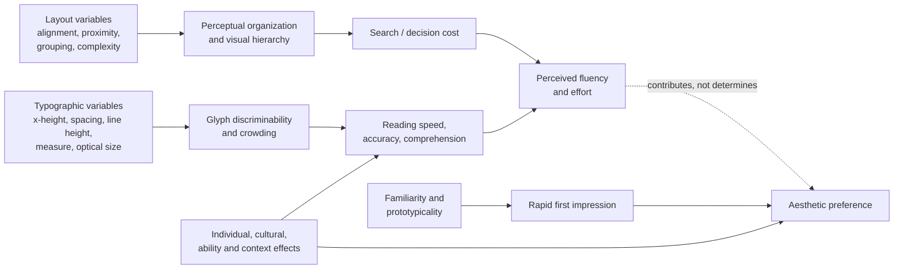
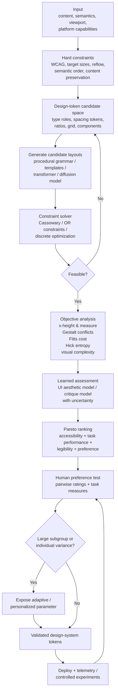

# Deterministic Aesthetics in Typography and User-Interface Design

## Executive summary

The scientific literature does **not** support a deterministic formula that guarantees that a layout, type system, rectangle, grid, or interface will be perceived as beautiful. The strongest evidence instead supports a more modest and technically useful proposition: design can be made **algorithmically more likely to be perceived as clear, fluent, coherent, familiar, and aesthetically competent** by enforcing perceptual, motor, typographic, accessibility, and structural constraints and then optimizing the remaining degrees of freedom against empirical preference data. This distinction is important because aesthetic judgments show substantial individual and cultural variation: McManus and colleagues found weak population-level preference for particular rectangle proportions but strong, stable individual preferences; a Korean experiment found a significant preference for approximately \(1:\sqrt2\), not \(1:\varphi\); nearly 2.4 million website ratings from almost 40,000 participants showed systematic variation in visual preferences around the world; and font experiments found that the fastest-reading typeface differs materially from reader to reader. citeturn21search4turn18view1turn14search1turn21search2

The **golden ratio \(\varphi \approx 1.618\) should therefore not be treated as a law of beauty**. A century of rectangle-preference research has produced mixed results, and one of the most careful modern studies found weak average preferences compared with large, robust individual differences. Some newer experiments continue to find circumstances in which golden proportions are attractive, so the defensible conclusion is not that \(\varphi\) is aesthetically meaningless, but that it is one candidate proportion among several rather than a universal optimum. citeturn21search4turn21search7turn1search10turn1search6

Typography has much stronger psychophysical foundations, but here too the evidence favors **measuring what the reader sees rather than blindly applying fixed pixel values**. X-height expressed as visual angle is more meaningful than nominal point size; a substantial reading literature places normal-vision critical print size around \(0.2^\circ\) of x-height under favorable conditions. Letter spacing has a nonmonotonic relationship with reading: extra spacing can relieve crowding in some low-vision or peripheral-reading conditions but can reduce performance when ordinary inter-letter and inter-word relationships are disrupted. Line length also presents trade-offs: longer lines can produce higher raw reading speed, while intermediate lengths can improve comprehension at normal and fast reading rates. Typeface choice itself is significantly individual. citeturn0search1turn0search14turn0search20turn7search0turn7search15turn21search6

Gestalt principles are more useful as **constraint generators than as beauty formulas**. Proximity, similarity, common region, connectedness, continuation, and common fate can reliably alter what users perceive as belonging together. Palmer's experiments established common region as a grouping principle; later work found interactions among proximity and similarity and showed that grouping can improve visual working memory; dynamic visualization experiments demonstrate that common motion can be a particularly strong grouping cue. Yet none of these studies yields a universal spacing ratio such as “group gaps must be 2×.” Such ratios are defensible as engineering priors to be tested, not psychophysical constants. citeturn2search1turn2search10turn2search14turn2academia25

The most genuinely quantitative “UI laws” concern **task performance rather than beauty**. Hick–Hyman predicts increasing choice time with information/choice entropy; Fitts predicts movement time from target distance and effective target width. Miller's famous “seven plus or minus two” is routinely misapplied: Miller explicitly distinguished absolute-judgment capacity from immediate memory and did not prescribe seven menu items, while subsequent work argues that working-memory capacity under controlled conditions is often nearer four chunks. Nielsen's heuristics and Jakob's Law are useful qualitative constraints concerning visibility, consistency, recognition, error prevention, conventions, and related issues, but they are heuristics rather than mathematical laws. citeturn18view4turn3search2turn20search0turn20search1turn22search3turn22search7

The strongest general first-impression result is that aesthetic judgments form extraordinarily quickly. Lindgaard and colleagues found meaningful visual-appeal judgments after 50 ms exposures; Tuch and colleagues experimentally showed that visual complexity and prototypicality influence those rapid judgments. This supports deterministic control of **complexity, alignment, hierarchy, grouping, and familiarity**, but not maximal minimalism: validated aesthetic instruments such as VisAWI describe perceived website aesthetics using multiple facets, including simplicity, diversity, colorfulness, and craftsmanship. citeturn22search5turn22search6turn22search4

The most rigorous algorithmic strategy is consequently a **constrained multi-objective optimization pipeline**:

1. Treat accessibility, overflow/reflow, minimum target size, semantic order, and content preservation as **hard constraints**.
2. Treat legibility, Fitts cost, Hick–Hyman entropy, Gestalt grouping strength, line measure, consistency, and visual complexity as **measurable engineering objectives**.
3. Generate typography, spacing, grids, and layouts from discrete tokens and constraints rather than arbitrary coordinates.
4. Use a constraint solver such as Cassowary, OR-constraint formulations, or optimization-based UI generation to produce feasible layouts. Cassowary was explicitly developed for interactive linear layout constraints and supports required versus preferred constraints. citeturn18view6turn19view0turn10search27
5. Rank feasible layouts with objective metrics and, where appropriate, learned aesthetic models; models such as NIMA, Webthetics, UI-specific classifiers, and learned layout generators demonstrate that human aesthetic ratings or design distributions can be modeled computationally, but their outputs are predictions of training-distribution preference, **not universal beauty functions**. citeturn10search17turn11search21turn11search4turn12search0
6. Because audience is unspecified here, optimize robustness across plausible users rather than the mean user alone: prefer layouts that remain legible, usable, and reasonably preferred across subgroups, and expose personalization when typography or density can vary safely. The empirical case for this is unusually strong in both cross-cultural website preference and individualized font performance. citeturn14search1turn21search6

The practical implication is that **“deterministic beauty” should be reframed as deterministic elimination of known perceptual and usability defects, followed by probabilistic optimization of aesthetic preference**. That is scientifically much more defensible than golden-ratio prescriptions, a fixed modular scale, an 8-pixel grid by itself, or a single learned “aesthetic score.”

## Scope, evidence model, and psychophysical measurement

A useful scientific model separates four concepts that are often conflated in design discourse: **legibility**, the ability to discriminate and read symbols; **usability**, the efficiency and effectiveness of completing a task; **perceptual organization**, the way elements are grouped and prioritized; and **aesthetic preference**, a person's evaluative response to appearance. These quantities correlate in some studies but are not interchangeable. The classic “what is beautiful is usable” work found associations between perceived aesthetics and usability, whereas subsequent experiments have shown that manipulating usability can influence aesthetic judgments without establishing the reverse causal relation. citeturn8search3turn8search13

For visual aesthetics, the most defensible measurements are **human judgments under controlled presentation**, preferably combined with behavioral outcomes rather than replaced by geometric proxies. Lindgaard et al. used repeated short presentations and demonstrated stable appeal impressions even at 50 ms. Tuch et al. manipulated presentation duration, visual complexity, and prototypicality. Moshagen and Thielsch developed the VisAWI to represent perceived website aesthetics in several facets rather than as an assumed geometric property of the artifact. McManus et al. used paired comparisons of rectangles and found much stronger within-person structure than population consensus. These paradigms are considerably stronger evidence than post-hoc claims that celebrated logos or artworks happen to contain \(\varphi\). citeturn22search5turn22search6turn22search4turn21search4

For typography, appropriate dependent variables include **words per minute, reading accuracy/comprehension, critical print size, reading acuity, fixation and saccade behavior, recognition thresholds, and subjective preference**. Wallace et al. deliberately measured both reading speed and comprehension and found a roughly 35% difference between each participant's fastest and slowest fonts without a corresponding comprehension penalty, while also finding substantial individual variation. This illustrates why subjective “looks readable” judgments should not substitute for performance tests. citeturn21search2turn21search6

Aesthetic-rating data should likewise preserve variation rather than simply averaging it away. A useful experiment for generated designs \(x_i\) is randomized pairwise comparison or repeated rating, analyzed with participant as a random effect:

\[
A_{iu}=\mu+\alpha_i+\beta_u+\gamma_{\text{culture}(u)}
      +(\alpha\beta)_{iu}+\epsilon
\]

where \(A_{iu}\) is user \(u\)'s evaluation of design \(i\), \(\alpha_i\) represents design effects, and \(\beta_u\) and cultural terms preserve individual and group heterogeneity. This recommendation follows directly from the large individual effects observed for rectangle ratios, fonts, and international web aesthetics. citeturn21search4turn14search1turn21search6

For pairwise tests, an implementation can assign latent scores \(q_i\) and fit a logistic choice model,

\[
P(x_i \succ x_j)=
\frac{1}{1+\exp[-(q_i-q_j)]},
\]

then report both the population distribution of \(q_i\) and subgroup/individual deviations. The important methodological principle is not the particular estimator but the preservation of uncertainty and respondent variation; the rectangle literature demonstrates why a weak group mean can conceal highly coherent individual preferences. citeturn21search4

A composite automatic design objective should consequently **not** be called “beauty.” A more defensible engineering objective is

\[
Q(x)=w_A A(x)+w_L L(x)+w_T T(x)
      -w_C C(x)-w_E E(x)
\]

subject to

\[
x \in \mathcal F_{\text{accessibility}}
\cap\mathcal F_{\text{content}}
\cap\mathcal F_{\text{layout}},
\]

where \(A\) is predicted aesthetic preference, \(L\) is legibility, \(T\) is task performance, \(C\) is cognitive/visual-complexity cost, \(E\) is interaction cost, and \(\mathcal F\) contains non-negotiable constraints. Because the weights are value judgments rather than laws of perception, it is often better to retain a **Pareto frontier** of candidates and select among them with human preference data. The need for such multi-objective treatment is supported by evidence that aesthetics, reading performance, complexity, usability, and individual preferences are related but nonidentical constructs. citeturn22search4turn22search6turn21search6turn8search13

The solid arrows summarize experimentally supported pathways in reading, grouping, first-impression, and HCI research; the dotted connection is deliberately weaker because better legibility or lower effort cannot by itself guarantee greater aesthetic preference. citeturn0search1turn21search6turn22search6turn14search1

A useful evidence hierarchy for deterministic design is therefore:

| Evidence level | Suitable for algorithmic use | Examples |
|---|---|---|
| **Strongest: psychophysical/task relation** | Encode quantitatively, then calibrate parameters | Fitts target geometry; Hick–Hyman information; angular print size; experimentally measured reading speed. citeturn3search2turn18view4turn0search1 |
| **Strong: accessibility requirement** | Hard constraint | WCAG reflow, resize, spacing tolerance, target-size and contrast criteria. citeturn15search4turn15search1turn15search3 |
| **Moderate: replicated perceptual/HCI tendency** | Soft objective or prior | Gestalt grouping; complexity and prototypicality; recognition rather than recall. citeturn2search1turn22search6turn22search7 |
| **Convention/design-system rule** | Token prior, not aesthetic truth | Material, Fluent, Carbon, Apple spacing/type conventions. citeturn16search2turn6search6turn6search7turn16search15 |
| **Weak as a universal law** | Candidate-generation parameter only | Golden ratio, fixed musical modular scales, a universal number of columns or menu items. citeturn21search4turn18view1turn20search0 |

This evidence hierarchy leads to the central design principle of the report: **determinism is most valuable at the constraint layer; preference should remain probabilistic.**

## Typography, proportion, grids, and responsive systems

Typography is one of the areas in which mathematical control is genuinely valuable, provided that the parameters correspond to human vision rather than merely to nominal CSS values. Legge and Bigelow's synthesis of reading psychophysics places the transition around which reading speed becomes largely independent of additional print-size increases—the critical print-size phenomenon—near \(0.2^\circ\) x-height for normally sighted readers under favorable conditions. X-height is therefore a better cross-typeface normalization variable than nominal point size because two typefaces with the same em size can have substantially different lowercase image size. citeturn0search1turn21search1

A deterministic implementation can convert intended physical x-height \(H\) and viewing distance \(D\) into visual angle:

\[
\theta_x =
2\tan^{-1}\!\left(\frac{H}{2D}\right)
\]

or solve for height,

\[
H=2D\tan(\theta_x/2).
\]

At 600 mm viewing distance, \(0.20^\circ\) corresponds to approximately 2.09 mm physical x-height; \(0.25^\circ\) is approximately 2.62 mm. These are derived geometric conversions rather than universal web font sizes. A reasonable algorithmic strategy for ordinary body text is therefore to use \(0.2^\circ\) as a **lower psychophysical reference**, add margin for imperfect display/vision, and allow user scaling rather than declaring “16 px” intrinsically optimal. The literature's dependence on contrast, vision, typeface, and context is precisely why the angular criterion should not be mistaken for an accessibility guarantee. citeturn0search1turn21search12

Typeface structure also matters, but simplistic categorical claims fail. Arditi and Cho experimentally manipulated serifs and found no basis for the familiar rule that serif typefaces are categorically more legible than sans serifs. More recent large-scale digital reading research similarly indicates that individual font effects matter more than a simple serif/sans classification. citeturn0search18turn0search19turn21search6

**Leading** affects both vertical crowding and eye movement, but “more is always better” is false. Chung found benefits from increased vertical word spacing under particular peripheral/crowding conditions, whereas a subsequent experiment did not find a general reading-speed benefit from increased line spacing. Thus a body-text line-height around 1.4–1.6 em is better understood as a robust engineering starting region than a psychophysical optimum. WCAG's 1.5× value is also frequently misquoted: Success Criterion 1.4.12 does **not** require authors to set all text to 1.5 line height; it requires content to remain functional when a user applies at least 1.5× line height together with specified paragraph, letter, and word spacing. citeturn0search2turn0search11turn15search0

**Tracking** has similarly conditional effects. In crowding or central-vision-loss settings there can be an optimum above ordinary spacing, after which additional separation provides no benefit or becomes detrimental. Research involving dyslexic reading also shows that increasing inter-letter spacing independently of word spacing can reduce reading performance. The deterministic default for a well-made text face should consequently be the font's designed spacing (`letter-spacing: normal`), with tracking treated as an optimization parameter rather than a fixed “beauty” value. citeturn0search14turn0search20

**Measure**, or characters per line, has one of the clearest examples of conflicting objectives. Dyson and Kipping found 100-character lines faster than 25-character lines while comprehension remained stable; Dyson and Haselgrove subsequently found that around 55 characters per line supported comprehension particularly well at normal and fast reading rates. This does not validate a mystical 66-character rule. It instead supports a practical search region around roughly **50–75 characters per line for continuous body prose**, followed by task-specific testing; longer measures may optimize throughput while intermediate measures may better balance comprehension and navigation. citeturn7search0turn7search15turn7search8

**Optical size** is one of the most defensible deterministic type technologies because it lets the font designer encode size-dependent shape changes. The OpenType `opsz` axis has standardized semantics in which values correspond to text size in points, allowing applications to select a design intended for a particular rendered size. Microsoft explicitly describes automatic selection by setting `opsz` to the text's point size, while the OpenType specification recommends metadata defining the size ranges for optical variants. Thus, where a font supplies a valid optical-size axis, the initial deterministic rule is simply:

\[
opsz=\operatorname{clamp}(s_{\text{rendered}},
opsz_{\min},opsz_{\max}).
\]

citeturn16search1turn16search5turn16search25

**Recommended typographic search ranges**

These are deliberately labeled *search ranges*, not universal optima.

| Metric | Deterministic rule or initial range | Evidence/rationale | Important limitation |
|---|---|---|---|
| **X-height / physical size** | Keep ordinary continuous text safely above the critical region; use \(\theta_x \gtrsim 0.20^\circ\) as a lower psychophysical reference and consider ~0.22–0.30° as an engineering search range before user scaling. | Critical print size is often around 0.2° x-height under normal-vision conditions. citeturn0search1 | Not an accessibility minimum; vision, contrast, distance, display, language and font alter performance. |
| **Body line height / leading** | Search about **1.4–1.6 × font size** for ordinary UI prose; make layout robust to at least **1.5×** user-applied line height. | Line-spacing effects are context-dependent; WCAG requires tolerance at 1.5×, not a default of 1.5. citeturn0search11turn15search0 | Dense data tables and large display type need different ratios. |
| **Body tracking** | Start at the font's **native spacing**; if optimizing, search approximately −0.01 to +0.03 em cautiously; layout must survive user override to **+0.12 em**. | Extra spacing can help crowding but can also hurt reading; WCAG's 0.12 em is an override-tolerance requirement. citeturn0search14turn0search20turn15search0 | No universal “ideal tracking” exists across fonts/scripts. |
| **Word spacing** | Preserve font default unless testing a specific reading need; ensure no breakage at **+0.16 em** user override. | WCAG text-spacing requirement. citeturn15search0 | Override threshold is not an aesthetic recommendation. |
| **Measure** | **50–75 characters/line** as a strong starting search interval for body prose; ~55–70 is a useful compromise region. | Experiments find speed/comprehension trade-offs rather than a single optimum. citeturn7search0turn7search15 | Language, font width, reading task and viewport change the optimum. |
| **Font width** | Prefer normal-width text for long reading; allow condensed widths where spatial efficiency is worth measured reading cost. | Experimental eye-movement work shows width-dependent trade-offs. citeturn0search13turn0search24 | Nominal “condensed” categories are not geometrically standardized. |
| **Optical scaling** | When supported, set `opsz` approximately to rendered point size within font-defined bounds. | OpenType gives `opsz` interoperable point-size semantics. citeturn16search1turn16search25 | Font designers determine what the axis changes; unsupported fonts gain nothing. |
| **Typeface selection** | Benchmark candidate fonts by WPM + comprehension on representative text; allow personalization where practical. | Reader-specific fastest fonts produced large performance differences in Wallace et al. citeturn21search2turn21search6 | Preference and speed are not identical objectives. |

The most important conclusion from this table is that **typographic parameters interact**. A larger x-height changes perceived size and line length; tracking changes word shape and measure; font width changes characters per line; optical size can alter spacing and stroke geometry. Optimizing each variable independently can therefore produce a globally poor result. citeturn21search1turn0search13turn21search6

**Ratio and modular-scale systems.** Any scale generated from a base \(S_0\) and ratio \(r\) can be written

\[
S_n=S_0r^n.
\]

This is useful because it reduces arbitrary choices and enforces internal regularity. It says nothing, however, about which \(r\) is beautiful. The empirical golden-ratio literature specifically cautions against making that inference. citeturn21search4turn18view1

| Ratio system | \(r\) | Example from 16-unit base | Algorithmic advantage | Empirical status as an aesthetic optimum |
|---|---:|---|---|---|
| Compact modular scale | **1.125** | 16 → 18 → 20.3 → 22.8 | Fine-grained hierarchy; useful when many text roles must coexist. | Design heuristic; no evidence of universal aesthetic superiority. |
| Compact modular scale | **1.20** | 16 → 19.2 → 23.0 → 27.6 | Moderate differentiation without explosive growth. | Heuristic, not perceptual law. |
| “Major-third” scale | **1.25** | 16 → 20 → 25 → 31.3 | Simple values; good candidate for product UI hierarchies. | Musical naming does not supply aesthetic evidence for typography. |
| \(4:3\) | **1.333** | 16 → 21.3 → 28.4 → 37.9 | Clear hierarchy; familiar rectangular proportion. | No convincing universal preference result. |
| Root-two | **1.414** | 16 → 22.6 → 32 → 45.3 | Self-similar rectangle under halving; useful geometric construction. | Korean study of 277 participants found significant preference for \(1:\sqrt2\), demonstrating at minimum that \(\varphi\) is not cross-culturally mandatory. citeturn18view1 |
| \(3:2\) | **1.50** | 16 → 24 → 36 → 54 | Strong display hierarchy. | Geometrically useful, no universal aesthetic law. |
| Golden ratio | **1.618…** | 16 → 25.9 → 41.9 → 67.8 | Strong differentiation; recursive geometric construction. | Modern rectangle research finds weak population preference and large individual differences; some experiments still find context-specific attraction. citeturn21search4turn21search7 |
| Octave | **2.0** | 16 → 32 → 64 → 128 | Very strong hierarchy and simple arithmetic. | Usually too coarse for a complete UI type ramp; no special universal aesthetic status. |

The golden ratio is particularly unsuitable as an across-the-board UI type scale because its exponential growth is aggressive: four steps above a 16-unit base already reach roughly 68 units. It can work well when only a few large display levels are desired, but compact ratios such as 1.125–1.333 generate many usable intermediate tokens. Modern design systems reinforce this point indirectly: Material uses named semantic type roles rather than asserting that every adjacent type size must share one constant ratio. citeturn16search2turn16search10

An evidence-aware modular-scale generator should therefore search several \(r\) values rather than canonizing one:

\[
\mathcal R=\{1.125,1.20,1.25,1.333,\sqrt2,1.50,\varphi\},
\]

generate candidate token sets, round values to renderable/grid-compatible increments, then score the resulting hierarchy for role discrimination, wrapping, line length, accessibility and human preference. This is a deterministic search procedure whose **choice of winner remains empirical**. The individual and cultural ratio evidence strongly favors that interpretation. citeturn21search4turn18view1

**Grids and spacing.** Four- and eight-unit spacing systems are valuable primarily because they reduce degrees of freedom, facilitate alignment, and produce reusable design tokens—not because either value is a perceptual constant. Fluent describes a spacing system centered on a 4-pixel base with some smaller alignment exceptions; Carbon's grid/spacing guidance is organized around an 8-pixel mini-unit and systematic multiples; Material likewise exposes explicit grid and spacing foundations. These are strong engineering precedents but not controlled demonstrations that users prefer multiples of four or eight. citeturn6search6turn6search7turn6search3turn16search18

A deterministic grid can be generated from viewport \(V\), horizontal margin \(m\), gutter \(g\), and minimum acceptable column width \(w_{\min}\):

\[
C=V-2m,
\]

\[
n=\max\left(1,\left\lfloor
\frac{C+g}{w_{\min}+g}
\right\rfloor\right),
\]

\[
w_{\text{col}}
=\frac{C-(n-1)g}{n}.
\]

Unlike a hard-coded “12 columns everywhere” rule, this formulation makes column count an output of available width and content requirements. Material's current adaptive-layout guidance similarly treats breakpoints as opinionated changes made for available space, device conventions, and ergonomics rather than as intrinsic device categories. citeturn16search6turn16search18

A responsive typographic interpolation between viewport bounds \(V_0,V_1\) can likewise be represented by

\[
f(V)=\operatorname{clamp}
\left(
f_{\min},
f_{\min}+
(f_{\max}-f_{\min})
\frac{V-V_0}{V_1-V_0},
f_{\max}
\right).
\]

The algorithm should then **clamp again on content outcomes**, because fluid scaling that creates a 120-character measure or prevents 200% text resizing is inferior to one that preserves a target reading measure and reflows. Material distinguishes adaptive changes from mere uniform scaling, while WCAG requires content to tolerate large text enlargement and reflow without losing content or functionality. citeturn16search6turn15search2turn15search3

The resulting hierarchy is:

\[
\text{content constraints}
>
\text{accessibility constraints}
>
\text{perceptual constraints}
>
\text{grid purity}
>
\text{preferred ratio}.
\]

A grid should therefore break before text does.

## Gestalt, visual hierarchy, cognitive load, and UI laws

Gestalt theory contributes a set of highly algorithmizable **relationships**: objects group because of spatial proximity, similarity, containment, connection, continuation, closure, or correlated motion. Modern experiments support several of these effects independently of the historical Gestalt literature. Palmer's experiments established **common region**—elements bounded by the same surrounding region are perceived as grouped. Work on **uniform connectedness** shows that direct connection can compete with classical grouping cues. Similarity-based grouping has also been shown to benefit visual working-memory performance under appropriate proximity conditions. citeturn2search1turn2search10turn2search14

The practical consequence is that whitespace should be treated as **relational information**, not decoration. For two groups with average internal gap \(g_i\) and between-group gap \(g_o\), an algorithm may use

\[
R_g=\frac{g_o}{g_i}
\]

as a grouping-strength proxy and impose an engineering prior such as \(R_g\ge 2\). That exact threshold is **not** established by Gestalt psychophysics; what is empirically grounded is that relative proximity changes grouping. A 2:1 gap rule is therefore a useful deterministic candidate constraint whose adequacy should be verified visually or experimentally rather than cited as a Gestalt “law.” citeturn2search1turn2search14

**Similarity** should be encoded with the same caution. Elements that share shape, color, size, orientation, or typographic treatment tend to be grouped, but similarity can compete with proximity. A deterministic design system should consequently reserve each strong visual channel for a semantic purpose—for example, one component treatment for actions of the same class—and penalize situations in which visually identical elements encode unrelated roles. The interaction between grouping factors is empirically more defensible than simplistic rules such as “all related things must be the same color.” citeturn2search10turn2search14

**Common region and connectedness** offer particularly strong mechanisms for UI generation because they can be represented topologically: semantic groups can be wrapped in containers or connected explicitly, while unrelated elements remain outside. This turns a perceptual principle into a graph-layout constraint. Palmer's experimental common-region effect and later connectedness research justify using containment and connection as stronger grouping interventions when whitespace alone is ambiguous. citeturn2search1turn2search10

**Common fate** becomes important in animation and transitions. Experimental visualization research found that coordinated dynamic properties—especially motion—can strongly imply that objects belong to one group. An algorithm generating transitions should therefore animate objects that semantically move together with correlated trajectories and timing, while avoiding synchronized motion among unrelated objects. citeturn2academia25

A useful deterministic Gestalt scoring layer is thus not a single beauty metric but a semantic-consistency penalty:

\[
P_G =
\lambda_1 P_{\text{proximity-conflict}}
+\lambda_2 P_{\text{similarity-conflict}}
+\lambda_3 P_{\text{region-conflict}}
+\lambda_4 P_{\text{alignment-conflict}}
+\lambda_5 P_{\text{motion-conflict}}.
\]

The weights should be calibrated to a component/domain because experiments show contextual interactions among grouping cues. citeturn2search10turn2search14turn2academia25

**Visual hierarchy and rapid aesthetics.** Lindgaard et al.'s 50-ms results mean hierarchy must be readable before users have time to inspect content semantically. Tuch et al. found that visual complexity and prototypicality influence these immediate aesthetic judgments, with lower complexity and higher prototypicality generally benefiting initial impressions. Reinecke and colleagues subsequently quantified visual properties such as complexity and colorfulness for prediction of website first impressions. citeturn22search5turn22search6turn14search2

This argues for an ordinal hierarchy constraint rather than arbitrary size decoration:

\[
S(\text{primary}) >
S(\text{secondary}) >
S(\text{supporting}) >
S(\text{background}),
\]

where salience \(S\) can be measured from relative size, luminance contrast, weight, whitespace isolation, position and grouping. The algorithm need not assume that size is always dominant; it only needs to detect whether the intended semantic ordering is perceptually plausible. This is especially important because validated aesthetic research treats simplicity as only one aesthetic facet rather than equating minimal information with maximal beauty. citeturn22search4turn22search6

**Cognitive load.** Sweller's cognitive-load work established that demanding unnecessary problem-solving operations can consume limited cognitive resources, but direct translation from instructional psychology to UI decoration should be conservative. A stronger UI-specific inference comes from combining finite working-memory capacity with Hick–Hyman choice effects and Nielsen's recognition-over-recall heuristic: externalize state, group choices semantically, avoid forcing users to remember arbitrary information between steps, and reveal complexity in task-relevant chunks. citeturn13search0turn20search1turn18view4turn22search7

The ubiquitous “Miller's Law = never show more than seven things” rule is scientifically indefensible. Miller's 1956 paper explicitly discusses the distinct limits of absolute judgment and immediate memory and even warns against treating the repeated appearance of seven as one underlying law; later Cowan's review argues for a capacity of around four chunks in more controlled working-memory circumstances. Neither result prescribes a navigation count, because recognition menus can remain visually available rather than being maintained in working memory. citeturn20search0turn20search1

**UI-law comparison**

| Law / heuristic | Empirical relation | Deterministic implementation | Recommended parameter/constraint | Limitation |
|---|---|---|---|---|
| **Hick–Hyman** | Choice RT increases with information. For unequal alternatives use \(H=-\sum p_i\log_2p_i\), with \(RT\approx a+bH\). Hyman's 1953 experiment explicitly studied stimulus information and reaction time. citeturn18view4turn3search0 | Estimate entropy of a choice set; group or prioritize probable actions rather than merely counting items. | **No universal item count.** When many equal-looking alternatives occur, group them or create hierarchy; calibrate \(a,b\) from task data. | Expertise, search structure, visual layout, learned conventions and probabilities matter. |
| **Fitts** | Acquisition time increases with movement distance and decreases with effective target width. citeturn3search2 | Minimize pointer distance for high-frequency actions; increase effective target size; exploit edges where appropriate. | Hard accessibility floor: **24×24 CSS px** at WCAG 2.2 AA unless an exception applies; Apple's button guidance generally calls for at least **44×44 pt** hit regions on its platforms. citeturn15search1turn16search7 | Minimum accessibility size is not the Fitts optimum; touch, mouse, gaze and motor ability differ. |
| **Miller / working-memory capacity** | Miller found limits near seven in particular absolute-judgment and memory-span experiments but explicitly distinguished the phenomena; Cowan later argues for about four chunks in constrained working memory. citeturn20search0turn20search1 | Prefer recognition over recall; persist state and labels; group information into meaningful chunks. | Avoid requiring users to retain more than roughly **3–4 unrelated chunks** during a single demanding step as a conservative engineering prior. **Do not cap menus at seven solely because of Miller.** | Chunk size depends strongly on expertise and encoding. |
| **Jakob's Law** | Users spend most of their time using other products and bring learned expectations to a new one. citeturn5search1 | Prefer platform/domain conventions unless deviation produces measured benefit. | No numeric range; maximize convention compatibility for common operations. | Novel products may require novel interaction; convention can preserve bad legacy patterns. |
| **Nielsen–Molich heuristics** | Expert inspection identifies usability defects by checking interfaces against general principles; the original method uses multiple evaluators because evaluators find partially different problems. citeturn22search3turn22search23 | Convert heuristics into lint rules and expert-review gates: status visibility, consistency, error prevention, recognition, recovery, minimalist relevance, etc. | Require every generated layout to pass the applicable **10 current Nielsen heuristics** review; use multiple evaluators for serious validation. citeturn22search7 | Heuristics detect likely usability defects; they do not compute beauty. |
| **Gestalt proximity** | Relative spatial separation alters grouping. citeturn2search1turn2search14 | Penalize overlap between within-group and between-group gap distributions. | Begin with \(g_{\rm out}/g_{\rm in}\ge2\) as an **engineering prior**, then test. | The 2× value is not a psychophysical law. |
| **Common region / connection** | Shared bounded regions and physical connection induce grouping. citeturn2search1turn2search10 | Add containers or connecting structures when proximity alone is ambiguous. | Prefer one unambiguous region/connection per semantic group rather than nested decoration. | Excessive containers create clutter and can counteract simplicity. |

Hick–Hyman and Fitts are therefore excellent candidates for an automatic layout evaluator because their independent variables can be computed from geometry and choice structure. Nielsen/gestalt rules are better represented as constraint violations or probabilistic scores. Miller should mostly serve as a warning against unnecessarily demanding recall—not as a component-count function. citeturn18view4turn3search2turn20search0turn22search7

Aesthetics should also not be optimized by blindly reducing visual complexity. Tuch's results make **prototypicality** important, and VisAWI's multidimensional structure includes both simplicity and diversity. An interface can therefore become less appealing if algorithmic “cleanup” removes all differentiation, hierarchy, personality, or expected structure. citeturn22search6turn22search4

## Accessibility, design systems, responsiveness, and cultural variability

Accessibility is the point at which several design recommendations can legitimately become **hard constraints rather than aesthetic preferences**. WCAG 2.2 requires normal text and controls to satisfy criteria covering contrast, resizing, reflow, spacing tolerance and pointer-target geometry. In particular, text must remain functional when resized to 200%; reflow is intended to allow magnified content to be read without two-dimensional scrolling in ordinary content; the text-spacing criterion requires layouts to withstand 1.5× line height, 2× paragraph spacing, 0.12× font-size letter spacing and 0.16× word spacing; and WCAG 2.2's AA target-size criterion establishes a 24×24 CSS-pixel baseline subject to documented exceptions. citeturn15search4turn15search3turn15search2turn15search0turn15search1

Those values should be used as **failure tests**, not aesthetic recipes. A design with 0.12 em tracking everywhere would misinterpret WCAG: the criterion is intended to guarantee that people who override spacing can still use the content. The distinction is particularly important because experimental typography shows that spacing that helps one visual condition may hinder another. citeturn15search0turn0search14turn0search20

For target geometry, platform guidance can supply stronger default margins than the WCAG floor. Apple's current button guidance states a general hit region of at least 44×44 points, for example. A generator targeting Apple platforms can therefore make `44pt` a platform default while retaining WCAG conformance separately for web targets. This is an example of how official design-system rules should enter the algorithm as **environment-specific priors**, not universal psychophysics. citeturn16search7turn16search15

Material 3 similarly defines semantic typography roles—display, headline, title, body and label—and adaptive layout guidance for changing interface structure with available space. Fluent exposes systematic spacing/layout guidance, while Carbon provides a discretized spacing/grid system. Their important shared idea is **tokenization**: rather than separately selecting every margin, text size, and radius, a design system restricts decisions to a coherent vocabulary. This dramatically reduces combinatorial design freedom and is highly valuable in procedural generation even though the particular token values are conventional rather than experimentally optimal. citeturn16search2turn16search6turn6search6turn6search7

A general tokenized generator can use

\[
\text{space}_k=\operatorname{snap}_g(s_0 r^k),
\]

\[
\text{type}_k=\operatorname{snap}_{g_t}(f_0 r_t^k),
\]

but the snapping function is important. Pure irrational scales such as \(\varphi^k\) rapidly generate awkward fractional pixel values and very large steps; production systems often benefit from discrete curated tokens instead. Material's semantic role-based scale is evidence that a mature design system need not be generated by one mathematical ratio. citeturn16search2turn16search10

The same principle applies to breakpoints. A deterministic responsive engine should make structural changes when constraints fail, not merely because the viewport crosses historically popular device widths. For each candidate width \(V\), calculate:

\[
\begin{aligned}
&\text{line measure}(V),\\
&\text{minimum target size}(V),\\
&\text{minimum pane width}(V),\\
&\text{overflow}(V),\\
&\text{content priority}(V).
\end{aligned}
\]

Introduce a breakpoint when maintaining the existing topology would violate one or more of those constraints. This content-first logic is consistent with Material's modern adaptive-layout treatment of breakpoints and with WCAG reflow requirements. citeturn16search18turn15search2

A useful responsive decision function is:

\[
L^*(V)=
\arg\min_{L\in \mathcal L}
\left[
P_{\rm overflow}(L,V)
+P_{\rm measure}(L,V)
+P_{\rm targets}(L,V)
+P_{\rm hierarchy}(L,V)
+\lambda P_{\rm change}(L,L_{\rm previous})
\right],
\]

where the last term discourages gratuitous topology changes. This resembles the distinction made in constraint-based interface research between required and preferred constraints: some relations may never be broken, while weaker preferences are violated only when necessary. Cassowary was designed explicitly for that kind of linear constraint hierarchy in graphical interfaces. citeturn18view6

**Cultural variability is a fundamental limit on deterministic beauty.** Reinecke and Gajos' CHI 2014 study collected roughly 2.4 million visual-appeal ratings from nearly 40,000 people, specifically to quantify how visual preferences differ around the world. Such scale makes the assumption of one universal visual optimum difficult to defend. citeturn14search1turn14search4

The golden-ratio literature provides an unusually concrete example. Joung and Badke-Schaub tested 277 South Korean participants and found significant preference for \(1:\sqrt2\); their analysis of more than 100 Korean traditional objects also found proportions shorter than the golden ratio, often around 1:1 or 1:1.333. The authors explicitly conclude that the golden ratio is not always the best proportion for good design. citeturn18view1

Typography creates an analogous individual-variation problem. Wallace and colleagues found that the difference between an individual's fastest and slowest candidate fonts could produce a 35% reading-speed difference, while the identity of the best font varied between people. Thus an algorithm optimizing the “average” font can be systematically inferior to one that supports controlled personalization. citeturn21search6

Language and script also constrain how apparently universal typographic metrics can be generalized. WCAG explicitly acknowledges that some text-spacing properties do not apply to every human language and script. X-height, in particular, is intrinsically a Latin-script-derived measurement; an international design generator should map it to script-appropriate glyph-body or reading-size measures instead of pretending every writing system has an equivalent lowercase “x.” citeturn15search4

For an unspecified target audience, the correct optimization objective is consequently **robustness**, not average preference. Instead of

\[
x^*=\arg\max_x E[A(x)],
\]

prefer something closer to

\[
x^*=\arg\max_x
\left(
E[A(x)]
-\lambda\,\operatorname{Var}[A(x)]
\right)
\]

or optimize a lower subgroup quantile while preserving accessibility constraints. This formula is a proposed engineering strategy rather than a result from a particular experiment; its rationale is the repeatedly observed heterogeneity in ratio, web-aesthetic and font preferences. citeturn21search4turn14search1turn18view1turn21search6

In practice, that means an audience-independent “beautiful” system should favor **clear grouping, recognizable controls, strong content hierarchy, comfortable reading, generous target geometry, restrained complexity, adaptable density and personalization hooks**, while leaving culturally expressive variables—decorative complexity, ratio, typeface personality, colorfulness and ornamentation—more flexible. The evidence is substantially stronger for the former properties as robust usability/perception constraints than for any particular universal aesthetic style. citeturn22search6turn22search7turn14search1

## Computational design, constraint solving, machine learning, and a generation pipeline

The most mature deterministic approach to layout is **constraint programming**. Badros, Borning and Stuckey's Cassowary algorithm was created specifically because user-interface layouts naturally contain simultaneous linear equalities and inequalities such as “left of,” “inside,” minimum width, alignment and proportional sizing. Cassowary is incremental, based on dual-simplex methods, and distinguishes required constraints from preferences so that interfaces can degrade gracefully when all preferences cannot simultaneously be satisfied. citeturn18view6

The paper's own interactive example is a useful visual model: moving one point causes related geometry to update while boundary constraints remain satisfied, and weaker “stay” preferences are violated when needed. That is almost exactly the behavior a responsive layout engine needs. citeturn18view6turn19view0

A representative primary-source figure is **Cassowary, Figure 1**, available in the original paper: [Badros, Borning & Stuckey, *The Cassowary Linear Arithmetic Constraint Solving Algorithm*, PDF, Fig. 1](https://constraints.cs.washington.edu/solvers/cassowary-tochi.pdf#page=2). citeturn19view0

Subsequent HCI work extends this idea from linear constraints toward optimization over complete interfaces. SUPPLE automatically generated interfaces for devices, tasks and user characteristics by searching a very large design space rather than applying a fixed template, and later ability-based work showed the value of adapting interfaces to user capabilities. ORC-style solvers likewise model adaptive GUI layout using richer constraint systems. These systems demonstrate that procedural layout can be framed as **“find the best feasible configuration” rather than “place every object at designer-specified coordinates.”** citeturn10search5turn10search24turn10search1turn10search27

For a design generator, hard constraints might be:

\[
\begin{aligned}
&\text{targetWidth}_i \ge T_{\min},\\
&\text{targetHeight}_i \ge T_{\min},\\
&\text{lineMeasure}_i \le M_{\max},\\
&x_i+w_i+g \le x_j,\\
&\text{semanticOrder}(i)<\text{semanticOrder}(j),\\
&\text{no clipping at 200\% text size},\\
&\text{contrast}(fg,bg)\ge C_{\min}.
\end{aligned}
\]

The accessibility terms are grounded in official WCAG/platform criteria, while the geometric relations are the class of constraints for which Cassowary was designed. citeturn15search4turn15search1turn15search3turn18view6

Soft objectives can then encode:

\[
\min
\left[
w_1 P_{\rm Gestalt}
+w_2 P_{\rm line-length}
+w_3 P_{\rm Fitts}
+w_4 P_{\rm Hick}
+w_5 P_{\rm complexity}
+w_6 P_{\rm inconsistency}
-w_7 \widehat A_{\rm preference}
\right].
\]

Only the final term attempts to predict aesthetic preference; the others remove known forms of perceptual or interaction friction. This separation helps prevent a learned aesthetic model from trading away accessibility or usability merely because inaccessible examples happened to score well in its training set. citeturn15search4turn22search6turn3search2turn18view4

**Machine-learning aesthetic models** provide a second layer. The AVA dataset introduced more than 250,000 photographs with human aesthetic-rating distributions and photographic/style annotations, enabling large-scale learning of aesthetic judgments. NIMA later predicted distributions of human image-quality/aesthetic ratings rather than reducing judgment to a hand-crafted geometric formula. These results establish that perceptual ratings can be modeled from visual data, but because both operate primarily on photographs rather than UIs, direct transfer to interface design is an obvious domain-shift risk. citeturn10search14turn10search17

UI-specific work reduces that domain mismatch. **Webthetics** applied deep learning to webpage aesthetics using human-rated webpage imagery; other HCI research has extracted automatic interface-aesthetic metrics; recent models such as UIClip and UICrit move toward learned assessment and critique of interface quality rather than generic image aesthetics. UICrit's dataset, for example, contains thousands of expert critiques tied to UI examples, illustrating a transition from scalar “pretty/not pretty” prediction toward actionable design feedback. citeturn11search21turn11search4turn11search9turn11search2turn11search12

Generative systems go further by learning the distribution of layouts. **LayoutGAN** represents layout elements structurally and uses a wireframe-sensitive discriminator, making geometric alignment part of the learned judgment. **Variational Transformer Networks for layout generation** learn relationships including margins, alignments and broader layout regularities from examples; transformer-based layout generators similarly model element dependencies for layout generation and completion. RUITE takes the complementary approach of detecting and correcting alignment defects in interface layouts. citeturn12search0turn12search9turn12search20turn12search2

These systems illustrate an important distinction:

\[
\text{learned probability of human/design-corpus approval}
\neq
\text{universal aesthetic truth}.
\]

A model can reproduce the dominant conventions, demographic preferences, historical biases and accessibility defects of its dataset. The cross-cultural results of Reinecke and Gajos and the reader-specific typography findings make this limitation empirical rather than merely philosophical. citeturn14search1turn21search6

Generative design should therefore use machine learning **inside a constrained architecture**, not as an unconstrained final authority. One robust pipeline is:

This architecture deliberately places accessibility **before** machine-learned aesthetics. It also loops from human validation back into candidate selection rather than assuming that the model's scalar score is ground truth. That structure follows from constraint-based UI research, accessibility standards, experimental aesthetics and demonstrated preference heterogeneity. citeturn18view6turn15search4turn21search4turn14search1

A concrete scoring specification could be:

\[
\begin{aligned}
\text{Score}(x)=&
\quad 0.25\,z(A_{\rm human/model})\\
&+0.20\,z(L_{\rm reading})\\
&+0.15\,z(H_{\rm hierarchy})\\
&+0.10\,z(G_{\rm grouping})\\
&-0.10\,z(F_{\rm motor})\\
&-0.10\,z(H_{\rm choice})\\
&-0.10\,z(C_{\rm complexity}),
\end{aligned}
\]

with accessibility handled outside the score as a feasibility constraint. The numerical weights above are **illustrative hyperparameters, not research findings**. In a serious system they should be tuned from preference/task experiments, and multiple Pareto-optimal designs should be retained whenever reasonable weight changes alter the winner. The empirical literature gives no basis for claiming a universal set of weights. citeturn21search4turn14search1turn21search6

For an audience-independent system, the following deterministic order of operations is defensible:

**First**, normalize typography by rendered geometry—especially x-height, optical size and line measure—rather than nominal font names. citeturn0search1turn16search1

**Second**, derive layout from semantic groups and enforce proximity, common-region, alignment and connection consistency. citeturn2search1turn2search10

**Third**, generate hierarchy with discrete type and spacing tokens, but treat the modular ratio as a search parameter rather than an aesthetic law. citeturn16search2turn21search4

**Fourth**, minimize decision entropy and motor cost where task structure permits, without applying “seven items” folklore. citeturn18view4turn3search2turn20search0

**Fifth**, enforce reflow, resizing, text-spacing tolerance, contrast and target-size accessibility before aesthetic scoring. citeturn15search4turn15search0turn15search1

**Sixth**, measure visual complexity and prototypicality and use them as soft first-impression priors, not as mandates for maximal minimalism. citeturn22search6turn14search2

**Seventh**, rank the remaining candidates using human-trained aesthetic models only with uncertainty estimates and domain-specific data. AVA/NIMA show that distributions of ratings can be learned; Webthetics and UI-specific models show why domain-specific data are preferable. citeturn10search14turn10search17turn11search21

**Finally**, run human pairwise preference plus objective task tests. Where variance is large, preserve more than one typographic/density/layout mode rather than forcing everyone toward the population average. citeturn21search4turn21search6

The result is not a mathematical proof of beauty. It is something more practically useful: a system that **provably satisfies formal constraints, minimizes several experimentally supported sources of perceptual and interaction friction, and then statistically optimizes preference**.

## Primary sources, official guidance, and representative figures

The following are the highest-priority sources for implementing or auditing such a system. Peer-reviewed original studies and official standards/design-system documentation are prioritized; reviews are included only where they synthesize a psychophysical parameter that is difficult to infer from one experiment.

**Typography and reading psychophysics.** Legge, G. E., & Bigelow, C. A. (2011), “Does print size matter for reading? A review of findings from vision science and typography,” *Journal of Vision*, 11(5):8, DOI [10.1167/11.5.8](https://doi.org/10.1167/11.5.8). This is the principal source for angular print-size/x-height reasoning and the critical-print-size literature. citeturn0search1turn0search23

Bigelow, C. (2019), “Typeface features and legibility research,” *Vision Research*, 165, 162–172, DOI [10.1016/j.visres.2019.05.003](https://doi.org/10.1016/j.visres.2019.05.003). Useful synthesis of experimentally manipulable typeface features and why nominal font categories are insufficient. citeturn21search1

Arditi, A., & Cho, J. (2005), “Serifs and font legibility,” *Vision Research*, 45(23), 2926–2933, DOI [10.1016/j.visres.2005.06.013](https://doi.org/10.1016/j.visres.2005.06.013). Primary experimental evidence against a blanket serif-legibility rule. citeturn0search18turn0search19

Dyson, M. C., & Kipping, G. J. (1998), experimental work on line length and screen reading in *Visible Language*; and Dyson, M. C., & Haselgrove, M. (2001), “The influence of reading speed and line length on the effectiveness of reading from screen,” *International Journal of Human-Computer Studies*, DOI [10.1006/ijhc.2001.0458](https://doi.org/10.1006/ijhc.2001.0458). Together these are valuable because they expose the speed-versus-comprehension trade-off instead of supporting a single ideal character count. citeturn7search0turn7search15

Wallace, S., Bylinskii, Z., Dobres, J., et al. (2022), “Towards Individuated Reading Experiences: Different Fonts Increase Reading Speed for Different Individuals,” *ACM Transactions on Computer-Human Interaction*, 29(4), Article 38, DOI [10.1145/3502222](https://doi.org/10.1145/3502222). The authors report roughly 35% fastest-versus-slowest-font differences within participants without decreased comprehension, making this a crucial source against universal typeface prescriptions. citeturn21search2turn21search6

For implementation of optical size, use the official OpenType specification: Microsoft/OpenType, **`opsz` design-variation axis**, [https://learn.microsoft.com/en-us/typography/opentype/spec/dvaraxistag_opsz](https://learn.microsoft.com/en-us/typography/opentype/spec/dvaraxistag_opsz), and the design-variation registry. citeturn16search1turn16search5

**Golden ratio and proportional preference.** McManus, I. C., Cook, R., & Hunt, A. (2010), “Beyond the Golden Section and Normative Aesthetics: Why Do Individuals Differ so Much in Their Aesthetic Preferences for Rectangles?”, *Psychology of Aesthetics, Creativity, and the Arts*, 4(2), 113–126, DOI [10.1037/a0017316](https://doi.org/10.1037/a0017316). With 79 participants, it found weak population preference but strong, stable and heterogeneous individual rectangle preferences. It is arguably the single most important paper for evaluating claims of a universal golden rectangle. citeturn21search4

Joung, J., & Badke-Schaub, P. (2017), “The impact of aesthetic preference in product design—golden ratio and Korean's preference proportion,” *Archives of Design Research*, 30(4), 5–14, DOI [10.15187/adr.2017.11.30.4.5](https://doi.org/10.15187/adr.2017.11.30.4.5). The study used 277 South Korean participants and analyzed more than 100 traditional objects; its root-two result is particularly valuable for the cultural-variability question. The TU Delft record includes access to the published document: [TU Delft research record](https://research.tudelft.nl/en/publications/the-impact-of-aesthetic-preference-in-product-design-golden-ratio/). citeturn18view1

De Bartolo et al., “The golden ratio as an ecological affordance leading to aesthetic attractiveness,” provides a useful recent pro-\(\varphi\) counterpoint and prevents the literature from being represented as unanimously negative. The full article is available through PubMed Central: [https://pmc.ncbi.nlm.nih.gov/articles/PMC9787369/](https://pmc.ncbi.nlm.nih.gov/articles/PMC9787369/). citeturn21search7

**Gestalt grouping.** Palmer, S. E. (1992), “Common region: A new principle of perceptual grouping,” *Cognitive Psychology*. PubMed record: [https://pubmed.ncbi.nlm.nih.gov/1516361/](https://pubmed.ncbi.nlm.nih.gov/1516361/). This is the primary experimental source for treating shared containment as an independent grouping cue. citeturn2search1

Han and colleagues' experimental work on **uniform connectedness and classical Gestalt organization** is a useful primary source for understanding how connection competes with other grouping principles. citeturn2search10 Peterson & Berryhill's work on the benefit of Gestalt similarity for visual working memory is useful where grouping must be connected to information-processing outcomes rather than merely subjective organization. citeturn2search14

For dynamic grouping, Chalbi et al.'s controlled work on **Common Fate for Animated Transitions in Visualization** compares motion and other dynamic channels empirically and is particularly relevant to algorithmically generated motion systems. citeturn2academia25

**First impressions, complexity, and aesthetic measurement.** Lindgaard, G., Fernandes, G., Dudek, C., & Brown, J. (2006), “Attention web designers: You have 50 milliseconds to make a good first impression!”, *Behaviour & Information Technology*, 25, 115–126, DOI [10.1080/01449290500330448](https://doi.org/10.1080/01449290500330448). citeturn22search5

Tuch, A. N., Presslaber, E. E., Stöcklin, M., Opwis, K., & Bargas-Avila, J. A. (2012), “The role of visual complexity and prototypicality regarding first impression of websites,” *International Journal of Human-Computer Studies*, DOI [10.1016/j.ijhcs.2012.06.003](https://doi.org/10.1016/j.ijhcs.2012.06.003). Google's research record describes the two experimental studies and the manipulation of 50, 500 and 1000 ms presentation durations: [Google Research record](https://research.google/pubs/the-role-of-visual-complexity-and-prototypicality-regarding-first-impression-of-websites-working-towards-understanding-aesthetic-judgments/). citeturn22search6turn22search22

Moshagen, M., & Thielsch, M. T. (2010), “Facets of visual aesthetics,” *International Journal of Human-Computer Studies*, 68, 689–709, DOI [10.1016/j.ijhcs.2010.05.006](https://doi.org/10.1016/j.ijhcs.2010.05.006). This work underlies VisAWI and its facets of simplicity, diversity, colorfulness and craftsmanship. citeturn22search4turn22search28

Reinecke, K., Yeh, T., Miratrix, L., et al. (2013), “Predicting users' first impressions of website aesthetics with a quantification of perceived visual complexity and colorfulness,” *CHI 2013*, DOI [10.1145/2470654.2481281](https://doi.org/10.1145/2470654.2481281). A primary paper for automatically quantified website-aesthetic features. citeturn14search2turn22search26

Reinecke, K., & Gajos, K. Z. (2014), “Quantifying Visual Preferences Around the World,” *CHI 2014*, DOI [10.1145/2556288.2557052](https://doi.org/10.1145/2556288.2557052). Its roughly 2.4 million judgments from nearly 40,000 participants make it the priority source for cultural and demographic variability in interface aesthetics. citeturn14search1turn14search4

**Human-performance “laws.”** Hick, W. E. (1952), “On the Rate of Gain of Information,” *Quarterly Journal of Experimental Psychology*, DOI [10.1080/17470215208416600](https://doi.org/10.1080/17470215208416600), is the original information/choice-reaction paper. citeturn3search0 Hyman, R. (1953), “Stimulus information as a determinant of reaction time,” *Journal of Experimental Psychology*, 45(3), 188–196, DOI [10.1037/h0056940](https://doi.org/10.1037/h0056940), directly relates stimulus information to reaction time and is the basis for the entropy-aware Hick–Hyman formulation. citeturn18view4

Fitts, P. M. (1954), “The information capacity of the human motor system in controlling the amplitude of movement,” *Journal of Experimental Psychology*, 47(6), 381–391, is the foundational source for target-distance/width models in pointing. citeturn3search2

Miller, G. A. (1956), “The Magical Number Seven, Plus or Minus Two: Some Limits on Our Capacity for Processing Information,” *Psychological Review*, 63, 81–97. York University maintains the complete historical text at [https://psychclassics.yorku.ca/Miller/](https://psychclassics.yorku.ca/Miller/). The original text itself is worth reading because it directly contradicts many simplified “Miller's Law” UI summaries. citeturn20search0

Cowan, N. (2001), “The magical number 4 in short-term memory: A reconsideration of mental storage capacity,” *Behavioral and Brain Sciences*, 24, 87–114, PubMed: [https://pubmed.ncbi.nlm.nih.gov/11515286/](https://pubmed.ncbi.nlm.nih.gov/11515286/). citeturn20search1

Nielsen, J., & Molich, R. (1990), “Heuristic evaluation of user interfaces,” *Proceedings of CHI '90*, DOI [10.1145/97243.97281](https://doi.org/10.1145/97243.97281). citeturn22search3 Nielsen Norman Group maintains the current official formulation of the **10 usability heuristics** at [https://www.nngroup.com/articles/ten-usability-heuristics/](https://www.nngroup.com/articles/ten-usability-heuristics/). citeturn22search7

**Accessibility and platform constraints.** The normative baseline is W3C's *Web Content Accessibility Guidelines (WCAG) 2.2*: [https://www.w3.org/TR/WCAG22/](https://www.w3.org/TR/WCAG22/). citeturn15search4 Particularly useful implementation explanations are [Text Spacing](https://www.w3.org/WAI/WCAG22/Understanding/text-spacing.html), [Target Size (Minimum)](https://www.w3.org/WAI/WCAG22/Understanding/target-size-minimum), [Resize Text](https://www.w3.org/WAI/WCAG21/Understanding/resize-text.html), and [Reflow](https://www.w3.org/WAI/WCAG21/Understanding/reflow.html). citeturn15search0turn15search1turn15search3turn15search2

The WCAG target-size page contains several useful **primary-source explanatory figures**, including its 24×24 CSS-pixel examples: [W3C Target Size (Minimum), figures](https://www.w3.org/WAI/WCAG22/Understanding/target-size-minimum). citeturn15search1

For platform-specific touch geometry, Apple's current HIG **Buttons** page includes the 44×44-point general hit-region guidance: [https://developer.apple.com/design/human-interface-guidelines/buttons](https://developer.apple.com/design/human-interface-guidelines/buttons). citeturn16search7

**Design-system precedents.** Material Design 3's typography system and adaptive-layout guidance are useful primary implementation references: [Material Typography](https://m3.material.io/styles/typography) and [Material Adaptive Layout](https://m3.material.io/foundations/layout/layout-overview/adaptive-design). These pages are also representative visual examples of a semantic type scale and adaptive design system. citeturn16search10turn16search6 Fluent and Carbon provide complementary official evidence that production design systems commonly discretize spacing into token scales rather than derive every value from the golden ratio. citeturn6search6turn6search7

**Constraint-based and generative UI.** Badros, G. J., Borning, A., & Stuckey, P. J., “The Cassowary Linear Arithmetic Constraint Solving Algorithm,” *ACM Transactions on Computer-Human Interaction*, is the core constraint-solving paper. Original PDF: [https://constraints.cs.washington.edu/solvers/cassowary-tochi.pdf](https://constraints.cs.washington.edu/solvers/cassowary-tochi.pdf). Its figures show hard and soft geometric relations updating interactively. citeturn18view6turn19view0

Gajos and Weld's **SUPPLE** line of work is a priority source for automatically generated and personalized interfaces, because it explicitly formulates UI generation as optimization over large alternative spaces rather than simply applying responsive templates. citeturn10search5turn10search24turn10search1

For learned aesthetic evaluation, Murray, Marchesotti & Perronnin's **AVA** (*CVPR 2012*) introduced a large-scale aesthetic-rating dataset; Talebi & Milanfar's **NIMA: Neural Image Assessment**, *IEEE Transactions on Image Processing* (2018), DOI [10.1109/TIP.2018.2831899](https://doi.org/10.1109/TIP.2018.2831899), predicts human rating distributions rather than only an arbitrary handcrafted beauty score. citeturn10search14turn10search17

For generated graphic layouts, **LayoutGAN: Generating Graphic Layouts with Wireframe Discriminators** is a representative primary source and includes direct visual comparisons of generated layouts: [https://arxiv.org/abs/1810.08930](https://arxiv.org/abs/1810.08930). citeturn12search0 Variational Transformer Networks and transformer-based layout-generation research extend the same principle by learning alignments, margins, element relationships and global layout regularities from corpora rather than encoding one geometric ratio manually. citeturn12search9turn12search20

Taken together, these sources support a clear technical conclusion: **the scientifically credible path toward algorithmic beauty is not to discover one privileged ratio or one fixed typography recipe. It is to construct a constrained generative system in which psychophysics, Gestalt grouping, task-performance laws, accessibility and design-system consistency eliminate bad regions of the design space; computational models search what remains; and human preference measurements determine which feasible candidates are actually perceived as attractive.** The strongest evidence simultaneously explains why this can work well and why no deterministic algorithm can honestly promise universal beauty. citeturn21search4turn14search1turn21search6turn18view6turn22search6