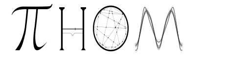
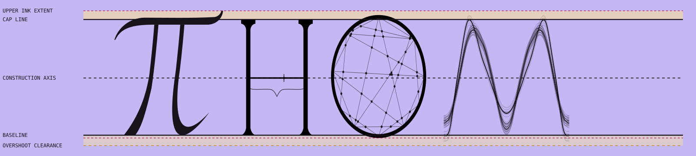
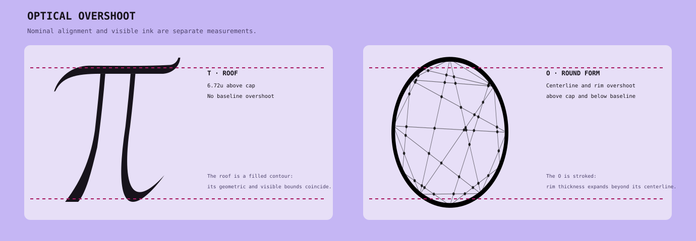
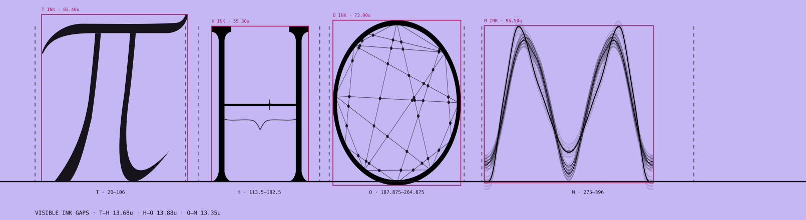
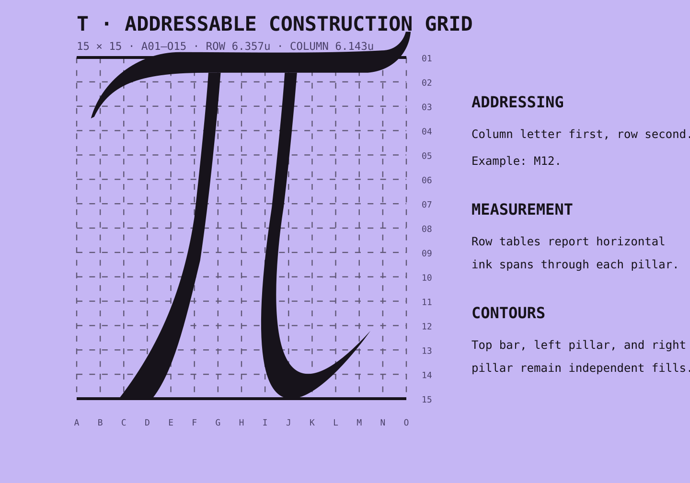

<div class="cover">
  <div class="cover-kicker">CANONICAL GEOMETRY · VERSION 1.1</div>
  <h1>THOM Typography Specification</h1>
  <p class="cover-subtitle">Construction, optical alignment, measurement, and SVG → Three.js translation</p>
  
  <div class="cover-meta">460 × 120 master · 89u cap height · refined audit geometry</div>
</div>

# Status and authority

This specification makes the refined THOM artwork canonical for **shape, proportion, and placement**. The canonical wordmark is [thom-canonical.svg](thom-canonical.svg); the machine-readable contract is [thom-typography-metrics.json](thom-typography-metrics.json).

The wordmark occupies a **460 × 120 master-unit artboard**. The former 460 × 152 audit board is not a second geometry system: its lower 32 units are annotation space. One master unit (1u) is one SVG user unit.

> **Typographic rule.** The baseline is the nominal alignment datum, not necessarily the lowest visible pixel. Filled contours, stroked centerlines, and round caps must be measured separately.

> **Evidence rule.** Geometry and accessibility constraints eliminate known defects; they do not prove universal beauty. The H’s golden-ratio division is an identity narrative and testable design prior, not a psychophysical optimum.

| Authority | Canonical source | Rule |
|---|---|---|
| Shape and placement | `docs/brand/typography/thom-canonical.svg` | Governs glyph outlines, construction, relative scale, and spacing. |
| Numeric geometry | `docs/brand/typography/thom-typography-metrics.json` | Governs lines, frames, bounds, overshoot, grid coordinates, and conversion constants. |
| Color and materials | `../../libs/thom-brand/src/geometry.ts` | Preserve the existing palette, metallic ramps, glow, stroke stacks, and source-energy compensation. |
| Motion and WebGL behavior | `../../libs/thom-brand/src/threeScene.ts` and generated brand data | Preserve timing, reveal order, animated construction, and material behavior during migration. |
| Optical profiles | `../../libs/thom-brand/src/opticalProfile.ts` and `src/brand/thom/svg.ts` | Select display, compact, or micro detail from rendered size while preserving the canonical silhouettes. |

<div class="page-break"></div>

# Vertical metrics



| Metric | SVG y | Three.js y | Definition |
|---|---:|---:|---|
| Upper ink extent | 8.30 | 111.70 | Highest rendered ink, set by the T roof. It is an observed ink bound, not a font-wide alignment line. |
| Cap line | 15.00 | 105.00 | Nominal top alignment for H and the principal M waveform. |
| Horizontal construction axis | 60.00 | 60.00 | Shared geometric axis through the H proportion split and O construction. |
| Baseline | 104.00 | 16.00 | Nominal lower alignment for filled T/H contours and the principal M waveform. |
| Lowest visible ink | 106.15 | 13.85 | Rendered bottom of the O perimeter at the specified audit weight. |
| Lower overshoot clearance | 112.00 | 8.00 | Reserved clearance/safety boundary; it is not an ink target. |

The cap height is **89u**. At the reference width of 2300 px, the export scale is **5 px/u**, so the cap height renders at 445 px.

## Optical compensation



- **T:** the roof reaches y = 8.2755, or 6.7245u above the cap line. Its pillar terminals land on the baseline with no lower ink overshoot.
- **O:** the perimeter centerline extends beyond both cap line and baseline; the visible rim extends farther by half the transformed stroke weight. This is conventional round-form compensation, not misalignment.
- **H:** the filled terminals land on the cap line and baseline. Its stem width and terminal/serif width are distinct metrics.
- **M:** the principal centerline aligns to cap line and baseline; round strokes and layered fine strands add a small visible-ink extension.

<div class="page-break"></div>

# Glyph metric sheets

Bounds are listed as **left, top, right, bottom** in master coordinates. “Geometric” uses SVG vector bounds; “visible ink” is verified at 20 px/u with alpha ≥ 0.5 and is reported to 0.05u precision.

| Glyph | Design frame | Geometric bounds | Visible-ink bounds | Upper ink overshoot | Lower ink overshoot |
|---|---|---|---|---:|---:|
| T | 20–106 | 23.72, 8.28, 107.14, 104.00 | 23.75, 8.30, 107.15, 104.00 | 6.70 | 0.00 |
| H | 113.5–182.5 | 120.70, 15.00, 176.25, 104.00 | 120.83, 15.00, 176.13, 104.00 | 0.00 | 0.00 |
| O | 187.875–264.875 | 190.26, 11.74, 262.87, 105.98 | 190.00, 11.60, 263.00, 106.15 | 3.40 | 2.15 |
| M | 275–396 | 276.60, 11.77, 372.60, 108.61 | 276.35, 14.70, 372.85, 104.70 | 0.30 | 0.70 |

## T — three independent filled contours

The T is built from **top-bar**, **left-pillar**, and **right-pillar** contours. Each contour retains paired outer/inner Bézier edges. The canonical transform is `translate(22, −0.222) scale(0.86, 1.03)`. Curve edits must move corresponding anchors and adjacent handles along the local normal; never replace the contours with simplified polygons or non-uniformly scale the whole letter.

## H — stem and terminal measures

- Construction-axis stem width: **3.3004u**.
- Cap/baseline terminal width: **11.5440u**.
- Local pillar centers after the audit adjustment: **28u** and **72u**.

### H motion contract

The display H uses one procedural, clockwise logarithmic golden spiral centered on the golden-ratio division point. Its radius grows by **φ per quarter turn**, completes **2.25 turns** at a **32u** radius, and remains behind the H construction. The 1000 ms sequence traces through 680 ms, holds through 820 ms, then fades to the unchanged settled H. Page load and direct H interaction share this geometry and timing. Pointer exit never cancels an active trace; reduced motion skips it.

## O — centerline versus rim

- Side perimeter weight: **2.2994u**.
- Cap/baseline perimeter weight: **2.9788u**.
- Perimeter centerline bounds, local: **8.652, 13.058, 79.358, 104.662**.
- Node/chord construction remains integral to the canonical O; the outer circle is not a substitute for the internal network.

## M — layered waveform

The M remains a textural Fourier construction. Four fine-strand copies are added at local y offsets **−2.4, −1.2, +1.2, +2.4**, each at 0.4 opacity. Existing strand widths are unchanged.

<div class="page-break"></div>

# Horizontal placement and spacing



The design frame is the nominal placement/advance region. The ink box is the actual rendered silhouette. Sidebearings are therefore measured from the frame edge to the visible ink—not inferred from a character’s nominal 100u source cell.

| Pair | Visible-ink gap |
|---|---:|
| T–H | 13.6750u |
| H–O | 13.8750u |
| O–M | 13.3500u |

The three gaps remain optically—not mechanically—defined, but now cluster within **0.5250u**. Their near-equality is a calibrated prior to be validated in use, not a claim that equal spacing is universally preferred.

## Placement transforms

| Glyph | Master transform | Design frame |
|---|---|---|
| T | translate(22, −0.222) · scale(0.86, 1.03) | 20–106 |
| H | translate(98.475, 0); local pillar scale x = 0.74 | 113.5–182.5 |
| O | translate(182.5, −8.4) · scale(0.88, 1.14) | 187.875–264.875 |
| M | translate(274.6, −26.7) · scale(1, 1.49) | 275–396 |

<div class="page-break"></div>

# T construction grid



Grid addresses use the **column letter first** and the **two-digit row second**: `A01` through `O15`. Rows are equally spaced between cap line and baseline; columns are equally spaced across the T design frame.

- Row spacing: **6.357143u**.
- Column spacing: **6.142857u**.
- Horizontal measurements report contiguous filled-ink spans through each independent pillar contour.
- Multiple values indicate distinct ink runs where a terminal or concavity crosses the same guide.

<div class="page-break"></div>

# T pillar widths by row

| Row | SVG y | Left pillar | Right pillar |
|---:|---:|---:|---:|
| 01 | 15.0000 | — | — |
| 02 | 21.3571 | 3.174u | 3.174u |
| 03 | 27.7143 | 3.153u | 3.153u |
| 04 | 34.0714 | 3.155u | 3.155u |
| 05 | 40.4286 | 3.154u | 3.154u |
| 06 | 46.7857 | 3.138u | 3.138u |
| 07 | 53.1429 | 3.094u | 3.094u |
| 08 | 59.5000 | 3.148u | 3.099u |
| 09 | 65.8571 | 3.549u | 3.228u |
| 10 | 72.2143 | 3.877u | 3.455u |
| 11 | 78.5714 | 4.411u | 3.803u |
| 12 | 84.9286 | 5.328u | 4.348u |
| 13 | 91.2857 | 6.560u | 5.358u + 1.105u |
| 14 | 97.6429 | 7.903u | 17.410u |
| 15 | 104.0000 | — | — |

<div class="page-break"></div>

# T vertical intersections

| Column | SVG x | Top bar | Left pillar | Right pillar |
|---:|---:|---:|---:|---:|
| A | 20.0000 | — | — | — |
| B | 26.1429 | 2.444u | — | — |
| C | 32.2857 | 3.840u | 1.649u | — |
| D | 38.4286 | 5.109u | 10.964u | — |
| E | 44.5714 | 5.635u | 14.855u | — |
| F | 50.7143 | 5.407u | 17.619u | — |
| G | 56.8571 | 5.332u | 8.395u | — |
| H | 63.0000 | 5.292u | — | — |
| I | 69.1429 | 5.262u | — | 28.418u |
| J | 75.2857 | 5.256u | — | 23.565u + 9.444u |
| K | 81.4286 | 5.291u | — | 4.639u |
| L | 87.5714 | 5.383u | — | 2.431u |
| M | 93.7143 | 5.551u | — | 0.811u |
| N | 99.8571 | 4.925u | — | — |
| O | 106.0000 | 4.167u | — | — |

The roof’s vertical span is deliberately non-uniform: its long sweep is thinner through the center and resolves into sharpened terminals. Pillar readings become discontinuous near the feet because the horizontal sample can cross a terminal turn more than once.

<div class="page-break"></div>

# Scaling and export

## Master units

Keep geometry in the 460 × 120 master whenever possible. Scale only at the final presentation boundary.

For a target width (W):

`scale = W / 460`

At the reference export, (W = 2300), so `scale = 5 px/u`. The corresponding height is `120 × 5 = 600 px`.

For a constrained viewport, use a uniform contain scale:

```ts
const scale = Math.min(viewportWidth / 460, viewportHeight / 120);
const offsetX = (viewportWidth - 460 * scale) / 2;
const offsetY = (viewportHeight - 120 * scale) / 2;
```

Never fit the complete wordmark with independent X and Y scales. Glyph-specific transforms already belong to the canonical construction and must not be reinterpreted as responsive distortion.

## Optical profiles

Profile selection uses the **rendered wordmark width**, not a device category or component name. The React component observes its actual inline size when `opticalProfile="auto"`; callers may pin a profile for exports or controlled comparisons.

| Profile | Rendered width | Treatment |
|---|---:|---|
| Display | > 300px | Full luminous construction, golden-ratio annotations, canonical O network, and layered M. |
| Compact | 121–300px | Stronger H stems, quiet continuous a/b crossbar, compact O network, and a compact M surrounded by dense irregular Fourier scribbles. |
| Micro | ≤ 120px | Continuous H crossbar without φ ticks/brace/point, seven O chords without nodes, and a strengthened M contour. |

Compact and micro assets apply small X-only spacing corrections recorded in the metrics contract. They never distort glyph geometry. The golden-ratio construction remains available in the display mark and procedural spiral animation, but it does not compete with letter recognition in utility sizes.

## Perceptual validation protocol

The golden-ratio split remains an **unvalidated design prior**. Before making a preference claim, compare blinded display variants at 1:1, φ:1, and 2:1 while holding pillars, total crossbar span, stroke energy, and wordmark spacing constant. Randomize order and record THOM recognition, perceived balance, forced-choice preference, and response confidence.

Repeat the recognition check at 184px compact and 92px micro sizes. Those profiles intentionally suppress ratio annotations, so the small-size question is legibility and identity survival—not whether viewers can recover φ from the rendered pixels. Report sample, context, uncertainty, and null results alongside any winner.

## Raster export examples

| Target width | Uniform scale | Output height |
|---:|---:|---:|
| 460 px | 1 px/u | 120 px |
| 920 px | 2 px/u | 240 px |
| 1380 px | 3 px/u | 360 px |
| 2300 px | 5 px/u | 600 px |

<div class="page-break"></div>

# SVG → Three.js translation

SVG’s origin is at the upper left and y increases downward. The canonical Three.js scene uses the same 460u width and 120u height, but y increases upward.

```ts
type Point = { x: number; y: number };

const svgToThree = ({ x, y }: Point) =>
  new Vector3(x, 120 - y, 0);
```

Apply the function to every `M`, `L`, and `C` coordinate, including both cubic control points. Preserve `Z` as `closePath()`.

## Preferred: flatten the SVG transform first

```ts
type SvgTransform = {
  tx: number;
  ty: number;
  sx: number;
  sy: number;
};

function transformedPoint({ x, y }: Point, t: SvgTransform) {
  const X = t.tx + t.sx * x;
  const Y = t.ty + t.sy * y;
  return new Vector3(X, 120 - Y, 0);
}
```

Flattening is least ambiguous because nested SVG transforms are resolved before the y-axis inversion.

## Equivalent Three.js group transform

If local geometry has already been converted with `(x, 120 − y)` and the SVG transform is only translate + scale:

```ts
group.scale.set(sx, sy, 1);
group.position.set(tx, 120 - ty - 120 * sy, 0);
```

## Camera

```ts
const camera = new OrthographicCamera(0, 460, 120, 0, -30, 30);
```

| SVG datum | SVG y | Three.js y |
|---|---:|---:|
| Artboard top | 0 | 120 |
| Cap line | 15 | 105 |
| Construction axis | 60 | 60 |
| Baseline | 104 | 16 |
| Artboard bottom | 120 | 0 |

## Legacy 416 × 120 compatibility

The former 416 × 120 scene is a compatibility viewport, not the geometry master. If it cannot yet be migrated, preserve proportions with a uniform scale of **0.904347826**. The canonical art becomes **108.521739u** high with **5.739130u** of vertical inset above and below. Do not squeeze 460u into 416u while retaining the full 120u height.

<div class="page-break"></div>

# Preservation and migration checklist

## Preserve from the legacy implementation

- Metallic color ramps and light/dark/monochrome themes.
- Source-energy compensation and display stroke conversions.
- T rim, O perimeter/chord/node materials, H proportion construction, and M layered stroke materials.
- Animation timing, reveal ordering, H logarithmic golden-spiral trace, O network stages, and M Fourier buildup.
- Responsive orthographic-camera behavior, adjusted to a 460 × 120 canonical base.

## Replace during a future production migration

- Geometry and placement constants derived from the old 416 × 120 master.
- Legacy T path data and old per-glyph placements where they disagree with this canonical SVG.
- Any non-uniform whole-wordmark fit introduced solely to preserve the old viewport.

## Acceptance checks

1. Composite `thom-canonical.svg` over `#c5b6f4` at 2300 × 600 and compare it to the refined audit raster.
2. Verify cap line, construction axis, baseline, and optical overshoots from the metrics JSON.
3. Confirm every cubic control point receives the same affine transform as its endpoint.
4. Confirm the 460 × 120 camera displays the canonical wordmark without cropping or anisotropic scaling.
5. Re-run the T grid measurements after any contour edit; do not copy old width tables forward.
6. Preserve color/material/motion sources until a separate migration explicitly supersedes them.
7. At widths of 92px, 184px, and 460px, verify the selected micro, compact, and display profiles respectively; every glyph must retain a high-contrast recognizable core.
8. Confirm compact and micro H output omits the ratio point, ticks, and brace while the display H retains them and the procedural spiral remains display-only.
9. Do not describe the φ split as preferred until the blinded comparison protocol is run and reported; exact geometry alone is not preference evidence.

---

**Specification artifacts:** [canonical SVG](thom-canonical.svg) · [metrics JSON](thom-typography-metrics.json) · [print-ready PDF](thom-typography-overview.pdf)
