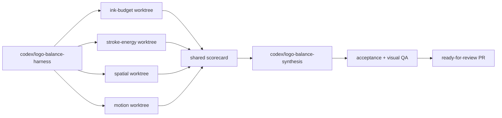

# THOM Logo Balance Implementation Plan

This plan implements the deterministic workflow in
`docs/logo-balance-orchestrator-handoff.md`. The handoff remains authoritative
if this tracking document and the handoff ever differ.

## Work plan

- [x] Freeze a harness-only baseline with deterministic 8x linear-light
  measurements, multiscale reports, temporal H frames, and comparison images.
- [x] Create four isolated branches and worktrees from that exact baseline.
- [x] Run exactly four specialist variants: ink budget, source stroke energy,
  spatial moments/counters/gaps, and temporal/multiscale balance.
- [x] Require each specialist to provide implementation, JSON metrics, visual
  evidence, changed parameters, and validation output.
- [x] Score all variants with the shared objective and reject every invariant
  violation before considering aggregate score.
- [x] Reproduce only compatible winning decisions on the synthesis branch.
- [x] Iterate on the full acceptance suite and visual comparison until every
  deterministic threshold passes or a genuine blocker is documented.
- [x] Commit generated assets, measurements, screenshots, tests, scorecard, and
  decision record.
- [x] Push the synthesis branch, open a ready-for-review PR, and do not merge it.

## Fixed branch topology

## Current status

The shared measurement harness, all four isolated specialist reports, common
scorecard, synthesized implementation, generated assets, full acceptance suite,
and Paper review are complete. The synthesis passes `28/28` deterministic gates
with `J = 0.069890` and is published as ready-for-review PR #7. The PR remains
open and intentionally unmerged.
