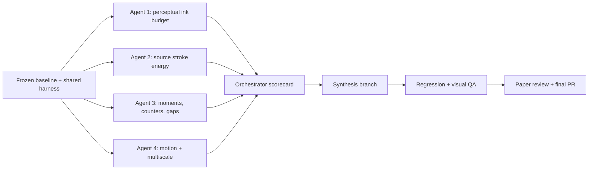

# THOM Logo Balance — Four-Agent Orchestrator Handoff

## Mission

Coordinate four implementation agents to produce and evaluate deterministic variants of the THOM logo, then synthesize the strongest result into one production-ready change.

The work must improve typographic balance without erasing how any character is constructed. The target is not to make the letters look like one conventional font. It is to make four different construction systems feel as though they belong to one wordmark.

Use [Paper](https://paper.design/) for visual comparison, review, and final design handoff. The repository remains the source of truth for geometry, rendering, measurement, generated assets, and tests.

## Current Baseline

The Golden-Ratio H redesign is present on `master` through PR #5. Its important properties are:

- Master coordinate system: `416 × 120`.
- T: custom π/T filled contour with the legs already tightened.
- H: thin classical pillars, exact golden-ratio crossbar, endpoint/division ticks, full-unit under-brace, and a 1000 ms procedural logarithmic golden-spiral trace.
- O: deterministic circle and seeded random-chord network using `THOM-01`.
- M: deterministic layered Fourier construction with a whispy waveform silhouette.

An 8× linear-light measurement of `public/brand/thom-master.svg` produced this settled-state baseline:

| Glyph | Current optical-energy share | Target band |
|---|---:|---:|
| T | 44.2% | 31–33% |
| H | 21.3% | 25–28% |
| O | 14.1% | 16–18% |
| M | 20.4% | 24–27% |

Other measured facts that must be considered:

- Approximate geometric gaps are `10.1 / 12.0 / 12.0` design units for T–H, H–O, and O–M.
- The H crossbar's `a` segment currently carries about `1.522×` the stroke energy per unit length of `b`.
- That material difference moves the crossbar's optical centroid about `2.11` units left of `x = 50`, although the endpoints are centered.
- The H motion is vector-native: a 2.25-turn spiral starts at the ratio point, grows by φ each quarter turn, and finishes at a 32u radius behind the H.
- A first-pass energy budget of `T × 0.70`, `H × 1.15`, `O × 1.15`, and `M × 1.18` predicts shares near `32.3 / 25.6 / 17.0 / 25.1`.

Treat these values as a reproducible baseline, not eternal constants. Recompute them from the checked-out revision before and after every variant.

## Character Invariants

These are hard constraints. A lower score does not justify breaking them.

### T

- Preserve the recognizable π/T topology, calligraphic roof, two legs, terminals, and counter relationships.
- Do not replace it with a font glyph or reconstruct it as generic straight strokes.
- Weight may change through constrained contour offsets, horizontal scale, gradient/highlight coverage, and glow.
- Any contour operation must preserve path topology and avoid collapsed or self-intersecting sections.

### H

- Preserve two thin classical pillars and their tightened relationship.
- Preserve the exact relation `a:b = (a+b):a = φ` to numerical tolerance.
- Preserve the endpoint ticks, division tick, and full-unit under-brace.
- Preserve the golden-ratio spiral narrative and reduced-motion/static fallbacks.
- Do not regain weight by making the pillars blunt or strongly gradient-heavy. Prefer flatter material energy and clearer proportional construction.

### O

- Preserve the circle, seeded random chords, anchors, intersections, and deterministic `THOM-01` topology.
- The circumference may become thicker or brighter.
- Do not simplify the O into a conventional filled ring.

### M

- Preserve the composed layering of whispy waves and the Fourier/superposition idea.
- Additional layers, seeded noise, or partial sums are allowed.
- Do not replace the M with a conventional outline or one heavy monoline path.

## Shared Measurement Harness

Before dispatching variants, the orchestrator should create or designate one shared Bun TypeScript measurement script, preferably:

`scripts/brand/measure-logo-balance.ts`

All four agents must use the same script and fixed render conditions. The script should:

1. Generate the brand assets from source.
2. Rasterize the master at 8× for stable subpixel measurement.
3. Evaluate 24 px, 48 px, and 120 px display heights.
4. Convert sRGB to linear luminance before measuring energy.
5. Report total optical energy, high-contrast core area, centroid, second moments, occupied bounds, counter area, and optical sidebearings for each glyph.
6. Capture H animation frames every 25 ms from `0–1000 ms` and measure temporal energy and centroid.
7. Emit deterministic JSON plus comparison images under `.codex/audits/logo-balance/<variant>/`.

Use target midpoints `32 / 26.5 / 17 / 25.5` for T/H/O/M while retaining the target bands in the report.

Use the same aggregate score for every variant:

\[
J = 0.40E_{mass} + 0.20E_{core} + 0.15E_{moments} + 0.10E_{gaps} + 0.15E_{motion}
\]

Lower is better. Publish every component of the score so a visually important regression cannot hide inside a single aggregate number.

## Parallel Work Structure

The four variants touch the same geometry and renderer files. They must not edit one shared worktree concurrently.

Create four isolated branches/worktrees from the same baseline commit, one for each agent. Agents may communicate findings, but an agent must only modify its assigned worktree. The orchestrator owns the baseline harness, scorecard, and final synthesis branch.



Suggested branch names:

- `codex/logo-balance-ink-budget`
- `codex/logo-balance-stroke-energy`
- `codex/logo-balance-spatial`
- `codex/logo-balance-motion`
- `codex/logo-balance-synthesis`

## Agent 1 — Perceptual Ink Budget

### Objective

Implement the reference-calibrated optical-energy approach. Bring the settled wordmark into the target bands with the smallest character-preserving changes.

### Required method

Measure each glyph using:

\[
W_i = \sum_p \alpha_p L_p
\]

Also measure high-contrast core coverage separately so glows cannot substitute for a legible skeleton.

Start from the provisional energy multipliers:

- T: `0.70`
- H: `1.15`
- O: `1.15`
- M: `1.18`

Perform bounded iterations rather than one large visual rewrite. No geometry parameter may change by more than 6% in one iteration without documenting why.

### Preferred controls

- T: highlight distribution, contour offset, glow, and very small horizontal scaling.
- H: flatter body luminance and clearer proportional linework while retaining thin pillars.
- O: circumference core/middle/halo widths.
- M: additional deterministic partial layers or seeded noise.

### Deliverables

- Working variant implementation.
- Before/after metrics JSON at all three sizes.
- Monochrome and production-material comparisons.
- Short report listing every changed parameter and its measured effect.

## Agent 2 — Source-Level Stroke Energy

### Objective

Balance the wordmark analytically from source geometry and material stacks before rasterization.

### Required method

Use:

\[
E = \sum_{lines}\ell_k w_k o_k L_k + \sum_{fills}A_j o_j L_j
\]

Use a bounded deterministic update such as:

\[
q_{n+1} = q_n\sqrt{E^*/E_n}
\]

Validate every analytic prediction against the shared raster measurement.

### H-specific requirement

Preserve the exact 61.8/38.2 split while bringing the effective per-unit energy of `a` and `b` close enough that the crossbar centroid returns to the center. The segment lengths and divider communicate the ratio; the long segment does not need a second large brightness advantage.

Target:

- Crossbar optical centroid within `0.25` design units of `x = 50`.
- Exact golden-ratio tests continue to pass.

### Deliverables

- Working variant implementation.
- Source-energy calculator or documented extension to the shared harness.
- Predicted-versus-rendered energy table.
- Parameter sensitivity table for T, H, O, and M.

## Agent 3 — Spatial Moments, Counters, and Optical Gaps

### Objective

Improve balance that raw ink totals cannot detect: vertical placement, internal counters, sidebearings, and the rhythm between dissimilar silhouettes.

### Required method

Measure weighted centroids and second moments:

\[
\bar{x}=\frac{\sum xW_p}{\sum W_p}, \qquad
\bar{y}=\frac{\sum yW_p}{\sum W_p}
\]

Use a blurred silhouette or distance field to measure optical gaps rather than comparing bounding boxes alone.

### Focus areas

- Reduce the T's upper-left dominance without flattening its roof.
- Keep the H's full construction optically centered.
- Preserve the O's central circular stability.
- Correct the M's relatively high optical center and short apparent vertical footprint without losing its waves.
- Make the three inter-glyph gaps feel equal at 24, 48, and 120 px, even if their numeric widths differ.

### Deliverables

- Working variant implementation.
- Centroid, moment, counter, and optical-gap report.
- Overlay images showing optical centers and sidebearing fields.
- Recommended final placements and advances with rationale.

## Agent 4 — Temporal and Multiscale Balance

### Objective

Make the animated H and small-size wordmark maintain the same perceived balance as the settled desktop mark.

### Required method

Evaluate the H every 25 ms across its 1000 ms sequence:

\[
J_{motion}=\frac{1}{T}\int_0^T |W_H(t)-W_H^*|dt +
\lambda\max_t|\bar{x}_H(t)-\bar{x}_H^*|
\]

Validate the single canonical strategy: a clockwise logarithmic golden spiral centered on the ratio point, with radius growth of φ per quarter turn, 2.25 turns, a 32u final radius, and trace/hold/fade boundaries at 68% and 82%.

At 24 and 48 px, verify that the H ticks/brace, O circumference/chords, and M core/layers survive downsampling without turning into noisy glow.

### Deliverables

- Working variant implementation.
- Frame-by-frame energy and centroid plot/data.
- Contact sheet of spiral-trace, shell-hold, shell-fade, and settled frames.
- Desktop, compact, mobile, reduced-motion, and static-fallback comparisons.

## Orchestrator Synthesis Protocol

1. Freeze one baseline commit containing only the shared harness and no balancing opinion.
2. Dispatch the four agents into isolated worktrees from that commit.
3. Require each agent to run the same generation and measurement commands before reporting completion.
4. Reject variants that violate a character invariant even if their aggregate score is better.
5. Build one scorecard with numerical results, screenshots, changed parameters, regressions, and implementation complexity.
6. Create `codex/logo-balance-synthesis` from the baseline.
7. Cherry-pick or manually reproduce only the winning parameter decisions. Do not merge four overlapping geometry implementations wholesale.
8. Recompute all metrics after synthesis; interactions between changes can invalidate individual variant scores.
9. Review the synthesized desktop, compact, mobile, monochrome, and animation states in Paper.
10. Publish one final PR containing the implementation, generated assets, measurements, tests, and a concise design decision record.

## Acceptance Criteria

The synthesized result is ready only when all of the following are true:

- At 120 px, each glyph is inside its target optical-energy band.
- At 24 and 48 px, each glyph remains within 2 percentage points of its target band and retains a recognizable core.
- Core-energy balance does not depend primarily on halos or gradients.
- H crossbar centroid is within `0.25` design units of center.
- H golden-ratio geometry remains exact to the existing test tolerance.
- H peak animation energy is no more than 35% above the settled H.
- The generated radius grows by φ per quarter turn within `1e-6` tolerance.
- H animation centroid moves no more than 2 design units horizontally after reveal.
- The H remains recognizable after reveal and the final frame exactly matches the settled state.
- Optical gaps differ by no more than 10% from their mean at each tested size, unless a documented shape correction visibly improves the rhythm.
- O chord topology and seed remain deterministic.
- M additions are deterministic and remain visibly layered/whispy.
- Reduced-motion and static SVG fallbacks match the settled construction.
- Generated master, compact, light, monochrome, glyph, avatar/favicon, and Open Graph assets are updated consistently.
- Typecheck, unit/component tests, production build, browser tests, and focused brand audit pass.

## Relevant Files

- `src/brand/thom/geometry.ts` — canonical geometry, materials, placements, and animation constants.
- `src/brand/thom/svg.ts` — static/generated SVG rendering.
- `src/brand/thom/threeScene.ts` — WebGL materials and animated states.
- `src/brand/thom/ThomLogo.tsx` — React integration and fallbacks.
- `scripts/brand/generate-brand.ts` — generated asset pipeline.
- `src/brand/thom/geometry.ts` — deterministic golden-spiral generation and timing state.
- `tests/geometry.test.ts` — geometry and deterministic construction contracts.
- `tests/e2e/site.spec.ts` — responsive, interaction, and SVG/WebGL parity coverage.
- `tests/visual/brand-compare.spec.ts` — focused visual audit.
- `design-qa.md` — historical QA record and final status.

## Required Validation Commands

```bash
bun run generate:brand
bun run typecheck
bun run test
bun run build
bun run test:e2e
bun run audit:brand
```

If the shared measurement harness is added as recommended, expose it through a package script such as:

```bash
bun run measure:brand:balance
```

Record the exact command, revision, viewport, pixel ratio, and output path in every agent report so results are reproducible.

## Design-Theory Guardrail

Use the golden ratio as the H's internal semantic proportion. Do not force φ onto every glyph width, gap, or weight. Whole-wordmark balance should come from cap-height alignment, counters, optical mass, sidebearings, and scale-aware perception. Mathematical proportion and optical correction are complementary constraints, not substitutes for one another.
