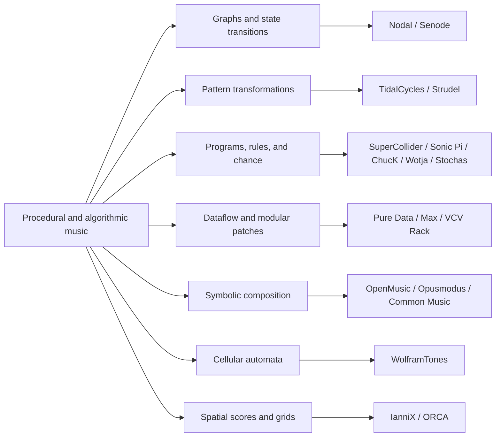
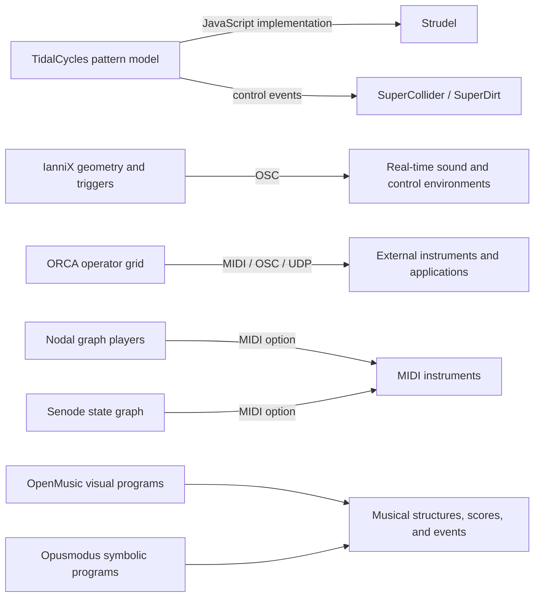

# Algorithmic Music: Generative Methods and Tool Relationships

A companion to the [Non-AI Generative Music: Systems, Methods, and Market
Survey](non-ai-generative-music-systems-and-market-survey.md), focused on how
generative methods work and how the tools relate to one another.

The supplied `deep-research-report.md` is byte-for-byte identical to the earlier
`generative-procedural-music.md` import. Its
[original text](references/non-ai-generative-music-original.txt) is preserved
verbatim. The existing survey remains the detailed reference for the 18 product
profiles, licenses, distribution, source qualifications, and market observations.
This companion collects the conceptual map and diagrams without creating a
second competing set of product facts.

## What “non-AI” means in these notes

The working distinction concerns a **documented musical workflow that does not
require a trained generative model**. Explicit rules, probability, graph traversal,
pattern transformations, symbolic programs, or cellular automata can produce
variation without learning a model from musical examples.

Three kinds of evidence should remain separate:

- **Vendor positioning:** Wotja explicitly calls its music “AI-free,” while its
  engine explanation also mentions “AI techniques & heuristics.” Attribute that
  terminology to the vendor; it does not establish that Wotja excludes every
  historical meaning of AI or is the only vendor making such a claim.
  [Wotja's explanation](https://wotja.com/music/)
- **Documented mechanism:** a described graph, program, pattern operation, or
  transition rule can explain a workflow without requiring trained-model
  inference. This is a classification of that mechanism, not an audit of an
  application's entire source or dependencies.
- **Extensible environment:** Max, Pure Data, SuperCollider, ChucK, and VCV Rack
  can support procedural generation while also allowing other techniques through
  code or extensions. Calling the described workflow procedural does not make
  every possible use of the environment “AI-free.”

The [survey's introduction](non-ai-generative-music-systems-and-market-survey.md#executive-summary)
provides the shared definition and qualifications. No exhaustive inventory of
all algorithmic music software, market ranking, or independent AI audit is
claimed here.

## A map of generative methods

These categories overlap. They describe ways to organize musical behavior,
rather than mutually exclusive product types. The linked survey profiles below
provide the sources for each example.

| Method | What determines the music | Examples |
| --- | --- | --- |
| Graphs and state transitions | Players or active states move through connected events, sometimes using probability. | Nodal, Senode |
| Pattern transformations | Functions transform repeating structures in musical time. | TidalCycles, Strudel |
| Procedural timing and controlled chance | Explicit programs, rules, clocks, state, and probability shape events. | SuperCollider, Sonic Pi, ChucK, Wotja, Stochas |
| Dataflow and modular patches | Connected objects or modules exchange control signals and audio. | Pure Data, Max, VCV Rack |
| Symbolic composition | Programs transform musical structures such as pitch, rhythm, notation, and form. | OpenMusic, Opusmodus, Common Music / Grace |
| Cellular automata | Repeated cell-update rules produce patterns that can be mapped into music. | WolframTones |
| Spatial scores and executable grids | Geometry or the arrangement of operators participates in execution. | IanniX, ORCA |

The table is also the text equivalent of the diagram. A tool's placement is a
useful entry point, not a restriction on what it can do. For example, a modular
patch can implement probabilistic state transitions, and a timed program can
manipulate symbolic structures.

## Tool map and detailed profiles

Each tool name links directly to its profile in the existing survey, including
the primary sources and qualifications already recorded there. These are
interaction-design observations, not comparative performance scores.

| Tool and source-backed profile | Mechanism to study | Possible lesson for theory |
| --- | --- | --- |
| [Nodal](non-ai-generative-music-systems-and-market-survey.md#nodal) | Players traverse a musical graph; edge length participates in timing. | Make routes and temporal relationships visible together. |
| [Senode](non-ai-generative-music-systems-and-market-survey.md#senode) | Probabilistic finite-state sequencing. | Show the active state and the alternatives available from it. |
| [TidalCycles](non-ai-generative-music-systems-and-market-survey.md#tidalcycles) | Composable transformations of time patterns. | Let users transform a phrase without editing every event. |
| [Strudel](non-ai-generative-music-systems-and-market-survey.md#strudel) | The Tidal pattern model in a browser-based JavaScript environment. | Put executable examples beside explanations. |
| [SuperCollider](non-ai-generative-music-systems-and-market-survey.md#supercollider) | Algorithmic composition and synthesis through language/server components. | Separate musical event decisions from sound generation. |
| [Sonic Pi](non-ai-generative-music-systems-and-market-survey.md#sonic-pi) | Live loops, state, and repeatable random operations. | Teach variation through small, audible changes. |
| [ChucK](non-ai-generative-music-systems-and-market-survey.md#chuck) | Explicit time and concurrent musical programs. | Expose when processes run and how they synchronize. |
| [Wotja](non-ai-generative-music-systems-and-market-survey.md#wotja) | Rule-driven generation, chance, patterns, templates, and scripting. | Offer playable starting points with deeper editable controls. |
| [Stochas](non-ai-generative-music-systems-and-market-survey.md#stochas) | Probabilistic, polyrhythmic MIDI sequencing. | Treat probability as part of the sequence that users can inspect. |
| [Pure Data](non-ai-generative-music-systems-and-market-survey.md#pure-data) | Executable visual dataflow patches. | Make signal and control relationships explicit. |
| [Max](non-ai-generative-music-systems-and-market-survey.md#max) | Visual programming for interactive audio and control. | Connect musical logic, interaction, and playback in one workspace. |
| [VCV Rack](non-ai-generative-music-systems-and-market-survey.md#vcv-rack) | Modular clocks, control signals, logic, and synthesis. | Let connected processes reveal their effect through sound. |
| [OpenMusic](non-ai-generative-music-systems-and-market-survey.md#openmusic) | Visual Lisp programs operating on musical structures. | Keep abstract transformations connected to notation. |
| [Opusmodus](non-ai-generative-music-systems-and-market-survey.md#opusmodus) | Symbolic, parametric, rule-based, and stochastic composition. | Support a path from generating material to analysis and presentation. |
| [Common Music / Grace](non-ai-generative-music-systems-and-market-survey.md#common-music--grace) | Scheme/SAL musical processes with several output destinations. | Separate the composition model from the way it is rendered. |
| [WolframTones](non-ai-generative-music-systems-and-market-survey.md#wolframtones) | Cellular-automaton patterns mapped into musical material. | Demonstrate how simple rules can create complex results. |
| [IanniX](non-ai-generative-music-systems-and-market-survey.md#iannix) | Curves, moving cursors, triggers, and OSC control. | Give geometry a defined musical meaning. |
| [ORCA](non-ai-generative-music-systems-and-market-survey.md#orca) | A spatial grid of interacting character operators. | Explore a representation that is both a visible score and an executable process. |

## Generation, synthesis, and tool relationships

**Generating musical events and synthesizing their sound are different jobs.**
Some environments do both, while others send events to a separate instrument.
Nodal, for example, supports built-in synthesis as well as external MIDI;
Strudel brings the Tidal pattern model and sound generation into the browser.
[Nodal overview](https://nodalmusic.com/),
[Strudel introduction](https://strudel.cc/workshop/getting-started/)

The diagram shows selected documented relationships, not all possible routes
or an assurance that every installation supports every connection.

In text: Strudel implements the Tidal pattern model in JavaScript; Tidal normally
uses SuperCollider/SuperDirt for sound. IanniX can control real-time environments
over OSC. ORCA emits control messages to external destinations. Nodal and Senode
can drive MIDI instruments. OpenMusic and Opusmodus work with symbolic musical
structures. The survey's [relationship table](non-ai-generative-music-systems-and-market-survey.md#scope-and-technical-taxonomy)
and individual profiles link to the supporting documentation.

For theory, separating event generation from playback could allow the same
musical material to appear in several views or drive different instruments.
That is a design proposal. It does not imply that these applications share a
common data model or can exchange their native documents.

## Product positioning and research limits

The source groups the tools around learning, live performance, visual control,
symbolic composition, template-driven generation, and DAW sequencing. Those are
useful ways to organize research, but they do not establish which marketing
channels produce customers or which application is easiest, deepest, or best.
The maintained [market-positioning section](non-ai-generative-music-systems-and-market-survey.md#adoption-and-market-positioning)
retains the interpretation and its evidence.

The source's numerical adoption claims and prices are not copied into this
companion. Repository stars, forks, installs, ratings, and paying users are
different measures. The unavailable `sandbox:` chart also lacked a portable
image asset and recoverable measurement evidence; it is described only in the
archived original. The survey records the checked distribution/licensing
information and its limits.

Making a generator's rules inspectable can help explain how an output was
produced. That alone does not prove copyright ownership, licensing rights,
uniqueness, or deterministic reproduction. Those questions can also depend on
samples, libraries, seeds, external inputs, and the applicable terms.

## Possible directions for theory

The [graphical music language proposal](theory-graphical-music-language.md)
develops these directions into a shared visual vocabulary and playable workflow,
with an explicit design lesson from each of the 18 tools.

These are collected design ideas, not implementation commitments:

- Let someone change a rule and immediately see and hear the result.
- Show the difference between a possible transition and the path actually taken.
- Offer both repeatable playback and intentional variation, with their controls
  explained clearly.
- Keep event generation, musical representation, and sound generation distinct
  enough to connect multiple views of the same material.
- Pair a small working example with an explanation before exposing deeper controls.

For practical exploration, use the [tutorial index](music-tool-tutorials.md).
Related references include [musical growth patterns](musical-growth-patterns.md),
[visual composition interfaces](visual-music-composition-interfaces-and-design-references.md),
and [DAW integration architecture](cross-daw-composer-plugin-architecture-and-host-integration.md).

## Import and rendering record

- The supplied report duplicates the source of the existing non-AI survey; this
  note and that survey link to each other and share the same archived original.
- The 92 opaque chat citation markers are retained only in that verbatim archive.
  The readable notes use standard links to sources and source-backed profiles.
- The missing temporary chart is not embedded. Both conceptual diagrams use
  simple Mermaid labels, with equivalent tables or prose for other viewers.
- All 18 tools remain accessible through the profile map. Tables are limited to
  three columns, and punctuation and arrows use normal UTF-8 text.
- No applications were installed or runtime-tested for this note.
