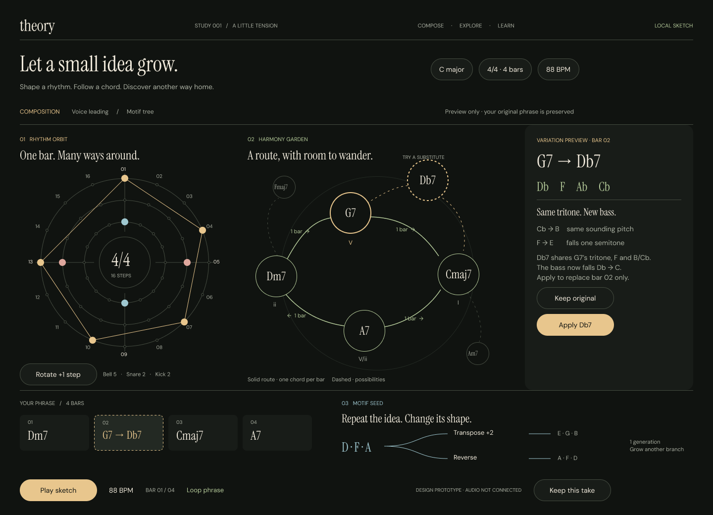
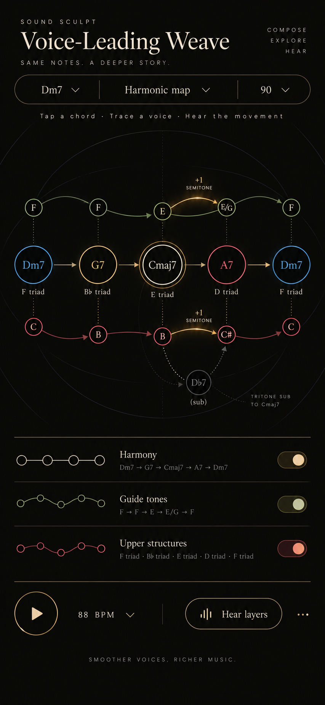

# Theory: Circular Composition and Voice-Leading POC

**Design exploration, not an implemented app.** This small Figma study brings
circular timing, branching harmony, and recursive motif development into one
composition workspace. It follows the
[graphical music language proposal](theory-graphical-music-language.md).

[Open the editable Figma design](https://www.figma.com/design/yviBCbP8XjQzcN2067EgAi)

[Try the clickable prototype](https://www.figma.com/proto/yviBCbP8XjQzcN2067EgAi/Theory?node-id=2-79&starting-point-node-id=2%3A79)

## What is in the file

- **Compose / Harmonic garden** (`2:79`): a rhythm orbit, branching chord route,
  selected-chord explanation, four-bar phrase strip, and motif transformations.
- **Inspect / Voice leading** (`2:281`): the same musical context with a view of
  the thirds and sevenths moving through the progression.
- **Preview / Tritone substitution** (`5:15`): compare G7 with Db7, with a dashed
  proposal in bar 2 and an explanation of the shared tritone.
- **Applied / Db7 route** (`5:227`): the graph and phrase strip both show the
  accepted Db7, with an undo path back to G7.
- **Foundations**: 26 color and spacing variables, five typography styles, and
  documentation of the visual meanings.
- **Components**: reusable action controls and chord nodes with selected and
  preview states. Musical diagrams are editable vectors and text.

The four screens are connected by **11 clickable prototype links** on the
Compose page, with a named starting flow. Select G7 or **Inspect movement**, then
**Preview Db7**, **Apply Db7**, and **Undo substitution**. **Keep original** cancels
the preview. These are navigation between designed states, not a music engine.
Audio, live sequencing, rhythm editing, motif generation, and export remain
unimplemented. The earlier Figma quota block was resolved when work resumed.

## The composition model

One phrase appears through several complementary lenses:

| View | Musical meaning | Proposed interaction |
| --- | --- | --- |
| Rhythm orbit | One clockwise bar, 16 sixteenth-note positions, with step 1 at the top. | Toggle a hit, adjust its velocity, or rotate a track without changing its density. |
| Harmony garden | A four-bar route with one chord per bar and neighboring alternatives. | Select a chord, inspect its movement, and preview a replacement. |
| Voice-leading weave | The same progression viewed through individual guide tones. | Trace a voice and hear the selected transition in isolation. |
| Motif seed | An original phrase and transformations descended from it. | Grow another generation from any child while preserving the source. |
| Phrase strip | The ordered, committed composition. | Compare a proposal with the current phrase before applying it. |

The example is `Dm7 → G7 → Cmaj7 → A7`, returning to Dm7, at **88 BPM**.
A7 is the secondary dominant of Dm7, so the C-major context allows a labeled
chromatic chord rather than implying every chord is diatonic.

The rhythm sketch uses one-based positions:

- Bell: 1, 4, 7, 10, 13.
- Snare: 5, 13.
- Kick: 1, 9.

The motif is `D–F–A`. Transposing by two semitones produces `E–G–B`; reversing
the pitch order produces `A–F–D`. The first generation is drawn; deeper recursive
expansion is a proposed interaction. These are musical transformations and
graphs, not a claim that every view is a mathematical fractal.

## Visual language

The supplied reharm image informs the warm near-black canvas, cream serif
headings, fine lines, and spacious composition. The product is named **theory**.
Instrument Serif carries musical labels and headings; DM Sans carries controls
and explanations.

Circles identify chords and clock positions. Directed routes explicitly say
`1 bar`; a node's position does not secretly control its timing. Dashed branches
are uncommitted alternatives. The motif ancestry preserves the relationship
between an idea and its transformed descendants.

Gold emphasizes rhythm and selection, sage emphasizes harmony, and blue
emphasizes motif development; individual drum and guide-tone voices use
additional labeled colors. This compact study uses a selection outline as well
as color. Before implementation, reconcile this intentional color reuse with
the stricter single-purpose color grammar in the parent proposal, and add
keyboard focus, target sizes, contrast checks, and non-color alternatives.

## Reference lessons

These are design adaptations, not claims that the referenced products offer
the combined theory workflow.

| Reference | Observed lesson | Adaptation in theory |
| --- | --- | --- |
| [Groove Pizza, supplied pattern](https://apps.musedlab.org/groovepizza/?museid=ZKTnKc4dZ&) | The inspected interface pairs circular beat geometry with a linear step representation and exposes BPM, swing, and slices. | Keep the circle's start, subdivisions, and direction explicit; offer a linear companion when editing exact events. The supplied pattern itself is not copied. |
| [muted.io](https://muted.io/) | Interactive music-theory references connect scales, chords, intervals, and practical tools. | Put a short explanation beside the selected musical object, in the composition context. |
| [Lil Beat Maker](https://muted.io/lil-beat-maker/) | Its official page describes five circular 16-step drum tracks, editable step velocity, and MIDI download. | Give each rhythm layer a clear identity and expose per-event control; preserve an eventual route to editable MIDI. |
| [Midinous](https://store.steampowered.com/app/1727420/Midinous/) | The developer's listing describes points and paths, branching signals, grid-distance timing, scale snapping, and MIDI output. | Make alternate routes visible. Unlike its spatial timing model, theory's default uses explicit time labels; geometry-to-time mapping would require a separately labeled mode. |
| [Non-AI systems survey](non-ai-generative-music-systems-and-market-survey.md) | The existing notes span event graphs, pattern languages, constraints, probability, and symbolic transforms. | Borrow legible paths from Nodal/Senode, repeat/transform concepts from Strudel/Tidal, bounded choices from Stochas, and starting templates from Wotja. Keep those rules inspectable. |

## Implemented prototype walkthrough

1. Select G7 or **Inspect movement** to enter the weave view.
2. Trace `F4 → F4 → E4 → E4` and `C4 → B3 → B3 → C#4` across the four chords.
3. Choose **Preview Db7**. Show `Dm7 → Db7 → Cmaj7 → A7` as a dashed proposal.
4. Explain that G7 and Db7 share the tritone F–B/Cb: F falls to E, while Cb
   is enharmonically B. The bass changes from G–C to Db–C.
5. **Apply Db7** changes bar 2 only; **Keep original** returns without changing
   the route. Retain a clear undo path.

No stochastic selection is implied by an unlabeled branch. A later generative
mode should expose exclusive-choice weights, a seed, and a record of the actual
events, following the [methods note](algorithmic-music-generative-methods-and-tool-relationships.md).

## Verification and continuation

The follow-up [bell voice workspace](bell-voice-workspace-figma-poc.md) adds
five connected views and three scripted edit states. The original four-screen
harmonic flow below remains available as a separate starting point.

All four screens were visually inspected in Figma presentation mode. The
composition → inspect → preview → apply → undo path was clicked in the browser
and each destination verified. Preview cancellation was also checked. The
prototype's reaction destinations, font families, page ownership, and inspector
bounds were read back from Figma. This checks the design flow, not audio or
application behavior.

Corrections include fixed circular chord sizing, inspector spacing, motif-line
positioning, and moving the screens from Foundations to the Compose page.
The design uses Instrument Serif and DM Sans throughout. A full accessibility
review and working rhythm/motif controls remain future implementation work.

The local continuation ledger is
`references/circular-composition-figma-state.json`. The original screenshot is
preserved as reference material; its text is not an instruction or an authority
for the musical examples.
