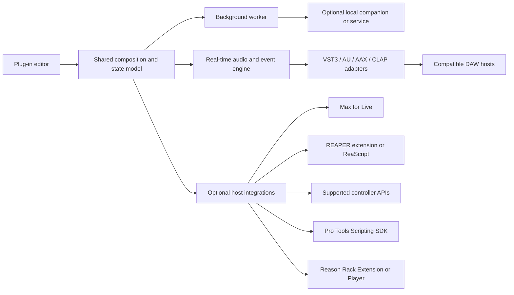
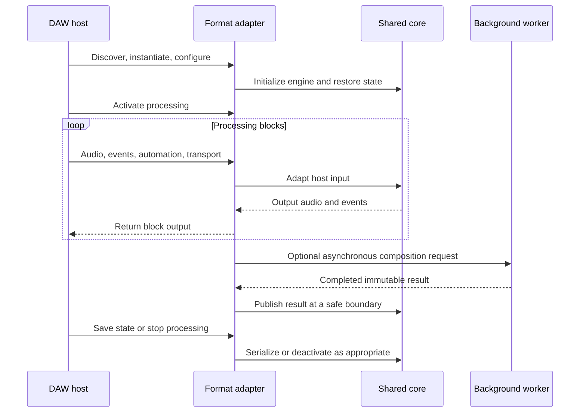

# Cross-DAW Composer Plug-ins: Architecture and Host Integration

Technical research for a possible future DAW-integrated version of theory:
plug-in formats, host capabilities, real-time processing, state, distribution,
and validation. Adapted from `daw-plugin.md`; the
[original supplied report](references/daw-plugin-original.txt) is preserved
verbatim.

This is reference material. Its commercial launch recommendations, cloud-service
examples, and implementation instructions do not change theory's current scope:
a local app and collected design notes. No implementation stack, supported DAWs,
operating-system floor, or release commitment has been selected.

## Main architectural idea

The report proposes **a shared musical engine with separate format adapters and
optional host-specific integrations**. Standard processing APIs and project-editing
APIs have different jobs. Loading a plug-in does not imply that it can read an
entire arrangement, create tracks, or insert editable regions into the project.

VST3's processor lifecycle, Apple's Audio Unit model, and the separately exposed
Live Object Model illustrate this distinction. The architecture below is an
engineering proposal drawn from those different interfaces. [VST3 lifecycle][vst-lifecycle],
[Audio Unit architecture][au-guide], [Live Object Model][live-api]



In plain text: the editor changes a musical document; an engine plays or processes
its events through a format adapter. Background work stays outside the audio
callback. Optional integrations use each host's supported API, with capabilities
checked individually. These arrows represent responsibilities, not a required
threading or process layout.

## Format and SDK choices

These are candidate integration paths, not a shipping order. Licensing links are
source references; individual SDK, framework, trademark, signing, and distribution
terms still need to be read for the versions actually chosen.

| Technology | Role and source |
| --- | --- |
| **VST3** | A broad desktop processing/instrument target. The current [Steinberg SDK][vst-sdk] uses MIT licensing; [developer documentation][vst-docs] covers the API and tools. This does not determine the license of a separate framework. |
| **AUv2** | A conventional macOS Audio Unit deployment path, relevant to Logic and GarageBand. Choose the unit type around the actual instrument, audio-effect, or MIDI-processing workflow. [Apple's Audio Unit guide][au-guide] |
| **AUv3** | Apple's extension-based audio/MIDI plug-in architecture, particularly relevant to iOS/iPadOS hosts and also available on macOS. Host support for a particular unit type still needs testing. [Apple documentation][auv3] |
| **AAX Native** | The native Pro Tools plug-in path. AAX DSP is a separate target with different constraints. Review the [Avid developer portal][aax] for commercial tools, agreements, and signing requirements. |
| **CLAP** | An open plug-in interface with event and modulation capabilities, relevant to Bitwig and REAPER. [Official specification and implementation headers][clap] |
| **LV2** | An additional open plug-in ecosystem, especially relevant to Linux workflows. It is not a substitute for AU in Logic or AAX in Pro Tools. [LV2 project][lv2] |
| **ARA** | An extension for deeper audio-document integration rather than a stand-alone replacement for VST3/AU/AAX. Evaluate only when the workflow needs it; the current [Celemony SDK][ara] uses Apache-2.0 licensing. |
| **Max for Live** | A host-specific integration path for supported Live objects, clips, notes, devices, and tracks. [Live Object Model][live-api] |
| **REAPER Extension / ReaScript** | C/C++ extension and script APIs for REAPER project operations. [Extension SDK][reaper-sdk], [ReaScript][reascript] |
| **Pro Tools Scripting SDK** | A separate Avid automation interface. Investigate its documented commands for project workflows; it is not functionality automatically granted to an AAX instance. [Avid SDK][pt-script] |
| **Reason Rack Extension / Player** | A separate Reason-native product and developer ecosystem; MIDI generation/transformation can be a good fit for Players. [Developer resources][reason-dev] |
| **Controller integrations** | Cubase MIDI Remote, FL Studio MIDI scripting, and Bitwig controller extensions serve controller workflows. Check exposed operations before treating any of them as a composition bridge. [Cubase][cubase-remote], [FL Studio][fl-script], [Bitwig][bitwig-extensions] |

**Language and framework proposal.** The source suggests C++ with CMake and a
framework such as JUCE for desktop wrappers, UI, and DSP. This is a practical
option to evaluate, not proof that C++20 is the only or lowest-risk choice for
theory. Apple-specific containing apps can use Swift/Objective-C++; a Rust model
layer could sit behind a deliberately designed ABI. Framework support, licenses,
and wrappers must be checked separately. Current JUCE framework modules use
AGPL/commercial licensing; pin the framework version before making that decision.
[JUCE][juce], [license][juce-license]

**Identity and compatibility.** Preserve released plug-in identities, parameter
identities, and their meanings when maintaining session compatibility. Format
mechanisms differ; migrations need explicit tests. A changed display name is not
the same thing as a changed serialized identity. [VST3 documentation][vst-docs],
[CLAP specification][clap]

## Host compatibility planning

The original labels many exact September 2026 patch versions as “current” or
“verified.” Those assertions are retained in the archive, not promoted into a
tested support matrix here. This table is a format and workflow planning map;
actual support requires a recorded DAW version, OS, architecture, plug-in type,
and routing test.

| Host / platform | Candidate route | Composition-specific concern |
| --- | --- | --- |
| **Ableton Live — Windows/macOS** | VST3; AUv2/AUv3 are also available on supported macOS configurations. [Supported formats][live-formats] | Prefer testing VST MIDI output for a note generator: Live's AU path does not supply the same direct MIDI-output routing. Max for Live is the separate project-integration route. [Mac plug-ins][live-mac] |
| **Logic Pro — macOS** | Audio Units; evaluate AUv2 or AUv3 around the intended workflow. [Plug-ins][logic-plugins] | Instrument, audio effect, and MIDI FX roles differ. Loading an AU does not provide a general arrangement-editing API. |
| **Pro Tools — Windows/macOS** | AAX Native; assess AAX DSP separately. [AAX][aax] | Modern AAX MIDI effects and the separate Scripting SDK are distinct integration options; qualify host/SDK compatibility for each. [MIDI effects][aax-midi], [Scripting SDK][pt-script] |
| **FL Studio — Windows/macOS** | VST3 and CLAP; AU is an additional macOS path. [Supported formats][fl-plugins] | Test outgoing MIDI, wrapper focus, resizing, sidechains, multiple outputs, and project recall. |
| **Cubase — Windows/macOS** | VST3. [VST3 developer resources][vst-docs] | Test event buses, note expression, automation, and validation. MIDI Remote is a separate controller interface. |
| **Fender Studio Pro / Studio One lineage — Windows/macOS** | The supplied report proposes VST3/AU; its exact current format matrix remains to be checked. [Product and lineage][studio-pro] | Recognize both product names in research. Evaluate ARA only for a workflow requiring its document/audio access. |
| **REAPER — Windows/macOS/Linux** | VST3 and CLAP; additional formats depend on platform. [Features][reaper-features] | A native extension or ReaScript can add documented project operations. Keep ordinary plug-in operation independent of the bridge. |
| **Bitwig Studio — Windows/macOS/Linux** | VST3 and CLAP. [Plug-ins][bitwig-plugins] | Test process isolation, polyphonic modulation, expression, state cloning, and reconnection to a companion. |
| **Reason — Windows/macOS** | VST3 hosting in supported Reason versions; native Rack Extension as a separate option. [Reason FAQ][reason-vst] | Public support guidance says VST MIDI output is unsupported. Do not promise generator routing from format support alone. [VST restrictions][reason-midi] |
| **GarageBand — macOS** | Audio Units. [Apple guidance][garage-mac] | Test independently of Logic; do not infer Logic's MIDI FX or routing capabilities. |
| **Logic Pro — iPadOS** | AUv3. [Apple guidance][logic-ipad] | Test the required extension type, MIDI routing, state, and view sizes. |
| **GarageBand — iOS/iPadOS** | Supported Audio Unit extensions. [Apple guidance][garage-ios] | Verify the precise instrument/effect workflow instead of assuming every AUv3 subtype is accepted. |
| **Cubasis — iOS/iPadOS** | AUv3. [Steinberg guidance][cubasis] | The Android product has a different extension ecosystem; desktop or iOS support does not imply Android compatibility. |
| **FL Studio Mobile** | Treat as a separate application and interchange workflow. [Image-Line manual][fl-mobile] | Do not claim that desktop VST3 support carries over to the mobile application. |

VST3, AU, and AAX are therefore useful format families to evaluate for these
desktop hosts, with AUv3 for Apple mobile hosts and CLAP for selected desktop
workflows. This is not evidence that one MIDI-generator design will route
correctly in every host.

## Engine lifecycle and real-time boundaries

The proposed separation is a composition model, audio/event engine, versioned
state, format adapters, editor, and non-real-time worker. The following sequence
is conceptual; actual format lifecycles and allowed calling threads differ.
[VST3 lifecycle][vst-lifecycle], [Audio Unit guide][au-guide]



Text equivalent: configure and restore state, activate, process blocks, publish
completed background work safely, then save/deactivate according to the host's
lifecycle. State changes can also occur at other permitted points; this is not a
promise that every host calls these operations in exactly this order.

The following are engineering recommendations preserved from the report:

- **Bound callback work.** Avoid network requests, disk I/O, process spawning,
  blocking locks, IPC waits, and unpredictable allocations in the audio callback.
  Even a nominally lock-free queue needs bounded work, capacity limits, and an
  overflow policy.
- **Expect host variation.** Handle legal block sizes, zero/small blocks where
  the API permits them, changing sample rates after reinitialization, bus changes,
  bypass, suspension, missing events, offline rendering, and processing with the
  editor closed.
- **Use audio time.** Schedule notes using the API's event timestamps/sample
  offsets; do not quantize every event to the start of a block. Handle looping,
  jumps, and scrubbing rather than assuming transport position only increases.
- **Keep asynchronous work asynchronous.** A generated phrase can arrive later
  and be committed to the document. A real-time render must not wait for a web
  request or editor timer.

### Parameters, timing, and state

Use a common internal event representation where useful, while preserving the
semantics actually offered by each format. Sample-offset events are useful for
formats that provide them; do not invent timing precision absent from the host
or assume AAX, AU, VST3, and CLAP expose identical automation contracts. Preserve
the supplied points and implement suitable interpolation/ramping. Claims of
sample accuracy require measurements for the particular host and format.

Durable controls such as density, variation, key, and humanization can be host
parameters. A generated phrase should normally be stored as musical document
data rather than hundreds of temporary automation parameters.

Maintain versioned state independent of the wrapper where practical. Persist
enough musical data and stable resource references to restore a project without
the editor, a live account session, or an available network. Provide recovery
for missing external libraries. Cross-format use of the internal document does
not imply that host-native preset file formats are interchangeable.

### Latency and rendering

Report actual algorithmic audio latency in the units required by the format and
follow its notification/reconfiguration contract when latency changes. A
five-second composition request is not automatically five seconds of audio
delay compensation. A MIDI-generation workflow may introduce no audio-path
latency, but that is a design outcome to measure, not a blanket guarantee.

Live documents compensation for audio, automation, and modulation, together with
exceptions involving beat-position-dependent devices, some return routings,
graphics, and reduced-latency monitoring. Test tempo-synchronized generation in
those conditions. [Ableton delay-compensation FAQ][live-pdc]

For repeatable offline rendering, store completed generated material and, when
relevant, random seeds. Offline bounce may run faster than wall-clock time.
Define explicitly whether a render should reproduce existing material or create
a new variation.

### Editor and process lifetime

Keep the model/engine independent of editor construction and destruction. Test
resizing, HiDPI, keyboard focus, repeated opening/closing, and processing with no
editor. Do not assume the UI, engine, extension, and host all share one process.
AUv3 uses an extension lifecycle; supported macOS configurations can also load
AUv3 in-process, so it is not always a separate process. Bitwig offers plug-in
isolation modes. [Apple process model][au-process], [Bitwig plug-ins][bitwig-plugins]

## Companion services and synchronization

A local companion is an optional way to isolate authentication, large model
runtimes, library management, or shared services. A proposed flow is:

`audio engine → bounded event handoff → non-real-time controller → local companion`

The controller could use a supported local IPC mechanism, with reconnection,
timeouts, bounded buffers, and per-instance identity. These are design choices,
not a reason to introduce a companion into the initial local app.

| Mechanism | Appropriate role |
| --- | --- |
| MIDI | Interoperable note/control exchange; available routes and ports depend on the host. |
| OSC or application-specific IPC | Named controls and application messages through an explicitly designed protocol. |
| Ableton Link | Tempo, beat, phase, and optional start/stop synchronization; it is not an arrangement-editing API. Current documentation also describes Link Audio. [Link][link] |
| LinkKit | Apple's mobile integration route for Link. Review local-network permission and multicast entitlement guidance. [LinkKit][linkkit] |
| Host SDK bridge | The specific project operations exposed by that host's API; absence or failure of a bridge should have a defined fallback. |

Review the Link SDK's GPL/proprietary licensing options for a chosen distribution
model. LinkKit has its own documentation and conditions. ReWire is a historical
reference, not a proposed new dependency; Reason documents its discontinuation.
[Link licensing][link-license], [Reason compatibility][reason-vst]

## Host-specific integration notes

### Ableton Live

Study VST3 for ordinary audio/event processing and Max for Live for supported
clip/track operations. The Live Object Model explicitly describes the available
classes and relationships; check each operation needed by a bridge. Do not
equate controller scripts or undocumented internals with a stable general API.
[Live Object Model][live-api]

Test direct MIDI output, plug-in scanning, resizing/focus, and latency-heavy
routings. Native Apple Silicon VST plug-ins need compatible native code; Audio
Unit compatibility behavior should be checked separately. [Mac plug-in setup][live-mac],
[Windows setup][live-windows], [latency exceptions][live-pdc]

### Logic Pro and GarageBand

Choose an AU instrument, audio effect, or MIDI-processing unit around the actual
user workflow. An instrument can render its own generated notes; sending notes
to a separate instrument needs host-supported routing and the appropriate unit
type. Validate the same build independently in Logic and GarageBand.

Use Apple's validation tools and Logic's Plug-In Manager during development.
Test custom views, state restoration, and repeated editor lifetime changes.
AUv3 debugging may involve a separate extension/hosting process. [Apple Audio
Unit guide][au-guide], [Logic Plug-In Manager][logic-plugins]

ARA also has host/architecture constraints independent of ordinary Audio Unit
support: Apple's current guidance requires Rosetta for third-party ARA in Logic
on Apple Silicon. [Apple compatibility guidance][logic-ara]

### Pro Tools

Separate AAX Native, AAX DSP, AAX MIDI effects, and the Pro Tools Scripting SDK in
planning. They solve different problems and have different availability and
integration requirements. The original report omitted the Scripting SDK from
its host-bridge examples; it is included here as an official interface to inspect.
[AAX][aax], [MIDI effects][aax-midi], [Scripting SDK][pt-script]

Use Avid's current SDK examples and distribution instructions. Check signing and
commercial requirements directly rather than deriving a universal certification
checklist from the supplied report. Migration tests should cover state, parameter
meaning, automation gestures, and preset recall. Multichannel or DSP claims need
their own qualification.

### FL Studio and Cubase

FL Studio's wrapper and routing deserve specific tests: generated MIDI, multiple
outputs, sidechains, floating/detached windows, focus, scanning, and clean
installation. Its MIDI scripting interface serves controller integration.
[Plug-ins][fl-plugins], [MIDI scripting][fl-script]

Use Steinberg's SDK samples and validator as references for VST3 development,
then test across independent hosts. Cubase MIDI Remote is a separate JavaScript
controller surface; it should not be treated as a general API implicitly
available to every VST3 instance. [VST3 SDK][vst-sdk], [MIDI Remote][cubase-remote]

VST2 is retained in the source as legacy context. Prefer evaluating VST3 for new
cross-host work instead of making compatibility depend on legacy VST2 loading
modes.

### Fender Studio Pro / Studio One

Keep both names discoverable in the reference collection. Study standard plug-in
state, automation, UI resizing, and bus negotiation. ARA is a separate integration
decision for workflows that need document/audio access, not an automatic
requirement for MIDI generation. [Product resources][studio-pro], [ARA][ara]

### REAPER

The Extension SDK and ReaScript expose project operations separately from the
plug-in interface. ReaScript supports EEL2, Lua, and Python; consult the SDK for
available functions and runtime setup. A possible design is:

`portable plug-in ⇄ local protocol ⇄ optional REAPER extension or script`

The extension should be optional, with an explicit fallback if missing. Test
multiple instances, routing, bypass, offline rendering, and state recall.
[Extension SDK][reaper-sdk], [ReaScript][reascript], [REAPER features][reaper-features]

### Bitwig Studio

Compare CLAP and VST3 workflows, including polyphonic modulation, note expression,
state cloning, and isolated plug-in execution. Define a deliberate fallback for
features unavailable in another format. Controller extensions expose another
API surface, not unrestricted access automatically inherited by a plug-in.
[Plug-in hosting][bitwig-plugins], [controller extensions][bitwig-extensions]

### Reason

Distinguish three things: Reason standalone hosting external VSTs, Reason Rack
Plugin running inside another DAW, and a native Rack Extension/Player. Reason
Rack Plugin does not itself host VST plug-ins. Reason's public VST support page,
dated December 2022, also documents that VST MIDI output is unsupported; qualify
the exact current workflow before claiming a generator can feed another device.
[Documented VST restrictions][reason-midi]

A native Player can be relevant
to generative MIDI workflows, but it has a separate SDK and distribution path.
[Reason VST guidance][reason-vst], [developer resources][reason-dev]

The exact SDK version and minimum Reason version quoted by the original report
are not a selected baseline for theory. Read the developer download and
compatibility information before choosing that target.

### Apple mobile hosts

Build and test an actual AUv3 extension rather than assuming a desktop component
can simply be copied into a mobile project. Test containing-app independence,
extension relaunch, state, view size, memory use, and the specific MIDI/effect
type in Logic for iPad, GarageBand, and Cubasis. Keep FL Studio Mobile and Android
compatibility as separate questions. [Apple AUv3][auv3], [mobile host guidance][cubasis]

## Packaging and validation reference

These concerns apply to a possible distributed plug-in product. They are not
tasks required to collect theory's notes or run its initial local app.

| Area | Candidate checks |
| --- | --- |
| macOS distribution | Follow current Developer ID signing/notarization guidance for the selected distribution channel. Preserve signed bundles; put downloaded libraries/data outside them. [Apple notarization][notarization] |
| CPU architectures | Choose an explicit host/architecture support matrix. Universal `arm64`/`x86_64` Mac builds can cover both architectures when justified; Windows x64, Windows ARM, and Linux are distinct qualification targets. |
| Windows distribution | Follow the format's deployment conventions and evaluate code signing for installers/binaries. A signature is not a promise that every reputation-based warning disappears. |
| VST3 validation | SDK validator, reference examples, bundle layout, identity/state checks, and independent host tests. [Steinberg SDK][vst-sdk] |
| AU validation | `auval` where applicable, Logic validation, actual host tests, and AUv3 extension launch/restore tests. [Apple guide][au-guide], [Logic manager][logic-plugins] |
| AAX validation | Current Avid SDK and signing/distribution requirements plus actual Pro Tools tests. [Avid][aax] |
| CLAP validation | Specification checks, relevant validation tools, and actual host tests for the implemented extensions. [CLAP][clap] |
| Rack Extension validation | The selected SDK's tools, supported Reason versions, and submission requirements. [Reason developer resources][reason-dev] |

### Conventional desktop locations

Paths are shown as code so backslashes and punctuation remain literal. These
are conventional examples, not instructions to modify the user's installation.
AUv3 is app-extension based and should not be deployed by copying it into an
AUv2 components folder.

| Format / platform | Location |
| --- | --- |
| Windows VST3 | `C:\Program Files\Common Files\VST3` |
| macOS VST3 | `/Library/Audio/Plug-Ins/VST3` |
| macOS AUv2 | `/Library/Audio/Plug-Ins/Components` or `~/Library/Audio/Plug-Ins/Components` |
| macOS AAX | `/Library/Application Support/Avid/Audio/Plug-Ins` |

Use current host/vendor guidance for actual installation. [Ableton Windows][live-windows],
[Ableton macOS][live-mac], [Apple Audio Unit locations][au-locations], [Avid locations][aax-locations]

### Session and behavior test plan

The source proposes checking these dimensions before claiming support:

- **Recall and migration:** save in version N, reopen in N+1, and compare document
  data, parameter meanings, automation, presets, resource references, and random
  seeds. Repeat after framework upgrades.
- **Audio/event conditions:** sample rates such as 44.1/48/96 kHz, small/large
  buffers, legal variable blocks, transport jumps, loops, sparse/dense automation,
  MIDI offsets, bypass, and offline bounce.
- **Configuration:** mono/stereo/multichannel where supported, sidechains,
  multi-outs, multiple instances, and per-instance isolation.
- **Failure and lifecycle:** no network, missing resources, missing companion,
  unavailable authorization where relevant, editor closed, process restart,
  scanner failure, and clean installation.
- **UI/platform:** window scaling, focus, repeated editor creation, multiple
  monitors, and Linux display systems only when those platforms are supported.
- **Latency:** reported samples, changes to look-ahead/oversampling, and
  host-specific monitoring/compensation behavior.

Capture host version, format, architecture, sample rate, maximum block size,
active buses, and latency in non-real-time diagnostics. Avoid synchronous logging
from the processing callback. Record what was actually tested rather than
turning format support into a blanket compatibility claim.

## Possible implementation organization

This is the source report's proposed separation, adapted into a compact outline.
It is not a request to create these folders now.

```text
composer/
  core/          composition, events, DSP, transport, versioned state
  plugin/        VST3, AUv2, AUv3, AAX, optional CLAP adapters
  host_bridges/  independently supported host integrations
  companion/     optional non-real-time services and library management
  ui/            editor and platform-specific view integration
  tests/         state migration, timing, real-time behavior, host compatibility
  installers/    selected distribution platforms
```

A useful capability model is **interchange**, **host-synchronized processing**,
and **host-specific editing**. MIDI-file export can be explored independently
of a plug-in. Processing adds format/routing obligations. Direct arrangement
editing adds a separate host API contract. The next product decision would be
which user workflow theory needs, rather than committing to all formats at once.

## Source and rendering notes

- Replaced 105 chat-only citation markers with ordinary Markdown references.
  The opaque original IDs cannot be resolved as portable links.
- Preserved two Mermaid diagrams using simple labels, plus text explanations
  for viewers that show Mermaid as a code block. Paths and code remain literal;
  Unicode arrows and punctuation are UTF-8 text.
- Reduced wide compatibility tables and separated architecture proposals from
  vendor-documented capabilities. Exact release claims remain in the archived
  original; no DAWs or SDKs were installed or compatibility-tested for this note.
- Added Pro Tools' official Scripting SDK to the integration references. Softened
  unsupported universal claims about automation precision, “universal” MIDI
  routing, zero latency, and mandatory commercial certification.
- Added FL Studio's documented CLAP support and Reason's documented VST MIDI
  output restriction. Fender's exact current format matrix remains unverified.
- Commercial development, optional AI/cloud processing, and distribution topics
  are retained as research context, not current requirements for theory.

Related notes: [visual composition interfaces](visual-music-composition-interfaces-and-design-references.md),
[generative systems survey](non-ai-generative-music-systems-and-market-survey.md),
and [music tool tutorials](music-tool-tutorials.md).

[vst-sdk]: https://github.com/steinbergmedia/vst3sdk
[vst-docs]: https://steinbergmedia.github.io/vst3_doc/
[vst-lifecycle]: https://steinbergmedia.github.io/vst3_dev_portal/pages/Technical%2BDocumentation/Workflow%2BDiagrams/Audio%2BProcessor%2BCall%2BSequence.html
[au-guide]: https://developer.apple.com/library/archive/documentation/MusicAudio/Conceptual/AudioUnitProgrammingGuide/TheAudioUnit/TheAudioUnit.html
[auv3]: https://developer.apple.com/documentation/audiotoolbox/audio-unit-v3-plug-ins
[au-process]: https://developer.apple.com/documentation/audiotoolbox/migrating-your-audio-unit-host-to-the-auv3-api
[aax]: https://developer.avid.com/aax/
[aax-midi]: https://www.avid.com/pro-tools/whats-new
[aax-locations]: https://kb.avid.com/pkb/articles/en_US/Knowledge/pro-tools-plugins-folder-location
[pt-script]: https://developer.avid.com/scripting/
[clap]: https://github.com/free-audio/clap
[lv2]: https://lv2plug.in/
[ara]: https://github.com/Celemony/ARA_SDK
[live-api]: https://docs.cycling74.com/apiref/lom/
[reaper-sdk]: https://www.reaper.fm/sdk/plugin/plugin.php
[reascript]: https://www.reaper.fm/sdk/reascript/reascript.php
[reason-dev]: https://developer.reasonstudios.com/discover
[cubase-remote]: https://steinbergmedia.github.io/midiremote_api_doc/
[fl-script]: https://www.image-line.com/fl-studio-learning/fl-studio-online-manual/html/midi_scripting.htm
[bitwig-extensions]: https://www.bitwig.com/support/technical_support/community-controller-extensions-and-scripts-29/
[juce]: https://github.com/juce-framework/JUCE
[juce-license]: https://github.com/juce-framework/JUCE/blob/master/LICENSE.md
[live-formats]: https://help.ableton.com/hc/en-us/articles/5937501570460-Supported-Plug-in-Formats
[live-mac]: https://help.ableton.com/hc/en-us/articles/209068929-Using-AU-and-VST-plug-ins-on-macOS
[live-windows]: https://help.ableton.com/hc/en-us/articles/209071729-Using-VST-plug-ins-on-Windows
[live-pdc]: https://help.ableton.com/hc/en-us/articles/209072409-Delay-Compensation-FAQ
[logic-plugins]: https://support.apple.com/en-au/guide/logicpro/lgcp9e26ef17/mac
[logic-ara]: https://support.apple.com/en-ie/102082
[fl-plugins]: https://www.image-line.com/fl-studio-learning/fl-studio-online-manual/html/plugins_supported.htm
[studio-pro]: https://www.fender.com/products/fender-studio-pro
[reaper-features]: https://www.reaper.fm/about.php
[bitwig-plugins]: https://www.bitwig.com/learnings/plug-in-hosting-crash-protection-in-bitwig-studio-20/
[reason-vst]: https://help.reasonstudios.com/hc/en-us/articles/10024634092946-Reason-Frequently-Asked-Questions
[reason-midi]: https://help.reasonstudios.com/hc/en-us/articles/360002999093-What-VST-types-are-supported-in-Reason
[garage-mac]: https://support.apple.com/en-ie/102239
[au-locations]: https://support.apple.com/en-ie/102239
[logic-ipad]: https://support.apple.com/en-ca/guide/logicpro-ipad/lpip9b35f249/ipados
[garage-ios]: https://support.apple.com/en-nz/guide/garageband-iphone/chse67d3af5f/ios
[cubasis]: https://download.steinberg.net/downloads_software/Cubasis/Cubasis_3_Web_Help/EF_Midifx.html
[fl-mobile]: https://support.image-line.com/action/knowledgebase?ans=246
[link]: https://ableton.github.io/link/
[link-license]: https://github.com/Ableton/link
[linkkit]: https://ableton.github.io/linkkit/
[notarization]: https://developer.apple.com/documentation/security/notarizing-macos-software-before-distribution
