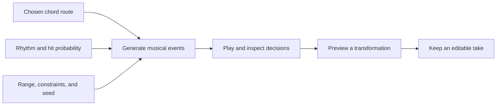

# Theory: A Graphical Language for Musical Exploration and Generation

**Design proposal.** Expand the Musical Fractals board into a family of connected,
playable views with a shared visual vocabulary. The aim is to help someone
understand a musical relationship, change its rules, hear the result, and keep
the parts they like. This is a concept note, not an implementation commitment.

The proposal synthesizes all 18 tools in the
[non-AI generative music survey](non-ai-generative-music-systems-and-market-survey.md)
and its [methods and relationships companion](algorithmic-music-generative-methods-and-tool-relationships.md).
Those notes document the tools; the adaptations below are proposed for theory,
not claims that the referenced products already implement this combined design.

## Core idea: one musical document, several views

Treat each fractal as a view of musical material or a process that operates on
it. Keep identity across views: selecting a chord in the honeycomb can reveal
its pitches in the register spiral and its occurrences in a phrase. A different
view changes what is emphasized, without silently replacing the composition.

“Fractal” remains a useful visual theme. Some structures are recursive; others
are cycles, lattices, state graphs, or geometric mappings. Their musical meaning
should explain their shape.

Three distinct layers prevent ambiguity:

1. **Relationships:** what belongs together, shares notes, or could follow.
2. **Rules:** what transforms, chooses, repeats, synchronizes, or constrains.
3. **Performance:** what actually happened, at what time, with which notes.

A relationship map need not play anything. To make it executable, a user selects
or creates a route, assigns timing, and chooses what it controls. Multiple voices
can follow separate routes, but a branch only creates simultaneous voices when
the user explicitly chooses a parallel operation.

## Shared graphical vocabulary

Start with a small set of marks whose meanings remain stable across the views.
Shapes identify roles; text identifies musical content; motion identifies
execution. A rounded rectangle is not automatically a chord because it happens
to be near another chord.

| Mark | Meaning | Example or behavior |
| --- | --- | --- |
| **Outlined circle** | A musical item, with a visible type label. | Note `C4`, chord `C major`, or motif `A`. A specific voicing also lists its pitches. |
| **Rounded block** | An operation with named inputs and outputs. | `Transpose +7 semitones`, `Rotate +2 steps`, `Repeat 4 times`. |
| **Diamond** | A decision or gate. | `Choose one`, `Play with probability 60%`, or `If every 4th cycle`. The mode is written on it. |
| **Bracketed region** | A scope or group. | Phrase, section, voice, or a reusable process. The header gives its role and duration where applicable. |
| **Ring with tick marks** | A periodic clock or phase view. | One bar divided into 16 steps; explicit zero point and playback direction. |
| **Moving playhead with a voice label** | The current position of a running process. | `Bass` traverses one route while `Melody` traverses another. |
| **Small labeled port** | A typed connection point. | `Pitch set`, `Events`, `Trigger`, `Control`, or `Audio`; invalid pairings explain what is missing. |
| **Thin line without an arrow** | A relationship, not execution. | `2 common pitch classes`. It never implies order by itself. |
| **Directed line with a time label** | An executable transition. | `After 1 bar`, on a selected route. Distance does not define timing unless explicitly enabled. |
| **Port-to-port cable** | Data or control flow. | A rhythm process supplies triggers to an event generator. Port labels expose the type. |
| **Dashed preview outline** | A proposed result that has not been accepted. | An alternate voicing or transformed motif. It is distinct from audible and saved material. |
| **Trail with numbered events** | Recorded execution history. | The last four transitions and the notes they produced; readable without animation. |

**Color has one primary job:** identify the selected voice/layer in a composition
view. For example, harmony can use cyan, rhythm amber, and melody violet. Use
labels, shapes, and line styles as well, so color is never required to interpret
the graph. A pitch-color mapping can be an explicitly named alternate view with
its own legend; it should not silently reuse the voice colors.

**Keep state legible:** a solid selection outline identifies the current editing
target; a playhead marks execution; a dashed shape marks a preview; a lock badge
identifies pinned content. A small glow may reinforce playback, but it carries
no unique information. Always offer reduced motion and a step-by-step mode.

## Rules for connections, geometry, and time

The language needs a few firm semantic rules before it needs more shapes:

- **Name the relationship.** Common tones, harmonic function, minimum voice
  movement, and “play next” are different relations. A view states the active
  relation; selecting a connection gives the actual calculation or rule.
- **Separate layout from composition.** Dragging an item normally arranges the
  canvas. A separate `Map geometry to music` mode can assign distance to time,
  angle to pitch class, or height to register. It displays units and previews
  the change before applying it. Panning and zooming never change music.
- **Make time explicit.** Note onset, note duration, transition delay, cycle
  length, and tempo are distinct. A node can last two beats while its next
  transition is scheduled for the next bar. Defaults must be visible.
- **Distinguish probability modes.** An exclusive choice of `70% / 30%` selects
  one of two eligible branches. Independent hit probabilities can both fire and
  do not need to sum to 100%. Show weights separately from normalized chances.
- **Explain constraints.** Evaluate eligibility before choosing a branch. Show
  disabled branches and the reason. If none remain, show the defined fallback
  such as rest, repeat, or stop; do not silently break a locked constraint.
- **Bound recursion and feedback.** Expansion has a preview depth and an event
  budget. Executable loops require elapsed musical time or an explicit finite
  iteration count. Stop must end running voices and clear pending notes.
- **Give each process a clock.** Independent cycles show their lengths and how
  they align to the shared transport. Changes made while playing can be queued
  for the next beat or bar, with that pending boundary visible.

These choices combine lessons from Nodal/Senode traversal, Max/Pd patching,
ChucK timing, and Tidal/Strudel cycles while resolving conflicts between their
different interaction models. They do not require theory to reproduce those
tools' APIs or file formats.

## Expand the eight existing views

Keep the board's breadth, but let each view answer a distinct musical question.
The rightmost column proposes behavior, not merely decorative detail.

| View | Musical question | Expansion into the shared language |
| --- | --- | --- |
| **Interval Snowflake** | What happens when an interval rule repeats? | A labeled interval operation grows a path. Show pitch-class cycles, octave changes, and duplicate destinations. Add audition, finite depth, and a rule inspector. |
| **Voice-leading Honeycomb** | Which specific voices stay or move? | Show common tones and per-voice movement between concrete voicings. Let users pin a bass or voice, compare alternatives, then choose a route. Provide an event/piano-roll view for the chosen result. |
| **Modulation Garden** | How could this passage establish another tonal center? | Shared chords connect key regions as possible pivots. Add a route and cadence context; label a shared chord as a possibility, not proof that a modulation occurred. |
| **Rhythm Mandala** | When do events happen, coincide, or interlock? | Rings gain hit probability, accents, rotation, independent cycle lengths, and synchronization. A current-hit marker and history distinguish an enabled step from one that actually sounded. |
| **Motif Tree** | How does an idea change while retaining a relationship to its source? | Branches carry named transformations and exact parameters. Compare parent/child pitch and rhythm changes, preview combinations, lock selected notes, and accept or discard a variation. |
| **Register Spiral** | How does spacing change the sound of a voicing? | Show octave-labeled pitches, voice identities, crossings, range constraints, and audible voicing alternatives. Moving a note in musical-edit mode updates every occurrence that shares that definition. |
| **Nested Form Map** | How do local ideas create larger repetition and contrast? | Sections contain occurrences of phrases and motifs. Make linked instances versus independent copies visible. Expand a scope to inspect its process; collapse it to a reusable unit with named controls. |
| **Scale Lattice** | Which notes distinguish these tonal collections? | Compare membership, common notes, and altered degrees. Explicitly select parallel modes with the same tonic or relative modes sharing a collection. Accepting a scale change previews affected notes before remapping. |

**Correctness before visual polish.** The artwork is a concept reference, not a
validated theory chart. Repeated major-third steps from C in 12-tone equal
temperament reach the pitch classes `C → E → G♯ → C`; the pictured snowflake does
not demonstrate that cycle. Spellings should follow the displayed context.
[Equal divisions of the octave](https://viva.pressbooks.pub/openmusictheory/chapter/equal-divisions-of-the-octave/)

Likewise, the honeycomb needs a stated adjacency rule: “diatonic neighbors in C”
and “single-voice transformations” produce different graphs. The spiral needs
consistent octave labels. The mandala needs to distinguish steps, hits, meter,
and instrument names. These definitions make the designs usable as teaching
interfaces.

## Additional views for generative behavior

The eight views mainly show musical relationships. Add a small set of process
views to explain how those relationships become evolving music:

| Process view | What it adds | Main influences |
| --- | --- | --- |
| **State Paths** | One or more labeled playheads, weighted transitions, conditions, and recorded routes. | Nodal, Senode |
| **Pattern Ribbons** | A compact sequence of transformations, with nested cycles and immediate before/after playback. | TidalCycles, Strudel, Sonic Pi |
| **Rule Patch** | Typed connections between clocks, constraints, selectors, transformations, and event outputs. | Pure Data, Max, VCV Rack |
| **Cell Field** | A cell-update rule and starting state, advanced one generation at a time, with an explicit cell-to-note mapping. | WolframTones; spatial execution from ORCA |
| **Trajectory Score** | Cursors traverse curves and encounter triggers; users explicitly map coordinates into musical values. | IanniX |

These can be alternate editors for shared objects rather than five new isolated
workspaces. For example, a Motif Tree branch might open its Pattern Ribbon; a
Rhythm Mandala might reveal the Rule Patch producing its hit probabilities.
Start with the smallest useful subset and expose deeper editors when needed.

## What each of the 18 tools contributes

Tool names link to our source-backed profiles. The design lessons are a synthesis
for theory; they are not feature-parity requirements or dependencies to adopt.

| Tool | Characteristic to learn from → proposed expression in theory |
| --- | --- |
| [Nodal](non-ai-generative-music-systems-and-market-survey.md#nodal) | Musical players traverse graphs, with spatial timing → visible playheads and an optional, unit-labeled distance-to-time mapping. Keep ordinary layout independent. |
| [Senode](non-ai-generative-music-systems-and-market-survey.md#senode) | Probabilistic finite-state steps and polyphonic emitters → explicit decision nodes, traversal modes, and distinct voice playheads. |
| [TidalCycles](non-ai-generative-music-systems-and-market-survey.md#tidalcycles) | Composable transformations of cyclic patterns → named, nestable operations that work on phrases rather than only individual notes. |
| [Strudel](non-ai-generative-music-systems-and-market-survey.md#strudel) | Playable browser examples of the Tidal model → every rule includes a small editable example and a time preview. Text can be an optional advanced representation. |
| [SuperCollider](non-ai-generative-music-systems-and-market-survey.md#supercollider) | Musical control and synthesis have separate responsibilities → distinct event and sound layers; changing an instrument need not change the generating process. |
| [Sonic Pi](non-ai-generative-music-systems-and-market-survey.md#sonic-pi) | Teaching, live loops, and repeatable randomness → auditionable lessons, a visible variation seed, and repeat/new-variation controls. |
| [ChucK](non-ai-generative-music-systems-and-market-survey.md#chuck) | Explicit time and concurrent processes → per-voice clocks, visible synchronization boundaries, and step-through execution. |
| [ORCA](non-ai-generative-music-systems-and-market-survey.md#orca) | Spatial placement participates in computation → an optional snapped operator-grid view with visible local dependencies. Keep full names available instead of requiring single-letter fluency. |
| [Pure Data](non-ai-generative-music-systems-and-market-survey.md#pure-data) | Executable dataflow patches → typed ports and visible values flowing between musical operations. |
| [Max](non-ai-generative-music-systems-and-market-survey.md#max) | Interactive interfaces and sequencing assembled from objects → reusable musical processes with a small surface of named controls and an inspectable interior. |
| [IanniX](non-ai-generative-music-systems-and-market-survey.md#iannix) | Curves, cursors, triggers, and spatial control → a Trajectory Score with an explicit mapping inspector and unit-aware scales. |
| [OpenMusic](non-ai-generative-music-systems-and-market-survey.md#openmusic) | Symbolic structures, visual transformations, recursion, and time organization → linked notation/event previews inside motif and form scopes. |
| [Opusmodus](non-ai-generative-music-systems-and-market-survey.md#opusmodus) | Generation connected to analysis, notation, and playback → a continuous generate–inspect–edit–listen workflow with the musical result always available. |
| [Wotja](non-ai-generative-music-systems-and-market-survey.md#wotja) | Templates and editable rule-driven variation → musical starting recipes with meaningful macros such as density and register; expose the rules each macro changes. |
| [Stochas](non-ai-generative-music-systems-and-market-survey.md#stochas) | Probability and independent rhythmic layers → event-level chance, velocity/duration variation, and histories showing what actually fired. |
| [WolframTones](non-ai-generative-music-systems-and-market-survey.md#wolframtones) | Cellular-automaton evolution mapped into musical structure → a Cell Field whose update rule and musical mapping can be inspected independently. |
| [VCV Rack](non-ai-generative-music-systems-and-market-survey.md#vcv-rack) | Clocks, modulation, logic, and sound linked through modules → visible control modulation with bounded ranges and explicit units. Keep the first layer musical rather than a full synthesis rack. |
| [Common Music / Grace](non-ai-generative-music-systems-and-market-survey.md#common-music--grace) | Compositional processes with several rendering destinations → preserve a musical-event representation separately from a chosen instrument or export. |

The [Senode description](https://senode.org/),
[Sonic Pi tutorial](https://sonic-pi.net/tutorial.html), and
[Strudel pattern constructors](https://strudel.cc/learn/factories/) are useful
direct references for transitions, repeatable variation, and sequence/parallel
composition. Their terminology should inform the design without becoming a
prerequisite for using it.

## A complete interaction: from harmonic map to four-bar phrase

Use a concrete lesson to test whether the language holds together:

1. **Choose a context.** Start in C major, 4/4, with a four-bar scope. The harmony
   map shows candidates. Select `C → Am → F → G`, one bar per chord. This is a
   chosen progression, not the only “correct” one.
2. **Add a rhythmic rule.** Create a 16-step ring with five evenly distributed
   hits. Display one possible rotation at step indices `0, 3, 6, 9, 12` with
   zero-based indexing. Each step is one sixteenth note; gaps are `3, 3, 3, 3, 4`.
3. **Connect harmony and rhythm.** Each hit requests a pitch from the active
   chord within C4–B4. The graph shows separate `Chord`, `Trigger`, and `Range`
   inputs to a `Choose pitch` operation. A sound destination plays the events.
4. **Introduce controlled variation.** Give one enabled hit a 60% firing chance.
   The other hits remain certain. Show the chosen seed and record each decision;
   this is an event probability, not a chord-transition weight.
5. **Inspect what happened.** Select a note and see, for example: “Bar 1, step 6;
   enabled hit; C-major pitch set; selected E4; inside C4–B4.” A failed chance
   decision appears as a skipped event in the execution history.
6. **Develop the phrase.** In the Motif Tree, preview `Rotate rhythm +2 steps`.
   Its hit positions become `2, 5, 8, 11, 14`; the preview identifies changed
   onsets while preserving the selected harmonic plan. Accepting it creates a
   variation occurrence in the Form Map.
7. **Keep a take.** Capture the realized events as an editable take. Retain its
   generating rules and seed as provenance, but allow the user to edit the take
   independently. Re-running the generator does not overwrite it.

The numbered walkthrough is the text equivalent of this diagram. It combines
several tool traditions in one learnable task while keeping their distinct
meanings visible.

## Reproducibility, editing, and explanation

**A seed alone is insufficient.** Repeating a generated event sequence also
depends on the rule version, parameters, starting state, clock/scheduling rules,
inputs, and random-stream allocation. A useful design would give each stable
process its own random stream so adding a new voice does not unexpectedly
reroll every other voice. Freeze a take when exact event recall matters; exact
audio also depends on the sound engine, assets, and effects.

**Explain from execution data.** “Why this note?” should show the actual rule,
eligible candidates, constraint results, and selected outcome. It should not
invent a plausible music-theory explanation after the fact. A constraint that
blocked an event is as important to show as a rule that produced one.

**Make changes local and reversible.** Preview transformations; show which
linked instances will change; distinguish editing a reusable definition from
editing one occurrence. Undo should preserve both musical content and generator
settings. A camera move belongs to view history, not the musical operation list.

**Do not assume every view is reversible.** An event take can retain a reference
to its generating process, but manually edited events may no longer have an
equivalent compact generator. Arbitrary advanced code may be a named process
with documented inputs/outputs rather than a graph that can always be expanded.

## A visual direction grounded in the board

Keep the dark working surface, fine geometry, colored paths, and focus on
musical relationships. Reduce the poster's repeated card borders when designing
the actual workspace: one large active canvas, a compact context/transport bar,
and an inspector for the selected item would give the music more room.

Use semantic zoom. From a distance, show form and phrase identity. Closer in,
show chords, routes, and cycle structure. At event level, show pitches, durations,
probabilities, and rule details. Zooming reveals information; it does not advance
a generator or create new events.

Keep a compact legend beside the active view: `Items: voicings`, `Links: common
tones`, `Timing: selected route`. One click can switch to the event list or
notation view without losing selection. Keyboard navigation, textual values,
audition controls, and a reduced-motion playhead are part of the language, not
an alternate simplified product.

Depth and breadth controls should report hidden alternatives, while actual
generation limits are separately named. Stable landmarks and pinned positions
help people recognize what changed when a rule exposes a new neighborhood.

## Suggested first design slice

Develop **Voice-leading Honeycomb + Rhythm Mandala + Motif Tree** around one
shared phrase, as proposed in the earlier
[musical growth patterns note](musical-growth-patterns.md). Add a minimal State
Paths layer and an execution inspector. The other views remain part of the
language, but this slice tests harmony, timing, transformation, and causality
together before building a large editor.

Evaluate it with concrete tasks:

- Can someone tell a harmonic relationship from a scheduled transition?
- Can they preview and hear a variation, then keep it without losing the source?
- Can they explain why one note played and another did not?
- Can they replay the same generated events and intentionally request a new take?
- Can they switch views and still identify the same notes, phrase, and selection?
- Can they rearrange the canvas without accidentally changing pitch or timing?
- Can they stop all voices, undo an edit, and understand a blocked rule?

The design succeeds when **every visible relation has a musical meaning, every
audible event has an inspectable cause, and every accepted result remains
editable**.

## Related notes

- [Circular composition and voice-leading Figma POC](circular-composition-figma-poc.md)
- [Musical Fractals and initial references](initial-notes.md#reference-musical-fractals)
- [Musical growth patterns](musical-growth-patterns.md)
- [Non-AI generative systems survey](non-ai-generative-music-systems-and-market-survey.md)
- [Generative methods and tool relationships](algorithmic-music-generative-methods-and-tool-relationships.md)
- [Visual composition interfaces](visual-music-composition-interfaces-and-design-references.md)
- [Tutorials and demonstrations](music-tool-tutorials.md)
- [Future DAW integration](cross-daw-composer-plugin-architecture-and-host-integration.md)
