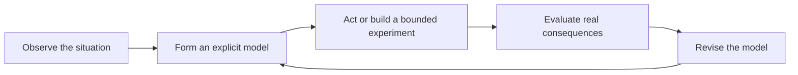

# Understanding Is the Bottleneck

## Overview

AI is making answers, prototypes, analyses, and implementations dramatically easier to produce. The old constraint was often the effort required to turn an idea into something concrete. A team could understand what it wanted and still spend months translating that understanding into research, specifications, designs, and code.

That constraint is weakening. When a system can generate plausible work almost immediately, the limiting factor moves upstream. The difficult question is no longer only, “Can we build it?” It is, “Do we understand the problem well enough to know what should be built, why it should exist, how it should behave, and whether the result is actually good?”

This post should explore **understanding as the new bottleneck** in product development and knowledge work. It should not claim that implementation has become effortless or that AI cannot contribute to understanding. The more precise argument is that production can now outrun comprehension. AI can amplify a clear model of the world, but it can also turn a weak assumption into a convincing artifact before a team has discovered that the assumption is wrong.

The practical destination is organizational: teams need to invest less exclusively in producing outputs and more deliberately in building shared understanding of customers, domains, systems, constraints, and consequences.

## Core Thesis

When implementation is scarce, output limits progress. When implementation becomes abundant, understanding limits progress.

AI can generate an answer, but the quality of that answer still depends on whether the people directing and evaluating the work understand:

- which problem matters;
- whose problem it is;
- how the surrounding system behaves;
- which distinctions must be preserved;
- what tradeoffs are acceptable;
- what evidence would change their minds; and
- what a successful outcome means in context.

The bottleneck is therefore not access to more intelligence-shaped output. It is the formation, testing, and coordination of a sufficiently accurate model of the world.

## Relationship to the Series

This post should synthesize the first four essays without merely summarizing them:

- **AI Knows Propositions; Humans Navigate Relationships:** understanding requires knowing not just what is true, but why it matters within a lived situation.
- **The Next Abstraction Layer:** a domain ontology is shared understanding made explicit enough to guide implementation.
- **Moats in the AI Era:** situated knowledge, trust, proprietary logic, and accumulated context are difficult to reproduce because they take time and participation to understand.
- **The Knowledge Factory:** shared AI infrastructure multiplies experts only when the organization supplies sound direction, context, evaluation, and learning.

The fifth post provides the connective claim: as the cost of implementation falls, these forms of understanding become the constraint around which the entire system organizes.

## Editorial Direction

### Intended reader

Write for product builders, technical leaders, founders, designers, researchers, and domain experts who are experiencing a sharp increase in how much their teams can produce but are less certain that increased output is producing better decisions or products.

### Tone

- Clear and exploratory rather than absolute.
- Skeptical of speed as a substitute for progress.
- Optimistic about AI as an instrument for inquiry and iteration.
- Grounded in product and organizational practice rather than abstract philosophy alone.
- Respectful of engineering, craft, and execution; understanding and implementation continually correct each other.

### Editorial guardrails

- Do not define understanding as possessing every relevant fact.
- Do not imply that humans always understand and AI never does.
- Do not present understanding as a mystical feeling immune to evidence or criticism.
- Do not use “bottleneck” to argue for endless analysis before action.
- Do not imply that a shared ontology captures all lived meaning or removes the need for judgment.
- Treat understanding as provisional: a model that becomes more useful through observation, prediction, action, feedback, and revision.

## Section Notes

### 1. The Old Bottleneck Was Producing the Work

Open with the familiar economics of software and knowledge work. Historically, a good idea could remain unrealized because translation was expensive:

- Research required searching and synthesizing many sources.
- A product concept required specifications, design, and coordination.
- Software required specialists to express behavior in exact instructions.
- Each experiment consumed enough time that teams had to ration attempts.

This production constraint encouraged organizations to measure progress through visible output: documents written, features shipped, tickets closed, and projects completed. That made practical sense when output was expensive.

AI changes this environment by compressing the distance between a request and a plausible artifact. A team can now produce more variations, drafts, explanations, and working prototypes before it has established which direction deserves to survive.

Suggested opening line:

> For most of software history, knowing what you wanted was not enough. You still had to pay the cost of making it real.

### 2. Abundant Output Exposes Scarce Understanding

Make the paradox explicit: lowering the cost of answers increases the value of good questions and sound judgment.

When outputs are abundant:

- A weak premise can generate an impressive prototype.
- An ambiguous term can produce several internally coherent but incompatible systems.
- A requested feature can be completed before anyone verifies that it addresses the customer's real constraint.
- A polished explanation can hide uncertainty rather than resolve it.
- Teams can accumulate more artifacts than they have the attention to evaluate.

The danger is not only that AI produces something incorrect. It is that the result is plausible enough to let the organization postpone understanding. Speed can conceal confusion by making every direction look briefly viable.

Use the phrase **production can outrun comprehension** as the section's organizing idea.

### 3. Information, Knowledge, and Understanding Are Not the Same

Offer a practical distinction rather than a universal philosophical definition:

- **Information** is something available to be represented or communicated: a fact, measurement, statement, observation, or record.
- **Knowledge** is information organized so that a person or system can retrieve it and act with it in a domain.
- **Understanding** is a working model of how and why the relevant parts relate, what changes when conditions change, and where the model's limits lie.

An organization may possess extensive information while understanding very little. It can know conversion rates, feature requests, support volume, and churn without knowing why customers hesitate, what job they are trying to accomplish, or which change would alter their behavior.

Understanding should be described as relational and operational. It connects facts to causes, purposes, constraints, perspectives, and consequences. It supports a better decision, not merely a more fluent description.

Avoid turning the three terms into rigid levels or claiming that every discipline defines them this way. They are editorial tools for distinguishing availability from organization and organization from a usable model.

### 4. The Problem Must Be Understood Before the Answer Can Be Judged

An answer has no independent quality. It is good relative to a need, situation, set of constraints, and desired outcome.

Develop this through product work:

- A feature request is evidence, not a complete problem definition.
- A customer may accurately describe a frustration while proposing a solution that does not address its cause.
- A technically correct implementation may fail because it conflicts with habits, incentives, permissions, trust, or the rest of the workflow.
- A metric can improve while the experience or underlying outcome becomes worse.

AI can rapidly answer the question a team asks. Understanding determines whether that was the right question, whether important context was excluded, and what evidence should count as a successful answer.

Candidate editorial prompt: **What would we need to understand before we could tell the difference between a correct answer and a useful one?**

### 5. The Five Dimensions of Product Understanding

Use a compact framework to make the thesis actionable. Strong product understanding coordinates at least five related models:

1. **Human understanding:** the person's goals, habits, fears, expectations, relationships, and lived context.
2. **Domain understanding:** the entities, language, rules, exceptions, rights, and practices that define the field.
3. **System understanding:** how technical and operational components interact, fail, recover, and change over time.
4. **Organizational understanding:** incentives, ownership, decision authority, capabilities, constraints, and the reality of how work gets done.
5. **Consequence understanding:** who benefits, who carries risk, what second-order effects may follow, and which outcomes are reversible.

The categories overlap. The point is not to complete a checklist but to show why local implementation competence does not guarantee product understanding. A team may understand the system but not the user, the user but not the regulated domain, or the immediate use case but not its consequences.

### 6. Understanding Is Demonstrated Through Better Predictions and Tradeoffs

Avoid defining understanding as eloquence. A person or model can repeat the right vocabulary without possessing a useful account of the situation.

Look for evidence in what the model enables:

- Can the team anticipate how the system will behave in a new but related case?
- Can it explain which assumptions support the decision?
- Can it identify exceptions and limits rather than treating them as noise?
- Can it predict what evidence would falsify the current account?
- Can it make an explicit tradeoff while naming who bears the cost?
- Can it update coherently when reality contradicts the model?

The standard need not be perfect prediction. Complex human and technical systems remain uncertain. The stronger claim is that understanding earns its name when it improves judgment, makes surprises legible, and supports revision.

### 7. AI Can Accelerate Understanding—and Simulate It

Keep the treatment of AI balanced. AI can help teams understand by:

- retrieving and organizing propositions;
- comparing competing explanations;
- exposing contradictions and missing definitions;
- generating counterexamples and edge cases;
- simulating perspectives or scenarios for investigation;
- translating between domain vocabularies;
- tracing behavior through a complex codebase; and
- turning feedback into patterns worth examining.

But the same fluency can simulate understanding by creating a coherent story around incomplete premises. Models tend to receive the framing supplied to them. If the organization has misunderstood the customer or collapsed two domain concepts into one term, AI can encode that mistake faster and more consistently.

The practical division of labor should not be “humans understand; AI implements.” It should be iterative:

1. Humans and AI form an initial model.
2. The model produces questions, predictions, prototypes, or actions.
3. Reality supplies evidence through observation and consequence.
4. Humans remain accountable for interpreting that evidence and revising the model.
5. AI helps propagate the revised understanding into new analysis and implementation.

### 8. Ontology Is Shared Understanding Made Operable

Connect explicitly to the second essay. When a team defines entities, boundaries, relationships, states, and invariants, it turns parts of its domain understanding into a form that people and systems can coordinate around.

Ontology helps relieve the bottleneck by:

- preventing important concepts from being collapsed into convenient but inaccurate labels;
- making disagreements visible before they become incompatible implementations;
- giving AI stable context for generation and evaluation;
- preserving institutional learning beyond a single expert or project; and
- creating a place where new evidence can revise the organization's model.

Ontology does not eliminate the bottleneck. The hard work remains deciding which distinctions reflect reality and which serve the product's purpose. Some meaning also remains relational, contested, or context-dependent. The ontology is a maintained instrument of understanding, not reality itself.

Use Mango's distinction between a protocol answer and a human conversation as a brief callback. A system that collapses both into “answered call” may be technically tidy but unable to represent the outcome the customer actually cares about.

### 9. The Organizational Bottleneck Is Often Alignment, Not Individual Insight

One expert may understand a situation while the organization behaves as though it does not. Understanding must cross boundaries among customers, domain experts, product teams, engineers, operators, executives, and the systems that store decisions.

Common failure modes include:

- Research findings become a presentation rather than a changed decision.
- Domain exceptions live in one employee's memory.
- Metrics use the same name for different behaviors across teams.
- A product specification records the decision but not the assumptions behind it.
- Generated code scales faster than review and learning can travel.
- Incentives reward visible output even when evidence suggests a different direction.

This makes shared understanding a form of organizational infrastructure. Meetings and documents are useful only when they change the models people use to decide and act.

### 10. Action Is Part of Understanding

Prevent the essay from becoming an argument for paralysis. Understanding is not a prerequisite that can be completed before work begins. In novel domains, teams learn by intervening in the world.

The answer to scarce understanding is a tighter learning loop:



The valuable change AI brings is not merely cheaper output. It can lower the cost of experiments and make more of the loop inspectable. Teams should use that leverage to learn faster, not simply to produce more.

Favor bounded, reversible actions when understanding is weak. Make assumptions explicit before generation. Decide what evidence will be observed. Preserve dissent and anomalous cases. Treat a prototype as a question posed to reality rather than proof that the idea was correct.

### 11. What Organizations Should Invest In

If understanding is the bottleneck, the highest-leverage investments may include:

- direct observation and durable customer relationships;
- domain experts with authority to shape the product;
- shared vocabularies and maintained ontologies;
- decision records that preserve assumptions and tradeoffs;
- instrumentation tied to outcomes rather than output volume;
- evaluation systems built from meaningful cases and exceptions;
- interfaces through which frontline evidence reaches decision-makers;
- time and incentives for reflection, synthesis, and revision;
- experiments designed to discriminate among explanations; and
- AI tools connected to trustworthy context and feedback rather than isolated prompting.

These investments may look slower than generating another artifact. Their purpose is to improve every artifact and decision that follows.

## Strategic Questions

- What do we believe about the customer, domain, and system—and which parts are assumptions?
- Which important term means different things to different teams?
- What evidence would cause us to change direction?
- Where is expert understanding trapped in a person, conversation, or disconnected document?
- Which recent output changed our understanding, and which merely increased inventory?
- Are we evaluating whether work is correct, or whether it creates the intended outcome?
- Can feedback revise the ontology and workflow, or does it disappear after delivery?
- What can we safely test before committing to a larger implementation?
- Where is AI clarifying the model, and where might it be making an unclear model look complete?
- If implementation became nearly free tomorrow, what would still prevent us from building the right thing?

## Visual Notes

### Primary visual: the shifting bottleneck

Show two periods:

```text
Before abundant AI
Understanding ───────────────► Implementation ──[BOTTLENECK]──► Output

With abundant AI
Understanding ──[BOTTLENECK]──► Implementation ───────────────► Output
```

The visual should communicate a shift in relative scarcity, not claim that implementation no longer requires skill or effort.

### Secondary visual: amplification cuts both ways

Use two parallel paths:

```text
Sound understanding → AI amplification → coherent implementation → useful evidence
Weak assumption      → AI amplification → plausible implementation → scaled confusion
```

### Optional visual: five dimensions of understanding

Place the product decision at the center, connected to human, domain, system, organizational, and consequence understanding. Use connections rather than a hierarchy because weaknesses in any dimension can alter the others.

## Research and Drafting Caveats

- Verify any quantitative claims about AI productivity, software output, or failure rates before publication.
- If using examples from a named company or product, distinguish documented evidence from the author's interpretation.
- Avoid unsupported statements about consciousness or what AI can never understand.
- If the article discusses automation bias, cognitive bias, organizational learning, or tacit knowledge, add primary research appropriate to the exact claim rather than citing a field in general.
- Keep the information/knowledge/understanding framework explicitly practical and editorial; do not present it as a settled philosophical taxonomy.
- Make the cost of misunderstanding concrete through a verified product or organizational example during drafting.
- Preserve the distinction between learning through action and using action to avoid thinking.

## Candidate Closing Question

> If answers are becoming abundant, what must we understand before we can recognize the right one?

## Candidate Closing Line

> AI can make almost any answer cheaper. Understanding is knowing which question is worth the cost.

