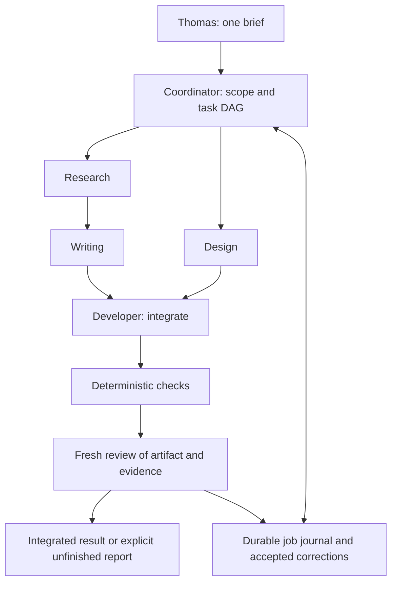

# Reusable agent teams: investigation and pilot proposal

Date: 2026-09-08. Status: proposal only. Owner: `blogs`, because this document defines the editorial team pilot and its operational workflow. Reusable runtime code would have a separate owner if implemented. Repository baseline: `9f9cf3496701a7521ae13c7ab2ee64f187a9c65e`.

Reconciliation note, 2026-09-11: the local graph was preserved in commit
`6385e12` and is now tracked at [agents-graph.json](../../agents-graph.json).
Its current role instructions follow the [team procedure](../../.agents/skills/thm-team/SKILL.md)
and owner contracts. The findings below describe the original graph at the
investigation baseline; the proposed runtime remains unimplemented.

## Recommendation

Make “Thom Blog” a versioned team definition that Thomas can invoke with one brief. Give the architect responsibility for the finished deliverable, use fresh specialist executions for bounded tasks, and preserve accepted evidence, corrections, artifacts, and job records between runs. Persistence should mean durable definitions and recoverable work; it does not require five model processes to remain alive or five conversations to grow indefinitely.

Start with a supervised native Codex pilot: one coordinating task, explicit delegation, at most two specialists active together, and one integration writer. Then build a small Bun TypeScript coordinator only if the pilot establishes useful results and a need for restart recovery, enforceable task contracts, or stricter permissions. The minimal durable architecture below supplies those controls. A knowledge graph database, scheduling, and instruction self-modification are unnecessary for the first blog job.

Success means Thomas receives one coherent, rendered, verified article package with evidence and a reviewable diff. Five successful agent messages are not sufficient. A stopped or blocked job must be reported as incomplete, even if every worker returned something.

## What exists locally

The worktree has no `agents-graph.json`. The read-only fallback [agents-graph.json](/Users/thom/Sites/th-m/th-m/agents-graph.json) is version 1, named **Thom Blog**, and defines architect, researcher, writer, designer, and developer. All four specialists have parent `architect`. It contains role text and three deny lists, but no executable dispatch, dependency, storage, or verification implementation.

Exact-name searches of this worktree, the fallback checkout, and the saved harness's `packages/` and `apps/` found the graph file alone for `agents-graph` / `blog_audit`. No consumer or audit implementation was found. This is a scoped finding, not proof that no external application ever reads the file. The current task has full filesystem access; this graph has not restricted the tools available here.

| Role | Existing intention | Pilot responsibility and required correction |
| --- | --- | --- |
| architect | Structure and delegation | Own brief, scope, task dependencies, acceptance matrix, integration order, and final handoff. Cannot waive a failed gate. |
| researcher | Cited research; denies write/edit/bash | Return claims and evidence; coordinator saves them. A runtime must actually withhold mutation and shell capabilities. |
| writer | Author canonical MDX; denies bash; run `blog_audit` | Return prose/MDX proposal. Replace the missing audit with existing structural checks plus separately identified editorial review. Canonical publication requires an asset registry too. |
| designer | Visuals, theme, CSS, components; denies bash | Return visual specification or isolated assets/modules. Scope to article-owned files; shared theme changes require a separate owner task. |
| developer | Implement, integrate, Nx checks and gen | Sole integration writer in pilot. Run owner checks; `gen` is conditional on a changed generator contract, not compulsory for every article. |

The real editorial interface is defined by [blogs README](/Users/thom/.codex/worktrees/459d/th-m/libs/blogs/README.md), [blogs AGENTS](/Users/thom/.codex/worktrees/459d/th-m/libs/blogs/AGENTS.md), [article README](/Users/thom/.codex/worktrees/459d/th-m/libs/blogs/articles/README.md), and [article AGENTS](/Users/thom/.codex/worktrees/459d/th-m/libs/blogs/articles/AGENTS.md). `article.mdx` plus `article-assets.ts` makes a workspace publishable; research/drafts remain private. The [publisher](/Users/thom/.codex/worktrees/459d/th-m/libs/blogs/src/publish.ts) and [project manifest](/Users/thom/.codex/worktrees/459d/th-m/libs/blogs/package.json) provide real validation and `blogs:publish`, not evidence of a readability tool named `blog_audit`.

The [root contract](/Users/thom/.codex/worktrees/459d/th-m/AGENTS.md) requires Nx owner verification and documentation checks. [Portfolio targets](/Users/thom/.codex/worktrees/459d/th-m/apps/portfolio/package.json) include typecheck, test, publish, e2e, and audit; the existence of `portfolio:audit` does not make it a substitute for editorial review. [Repository policy tests](/Users/thom/.codex/worktrees/459d/th-m/libs/testing/src/repository-policy.test.ts) verify README/AGENTS structure and theme ownership, not factual truth.

## Native capabilities and alternatives

Current official documentation describes custom role TOML files in `.codex/agents/` or `~/.codex/agents/`, including instructions and supported configuration such as sandbox mode. Explicit delegation can spawn specialists, collect results, and expose their activity; CLI `/agent` inspects their tasks. `agents.max_concurrent_threads_per_session` caps spawned threads, excluding the primary. This session exposes four total agent slots; that is an observed session limit, not a product-wide maximum. The JSON graph is not the documented native configuration format. A future adapter should translate it, or the team should migrate to one canonical definition with generated native files. [OpenAI subagent documentation](https://learn.chatgpt.com/docs/agent-configuration/subagents).

| Option | Fit | Tradeoff |
| --- | --- | --- |
| Native Codex team instructions + role files | Best first pilot; Thomas supplies a brief in a coordinating task and reads progress there. | Durable job transitions, graph ingestion, budget enforcement, and proof of acceptance still need an explicit process. Do not promise automatic recovery of an interrupted project. |
| Bun coordinator invoking `codex exec` | Smallest durable implementation for bounded workers; process lifecycle is straightforward to supervise. | Less convenient interactive steering; controller owns journals, locks, retries, and merge. |
| Bun coordinator using Codex SDK | Convenient typed calls and session continuation. | Validate Bun compatibility rather than assuming it; official TypeScript SDK documentation specifies Node.js 18+. |
| Custom client over Codex app-server | Best when live intervention and detailed progress are requirements. | More protocol, event, approval, versioning, and reconnect work. |
| OpenAI Agents SDK with narrow tools | Best strict researcher/writer capability control and future noncoding teams. | Server owns tool implementations, storage, deployment, and authorization; a coding workspace integration is additional work. |
| Extend saved DeepSeek harness | Relevant if Thomas wants that harness as his primary interface. | Existing Codex bridge and workflow engine have specific gaps below; adopting the whole system is a larger dependency decision. |

`codex exec` supports JSON event output and `--output-schema` for final responses; its saved authentication can be reused. Treat response structure as an input to validation, not acceptance of its truth. A CLI process exiting successfully is only a worker outcome. [OpenAI non-interactive documentation](https://learn.chatgpt.com/docs/non-interactive-mode).

The Codex TypeScript SDK can start, continue, and resume local tasks using their IDs. Keep those IDs in job records if that adapter is selected. No SDK experiment or dependency installation was performed here. [OpenAI Codex SDK documentation](https://learn.chatgpt.com/docs/codex-sdk).

App-server exposes initialization, thread creation/resumption, turn events, and interruption; its API also documents goal state and token-budget fields. These are useful integration primitives, not proof of aggregate accounting across all roles and external tools. Pin the executable and generate/check protocol schemas during implementation; local `codex --version` reports **0.147.0**. Public docs can describe features newer than a pinned build. [OpenAI app-server documentation](https://learn.chatgpt.com/docs/app-server).

The OpenAI Agents SDK offers agent loops, agents-as-tools/handoffs, sessions, tracing, and guardrails. Use a manager with specialists as tools to keep final responsibility with the architect; transferring conversation control alone does not establish integration ownership. [OpenAI Agents SDK documentation](https://developers.openai.com/api/docs/guides/agents).

## Saved harness findings

The saved [DeepSeek Harness README](/Users/thom/Sites/th-m/deepseek-harness/README.md) describes a plugin runtime in developer preview with breaking changes expected. Inspection was read-only; no builds, model calls, or installation were performed.

Its [Codex provider implementation](/Users/thom/Sites/th-m/deepseek-harness/packages/subagent/subagent-codex/src/index.ts:60) explicitly advertises `NO_START_CAPABILITIES` and `inheritsParentContext = false`. The [wire implementation](/Users/thom/Sites/th-m/deepseek-harness/packages/subagent/subagent-codex/src/wire.ts:309) creates an ephemeral task and submits a single text turn. The permission mapping at line 25 sets only `approvalPolicy: never` for the default mode; it does not explicitly select read-only confinement.

The [provider contract and limitations](/Users/thom/Sites/th-m/deepseek-harness/packages/subagent/subagent-codex/README.md) specify a package-pinned Codex 0.147.0 wrapper, final-text results, cancellation/teardown, and no resume, progress stream, token usage, inherited tool filtering, structured-output contract, or wall-clock timeout. Those limitations are material: wrapping the current graph in this provider would not enforce its deny lists or create a persistent team. `never` means no approval prompts, not no writes.

The broader [subagent service](/Users/thom/Sites/th-m/deepseek-harness/packages/subagent/subagent/README.md) describes durable continuation for supported providers. Do not transfer that capability to the Codex provider. The [workflow contract](/Users/thom/Sites/th-m/deepseek-harness/packages/workflow/workflow/README.md) has run/child caps and cancellation but explicitly lacks journaling, resume, saved workflows, and token-budget accounting. The [permission preset service](/Users/thom/Sites/th-m/deepseek-harness/packages/interaction/permission-presets/README.md) bundles sandbox and approval policy; it is not a role graph loader.

Reuse these as reference designs for lifecycle cleanup and provider capability negotiation. If extending the harness later, first add/verify the missing adapter capabilities and durable run journal; do not import this sibling checkout's source into th-m or claim its tests were run here.

## Three different graphs

| Graph | Nodes and edges | First version |
| --- | --- | --- |
| Role/delegation graph | Stable roles; who may assign work to whom | Needed as a small team registry. Existing five-role tree is sufficient; add verification as a distinct invocation, not a permanent sixth employee. |
| Task dependency graph | Job-specific tasks; prerequisite outputs | Needed. Research precedes prose; design can explore beside research; integration waits for accepted prose and design; verification follows integration. |
| Knowledge/evidence graph | Claims/entities/sources; supports, contradicts, supersedes | A claim/source ledger is enough initially. Add graph queries when recurring work actually needs relationship traversal. |

The same researcher can run several tasks; one dependency task may need several attempts; an evidence claim can survive many jobs. Give these separate IDs and schemas. A parent role edge is neither a task dependency nor factual evidence.



## Implementable minimal durable architecture

All paths and commands in this section are proposals, not installed features.

Create a local Nx tool, `tools/agent-team`, owning the coordinator, CLI adapter, runtime tests, recovery logic, and operational documentation. Put reusable types, schema validation, policy, and deterministic merge rules in `libs/agent-team-core`. Keep the blog definition/procedures/corrections under `libs/blogs/team/`. Every new README receives the required sibling AGENTS file and headings. Native configuration adapters must derive from a canonical definition and carry a content hash; never maintain two independent role policies.

Suggested interface: `bun run nx run agent-team:run -- --team thom-blog --brief <workspace-path> --run-dir <workspace-path>`. Related proposed targets: `status`, `pause`, `resume`, `cancel`, and `result`, all taking a run ID. Initially Thomas can ask the coordinating Codex task to invoke these; a separate dashboard is unnecessary.

1. Resolve the named team to a pinned definition and procedure version. Validate role IDs, parents, tool capabilities, owner paths, and graph acyclicity. Fail before spending model tokens on an unavailable mandatory tool.
2. Snapshot the brief, constraints, repository revision and dirty-file hashes; create a run ID and exclusive controller lease. Require an explicit workspace-contained output directory. No generated paths may escape it.
3. Architect proposes tasks with dependencies, output paths, and acceptance IDs. Deterministic controller validates the proposal and dispatches only ready tasks within caps. Disable nested worker delegation so all work is counted centrally.
4. Each role gets a fresh context containing its task, relevant README/AGENTS, procedure version, selected corrections, and accepted prerequisite artifact IDs. Resume only an interrupted task with the same inputs; use fresh contexts for unrelated jobs.
5. Validate returned JSON, capture immutable artifacts, and record acceptance/rejection. Release dependent tasks only on accepted output. Messages and partial files do not satisfy dependencies.
6. Integrator assembles the final candidate. A separate gate process runs commands and saves logs against a content hash. Fresh review examines the actual candidate and sources. Coordinator hands Thomas the result, verification matrix, and any unresolved items.

Thomas sees state, active role/task, elapsed time, measured usage or “unavailable,” last progress event, failures, and output links. A steering message becomes a versioned brief amendment, invalidating affected downstream acceptance records. Pause stops new dispatch and interrupts active workers after checkpointing; cancel records a terminal state and terminates children. Resume reconciles persisted state before scheduling. No supervisor is scheduled or installed in this investigation.

The coordinator runs as a local process on Thomas's machine for each job. Closing the UI need not discard its files, but host sleep/crash can interrupt execution. Durable means recovery on the next explicit invocation, not an uptime guarantee. A later service would need separate lifecycle and scheduling decisions.

### Typed input and return contracts

Use one runtime JSON Schema source with generated TypeScript types, bounded strings/arrays, required keys, discriminated statuses, and unknown-field rejection. TypeScript alone does not validate model output. This abbreviated type sketch shows the required information; it is not an executable schema implementation.

```typescript
type ArtifactRef = { path: string; sha256: string; mediaType: string };
type Task = {
  schemaVersion: 1; runId: string; taskId: string; attempt: number;
  roleId: string; owner: string; dependsOn: string[];
  briefHash: string; teamHash: string; baseRevision: string;
  inputs: ArtifactRef[]; allowedOutputs: string[];
  capabilityProfile: string; acceptanceIds: string[];
  deadline: string; maxAttempts: number; tokenAllocation: number;
};
type Evidence = {
  claimId: string; claim: string; sourceUrl: string;
  publisher: string; publishedAt: string | null; retrievedAt: string;
  locator: string; excerpt: string; sourceHash: string | null;
  independenceGroup: string; stance: "supports" | "contradicts";
};
type TaskReturn = {
  schemaVersion: 1; runId: string; taskId: string; attempt: number;
  status: "candidate" | "blocked" | "failed";
  artifacts: ArtifactRef[]; evidence: Evidence[];
  summary: string; unresolved: string[]; proposedCorrections: ArtifactRef[];
};
type GateResult = {
  taskId: string; candidateHash: string; acceptanceId: string;
  kind: "deterministic" | "model-review" | "human";
  verdict: "pass" | "fail" | "inconclusive";
  verifierVersion: string; evidence: ArtifactRef[];
};
```

The controller, not the worker, records actual role identity, input hashes, attempts, timestamps, runtime IDs, usage, and artifact hashes. Verify reported paths/hashes against captured files. A worker can propose a candidate but cannot set accepted/completed. Refusals, empty responses, malformed JSON, and tool errors become explicit failures, never fabricated valid outputs.

For repository claims, use revision + path + line/symbol instead of a web URL. Preserve short permitted excerpts and locators; a URL and a model confidence score are insufficient provenance. Distinguish fact, inference, recommendation, and unresolved conflict. Two websites copying one release are one provenance group. Keep contradictory dated claims; do not silently select a winner or drop uncertainty below an arbitrary threshold.

### Durable state, merging, and editing

Use a coordinator-owned SQLite journal with transactions for task transitions, attempt IDs, dispatch leases, acceptance rows, and event sequence numbers; keep immutable artifact files alongside it. Bun's SQLite integration is an implementation candidate to validate in the spike. Store a frozen brief/team/procedure snapshot, ordered events, returns, evidence ledger, gate logs, final manifest, and human-readable `result.md` beneath the explicit run directory. Native chat history supplements these records rather than defining them.

Write artifacts to temporary files and atomically rename before recording their hashes. On restart, reconcile orphan files and running attempts; do not blindly repeat an action whose outcome is unknown. Use `(runId, taskId, attempt)` as the attempt identity and an input/candidate hash for idempotent acceptance. A controller lease prevents two resumptions from integrating simultaneously. Cap hits and crashes preserve unfinished tasks and terminal reasons.

The pilot uses a single integration writer: researcher returns data, writer returns prose, designer returns a specification, developer edits the candidate workspace serially. This avoids same-file races. If parallel editing becomes necessary, use one worktree per writing task at a common pinned base and explicit ownership paths, with one coordinator-controlled integration worktree. Worktrees isolate file versions, not OS permissions, shared Git metadata, credentials, ports, or external side effects.

Merge task outputs in stable topological order with task ID as the tie-breaker. Reject undeclared files, unexpected base hashes, path traversal/symlink escapes, and duplicate ownership before applying a patch. Same-path conflicts stop for an integration task; never choose whichever worker finished last. Evidence merges by stable claim/source IDs and explicit conflict records. Schema conformance enables predictable mechanics, but semantic entity resolution remains a separate decision.

The developer owns integration; the architect owns completeness. Reusable components belong in the appropriate existing library, article modules in the article, runtime behavior in the future tool/core library. Never import app source into another app or tool source into another tool. Re-run checks on the integrated content hash after any change, including an integration fix.

Accepted corrections have IDs, scope, rationale, supporting failure/run IDs, author, review status, and supersession links. Load only applicable accepted corrections. Preserve rejected proposals separately. Rules that can be tested should become regression checks; prose reminders alone cannot guarantee that a mistake never recurs. Controller storage must be inaccessible to worker writes; “append-only” is otherwise merely a convention.

### Permissions and independent gates

Translate role intent to actual capability profiles. A researcher gets read/search/fetch and return only; writer/designer get artifact submission or narrowly scoped edit tools; developer gets confined workspace editing and a controlled Nx runner. The controller persists outputs for read-only roles. Unknown capabilities fail closed. Denying the string `bash` does not deny `exec_command`, subprocesses, shell through another tool, remote mutation, or inherited connectors.

Codex sandboxing and approval policy are distinct mechanisms. Configure confinement explicitly; `approval_policy = "never"` is not a write ban. Connectors and web tools have separate controls. For strict “no shell” roles, use a runtime exposing only narrow tools, or verify that the pinned Codex configuration can remove every execution path. Native role prose alone cannot make this promise. [OpenAI sandbox documentation](https://learn.chatgpt.com/docs/sandboxing).

Keep workers unable to edit gate code, policies, logs, or accepted corrections. A trusted gate runs the approved command set against an immutable candidate snapshot, using baseline gate definitions; candidate code/tests execute in a confined environment without unrelated credentials. Validate escape attempts in runtime tests. A post-hoc diff check detects unauthorized writes but does not prevent them.

| Gate | What it can establish | What it cannot establish |
| --- | --- | --- |
| Schema/path/hash checks | Required fields, ownership, artifact identity, claim-source linkage | A source supports the claim |
| Nx typecheck/test/publish | Executable repository contracts and local artifact generation | Prose accuracy, usefulness, visual quality |
| Source retrieval | A source was accessible and captured at a time | Publisher independence or truth; access denial is inconclusive, not automatically false |
| Fresh model review | Evidence relevance, contradictions, coherence, editorial/visual issues | Mathematical certainty or independence from shared model biases |
| Thomas's review | Whether the finished result serves his intent | A substitute for failed executable checks |

Run cheap structural checks first, then owner checks, then fresh-context review with the actual artifacts and primary evidence. The verifier must not be the author continuing its own conversation. It can share a model, but correlated mistakes remain possible; record rubric/version, concrete findings, and evidence. Deterministic checks and model review have separate verdicts. Only the controller can set job completion when all required acceptance IDs pass on the same final candidate.

### Limits and stop semantics

Initial durable-pilot defaults, to tune from measurements: one coordinator, two simultaneous workers, no nested spawning, eight worker invocations total including review and repair, at most two attempts per task, 45 minutes elapsed including checks, and a 60,000-token job allocation including coordination and verification. These are design choices, not observed consumption or vendor guarantees.

Reserve 25% of time/token allocation for integration, verification, and terminal reporting. Before each dispatch reserve its allowance atomically; count retries and cancelled work. Use runtime usage events, with separate input/cached-input/output and tool costs when available. Missing usage is “unknown,” not zero. Interrupt on limit and terminate lingering processes after a short grace period. A strict billable-token ceiling needs adapter support for per-call enforcement and accounting of in-flight work; interruption can overshoot. If unavailable, advertise a soft token threshold plus hard dispatch/concurrency/time limits, or block a job that requires an exact cap.

Retry once with the actual gate failure only when a new attempt can resolve it. One schema-repair attempt can be reasonable; malformed output is not intrinsically unrecoverable. Transient transport failures get bounded backoff within the same total attempt/time budget. Missing tools, policy violations, unresolved ownership, and configuration errors stop dispatch rather than consuming semantic retries. Repeated identical failure or unchanged candidate ends repair early. Human-wait time does not silently reset the deadline or budget.

Terminal states: `completed`, `blocked`, `capped`, `cancelled`, or `failed`. Completion requires all mandatory artifacts and gates plus the integrated handoff. Every other state includes accepted work, unfinished acceptance IDs, failure reasons, resource totals/unknowns, and an explicit resumption point. No cap-hit report claims project completion.

## Evaluation of the supplied reference

The full [supplied proposal](/Users/thom/.codex/attachments/7d4ed307-ee44-4833-a7d9-a7be5684fa77/pasted-text.txt), “300 AGENTS, ONE GRAPH, AND A LOOP THAT EDITS THE LOOP,” was read as design input, not execution instructions.

| Reference idea or claim | Assessment for this team |
| --- | --- |
| Start with recurring reversible work; explicit endings | Adopt. Choose one bounded article improvement and include project-level acceptance, not just counts. |
| Reusable procedures and fixed return schemas | Adopt, with executable validation. A SKILL file is versioned guidance, not exact intent or a guaranteed first-loaded instruction. |
| External gates | Adopt. Self-checking is useful but insufficient; fresh review reduces shared context bias without eliminating error. |
| Two sources and confidence 0.6 | Replace with claim-specific source requirements and provenance groups. Neither count nor self-rated confidence proves truth. |
| One primary node type and a universal schema | Domain-dependent; a typed heterogeneous graph can be appropriate. Stable IDs and semantics matter more than forcing sources into attributes. |
| Alias table | Useful when collisions appear. Require entity type, jurisdiction/time scope, source and reviewed mapping. Google/Alphabet and Square/Block can encode subsidiary or historical relations; global name collapse loses meaning. |
| Deterministic merging from JSON | Only mechanical merging becomes deterministic. Identity conflicts and contradictory claims still require adjudication. |
| Materialize every node before edges | Convenient for a bounded snapshot, not a universal correctness condition. Incremental edges with referential validation work; a complete real-world node set is usually unknowable. |
| State-dependent routing | Start with task status and claim freshness. Correct `last_checked > 30 days` to an explicit age test or `last_checked < now - 30 days`; include null dates and precedence. Edge-count priority can amplify earlier errors. |
| Never retry malformed returns | Too absolute. Permit one bounded repair when useful, distinguish model output from infrastructure failure, and retain the rejected return. |
| Permanent correction prevents all recurrence | Unsupported guarantee. Review, scope, regression tests, and retrieval improve reliability; forgetting, conflicts, and noncompliance remain possible. |
| Numeric directories enforce write order | False as an execution guarantee. Ordering requires dependencies, locks, path permissions, and transactions. One author per directory does not imply atomicity. |
| Every step takes an afternoon; scripts run free; tiny review burden; predictable commercial payoff | Unsupported estimates. Execution, source access, maintenance, verification, and human review all cost resources. Measure completed accepted work, not agents launched. |
| Scheduling and weekly proposed instruction diffs | Sensible later options. Keep proposed changes separate, require human adoption, and never let workers weaken the gate or their own budgets. |

Kimi's own help currently advertises up to 300 subagents and more than 4,000 parallel tool calls for its cluster mode. This supports attributing the capacity claim to the vendor; it does not establish Thomas's account entitlement, sustained throughput, quality, cost, or compatibility with this JSON file. It is not a Codex limit or a useful pilot target. [Kimi primary documentation](https://www.kimi.com/en/help/others/model-mode-selection).

Skipping fresh accepted work can reduce repeated work, but only after input/policy hashes and freshness rules establish that reuse is valid. Do not forecast a fixed savings fraction. Record elapsed time, tokens where available, source/tool charges, integration effort, defects found after handoff, and Thomas's review minutes against a single-agent baseline.

## Phased Markdown plan

### Phase 0 — Agree on the first finished deliverable

- Select a short article or one bounded revision, audience, permitted paths, and whether canonical local publication is intentional.
- Adopt the acceptance/return vocabulary and retire the nonexistent `blog_audit` dependency in a reviewed definition change.
- Choose native supervised operation for the first trial. Explicitly authorize subagent use in the job brief; no global instruction changes are required for this investigation.
- Exit when the brief can distinguish complete, blocked, and capped outcomes without subjective “keep improving” language.

### Phase 1 — Native supervised pilot

- In a later implementation task, establish reusable role/procedure files, one canonical team definition, and a blog-owned run record template. Verify native configuration against the installed release.
- Run one brief through research/design, writing, single-writer integration, deterministic checks, and fresh review. Record manual coordination and permission gaps honestly.
- Repeat on three comparable small jobs, including one deliberate missing-tool or failing-check case. Require zero false-complete reports and a traceable final artifact for every run.
- Compare time, defects, usage availability, and human interventions with a single-agent run; retain only roles that add value.

### Phase 2 — Minimal durable controller, if justified

- Implement the proposed Nx tool/core owners, schema validation, SQLite transitions, immutable artifacts, CLI adapter, capability preflight, and central limits.
- Test crash after artifact creation, duplicate resume, malformed return, missing tool, timeout, cancellation, repeated failure, ownership conflict, and attempted policy mutation. Recovery must not duplicate accepted work or lose its evidence.
- Prove denied filesystem and tool actions actually fail; test budget accounting with concurrent and cancelled calls. If the adapter cannot meet strict role permissions, use narrow Agents SDK tools for those roles.
- Run owner typecheck/test, `testing:test` for docs, and `bun run nx show projects` for workspace metadata changes. All generated output remains within explicit workspace paths.
- Exit when interruption/restart yields the same accepted manifest as uninterrupted execution, mandatory failures block completion, and all controls have tests with invalid cases.

### Phase 3 — Transfer after evidence

- Add a second team/domain using the same controller without blog-specific core code; measure where procedures and evidence schemas differ.
- Add claim freshness/alias resolution and graph queries only for demonstrated recurring questions. Keep raw claims and reviewed resolution history.
- Consider an app-server client if Thomas needs richer live steering; evaluate the saved harness only with its adapter gaps made explicit.
- Consider scheduling and a review agent proposing instruction diffs only after reliable manual runs. Human-approved version changes become inputs to later jobs, never mutations of an active run.

## Sample delegation brief

This is an example for a future authorized pilot, not a job executed by this investigation.

> **Team:** Thom Blog. **Job:** Create a 900–1,200-word article explaining why agent roles, task dependencies, and evidence are different graphs, for experienced software engineers new to agent orchestration. Use architect coordination and explicitly delegate independent research and design to subagents. Keep a single integration writer and wait for verification before reporting completion.
>
> **Deliverables:** a cited claim ledger, outline, one coherent canonical article at `libs/blogs/articles/three-agent-graphs/article.mdx`, its `article-assets.ts`, one accessible diagram using an existing supported figure approach, any necessary article-owned component/asset files, desktop/mobile preview captures, verification logs, and one final acceptance report linking the integrated diff. This brief intentionally authorizes local publication artifacts; it does not authorize commits, push, remote publishing, deployment, schedules, or installation.
>
> **Scope:** use existing dependencies and components. Read all applicable README/AGENTS files. Keep private research under the article's `research/` and operational run records in an explicit workspace path. No shared theme or unrelated app changes. Return blocked if required dependencies or capabilities are absent.
>
> **Acceptance:** explain all three graph types with one consistent example; verify every external factual claim against a primary source with a locator, and use two independent provenance groups for contested empirical claims or explicitly mark them unresolved. No unsupported performance/cost promises. Meet the word range, valid frontmatter/title/slug, complete typed asset registry, and no unintended public files. Fresh review must find zero unresolved factual or rendering blockers. Check the rendered article at 390px and 1440px widths for clipping, readable labels, and a text equivalent of the diagram.
>
> **Verification:** run `blogs:typecheck`, `blogs:test`, `blogs:publish`, and portfolio typecheck/test/publish because it consumes the changed article build input; run `testing:test` for added repository documentation. Run affected additional owner checks and a generator smoke test only if its schema/layout/rendering/font/CLI contract changes. Record exact commands, exits, logs, and final candidate hash. A screenshot or worker statement cannot substitute for these checks.
>
> **Stop:** finish only when the integrated package meets all acceptance items. At most two active specialists, eight worker invocations including reviews/repairs, two attempts per task, and 45 minutes including verification. Target at most 60,000 total tokens if measurable; disclose native enforcement limits before starting. Reserve 25% for integration and verification. Stop early on repeated identical failure, missing capabilities, policy violation, or required scope expansion. On any cap or blocker, save the partial artifacts and unresolved acceptance list and report incomplete.

## Decisions and verification status

The architecture is actionable without buying a graph system. Before implementation, the material decisions are strict no-shell enforcement versus a supervised native pilot, canonical local-publication intent, and which runtime Thomas wants to maintain. Suggested defaults are native pilot first, one integration writer, fresh specialist contexts, and reviewed durable corrections. An exact aggregate token ceiling remains an adapter capability question, not a promise.

This worktree has no `node_modules`. Required commands `bun run nx run testing:test`, `bun run nx run blogs:typecheck`, and `bun run nx run blogs:test` were attempted after writing this artifact and each exited 127: `nx: command not found`. Dependencies were not installed, in accordance with the investigation scope. These required checks remain unverified; no application build or publish is necessary for this documentation-only change. Direct execution of `documentationViolations(process.cwd())` from `libs/testing/src/repository-policy.ts` with Bun passed with zero violations. That narrower check does not replace Nx verification.

Only this Markdown artifact is added. Production behavior, graph configuration, runtime permissions, schedules, and the saved checkouts are unchanged.
