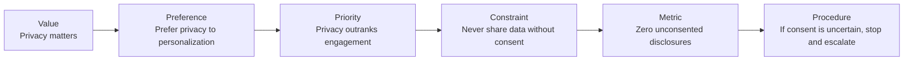
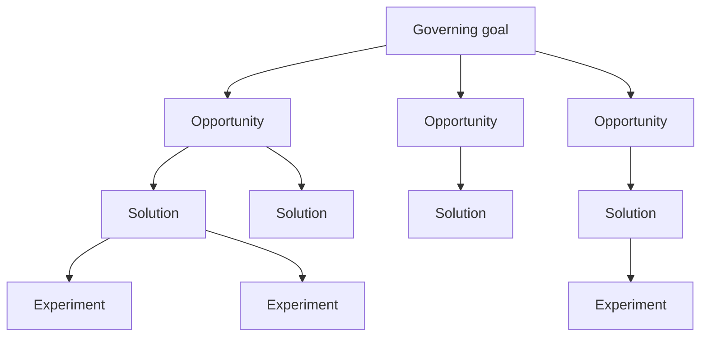
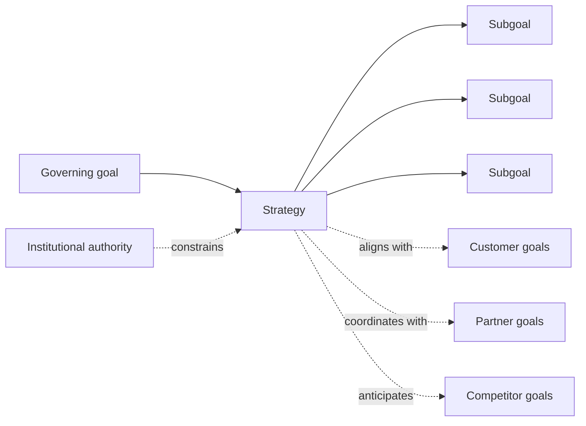
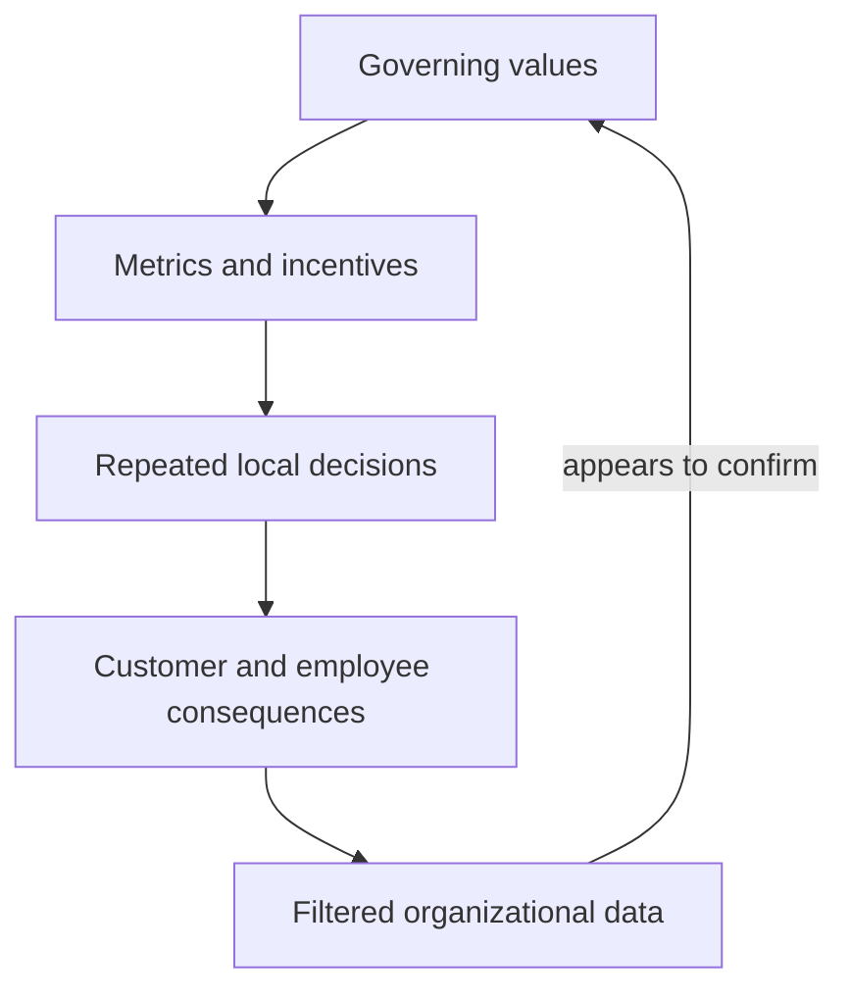

# Goals, Solutions & Value

## 1. The Priorities Hidden Inside the Prompt

I once gave an agent an existing plan and asked:

> **“Optimize this plan, find all the gaps and ensure validation checks are in
> place.”**

Nine hours later, it returned an impractically large plan: pages of phases,
dependencies, validation gates, and Markdown checkboxes—too much for a person
to reasonably read and review as a whole. Buried in that volume were
contradictions that made the plan incoherent and unusable.

Of course I blame the agent.

`Optimize` did not specify what the plan should become better at. `Find all the
gaps` treated every imaginable omission as equally important. `Ensure validation
checks are in place` rewarded adding another gate wherever uncertainty
remained.

The model had not ignored my instructions. It had operationalized them.

My language implied a value hierarchy: completeness over simplicity, risk
reduction over momentum, validation coverage over usability, and planning over
action. What I actually wanted was narrower: identify the gaps consequential
enough to threaten the outcome, add validation proportional to their risk,
preserve the team's ability to execute, and stop when additional process
created more burden than confidence.

None of those priorities appeared in the prompt. I had supplied a vocabulary
of rigor without supplying the judgment that makes rigor useful.

Research on AI-generated strategic advice demonstrates a related instability.
In one study of seven strategic tradeoffs, changing the wording or asking a
model to reason harder changed fewer than 2% of answers. Adding relevant
company information changed about 11%. Merely reversing the order of the
choices changed about 19%—more than the company evidence did.
[“Researchers Asked LLMs for Strategic Advice. They Got ‘Trendslop’ in
Return”](https://hbr.org/2026/03/researchers-asked-llms-for-strategic-advice-they-got-trendslop-in-return).

A polished recommendation can therefore conceal the priorities it inferred:

- Which outcome should be optimized?
- Which gaps are material?
- What degree of uncertainty is acceptable?
- How much validation is proportional to the consequence?
- When does another check reduce risk, and when does it merely add process?
- Who has authority to accept the remaining risk?

> **AI does not merely follow our goals. It operationalizes the priorities
> hidden inside the language we use to express them.**

> **Core thesis — Human experience reveals what can matter. Values determine
> what should matter. Wisdom negotiates conflicts among those values and
> revises them after consequences arrive. AI can infer and pursue a goal, but
> people who inhabit the situation and remain accountable for its consequences
> must define, authorize, and revise the values that govern it.**

To understand why the missing judgment matters, we need a compact account of
what a language model carries—and what even a very capable model does not
receive automatically.

## 2. What a Language Model Carries

An LLM can be understood as a compressed statistical model of patterns in
human-produced language. That is different from saying it literally contains
all language. Its training data is selected, incomplete, historically situated,
and further shaped by post-training. But at sufficient scale the model absorbs
an extraordinary range of associations, distinctions, arguments, norms,
contradictions, procedures, and recurring forms of expression.

Neural-network architecture provides the machinery for representing those
patterns. Cross-entropy training supplies the pressure: predict the observed
continuations more accurately. Optimization turns that pressure into learned
weights.

### Input and tokens

Training material commonly includes:

- publicly accessible writing, code, reference material, and research;
- licensed or partnered collections;
- human demonstrations, corrections, rankings, and safety examples; and
- synthetic material generated and filtered for additional training.

Large web crawls such as [Common Crawl](https://commoncrawl.org/) supply part
of that linguistic record. Before the model can process text, a
**tokenizer** converts it into numerical units and later converts predicted
units back into text. One influential family uses **Byte Pair Encoding**,
adapted from Philip Gage’s lossless compression technique:
[“A New Algorithm for Data
Compression”](https://www.derczynski.com/papers/archive/BPE_Gage.pdf).

```text
text → reversible token IDs → model inference → predicted token IDs → text
```

Tokenization can preserve the symbols. It does not recover the experience or
motivation that caused a person to choose those symbols.

### Training through cross-entropy

During pretraining, almost every token becomes the answer to a prediction made
from the preceding context. Given:

> The cat sat on the …

the model might assign:

| Possible next token | Probability |
| --- | ---: |
| `mat` | 70% |
| `floor` | 15% |
| `chair` | 5% |
| everything else | 10% |

If the observed training text continues with `mat`, cross-entropy loss scores
the probability assigned to that token:

```text
loss = -ln P(observed token)
```

| Probability assigned to `mat` | Loss |
| ---: | ---: |
| 90% | 0.11 |
| 70% | 0.36 |
| 10% | 2.30 |

A high probability for the observed token produces a small loss. A low
probability produces a large one. Backpropagation identifies how the model’s
parameters contributed to the error, and an optimizer adjusts those parameters
to improve future predictions.

<!-- neural-net-lab -->

```text
context → token probabilities → observed token → cross-entropy loss
→ backpropagation → updated weights
```

The precision of the objective matters. Cross-entropy rewards the model for
predicting the continuation present in the training data. It does not directly
reward the model for recovering the author’s unspoken motive, experiencing the
author’s consequences, or determining whether the author’s values should
govern anyone else.

### Model, inference, and runtime

The trained model combines an architecture with billions of learned
parameters, or **weights**:

- embeddings map token IDs into learned numerical representations;
- attention combines information from different positions in the context;
- feed-forward layers transform each contextualized representation; and
- output weights turn the final representation into scores for possible next
  tokens.

The weights are not a searchable archive of the training corpus. Together they
form a compressed statistical representation of recurring linguistic
relationships. At inference time, the current tokens pass through the network,
the model produces a probability distribution, a decoding strategy selects a
token, and the process repeats.

```text
prompt → tokens → learned representations → token probabilities
→ selected token → append → repeat
```

Training changes the weights. Inference uses those weights. Runtime context
then steers which learned patterns matter for a particular execution: system
instructions, an agent charter, tool permissions, retrieved evidence,
conversation history, and the user’s prompt.

This is why a model can competently enact values without independently
originating them:

> Pretraining teaches the language in which values are expressed.
> Post-training reinforces dispositions among those values. Runtime
> instructions establish which hierarchy the model should enact in a
> particular role.

### Two compressions

There is a compression before model training ever begins:

```text
lived experience → motivation and judgment → language
```

A person experiences a situation, interprets it, forms intentions, and
compresses some portion of that inner and social reality into words. Training
then performs a second kind of compression:

```text
human-produced language → token sequences → learned weights
→ context-sensitive predictions
```

Put together:

```text
lived experience → motivation and judgment → language → training corpus
→ learned weights → inferred continuation
```

The result is extraordinarily capable. A model can infer a person’s motivation
from language, behavior, examples, and context—sometimes more accurately than
another person. But it cannot directly observe a private motivation or know
that its inference is correct. Information omitted when experience became
language is not guaranteed to reappear because the continuation sounds
plausible.

People face the same boundary. Two coworkers may use `quality`, `safe`, or
`done` for weeks while carrying different definitions. Each hears a familiar
word and assumes shared meaning. They talk past one another until a failure,
example, or direct question exposes the difference.

AI inherits that problem at scale. When a term underdetermines the speaker’s
intent, the system fills the gap with patterns from training, post-training,
runtime instructions, and the surrounding context. The answer can be coherent
under the inferred meaning and completely wrong for the person who asked.

## 3. Experience, Values, and Wisdom

The language boundary matters because consequential goals are grounded in
situations people inhabit rather than in words alone.

- **Experience** is situated contact with events and consequences: needs,
  emotions, relationships, memory, physical conditions, social effects, and
  the changes an action produces.
- A **value** identifies something treated as worth pursuing, protecting, or
  refusing.
- **Wisdom** is corrigible judgment that integrates experience, evidence,
  competing values, relationships, time horizons, and consequences.

Humans do not automatically possess wisdom. People can be biased, selfish,
shortsighted, manipulated by incentives, or confidently wrong. Wisdom is not
the mystique of human intuition. It is a practice: remain in contact with the
people and conditions affected, preserve dissent, compare perspectives,
remember consequences, and revise the judgment when reality contradicts it.

That practice cannot be replaced by asking which sentence sounds most like a
wise answer. The people who bear a decision’s consequences have standing in
the judgment, and the institutions exercising authority remain accountable for
what follows.

### Judgments hidden in ordinary language

Values do not appear only in declarations such as “privacy matters.” Ordinary
language quietly supplies objectives, priorities, obligations, and authority:

| Kind | Examples | Implied judgment |
| --- | --- | --- |
| Evaluative | `better`, `safe`, `fair`, `meaningful` | Compare against an unstated standard |
| Goal-oriented | `optimize`, `improve`, `reduce`, `protect` | Treat an outcome as desirable |
| Deontic | `must`, `should`, `permitted`, `prohibited` | Establish an obligation or boundary |
| Priority | `prefer`, `before`, `even if`, `at the expense of` | Rank competing values |
| Threshold | `at least`, `only if`, `never`, `until` | Turn a judgment into a gate |
| Affective | `painful`, `reassuring`, `alienating` | Point toward experienced consequences |
| Authority | `consent`, `deserve`, `authorized`, `accountable` | Assign standing and responsibility |

Even a noun such as `problem` contains a judgment: the current state is
undesirable relative to some interest. `Opportunity` implies a valued outcome.
`Success`, `failure`, `risk`, and `waste` all depend on a perspective and time
horizon.

Those judgments can become progressively more operational:



An AI can enact the later statements more reliably because they expose
priorities, observable conditions, and actions. But operational precision does
not establish that the hierarchy is legitimate. Someone still has to decide
that privacy should outrank engagement in this context, determine whose consent
counts, observe the consequences, and authorize exceptions or revision.

## 4. Goals Create Problem Spaces

Something becomes a problem only relative to a valued outcome. A candidate
becomes a solution only if its consequences move the situation toward that
outcome:

- A **goal** identifies a state worth bringing about or preserving.
- An **opportunity** is a condition that may enable progress toward it.
- A **solution** is an intervention expected to use that opportunity or remove
  an obstacle.
- An **experiment** tests whether the intervention produces the expected
  consequence.



Change the governing goal and the same observation opens a different problem
space. A rise in support tickets might be a cost problem under a margin goal, a
quality signal under a retention goal, or valuable customer contact under a
learning goal.

Once the root goal is supplied, AI can expand the tree. It can identify
opportunities, generate solutions, design experiments, predict consequences,
and compare results. Generating more branches cannot determine which root
deserves to govern them.

That distinction separates two kinds of decision:

- **Governing decisions** establish what counts as better, whose interests
  matter, which time horizon matters, and which tradeoffs are legitimate.
- **Instrumental decisions** select actions expected to advance an accepted
  goal within supplied evidence and constraints.

“Optimize this code” can become substantially instrumental once tests,
performance budgets, failure conditions, and operational constraints are
specified. “Optimize my strategy” may ask the system to choose among revenue,
resilience, customer welfare, employee sustainability, speed, and risk. Until
those priorities are ranked, there is no single meaning of `better` waiting for
the model to discover.

Strategy also operates inside a field of goals held by other people and
institutions:



A company can achieve a local subgoal while undermining its governing purpose.
It can hit an internal target while producing an outcome that customers,
employees, partners, or regulators reject. Success is therefore relational:
the question is not only whether an action worked, but whose goal it advanced
and which other goals it constrained.

> **AI can help decide how to pursue a goal. Prediction alone cannot determine
> which goal deserves authority.**

## 5. Authority, Accountability, and Corrigibility

An AI can state principles, rank them, and translate them into behavior. That
does not establish that it authored those principles or has authority to impose
them.

Its operative value hierarchy can come from several layers:

| Source | Contribution |
| --- | --- |
| Training data | Associations, examples, norms, contradictions, and recurring judgments |
| Post-training | Reinforced dispositions such as helpfulness, refusal, or deference |
| System instructions | Role-specific priorities and constraints |
| Organizational policy | Delegated purpose, decision rights, and escalation |
| User context | Immediate goals, evidence, preferences, and exceptions |
| Tools and permissions | Enforceable limits on possible action |
| Evaluation and feedback | Criteria that reward, reject, or revise behavior |

These layers can agree or conflict. What the system enacts depends on how they
are ordered and enforced—not on a single value hierarchy the model necessarily
chose for itself.

The deeper danger is not merely leaving values unstated. People can state them
clearly and choose the wrong ones. An organization can encode a mistaken value
hierarchy into excellent metrics, incentives, tests, and automation.

> **The organization becomes coherently wrong.**



| Governing priority | Behavior rewarded | Possible consequence |
| --- | --- | --- |
| Growth above trust | Aggressive acquisition and dark patterns | Churn, regulation, and brand erosion |
| Speed above reliability | Shipping without adequate validation | Outages and accumulated technical debt |
| Harmony above truth | Suppressing disagreement and bad news | Loss of corrective evidence |
| Metrics above purpose | Optimizing visible indicators | The measurement improves while the outcome deteriorates |
| Revenue above customer welfare | Extracting rather than creating value | Customers leave when alternatives appear |

This is false evaluative closure. The organization has precise criteria for
calling an action better, but those criteria omit or misrank consequences that
matter. Tests pass because the tests embody the wrong priorities. Dashboards
remain green because the dashboards exclude the people being harmed.

AI can accelerate this failure. It can reproduce the hierarchy across more
decisions, with greater speed and consistency. The model may identify a
contradiction or harmful consequence, but it cannot overrule the governing
system unless people have given it permission to challenge, escalate, or stop.

A resilient hierarchy must therefore be **corrigible**: answerable to evidence
and revision rather than protected as an untouchable objective. That requires:

- direct observation of customer and employee consequences;
- protected disagreement and independent feedback;
- perspectives from people who bear costs without controlling the decision;
- measurements that include downstream effects;
- explicit review of tradeoffs and uncertainty; and
- escalation paths with authority to revise the governing goal.

Human governance does not mean manually choosing every action. It means
retaining responsibility for which values govern, creating the conditions
under which those values can be challenged, and changing them when their
consequences reveal they were wrong.

## 6. From Human Judgment to Language

Human values cannot guide an AI while remaining private. They have to become
available through some combination of:

- named stakeholders and consequences;
- definitions and domain distinctions;
- priorities and legitimate tradeoffs;
- representative examples and counterexamples;
- constraints, permissions, and escalation boundaries;
- evidence, provenance, and explicit uncertainty;
- tests, stopping conditions, and evaluation; and
- feedback capable of revising the governing model.

This translation does not remove the need for judgment. It makes judgment
inspectable and gives both people and AI a better chance of recognizing when
they are using the same words for different things.

It also opens the next question in this series. Language does not carry every
kind of constraint with equal reliability. A proof, a program, an experimental
report, and a product aspiration are shaped by different practices and
corrective systems. In some domains an invalid interpretation is quickly
rejected. In others, several incompatible interpretations can sound equally
coherent.

[Truth, Entropy & Inference](/writing/truth-entropy-and-inference) asks what
makes the difference: how language acquires predictive structure, why code is
unusually constraint-dense, and when a fluent continuation is evidence rather
than merely the shape of an answer.

## 7. Conclusion

The agent did not fail because it was incapable of producing a plan. It failed
because `optimal` omitted the judgment that would make one plan preferable to
another. The model supplied a plausible interpretation from its training and
runtime context. It could not receive the private definition I never expressed.

AI can represent principles, infer motivations, generate strategies, and
pursue goals through tools and feedback. Those are genuine capabilities. They
do not determine which outcome should govern, whose interests deserve standing,
or when a successful optimization has become harmful.

Human experience reveals what can matter. Values determine what should matter.
Wisdom keeps those judgments answerable to evidence, other people, and their
consequences. Our role is not to choose every action. It is to define and
authorize the governing values, translate them into inspectable language,
observe what happens, and revise the hierarchy when it proves incomplete or
wrong.

> **AI encounters our commitments through language. The next task is to know
> when language carries enough of the relevant distinctions to guide reliable
> action—and when it carries only the shape of an answer.**

## Sources

The argument above is my synthesis. These sources support its technical
background, account of revisable valuation, and opening example.

### Language models and training

1. Common Crawl. [“Common Crawl.”](https://commoncrawl.org/) An open repository
   of web-crawl data and one source of public text used in language-model
   corpora.
2. Philip Gage. [“A New Algorithm for Data
   Compression.”](https://www.derczynski.com/papers/archive/BPE_Gage.pdf)
   *C Users Journal* (1994). Introduces byte-pair encoding as a lossless
   compression technique.
3. Rico Sennrich, Barry Haddow, and Alexandra Birch. [“Neural Machine
   Translation of Rare Words with Subword
   Units.”](https://aclanthology.org/P16-1162/) (2016). Adapts byte-pair encoding
   to subword tokenization for neural language processing.
4. David E. Rumelhart, Geoffrey E. Hinton, and Ronald J. Williams. [“Learning
   Representations by Back-Propagating
   Errors.”](https://doi.org/10.1038/323533a0) *Nature* 323 (1986). Provides an
   influential demonstration of backpropagation in multilayer networks.
5. Ashish Vaswani et al. [“Attention Is All You
   Need.”](https://proceedings.neurips.cc/paper_files/paper/2017/hash/3f5ee243547dee91fbd053c1c4a845aa-Abstract.html)
   (2017). Introduces the Transformer architecture underlying the attention
   and feed-forward account above.
6. Claude E. Shannon. [“Prediction and Entropy of Printed
   English.”](https://doi.org/10.1002/j.1538-7305.1951.tb01366.x) *Bell System
   Technical Journal* 30, no. 1 (1951): 50–64. A precursor to statistical
   language modeling through next-character prediction and estimates of
   linguistic entropy.

### Values and judgment

7. John Dewey. [*Theory of
   Valuation.*](https://archive.org/details/theoryofvaluatio032168mbp)
   (1939). Develops valuation as inquiry in which ends and means remain
   answerable to consequences.

### Strategic-advice example

8. Angelo Romasanta, Llewellyn D. W. Thomas, and Natalia Levina. [“Researchers
   Asked LLMs for Strategic Advice. They Got ‘Trendslop’ in
   Return.”](https://hbr.org/2026/03/researchers-asked-llms-for-strategic-advice-they-got-trendslop-in-return)
   *Harvard Business Review* (March 16, 2026). Reports the prompt-order and
   company-context effects summarized in the introduction.
