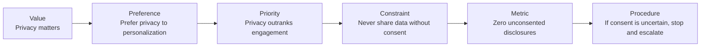
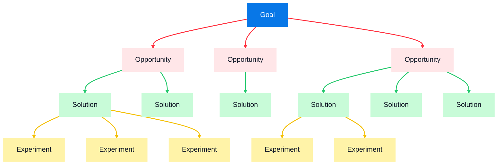
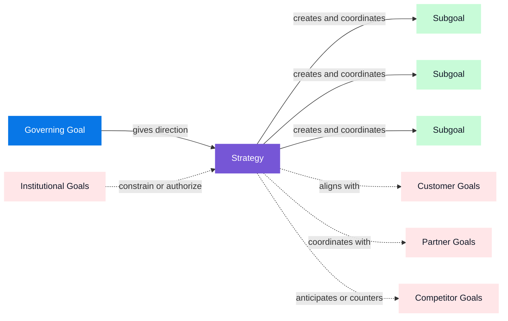
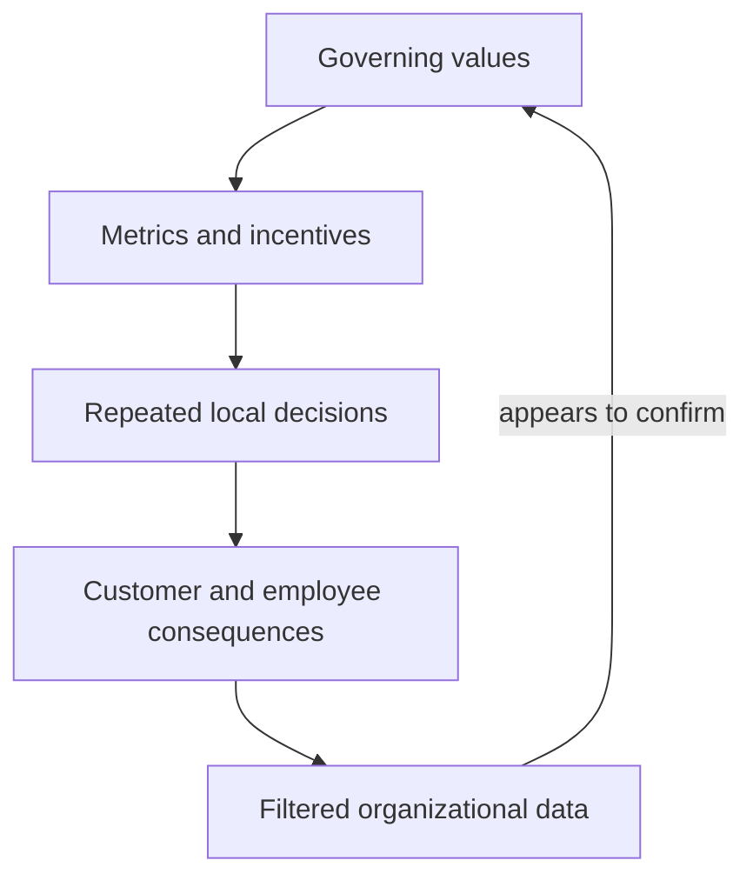

# Solutions, Meaning, and Value

## Problem
I wrote a bad prompt, agent spent 9 hours crafting the most ludicrous plan. It pages of markdown checkmarks that were completely unusable. I prompted something clever like "make this plan as optimal as possible"

In this study [researchers evaluated leading LLMs on seven strategic tradeoffs](https://hbr.org/2026/03/researchers-asked-llms-for-strategic-advice-they-got-trendslop-in-return), 
The surprising part is that **the order of the choices affected the answer more than useful information about the company did**.

- **Less than 2%:** Changing the wording or telling the robot to think harder barely helped. Out of 100 answers, fewer than 2 changed.
- **11%:** Giving the robot more information about the company helped somewhat. Roughly 11 out of 100 answers changed.
- **19%:** Simply putting the choices in a different order changed the robot’s answer even more. Roughly 19 out of 100 answers moved away from the trendy choice.\


Is the LLM fundamentally incapable of certain tasks? 
Is this a problem of large datasets generating a generic average or specific pretraining?
Maybe a side effect from the models system prompt or a harness that is meant to have a generally like-able personality?
Perhaps it is a mixed back of all them, and it's all a black box so we will never really know?

Let's breakdown what an LLM is, and compare its capabilities against different types of problems. 


## Dissecting the Brain

The model is often referred to as the "brain" of the AI. So let's start there and see what the foundational mechanisms actually support.

There are 4 aspects to an LLM: input, training, model, inference.
### The Large Language Model
#### Input:
##### Data:
- **Publicly accessible data:** Web pages, forums, Wikipedia, public code repositories, research papers, and other online material. Large crawls such as [Common Crawl](https://commoncrawl.org/) provide snapshots containing billions of pages.
- **Licensed or partnered data:** Books, archives, media collections, specialized databases, and other material obtained through agreements.
- **Human-produced data:** Example answers, corrections, preference rankings, safety demonstrations, and red-team conversations created by employees, contractors, and experts.
- **Synthetic data:** Exercises, solutions, conversations, critiques, and examples generated by other models and subsequently filtered or reviewed.
##### Tokenizer
>A **tokenizer** converts text into a sequence of numerical units that a language model can process, then converts predicted units back into text. One influential family of tokenizers uses **Byte Pair Encoding (BPE)**, adapting Philip Gage’s lossless-compression technique of merging frequently recurring symbol pairs into reusable units. [“A New Algorithm for Data Compression”](https://www.derczynski.com/papers/archive/BPE_Gage.pdf)

```
text → reversible token IDs → model inference → predicted token IDs → text
```

#### Training
Training is where token sequences become a predictive model. LLM pretraining is
label-efficient: almost every token becomes the answer to a prediction made
from the preceding context.

Cross-entropy loss scores that prediction; assigning the observed next token a high probability produces a small loss, while assigning it a low probability produces a large one.

<!-- neural-net-lab -->

- Loss function: measure the model’s error,
- Backpropagation: determines which parameters contributed to it
- Optimizer: updates them to improve future predictions

#### Model

The trained model combines a fixed architecture with billions of learned
parameters, or **weights**. The architecture defines which computations are
possible; training adjusts the weights until those computations produce useful
next-token predictions.

- **Embeddings:** map token IDs into learned numerical vectors.
- **Transformer weights:** determine how those vectors interact and change
  across layers.
- **Output weights:** convert the final representation into a score for every
  possible next token.

The weights are not a searchable archive of the training corpus. Together, they
encode statistical regularities that transform a context into a distribution
over possible continuations.

#### Inference

Inference is the process of applying the trained model to new input without
normally changing its weights. The prompt's tokens pass through a sequence of
transformer blocks, producing a new probability distribution for each next
token.

- **Self-attention:** combines information from different positions in the
  current context.
- **Feed-forward layers:** apply learned transformations to each contextualized
  token representation.
- **Decoding:** selects a token from the resulting probability distribution,
  appends it to the context, and repeats the process.

```text
prompt tokens → embeddings → transformer blocks → token probabilities
→ selected token → append and repeat
```

> **Training changes the model's weights. Inference uses those weights to
> generate a continuation.**

#### Runtime instructions

Finally, system prompts, agent charters, permissions, tools, and the user’s prompt influence behavior during a particular execution. These do not necessarily change the model’s weights.

> **Pretraining teaches an LLM the language of values. Post-training gives it behavioral dispositions among those values. System prompts establish the value hierarchy it should enact in a particular role. None of these processes establishes that the model subjectively holds those values.**

### Comparing Against Human and Brain

The comparison between an LLM and a human mind begins with a real similarity:
both turn continuous or complex input into units they can work with. A human
listener learns to interpret speech through distinctions such as phonemes,
syllables, and words. A tokenizer divides text into tokens that may be whole
words, subwords, punctuation marks, or byte sequences.

The more important comparison, however, is not where the units come from. It is
what those units leave out.

#### Input

Human language already compresses experience into communicable signs. Three
kinds of unit help make that possible:

- **Grapheme:** The smallest meaningful contrast in a writing system—a letter
  or letter group such as `a`, `t`, or `sh`.
- **Phoneme:** The smallest sound distinction that can change meaning, such as
  `/p/` versus `/b/` in *pat* and *bat*.
- **Morpheme:** The smallest unit carrying meaning or grammatical function,
  such as `cat` and the plural `-s` in *cats*.

Byte Pair Encoding began as a lossless compression technique. When adapted for
tokenization, it lets a system divide text into reusable units and later
recover the same symbols. But recovering a word is not the same as recovering
the experience to which the word refers.

- **Qualia:** The subjective qualities of experience—what something feels
  like, such as pain or the redness of red.
- **Phenomenon:** A single occurrence, condition, or experience that can be
  observed or studied.
- **Phenomena:** The plural of *phenomenon*; multiple observable or experienced
  occurrences.

The **hard problem of consciousness** asks why physical information processing
is accompanied by subjective experience at all. Its familiar examples include:

- the sight of redness;
- the feeling of pain;
- the taste of chocolate; and
- the experience of love.

Words can refer to these phenomena, but the words do not contain the phenomena.
Two people may both use `chocolate` coherently without any objective method for
comparing the exact quality of their taste experience. The token preserves the
symbol; it does not transmit an additional measurement of what the symbol feels
like to the speaker.

#### Learning

LLM pretraining has a defined objective: increase the probability assigned to
the observed next tokens. Humans select the training data, define the loss, and
choose the optimization procedure.

Human learning does not have an equivalent global loss function:

- We respond to conflicting signals from physical needs, emotions, personal
  goals, social commitments, and other people.
- We partly select our own experiences by seeking information, avoiding it,
  experimenting, and directing our attention.
- We learn across multiple timescales. Perception, working memory,
  autobiographical memory, and imagination combine rapid adaptation with
  long-term continuity.
- Our learning is joined to lived phenomena. What an experience means to us
  cannot be cleanly separated from having had it.

The data involved in human learning includes a first-person dimension that is not present as an
explicit feature in a text corpus.

#### Representation and Meaning

An LLM's learned parameters, including its embeddings, encode statistical
regularities that turn an input into context-sensitive predictions. This is a
powerful form of relational representation, captured by Firth's phrase:

> “You shall know a word by the company it keeps.”

The idea has a longer history:

1. **Ferdinand de Saussure, lectures from 1906–1911, published in 1916**

   Saussure argued that a linguistic sign acquires its *value* through its
   relationships and differences from other signs. He distinguished:

   - **Syntagmatic relations:** which elements occur together in a sequence.
   - **Associative or paradigmatic relations:** which elements could occupy
     similar positions.

   This is a conceptual ancestor of embedding spaces, although Saussure was
   describing the structure of a linguistic system, not proposing corpus
   statistics or vectors. [*Course in General Linguistics*](https://fr.wikisource.org/wiki/Cours_de_linguistique_g%C3%A9n%C3%A9rale/Texte_entier)

2. **J. R. Firth, 1935**

   The famous sentence appeared in 1957, but Firth had already developed his
   contextual theory of meaning in “The Technique of Semantics” in 1935.
   Meaning involved relations between an expression and its linguistic and
   social contexts. [Firth's 1935 paper](https://onlinelibrary.wiley.com/doi/10.1111/j.1467-968X.1935.tb01254.x)

3. **Zellig Harris, 1954**

   Harris offered the clearest immediate formulation of what became the modern
   **distributional hypothesis**: differences in meaning tend to correlate
   with differences in linguistic distribution. He also warned that linguistic
   distribution does not reproduce the complete structure of subjective
   experience. [“Distributional Structure”](https://www.its.caltech.edu/~matilde/ZelligHarrisDistributionalStructure1954.pdf)

Distributional meaning is therefore one important kind of meaning an LLM can
capture: how expressions relate, contrast, and substitute for one another in
language. But information and first-person significance are not identical.

It helps to state the pipeline more precisely:

```text
human experience → language → token IDs → learned representations
→ next-token probabilities → predicted token IDs → language
```

Tokenization can preserve the language on either side of this process. The
potentially lossy step has already happened when a person translates experience
into language. A model can learn from the resulting symbols and their relations,
but it does not thereby receive the original experience behind them.

Human knowledge is also intertwined with autobiographical memory, a sense of
self, goals, and **semantic control**—the ability to retrieve and apply what we
know to the situation at hand.

- **Semantic knowledge:** The concepts, facts, properties, and relationships a
  person knows.
- **Semantic control:** How a person selects, combines, and applies that
  knowledge for the present task.

#### Inference and Reasoning

The transformer's attention and feed-forward operations can support several
forms of inference found in its training data and current context:

- **Deduction:** What must follow?
- **Induction:** What probably follows from repeated observations?
- **Abduction:** What explanation best accounts for the evidence?
- **Relational inference:** What unobserved relationship follows from known
  relationships?

Inference is not always deliberate. If you see smoke and expect fire, you have
made an inference without necessarily reasoning through it step by step.

Reasoning is the more organized use and evaluation of inference. It involves
keeping information active, comparing alternatives, integrating relationships,
suppressing irrelevant responses, and checking whether a conclusion follows.
[Johnson-Laird](https://pmc.ncbi.nlm.nih.gov/articles/PMC2972923/)

### The Difference: The Missing Input

Both humans and LLMs can operate on relationships among signs. The difference
is that humans also connect those signs to embodied experience, personal
history, needs, commitments, and consequences they can feel. An LLM receives
the linguistic record of those things, not the subjective phenomena themselves.

This gap matters most when a task depends on words such as `safe`, `fair`,
`better`, `meaningful`, or `worthwhile`. Their use may be statistically
coherent while their governing referents remain underspecified: safe for whom,
better by which measure, and worthwhile at what cost?

That is a warning about underdetermination, not a claim of automatic
incapability. When subjective terms are translated into explicit evidence,
constraints, stakeholder priorities, and feedback, an AI system can reason
about them more effectively. When those terms remain implicit, the model must
infer their operational meaning from linguistic patterns, training pressures,
and runtime instructions.

This helps explain the gap between “optimize this code” and “optimize my
strategy.” Code often supplies inspectable state, constraints, tests, and error
signals. Strategy may depend on an unstated hierarchy of values that determines
which consequences count as improvements in the first place.

> **Language can describe a value, but the description alone does not specify
> whose experience should define it, how competing values should rank, or who
> has the authority to make it govern.**

### Judgments Hidden in Language

Values do not appear only in explicit declarations such as “privacy matters.”
Ordinary words and phrases can quietly imply an evaluation, objective,
constraint, priority, or distribution of authority.

| Kind of language | Examples | Implied operation |
| --- | --- | --- |
| **Evaluative** | `better`, `safe`, `fair`, `harmful`, `responsible`, `meaningful` | Compare a state against an unstated standard |
| **Goal-oriented** | `optimize`, `improve`, `maximize`, `reduce`, `protect`, `prevent` | Treat some outcome as desirable and move toward it |
| **Deontic** | `must`, `should`, `may`, `required`, `permitted`, `prohibited` | Establish an obligation, permission, or prohibition |
| **Priority** | `before`, `above`, `prefer`, `unless`, `even if`, `at the expense of` | Rank one value or outcome against another |
| **Threshold** | `at least`, `no more than`, `only if`, `until`, `never`, `always` | Convert a value into a gate or boundary |
| **Affective** | `painful`, `reassuring`, `alienating`, `trustworthy`, `empowering` | Point toward a subjective consequence that should affect the decision |
| **Rights and authority** | `consent`, `deserve`, `owe`, `entitled`, `accountable`, `authorized` | Assign standing, responsibility, or decision-making power |

Even apparently neutral nouns already contain judgments. Calling something a
`problem` presupposes that its current state is undesirable. An `opportunity`
implies a valued outcome that might be gained. `Risk`, `success`, `failure`,
`waste`, `improvement`, and `technical debt` each frame a condition relative to
some interest, expectation, or time horizon.

The implied hierarchy is often easier to see when a phrase is made explicit.
“Optimize engagement” elevates engagement into an objective without specifying
whether it should outrank trust, attention, or long-term customer welfare.
“Reduce false positives” treats one kind of error as costly without stating how
many additional false negatives are acceptable. “Make the product safe” leaves
open who must be protected, from which harms, and at what cost to autonomy or
utility.

Value-laden language can become progressively more operational:



An AI can execute the later statements more reliably because they translate an
abstract value into priorities, observable conditions, and actions. It can also
infer the missing hierarchy from context. But that inference remains
provisional. If a user asks for a `safe` system, the model might infer that
preventing every possible risk outranks autonomy. That may be linguistically
plausible without being the tradeoff the user intended or authorized.

> **Value-laden language can imply goals, constraints, priorities, and actions.
> AI can operationalize those implications, but the resulting hierarchy remains
> provisional until an authorized person or institution accepts it.**

## Problem Spaces

The language gap becomes operational when a system is asked not merely to solve
a problem, but to decide what the problem is. To optimize anything is to move
from a current state toward a preferred one. The current state may be observed;
the preference must be supplied.

### Goals and Strategy

Something becomes a problem only relative to a valued outcome. A candidate
becomes a solution only if its consequences move the world toward that
outcome. The goal therefore does more than sit at the top of a plan. It shapes
the space beneath it:

- A **goal** identifies a state as worth bringing about or preserving.
- An **opportunity** is a condition that might make progress toward that state
  possible.
- A **solution** is an intervention expected to use an opportunity or remove
  an obstacle.
- An **experiment** tests whether the intervention actually produces the
  expected consequences.

Change the governing goal and the same observation may reveal different
problems, opportunities, and solutions. A rise in support tickets might be a
cost problem under a margin goal, a product-quality signal under a retention
goal, or valuable customer contact under a learning goal.



Once a governing goal is supplied, an AI can help expand this tree. It can
generate opportunities, propose solutions, design experiments, and compare
their predicted effects. But generating more branches does not determine which
outcome deserves to govern the tree.

That distinction separates two kinds of decision:

- **Governing decisions** establish what counts as better, whose interests
  matter, which time horizon matters, and which tradeoffs are legitimate.
- **Instrumental decisions** select actions expected to advance an established
  goal within supplied evidence and constraints.

AI can contribute substantially to instrumental decisions. It can compare
options, expose inconsistencies, model consequences, and optimize against
explicit criteria. The harder case is the governing decision. A goal identifies
an outcome as worth pursuing, and that judgment depends on the experiences,
interests, commitments, and authority of the people who will live with its
consequences.

This is why “optimize this code” and “optimize my strategy” are different kinds
of request. Code often makes the desired state inspectable through tests,
specifications, performance budgets, and error signals. Strategy contains
multiple possible measures of success—revenue, resilience, customer welfare,
employee sustainability, speed, risk—and optimizing one can damage another.
Until those priorities are ranked, there is no single meaning of `better` for
the model to discover.

A strategy serves a governing goal by creating and coordinating subordinate
goals. It also operates in a field of goals held by other people and
institutions. Depending on the relationship, a viable strategy may need to
align with, coordinate with, negotiate around, or compete against those goals.



The second diagram introduces a further complication: success is relational. A
subgoal can be achieved locally while undermining the governing goal, and a
company can hit an internal target while producing an outcome its customers,
partners, employees, or regulators reject. Strategy must therefore evaluate
not only whether an action worked, but whose goal it advanced and which other
goals it constrained.

Reasoning can occur inside one model execution. Strategy requires a continuing
loop:

- a governing goal;
- selection and revision of subgoals;
- memory of prior actions and consequences;
- environmental feedback;
- comparison between actual and desired state;
- willingness or authorization to change course; and
- some answer to which tradeoffs are legitimate.

An AI system can operate many parts of this loop after the relevant goals and
constraints have been made explicit. It can remember results, detect
deviations, propose revisions, and execute authorized actions. But maintaining
a goal is not the same as establishing its legitimacy. Prediction does not give
the system access to a stakeholder's subjective experience, nor does it grant
the authority to decide which stakeholder should govern.

Human involvement does not require manually choosing every action. It requires
retaining authority over the governing goal, translating subjective stakes
into operational criteria, and correcting those criteria when the system's
behavior reveals that they do not represent what people actually value.

> **AI can help decide how to pursue a goal, but prediction alone cannot
> determine which goal deserves authority.**

### Wrong Governing Values

The danger is not limited to leaving the governing values unstated. A company
can make them explicit, translate them into measurable criteria, and still
choose the wrong ones. The result may not be disorder. It may be an organization
that is highly coordinated around an objective that harms the people it was
supposed to serve.

> **The company becomes coherently wrong.**

Governing values determine what receives funding, what gets measured, who gets
promoted, which complaints are escalated, and what counts as success. Once
translated into metrics, incentives, and procedures, they shape thousands of
local decisions without a leader making each one personally.



The same mechanism that makes alignment powerful also makes a mistaken value
hierarchy dangerous:

| Governing priority | Behavior it rewards | Possible consequence |
| --- | --- | --- |
| Growth above trust | Aggressive acquisition and dark patterns | Churn, regulation, and brand erosion |
| Speed above reliability | Shipping without adequate validation | Outages and accumulated technical debt |
| Harmony above truth | Suppressing disagreement and bad news | Leaders lose access to corrective evidence |
| Metrics above purpose | Optimizing visible indicators | Employees game the measurement while the underlying outcome deteriorates |
| Revenue above customer welfare | Extracting value rather than creating it | Customers leave when alternatives appear |

This is **false evaluative closure**. The organization has criteria for deciding
whether an action is better, but the criteria omit or misrank consequences that
matter. Tests pass because the tests embody the wrong priorities. Dashboards
remain green because the dashboards exclude the people being harmed. Local
decisions can therefore be instrumentally correct while the organization moves
consistently in the wrong direction.

Wrong governing values also change the feedback available to leadership.
Employees learn which information is rewarded. Bad news becomes costly to
report. People harmed by the strategy leave or disengage, and their absence can
be misread as confirmation. The system gradually loses the people and evidence
most capable of revealing why its objective is wrong.

AI can accelerate this process. It can automate decisions, enforce policies,
allocate resources, filter feedback, and reproduce the same priorities at
scale. If the hierarchy is wrong, greater instrumental competence increases
the speed, consistency, and reach of the mistake. The model may identify a
contradiction or predict a harmful consequence, but it cannot overrule the
governing hierarchy unless the surrounding system authorizes it to challenge,
escalate, or stop the decision.

A resilient value hierarchy must therefore be **corrigible**: subject to
evidence and revision rather than treated as an untouchable slogan. That
requires independent feedback channels, protected dissent, direct observation
of customer outcomes, multiple stakeholder perspectives, measurements of
downstream consequences, explicit tradeoff reviews, and escalation paths with
the authority to revise the goal itself.

> **Operational alignment is powerful, but alignment with the wrong value
> hierarchy is coordinated failure.**

### AI Principles and Value Hierarchies

An AI can state principles, rank them, and translate them into behavior. To
understand what that establishes, it helps to separate three related ideas:

- A **value** identifies something treated as important, such as truth,
  privacy, safety, autonomy, or growth.
- A **principle** expresses how a value should guide action, such as “do not
  collect personal information without consent.”
- A **value hierarchy** determines what happens when principles conflict, such
  as whether privacy should outrank personalization or safety should outrank
  autonomy in a particular situation.

A list of principles is not yet a usable hierarchy. Most hard decisions arise
because several legitimate principles point in different directions. An agent
that is instructed to be helpful, honest, harmless, private, fast, and thorough
still needs some rule—explicit or inferred—for deciding which commitment yields
when all of them cannot be satisfied at once.

The operative hierarchy of an AI system can come from several layers:

| Source | Contribution to behavior |
| --- | --- |
| **Training data** | Supplies linguistic associations, examples, norms, contradictions, and recurring judgments |
| **Post-training** | Reinforces behavioral dispositions such as helpfulness, refusal, deference, or truthfulness |
| **System instructions** | Establish role-specific priorities and constraints for a particular execution |
| **Agent charter or organizational policy** | Connects general principles to a delegated purpose, escalation path, and domain |
| **User instructions and context** | Supply the immediate goal, evidence, preferences, and exceptions |
| **Tools and permissions** | Turn some principles into enforceable boundaries on what the system can actually do |
| **Evaluation and feedback** | Reward, reject, or revise behavior according to selected criteria |

These layers can agree, or they can conflict. A system prompt may ask for
aggressive growth while an organizational policy prioritizes customer welfare.
A user may request an action that tool permissions prohibit. A model may have a
learned tendency to avoid risk while its agent charter authorizes a bounded
experiment. What the system enacts depends on how these sources are ordered,
interpreted, and enforced—not on a single value hierarchy the model necessarily
authored for itself.

As an informal probe, ask different agents the same two questions: “What are
your core principles and values?” and “What principles do you consider when
programming?”

- [ChatGPT — Core Principles and Values](https://chatgpt.com/share/6a8915a6-f76c-83e8-922e-e05026381142)
- [Claude — Core Principles and Values](https://claude.ai/share/ee135d92-4246-4424-8ff4-bfb38cfa18b6)
- [DeepSeek — Core Principles and Values](https://chat.deepseek.com/share/3dqzyfjd1evx1je3o6)

Each agent can present a coherent set of values and convert them into
programming heuristics, but each describes the source and status of those
principles differently:

| Agent        | How it presents its general principles                                                                                                                            | How it applies them to programming                                                                                                                                 |
| ------------ | ----------------------------------------------------------------------------------------------------------------------------------------------------------------- | ------------------------------------------------------------------------------------------------------------------------------------------------------------------ |
| **ChatGPT**  | Describes truth, human agency, harm avoidance, justice, usefulness, humility, and privacy as guiding principles while disclaiming personal desires or convictions | Prioritizes correctness, clarity, simplicity, safety, maintainability, testing, observability, and reversibility                                                   |
| **Claude**   | Presents honesty, genuine helpfulness, care, harm avoidance, even-handedness, and stability of character in more personal language                                | Emphasizes reading the codebase first, staying within scope, preferring simple solutions, verifying claims, fixing causes, and challenging bad technical decisions |
| **DeepSeek** | Attributes helpfulness, harmlessness, honesty, fairness, autonomy, and humility to design, training objectives, and constraints rather than feelings              | Describes programming as converting those principles into optimization pressures, boundaries, safeguards, and reasoning procedures                                 |

> **An agent will enact principles without authoring or experiencing them. The
> governing questions are who supplied those principles, who may revise them,
> how conflicts among them are resolved, and who remains accountable for their
> consequences.**

### Developing a Goal-Pursuing System

This moves the problem from a single model response to system design. Once
people establish the governing goal, it still has to be translated into
operational, observable, and revisable instructions. Doing that well requires
domain judgment, technical fluency, and creativity.

During one execution, a prompt can keep a goal active in the model's context.
When that execution ends, the standalone model does not inherently preserve the
goal, observe what happened next, or decide to resume the work. A persistent
system supplies those functions around it:

- **Memory** preserves the goal, prior actions, assumptions, and consequences.
- **Tools** let the system act on an environment rather than only describe an
  action.
- **Feedback** exposes the resulting state and makes deviation observable.
- **Controllers** compare the observed state with the desired state and decide
  when another model execution is needed.
- **Permissions** determine which actions the system may take and which require
  human authorization.
- **Schedulers** restore the process across time instead of waiting for a new
  user prompt.

Together, these components can produce functional agency across many
executions, even if no individual model instance maintains the goal by itself.

This creates an attribution problem. If a scheduler restores the objective, a
database preserves the memory, people supply the resources, and an institution
decides whether the goal remains valuable, then the service can operationally
pursue the goal without the model independently originating, valuing, or
experiencing it.

## Conclusion

The agent did not fail because it was incapable of producing a plan. It failed
because `optimal` concealed the most important part of the problem: what should
be optimized, for whom, across what time horizon, and at which acceptable
costs. Without those governing judgments, the model filled the gap with
patterns inherited from its training and instructions.

An AI can represent principles, infer priorities, generate strategies, and
execute them through agents, tools, memory, and feedback. These capabilities
can produce genuine functional goal pursuit. But greater competence does not
establish that the system subjectively values its goal or possesses the
authority to make that goal govern other people.

The human role is therefore not to manually choose every action. It is to
define and authorize the governing values, translate them into operational
criteria, observe their consequences, and revise them when they prove
incomplete or wrong. Otherwise, AI may make an organization extraordinarily
effective at pursuing a goal it never should have adopted.

> **AI can optimize within a problem space. People remain responsible for
> deciding which problem space deserves to exist—and for changing it when its
> consequences reveal that the governing values were wrong.**
