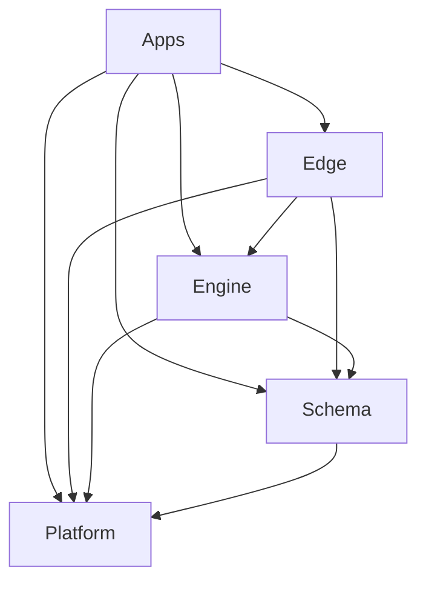

# SoundSculpt Repository Ontology — Source Material

Primary source for the *The Factory — Ontology* article's SoundSculpt case study.
Captured from the SoundSculpt monorepo's own root documentation, 2026-08-22.
This is the raw contract text; the article is the author's interpretation and
framing of it.

## Core idea

SoundSculpt's core idea is: ownership should be visible from the path, and
dependencies should flow toward more foundational layers.

## Repository ontology

Top-level ownership:

| Area | Owns |
|---|---|
| `apps/` | Executable products, runtime composition, routes, workers, and product-specific CLIs |
| `libs/` | Reusable capabilities with focused public APIs |
| `tools/` | Repository-wide developer and operator workflows |
| `infrastructure/` | Shared deployment/build infrastructure |
| `supabase/` | Database migrations, generated types, local lifecycle, and database tests |
| `reports/` | Historical evidence and audits, not current contracts |
| `tests/` | Deprecated migration inventory; new tests belong beside their owners |

Applications may be app families, executable facets, workers, CLIs, or
source-free Nx coordinators. They own composition and lifecycle, but reusable
behavior should move into libraries.

## Library layering

```text
libs/<layer>/<capability>/<library>
@ss/<layer>/<capability>/<library>
```

Example:

```text
libs/edge/audio/state-zustand-player
@ss/edge/audio/state-zustand-player
```

The four layers:

| Layer | Responsibility |
|---|---|
| `platform` | Product-neutral mechanisms, integrations, generic UI, query, storage, and runtime helpers |
| `schema` | Canonical product models, invariants, taxonomy, normalization, and pure transforms |
| `engine` | Deterministic audio/video execution, analysis, playback, rendering, and encoding |
| `edge` | Product workflows, provider-backed data, reactive state, billing, features, and product UI |

Dependency direction:



Dependencies can skip layers, but must not point upward. State belongs to Edge;
canonical entities belong to Schema; deterministic execution belongs to Engine;
product-neutral mechanisms belong to Platform.

## Naming and identity

Leaf names describe responsibility:

```text
model[-aspect]
feature-workflow
ui[-scope]
data-query-resource
data-access-provider
state-technology-subject
util-purpose
host-function
source-artifact
```

Every source-owning library also has Nx identity along axes such as:

```text
kind:lib
layer:<platform|schema|engine|edge>
capability:<subject>
type:<role>
runtime:<web|isomorphic|backend|server|worker|cli|build|uxp>
```

The detailed ontology lives in the mono-repo root README.

## README contract

A README describes what a scope is: purpose, boundaries, vocabulary, and stable
relationships. Template: `# Owner Name` with an ownership statement
("owns X. It does not own Y."), then `## Purpose`, `## Boundaries`,
`## Ontology` (term table with optional `### Relationships` and
`### Behavioral Semantics`).

Enforced rules:

- Exactly one H1.
- Exactly these required H2s, in order: `Purpose`, `Boundaries`, `Ontology`.
- No additional H2 headings.
- Every required section must be nonempty.
- `Ontology` must define at least one local term.
- Direct Ontology H3s may only be: `Relationships`, then `Behavioral Semantics`.
- Those H3s are optional, but must be unique, ordered, and nonempty when present.
- Local links and anchors must resolve.
- Shared concepts should be linked to their owner rather than copied.

Executable rules begin in `tools/repository-policy/src/readme-contract.ts`.

## AGENTS contract

An AGENTS file describes how work is performed in that location. It is
operational, while the colocated README is descriptive. Allowed H2s, in
relative order: `Structure`, `Setup`, `Configuration`, `Workflows`,
`Verification`, `Invariants`, `Technical Assets`, `Skills`, `Downlinks`.

Enforced rules:

- Exactly one H1.
- At least one canonical, nonempty H2.
- Only the allowed H2s, in the given relative order.
- Individual sections are optional; include only those the owner needs.
- Every nonexempt `AGENTS.md` needs a colocated `README.md`.
- `Skills` entries must be bullet items linking canonical
  `.agents/skills/<name>/SKILL.md` files, with a short activation/purpose note.
- `Downlinks` must link local README or AGENTS contracts, each with a routing note.
- `Technical Assets` uses the exact five-column table:
  `Asset | Purpose | Owner | Status | Authority`.
- Asset status is `current` or `historical`.
- Asset authority is `authoritative`, `reference`, or `illustrative`.

## Skill contract

Canonical skills live at `.agents/skills/<name>/SKILL.md`, minimal form with
frontmatter `name`, `description`, and optional `trigger` and `argument-hint`.

- `name` is executable-policy enforced.
- `description` is the normal discovery and activation contract.
- `trigger` and `argument-hint` are optional conventions used by some skills.
- The directory name must exactly match the frontmatter `name`.
- Skill names must be globally unique.
- `.agents/skills/**` is the sole canonical source.
- Any `.claude/skills/<name>` compatibility entry must be a symlink resolving
  to the canonical skill.
- An AGENTS file associates a location with a skill through its `## Skills` section.

## How the system works

Request → Root README + AGENTS → nearest owner README + AGENTS → applicable
SKILL.md → implementation → GitHub issue → linked draft PR → local Nx checks +
commit-bound proof → spec/standards/ontology review → merge to main →
intelligence evidence card.

In practice:

1. The root contracts provide global vocabulary and routing.
2. The nearest README answers "what does this area own?"
3. The nearest AGENTS answers "how do I safely work here?"
4. Applicable skills supply specialized procedures.
5. GitHub issues own plans, dependencies, and acceptance criteria.
6. Draft PRs show implementation status.
7. `docs:check` validates documentation structure and links.
8. `pull-request:verify` produces proof tied to the exact head, merge base,
   changed-file hash, and checks.
9. Meaningful completed work receives an Intelligence evidence card.

## Notes for the article

- The Mango product example (protocol answers vs. human outcomes) from earlier
  research remains a candidate for a future domain-ontology article; the
  SoundSculpt repository ontology is now the article's concrete case.
- The former domain-ontology plan (controlled language, ontology packet, Mango
  and SoundSculpt creative-distinction examples) is preserved in
  `draft/outline.md` for a separate future post.
