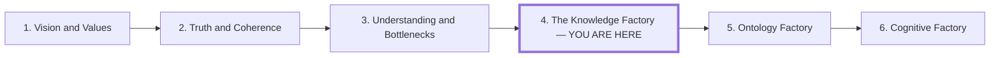

# The Knowledge Factory

## Role in the Series

**Working concept:** the AI factory. Keep the canonical title *The Knowledge
Factory* unless the series is intentionally renamed.

**Series job:** This fourth essay turns the first three essays' commitments into
an operating model. *Vision and Values* supplies accountable direction, *Truth
and Coherence* supplies standards for judging claims, and *Understanding and
Bottlenecks* distributes the capacity to judge. This article asks what system
those teams need around AI generation. *Ontology Factory* will develop that
system's semantic infrastructure; *Cognitive Factory* will develop its
sensemaking, cognitive reach, signals, and discoverable organizational memory.

**Central question:** What must an organization build around token generation to
turn abundant AI output into verified outcomes that improve the next project?

**Central answer:** It must build a knowledge factory: an organizational
learning system that supplies reusable context, distributes bounded solutioning,
evaluates candidate work against evidence and consequences, and feeds validated
learning back into the next project.

**Argument destination:** By the end, the reader should stop treating model
output or implementation speed as the product. The product is verified,
reusable capability: an outcome the organization can trust and learning that
changes how the next outcome is produced.

## Audience

Leaders and builders designing repeatable AI-assisted product and engineering
work rather than isolated prompts.

## Current Draft Brief

This outline governs the next private `article.md` and `humanized-draft.md`.
The humanized pass must retain its claims, sources, and ownership boundaries
while giving the prose a more direct voice. Canonical MDX remains the published
baseline until the user reviews these candidates.

Carry one hypothetical case through the essay: customers stop completing their
first data import after a release. Generation can propose a patch quickly;
the factory must establish the problem, route an investigation, coordinate
dependent work, verify the change, and observe the customer outcome.

Use the series' latest strategic premise: human insight and vision supply the
direction; the factory preserves that direction through execution and feedback.
Do not repeat the engagement or average-output quotations from article one.
Keep the organization visible: product and support contribute evidence,
autonomous domain teams own investigations, and integration owners resolve
shared effects. A central architect approving every task recreates the
bottleneck described in article three.

## Scope and Definitions

- **Knowledge factory:** the socio-technical system around model inference that
  turns intent and evidence into outcomes, then makes the result available to
  future work.
- **Candidate output:** generated text, code, analysis, or other artifacts before
  the relevant evaluator accepts them. It is inventory, not yet an outcome.
- **Verified outcome:** a result checked by evidence appropriate to its
  consequence. A test may verify a local code property; customer evidence or
  runtime observation may be required to verify that the work achieved its
  intended effect.
- **Factory engineer:** a participant who improves the reusable context,
  workflows, evaluation, boundaries, and feedback through which many work items
  pass. This is a way of working, not a new title or a synonym for platform
  engineer.
- **Useful yield:** the portion of candidate work that survives relevant
  evaluation and contributes to the intended outcome. Treat this as a proposed
  management lens, not a universal or already validated metric.

Keep token efficiency subordinate to this organizational argument. Tokens make
the generation mechanism and its waste visible; they do not measure value,
judgment, or consequences by themselves.

## Preface and Series Position

Open with the smallest possible series bridge:

> The previous essays established that people choose the direction, claims need
> standards of evidence, and understanding must move closer to the work. The
> next question is operational: what must surround AI generation so distributed
> teams can turn it into reliable outcomes and learn from the result?

Place the compact six-part series map after this bridge. It is navigation, not
evidence and not one of the article's explanatory figures.

Introduce three recurring visual questions in the preface: what survives
generation, how work branches and rejoins, and where consequences return.

## Argument Flow

### 1. A Token Exchange Is Not Yet a Factory

**Reader move:** From seeing AI as the productive system to seeing model
inference as one station inside a larger system.

Begin with a deliberately incomplete schematic:

> context tokens → model inference → output tokens

The schematic explains what crosses the model boundary, not whether useful work
occurred. One input can produce a hundred pages or a large patch while leaving
the original problem unsolved. Set the opening tension: generation can become
cheap and abundant while context preparation, judgment, integration, and
consequences remain organizational work.

**Evidence:** The token exchange is a simplified technical description, not a
full account of an AI system. DORA's 2025 report supports the narrower empirical
premise that AI amplifies the strengths of high-performing organizations and
the dysfunctions of struggling ones.

**Inference:** Therefore an organization should analyze the system around the
model, not infer productivity from output volume. Do not claim that every large
output increases workload or that implementation is literally free.

**Transition:** If tokens are only intermediate goods, the reader needs a better
definition of throughput.

**Visual:** None. The one-line token schematic does the necessary work; a model
diagram here would falsely make inference the center of the factory.

### 2. Output Volume Is Not Throughput

**Reader move:** From counting generated artifacts to tracing one work item all
the way to an accepted consequence.

Use the first-import case. Follow it through intent,
triage, context assembly, generation, review, integration, release, and observed
effect. At every handoff distinguish:

- the input from the output;
- the artifact produced from the outcome it is meant to create;
- triage, which clarifies and routes work, from validation, which accepts,
  returns, or escalates it; and
- declarative constraints from imperative instructions.

Introduce the costs hidden by raw output counts: preparing context, repeating
context, reviewing candidates, integrating survivors, discarding failures,
reworking errors, and waiting for a result that can be trusted.

**Evidence:** DORA supplies the systems-level warning. The input/output,
triage/validation, and declarative/imperative distinctions come from the
article's software-factory boundary note.

**Inference:** "More output can create more work than it saves" is a causal
hypothesis the example makes visible, not a measured universal. Phrase it as a
risk and show the mechanism rather than inventing a productivity number.

**Transition:** Once throughput ends at a verified outcome, the article can name
the dimensions that reveal whether the factory improved it.

**Visual:** Reserve the recurring factory icons for the main loop in section 4.
Repeating them here would decorate the example before their meanings are fixed.

### 3. Measure Useful Yield Without Inventing One Magic Ratio

**Reader move:** From one-dimensional token efficiency to a scorecard of visible
tradeoffs.

Present seven diagnostic questions:

1. **Input effort:** How much work made the task legible?
2. **Context reuse:** How much of that input already existed as maintained
   organizational context?
3. **Generation leverage:** How much relevant candidate work did the model
   produce?
4. **Useful yield:** What portion survived the relevant evaluation and
   contributed to the outcome?
5. **Verification and rework:** How much expert attention and correction did
   trust require?
6. **Time to verified outcome:** How long did the whole path take, including
   queues and integration?
7. **Retained learning:** What became easier, safer, or faster for the next
   project?

Do not collapse these into a fake-precise efficiency score. The scorecard is a
conversation and instrumentation frame: improving one dimension can worsen
another, and the appropriate evidence depends on the consequence of the work.

**Evidence:** NIST AI RMF 1.0 supports examining benefits, costs, context,
human oversight, measurement, and whether a system achieved its intended
purpose. It does not validate this seven-part scorecard.

**Inference:** The scorecard is this article's synthesis of the token-efficiency
note, the factory boundaries, and the series' concern with evidence and retained
learning. Label it as a proposed diagnostic until field evidence supports
thresholds or aggregation.

**Transition:** The scorecard diagnoses the gap; the knowledge-factory loop
explains what an organization builds to close it.

**Proposed illustrations — token economics:** Use the shared AI Factory motif
variant `token-economics`, reviewable at
`/ai-factory-motif#motif-04`. It uses three small graphs rather than one combined
production line: **R_TOKEN = N_OUTPUT / N_INPUT** for the token expansion ratio,
with output shown as a larger set of token icons; **T_INPUT** for
the elapsed time from a recognized need to model-ready input, and **V_OUTPUT**
for the contribution retained after evaluation. Keeping them separate makes the
argument that token volume, preparation time, and verified value are related but
not interchangeable. Pull the implementation
from `libs/blogs/components/ai-factory-motif/ai-factory-motif.tsx` when the
canonical article is revised; do not recreate it as article-local geometry.

### 4. The Factory Surrounds the Model

**Reader move:** From a list of costs to the article's constructive answer.

Introduce one loop and let it organize the rest of the essay:

> intent and evidence → reusable context → generation → evaluation → action →
> consequence → retained learning → revised context

Make the model one station inside this loop. Context carries prior distinctions,
constraints, examples, procedures, and stopping conditions into the work.
Evaluation decides what may proceed. Consequences test whether the accepted
artifact achieved the intended change. Retained learning updates the context,
evaluation, or procedure for the next cycle.

This is the point at which the central answer should appear nearly verbatim:
the knowledge factory is the organizational learning system around generation,
not the model subscription or the agent collection itself.

**Evidence:** Nonaka supports the claim that organizations articulate and
amplify knowledge developed by individuals through ongoing organizational
processes. NIST supports continuous lifecycle governance and feedback. These
sources support parts of the loop, not this exact architecture.

**Inference:** The loop is a proposed operating model that synthesizes those
ideas with the article's factory metaphor.

**Transition:** The loop has two immediate design problems: how to make context
reusable across teams and how to make evaluation strong enough to authorize
action.

**Visual continuation:** Return to the three quantities in the token-economics
illustration: expansion, preparation time, and retained contribution. Do not
describe that illustration as a production-line diagram. The return-loop
motif in section 9 will show how a result changes the next cycle.

### 5. Factory Engineers Make Context and Judgment Portable

**Reader move:** From an abstract loop to the organizational redesign required
to run it across many teams.

The factory should not rediscover its world in every prompt. Reusable context
includes stable vocabulary and domain boundaries, examples and counterexamples,
prior decisions and reasons, tools and permissions, operating procedures,
tests and rubrics, stopping conditions, and outcomes from previous work.

Introduce the factory engineer as the person who improves this reusable
machinery rather than merely completing one unit. Preserve the concrete work:
clarifying a domain distinction across schemas and interfaces, turning repeated
review judgment into an evaluation, exposing a hidden queue, encoding side
effect and escalation boundaries, instrumenting failures, and giving domain
experts safe ways to alter the system.

Then return to distributed solutioning. Teams can frame and test solutions
locally when they share intent, definitions, acceptance criteria, decision
rights, and an integration owner. Parallel generation without those conditions
can multiply review and coordination load.

**Evidence:** The preceding essay establishes the need to distribute complete
learning loops. The current DORA source supports the general systems premise;
it does not prove that every organization should adopt this division of work.

**Inference:** Factory engineer and distributed solutioning are proposed roles
and organizational patterns. Say they can make judgment portable under explicit
boundaries, not that they guarantee a disproportionate advantage.

**Transition:** Portable context expands who can generate and decide; portable
evaluation determines whether that distribution remains trustworthy.

**Visual:** Explain executable context through one concrete transformation:
a first-import requirement becomes a representative integration test. Hand
the deeper ontology illustration to article five; keep this article to three
explanatory motifs.

### 6. Evaluation Converts Candidate Inventory into Trusted Action

**Reader move:** From "evaluation" as generic review to choosing evidence
proportional to a result's consequences.

Generated output remains candidate inventory until an appropriate evaluator
connects it to evidence and an acceptance decision. Match evaluator to claim:

- deterministic tests check specified local properties;
- expert review examines meaning, tradeoffs, and exceptions;
- customer evidence tests whether the work changed the intended experience;
- runtime signals test operational behavior; and
- postmortems test the system's explanation after consequences arrive.

Make authority explicit. An evaluator can reject, return, accept, or escalate;
passing one evaluator does not establish every kind of correctness. Human
judgment remains fallible, so preserve uncertainty, contradictory evidence,
decision ownership, and disconfirming signals.

**Evidence:** NIST AI RMF's Map, Measure, and Manage functions support
context-sensitive assessment, human oversight, monitoring, and decisions about
whether an AI system achieved its intended purpose.

**Inference:** "Evaluation converts output into knowledge" is the article's
conceptual definition. In prose, prefer the more precise claim that evaluation
authorizes an action or retains a result for a stated purpose; it cannot turn a
false premise into truth.

**Transition:** An accepted artifact permits a next action. The factory still
needs a route from an incoming observation to that action and its consequences.

**Visual:** Use the evaluation-gate branch already present in the main loop. A
second evaluation diagram would repeat rather than advance the reasoning.

### 7. Triggers Open Investigations

**Reader move:** From a signal to a bounded work proposal.

Use the release/onboarding case moved from *Cognitive Factory*. Record the
source, window, baseline, uncertainty, affected domain, owner, evidence links,
and expiry in an event contract. Preserve regression, intended tradeoff, and
coincidental change as alternative explanations.

A trigger should open a hypothesis, not declare a diagnosis. Separate the
permission to investigate from the permission to release. Define event
identity, deduplication, cooldowns, and ownership so repeat observations do not
silently produce repeat interventions.

**Evidence:** Existing PostHog, Sentry, and CloudWatch primary documentation
supports individual capabilities. Their composition is a proposed design.
Choosing lead/lag measures and interpreting their meaning belongs in cognition.

**Visual:** Start the branching-work motif with the observation and competing
hypotheses. Continue the same figure into the DAG in section 8; use the shared
trigger motif as a visual reference rather than a fourth standalone figure.

### 8. Agent DAGs Make Delegation Inspectable

**Reader move:** From authorized work to inspectable dependencies and handoffs.

For each task, name inputs and retrieved context, outputs, tools, permissions,
checks, dependencies, side effects, owner, and stop/recovery conditions.

Context retrieval and reproduction may proceed independently before hypothesis
review, implementation, verification, and integration. Keep the per-attempt DAG
acyclic; bounded retries or later iterations belong to the enclosing workflow.
Retain state across interruptions and guard repeated side effects.

Keep local team authority intact. Integration ownership resolves shared effects
without putting every local decision through a central director.

**Visual:** Complete the branching-work motif: context lookup and reproduction
join at hypothesis review; a selected intervention proceeds to verification
and authorized integration. The diagram depicts one possible attempt; a
decision can also end the investigation without a code change. Explain the
executable-context card's examples in prose.

### 9. Engineer the Return Path

**Reader move:** From completed artifact to an evaluated consequence.

Specify expected effect, observation window, acceptable tradeoffs, outcome
owner, stopping conditions, and rollback before execution. Follow observation,
hypothesis, authorization, DAG, verification, release, consequence, and revision.

Bound retries, handle missing or delayed observations, and close inconclusive
work explicitly. Verification of the artifact and evaluation of its consequence
answer different questions.

**Visual:** Move the existing control-loop SVG here. Treat it as a proposed
composition; cognition now owns the capabilities and memory behind its inputs.

The return path should survive handoffs and delayed outcomes. Name an outcome
owner who is still responsible after the implementation task closes. An
inconclusive result stays inconclusive; it does not quietly become proof of
success or automatically schedule another patch.

### 10. The Factory Compounds Learning, Not Output

**Reader move:** From improving one delivery cycle to understanding the
article's strategic destination: verified, reusable capability.

Return to the final scorecard question. A completed project should be able to
revise a definition, example, procedure, test, escalation rule, or decision
record. Retaining only the artifact leaves the next team to reconstruct the
reasoning and repeat the same verification work.

Implementation speed alone is increasingly easy to imitate. The harder-to-copy
candidate advantage is the connected learning system: proprietary evidence,
domain understanding, evaluation, customer relationships, trusted
distribution, and feedback that improve together through use. End on the
distinction the opening created:

> The factory's product is not output. It is verified capability.

**Evidence:** Nonaka supports organizational articulation and amplification of
individual knowledge. March supports treating exploration and exploitation as
an organizational learning tension. The canonical source map also identifies
Walsh and Ungson for acquisition, retention, retrieval, use, and possible
misuse of organizational memory; extract the relevant passage before making a
strong canonical claim from it.

**Inference:** Defensibility as the residue of organizational learning is the
article's strategic argument, not a demonstrated law. Phrase it as a potential
moat and name the conditions that would make it real: customer value, retention,
reuse, and continued improvement.

**Transition to the series:** *Ontology Factory* explains how shared context
becomes precise enough to reuse. *Cognitive Factory* explains how the organization interprets signals, relates
history to current state, and retrieves relevant memory without loading the
entire archive. This article owns the execution machinery and useful yield.

**Visual:** Close by returning to **V_OUTPUT** in the token-economics figure and
explain that a verified result becomes economically compounding only when its
learning revises the next cycle's context. Do not add a graph of compounding
assets; the return to the opening variables is the argument.

## Editorial Guardrails

- Preserve the factory metaphor for systems, queues, capital, evaluation, and
  feedback; do not reduce people to interchangeable inputs.
- Keep human direction from *Vision and Values*, evidence standards from *Truth
  and Coherence*, and distributed understanding from *Understanding and
  Bottlenecks* as premises rather than reopening those arguments.
- Keep ontology mechanics—bounded contexts, entity relationships, provenance,
  and semantic conflict resolution—in *Ontology Factory*.
- Own event contracts, triggers, bounded authorization, agent DAGs, and loop
  engineering here. Keep cognitive light-cone assessment, 4DX signal selection,
  Second Brain records, and selective discovery conventions in *Cognitive Factory*.
- Do not equate generated output with accepted work, accepted work with customer
  impact, or customer impact with truth or moral value.
- Do not claim a quantified productivity gain, universal organizational model,
  or durable moat without evidence beyond the current source set.

## Three Motifs for the Drafts

| Motif | Placement and return | What it teaches |
| --- | --- | --- |
| Candidate work and useful yield | Sections 2–3; revisit at the close | Tokens, input effort, and retained contribution measure different things. Use the existing token-economics figure as the reference. |
| A trigger branches into inspectable work | Sections 7–8 | An observation opens alternatives; independent work rejoins at an explicit decision. Keep the attempt acyclic. |
| Consequences return to the next attempt | Section 9; revisit at the close | Verification precedes release; later outcomes revise context, checks, or practice. Reuse the moved control-loop figure as the reference. |

Private drafts use brief editorial figure cues and captions. These cues are
not new production assets or evidence that the depicted workflow is deployed.

## Research Obligations

- Source the token-in/token-out description if the canonical prose makes it a
  technical claim; otherwise label it as a deliberately simplified boundary
  schematic.
- Keep every scorecard dimension separate until actual use supplies comparable
  definitions, baselines, and thresholds.
- Use DORA only for its reported amplifier finding, not as proof of this
  proposed factory architecture or of a specific productivity effect.
- Use NIST AI RMF for lifecycle governance, context, measurement, human
  oversight, feedback, and purpose checks; do not present its voluntary risk
  framework as a throughput methodology.
- Extract exact passages from Walsh and Ungson before relying on organizational
  memory acquisition or retention in canonical prose.
- Treat the moat claim as strategic inference unless evidence connects retained
  learning to durable competitive outcomes in the relevant setting.

## Handoff

The writer can now follow one causal path: generation is not an outcome; useful
yield reveals the missing work; the knowledge-factory loop supplies that work;
factory engineers make its context and judgment portable; proportional
evaluation authorizes action; and retained learning turns one verified outcome
into greater capacity for the next.

## Sources and Locators

- Sentry, [Seer](https://docs.sentry.io/product/ai-in-sentry/seer/); PostHog,
  [Insights](https://posthog.com/docs/product-analytics/insights/); AWS,
  [alarm actions](https://docs.aws.amazon.com/AmazonCloudWatch/latest/monitoring/alarm-actions.html).
  Source the individual sensing mechanisms; the assembled workflow is a proposal.

- DORA, Google, [*2025 State of AI-assisted Software Development
  Report*](https://research.google/pubs/dora-2025-state-of-ai-assisted-software-development-report/),
  abstract: survey responses from nearly 5,000 technology professionals and the
  finding that AI acts as an amplifier of organizational strengths and
  dysfunctions.
- Ikujiro Nonaka, ["A Dynamic Theory of Organizational Knowledge
  Creation"](https://doi.org/10.1287/orsc.5.1.14) (1994), abstract and pp.
  14–37: individuals develop knowledge while organizations articulate and
  amplify it through interaction between tacit and explicit knowledge.
- James G. March, ["Exploration and Exploitation in Organizational
  Learning"](https://doi.org/10.1287/orsc.2.1.71) (1991), abstract and pp.
  71–87: organizational learning must allocate attention between exploring new
  possibilities and exploiting established capabilities.
- National Institute of Standards and Technology, [*AI Risk Management
  Framework 1.0*](https://doi.org/10.6028/NIST.AI.100-1) (2023), Core overview;
  Map 3, Map 5, Measure, and Manage 1: continuous lifecycle risk management,
  context, benefits and costs, human oversight, impact assessment, and whether
  a system achieved its stated purpose.
- Existing article source map:
  [`article.mdx`](../article.mdx), **Sources**, for the DORA, Nonaka, March,
  Weick, Walsh and Ungson, Porter, ISO, and NIST references already attached to
  the canonical article.
- Article-local editorial material:
  [`token-efficiency-and-moats.md`](../notes/token-efficiency-and-moats.md),
  [`software-factory-boundaries.md`](../notes/software-factory-boundaries.md),
  and [`writing-guidelines-review.md`](../notes/writing-guidelines-review.md),
  especially **Overall Diagnosis**, **What Already Works**, and the recommendation
  to replace the multi-part preamble with one problem-led introduction.
