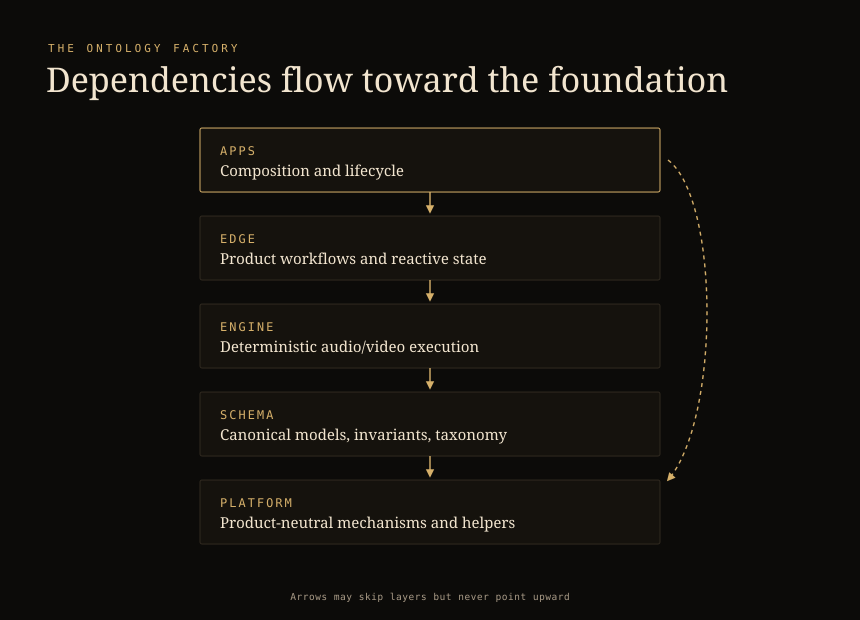
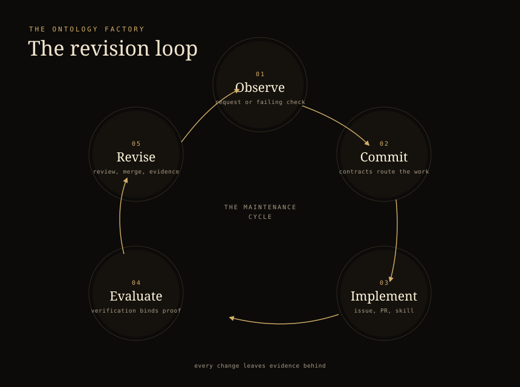

# Ontology Factory

## A Map of the Factory Itself

The knowledge factory needs explicit, maintained maps of the domains in which
people and AI act. *The Knowledge Factory* introduced the operating system:
an organization that turns evidence and intent into reusable capability.
This essay is the first implementation-oriented deep dive into that system's
semantic infrastructure, and it makes the subject concrete. The factory whose
map we inspect is a real one — the SoundSculpt repository — and its ontology
is not stored in a diagram somewhere. It is the structure of the repository
itself.

Maps are easy to imagine for products. A model can produce plausible
definitions for `customer`, `conversation`, `song`, or `risk` on demand; the
hard question has always been which definition controls a particular decision,
and who decides. The factory's most consequential map, however, may be the one
it keeps of itself. If ownership is invisible, every change becomes a
negotiation about belonging. If dependency direction is unstated, the
structure decays into whatever the last urgent change made it. The factory
cannot manufacture understanding for its products if no one can understand the
factory.

SoundSculpt's core idea is compact: **ownership should be visible from the
path, and dependencies should flow toward more foundational layers.** That
single sentence turns the repository into a commitment about which distinctions
the system recognizes, how they relate, and who remains accountable for
revising the map. This essay reads the idea as an
[ontology](https://tomgruber.org/writing/ontology-definition-2007.htm) and
shows what a factory gains when it enforces one.

## Ownership in the Path

The first sentence of the SoundSculpt ontology is the repository root. Five
top-level areas divide the factory, and each one carries a one-line answer to
the question *what does this own?*:

| Area | Owns |
|---|---|
| `apps/` | Executable products, runtime composition, routes, workers, and product-specific CLIs |
| `libs/` | Reusable capabilities with focused public APIs |
| `tools/` | Repository-wide developer and operator workflows |
| `infrastructure/` | Shared deployment/build infrastructure |
| `supabase/` | Database migrations, generated types, local lifecycle, and database tests |

The list is stable enough to read as a policy. Nothing about these boundaries
follows from technology; they are decisions, which is exactly what makes them
ontology.

Applications are the factory's edges. An app may be an app family, an
executable facet, a worker, a CLI, or even a source-free Nx coordinator — the
category is defined by what it does, not by its shape. Apps own composition and
lifecycle: the wiring, the routes, the runtime, the product-specific entry
points. The rule that follows is the load-bearing one: **reusable behavior
should move into libraries.** Composition is what an app does; capability is
what it borrows. When a behavior is needed twice, its natural home is the
map's interior, not a second copy at the edge. The path
`apps/soundsculpt/...` is therefore not an address; it is a claim.

That is what "ownership visible from the path" means: responsibility can be
read directly off the filesystem, by a new engineer, by a code review, or by
an agent asked to change the system — without asking who knows the answer. The
structure itself teaches the factory how to change it.

## Layers Are Bounded Contexts

Libraries follow a path that carries three pieces of meaning:

```text
libs/<layer>/<capability>/<library>
@ss/<layer>/<capability>/<library>
```

The layer is the
[bounded context](https://martinfowler.com/bliki/BoundedContext.html), the
capability is the subject, and the leaf names the responsibility. For example:

```text
libs/edge/audio/state-zustand-player
@ss/edge/audio/state-zustand-player
```

reads as: a library owned by the edge layer, about audio, holding reactive
player state on Zustand.

The four layers are the factory's semantic strata:

| Layer | Responsibility |
|---|---|
| `platform` | Product-neutral mechanisms, integrations, generic UI, query, storage, and runtime helpers |
| `schema` | Canonical product models, invariants, taxonomy, normalization, and pure transforms |
| `engine` | Deterministic audio/video execution, analysis, playback, rendering, and encoding |
| `edge` | Product workflows, provider-backed data, reactive state, billing, features, and product UI |



Assigning a concept to a layer is not a matter of taste; it is a semantic
commitment. State belongs to Edge. Canonical entities belong to Schema.
Deterministic execution belongs to Engine. Product-neutral mechanisms belong
to Platform. The assignment decides which other concepts may depend on the
concept and, just as importantly, which may not.

Dependency direction is the second sentence of the map:

| Depends on → | `edge` | `engine` | `schema` | `platform` |
|---|---|---|---|---|
| `apps` | ✓ | ✓ | ✓ | ✓ |
| `edge` | | ✓ | ✓ | ✓ |
| `engine` | | | ✓ | ✓ |
| `schema` | | | | ✓ |
| `platform` | | | | |

<!-- ontology-layer-graph -->

Dependencies may skip layers, but must never point upward. A product workflow
at the edge may reach past its neighbors straight to a foundation, and an app
may depend on anything it needs. The interior, however, never reaches up into
product logic. An upward dependency is a semantic leak: it drags product
decisions into the middle of the map, where they quietly become everyone's
problem and every future change's constraint.

Skip-but-never-ascend is what keeps the map stable under growth. New workflows
can appear at the edge and lean on whatever foundation they need; the interior
never learns about them. The direction of arrows is
[enforced, not merely documented](https://nx.dev/docs/kb/project-dependency-rules)
— and because it is enforced, the factory can grow without asking permission of
its own past. The same instinct — boundaries drawn from the domain rather than
the technology — is what large platforms like
[Uber's domain-oriented microservices](https://www.uber.com/us/en/blog/microservice-architecture/)
describe at service scale.

## A Vocabulary for Identifiers

A map is useless if its terms are arbitrary. Leaf names in SoundSculpt follow
a small grammar in which the suffix describes the role:

```text
model[-aspect]        canonical entity, optionally an aspect of one
feature-workflow      product workflow
ui[-scope]            interface, optionally scoped
data-query-resource   data access by query resource
data-access-provider  data access by provider
state-technology-subject  reactive state on a technology
util-purpose          purpose-bound helper
host-function         runtime host
source-artifact       build input
```

Every source-owning library also carries Nx identity along axes that make the
map machine-readable:

```text
kind:lib
layer:<platform|schema|engine|edge>
capability:<subject>
type:<role>
runtime:<web|isomorphic|backend|server|worker|cli|build|uxp>
```

The same terms a human reads from a path can be queried, filtered, and
enforced by tooling. The vocabulary is not decoration; it is the interface
between the map and the machinery that checks it. A name is the ontology's
term for a thing, and the thing is only real in the system when its term is
stable enough to be validated against.

## Description and Operation

Entities and arrows say what exists; they do not say what a scope means or how
to work inside it. SoundSculpt splits that explanation into two contracts with
complementary jobs, colocated with every scope — the same
[interface-versus-implementation discipline](https://web.stanford.edu/~ouster/cgi-bin/aposd2ndEdExtract.pdf)
Ousterhout argues for in *A Philosophy of Software Design*: what a component
promises is a contract, and how it keeps that promise stays behind the
interface.

A README describes what a scope *is*: its purpose, its boundaries, its
vocabulary, and its stable relationships. The shape is enforced by executable
rules: exactly one H1; exactly the required H2s — `Purpose`, `Boundaries`,
`Ontology` — in order, with no additional H2s; every required section nonempty;
at least one local term defined in the ontology; optional H3s limited to
`Relationships` then `Behavioral Semantics`; local links and anchors that must
resolve; and shared concepts linked to their owner rather than copied.

A colocated AGENTS file describes how work is *performed* in that location. It
is operational, where the README is descriptive. Its sections — `Structure`,
`Setup`, `Configuration`, `Workflows`, `Verification`, `Invariants`,
`Technical Assets`, `Skills`, `Downlinks` — are optional per-section but
strictly ordered, and every nonexempt AGENTS file requires its colocated
README. Technical assets are recorded in a fixed five-column table whose
status is `current` or `historical` and whose authority is `authoritative`,
`reference`, or `illustrative`.

Two properties make these contracts part of the ontology rather than adjacent
documentation. First, the schemas are enforced — exactly one H1, the required
H2s in order, at least one local term, links that resolve — so the map cannot
drift silently. A violation is caught like a lint error, not discovered months
later by a confused reader. Second, the split forces a discipline that
documentation usually lacks: every scope must answer both *what does this own?*
and *how do I safely work here?*, and neither answer may hide inside the
other's file. Description and operation are kept apart so that each stays
honest.

## Skills Supply Procedure

Where README and AGENTS say *what* and *how*, skills supply *procedure*.
Canonical skills live at `.agents/skills/<name>/SKILL.md`, with frontmatter
whose `name` is executable-policy enforced, whose `description` is the
discovery and activation contract, and whose `trigger` and `argument-hint` are
optional conventions. Skill names are globally unique; `.agents/skills/**` is
the sole canonical source, and any compatibility entry elsewhere must be a
symlink resolving back to it.

Skills are the factory's reusable capital in miniature: a specialized
procedure, attached to a location through the AGENTS `Skills` section,
discoverable by description, and applied exactly when needed. The ontology says
where things are and how they relate; the skill says what to do once you get
there.

## The System in Motion

An ontology that never changes is a museum. The interesting question is how
the map is revised, and SoundSculpt's answer is that revision flows through
the same governed path as everything else:

> Request → root contracts → owner contracts → applicable skill →
> implementation → issue → draft pull request → verification → review → merge
> → evidence.

In practice the loop is:

1. The root contracts provide global vocabulary and routing.
2. The nearest README answers "what does this area own?"
3. The nearest AGENTS answers "how do I safely work here?"
4. Applicable skills supply specialized procedures.
5. GitHub issues own plans, dependencies, and acceptance criteria.
6. Draft pull requests show implementation status.
7. `docs:check` validates documentation structure and links.
8. `pull-request:verify` produces proof tied to the exact head, merge base,
   changed-file hash, and checks.
9. Meaningful completed work receives an intelligence evidence card.

The loop is a maintenance cycle made concrete: an observation (a request, or a
check that fails), an ontology commitment (the contracts that route the work),
implementation, evaluation (verification that binds proof to the exact change),
and revision (review, merge, and an evidence card that lets the learning
accumulate). The map is not a document updated by committee; it is a system
that governs how the factory changes, and every change leaves evidence behind.



## A Commitment, Not a Mirror

The factory's ontology is not a description of what its repository happens to
look like. It is a commitment about which distinctions the system will
recognize, how those distinctions relate, and what evidence is sufficient to
make claims about them — the same
[model-as-commitment discipline](https://www.domainlanguage.com/ddd/) Eric
Evans describes in *Domain-Driven Design*, where the model is a deliberate
choice about what matters, not a mirror of everything that exists. The
SoundSculpt core idea — ownership visible from the
path, dependencies flowing toward more foundational layers — is such a
commitment. The repository root is the first sentence of the map; the layer
rules are the second; naming and identity are its vocabulary; README, AGENTS,
and skills are its definitions and procedures; and the workflow is its
maintenance loop.

None of this replaces human judgment. It is how human judgment becomes
shareable, testable, and available in context — for the next engineer, for the
next review, and for the next model asked to change the system. A contract
system can make the factory speak clearly. The ontology gives it a world clear
enough to speak about.
