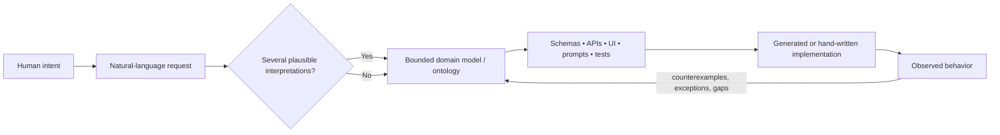

# Research Audit: “The Ontology Factory”

> **Coordination note:** This audit was produced for the earlier “Software
> Engineering Becomes Ontology Design” outline. Its ontology, bounded-context,
> ambiguity, Mango, SoundSculpt, and AI-productivity analysis remains relevant.
> The refocused article also requires primary research on in-context learning
> and an explicit audit of the controlled-language-versus-domain-ontology
> distinction before publication.

## Executive summary

The supplied outline argues that as AI reduces the effort required to produce implementation, more engineering leverage moves upstream into defining domain entities, relationships, distinctions, constraints, and meanings. It then grounds that thesis in two contrasting cases: Mango, where technical telephony states must not be confused with human communication outcomes, and Sound Sculpt, where composition, performance, production, rights, timbre, and perceived mood need to remain distinct. fileciteturn0file0

**Overall judgment: the argument is strong as an exploratory thesis, but several formulations should be narrowed before publication.** The best-supported version is not “software engineering becomes ontology design,” but **“AI increases the relative value of explicit domain modeling and semantic precision when implementation becomes easier to generate.”** Current evidence does show rapidly increasing AI software capabilities and widespread adoption, but measured productivity effects remain highly task-, developer-, and workflow-dependent. An early-2025 randomized METR study found experienced open-source developers took about 19% longer with then-current AI tools; METR's 2026 follow-up suggests the effect may have improved substantially but explicitly says selection effects prevent a reliable contemporary estimate. DORA's 2025 research similarly characterizes AI as an amplifier of the surrounding organizational system rather than an automatic productivity multiplier. citeturn18view0turn18view1turn18view2

The deepest intellectual support for the thesis predates generative AI. Dijkstra's hierarchical system design, Parnas's information hiding, and Brooks's distinction between accidental and essential complexity all point toward the same first principle: abstraction can remove or hide implementation mechanics, but it cannot eliminate the problem of deciding what the system is supposed to represent and do. Brooks is especially useful: AI code generation can plausibly be framed as another attack on *accidental* implementation difficulty, without implying that it removes the *essential* complexity of modeling a domain. citeturn4search10turn4search7turn4search15

The ontology argument has unusually good theoretical grounding. Gruber's canonical computational-ontology paper defines an ontology in terms of a shared representational vocabulary containing classes, relations, functions, and other objects, specifically to enable knowledge sharing and reuse among systems. Eric Evans's Domain-Driven Design gives the software-engineering analogue: a model selects aspects of a domain, a Ubiquitous Language binds terminology to that model, and a Bounded Context determines where those meanings apply. citeturn17view1turn10view0turn11view0turn11view1

The most important correction follows directly from Evans and Wittgenstein: **semantic consistency should be local to a bounded context, not global.** Requiring “the same word to have the same meaning everywhere” is often undesirable because real organizations legitimately operate several models. Wittgenstein's language-games similarly emphasize that meanings depend on practices and contexts of use. citeturn15search5turn10view0

The aviation-controlled-language opening is defensible if kept modest. ASD-STE100 Simplified Technical English is a real controlled natural language and current international technical-documentation standard; the current Issue 9 is dated January 15, 2025. Its history and controlled vocabulary support the conceptual point that restricting lexical choices can reduce ambiguity. However, the blog should **not infer a quantified accident-reduction or safety benefit without separate empirical evidence**; the standard's own organization supplies rationale and design rules, not a causal trial showing how many incidents it prevents. citeturn17view0turn0search2

Mango is the strongest concrete case. SIP itself separates a “call,” a dialog, and a session; importantly, RFC 3261 says that a successful 2xx response to INVITE establishes a session/dialog, not that a human conversation occurred. Twilio likewise warns that its technically “completed” call status can result from a person, an IVR, or voicemail. citeturn19view1turn19view2turn20view0 The outline should nevertheless label **Call leg**, **Protocol answer**, **Human answer**, **Bridge**, and **Conversation** as Mango domain concepts rather than pretending they are standardized SIP vocabulary. RFC 3261 specifically says *call leg* is the old name for a SIP dialog and is no longer used by that specification. citeturn19view0

Sound Sculpt is also conceptually sound, but its strongest and weakest elements should be separated. The distinction between composition and a particular recorded performance has strong institutional grounding: the U.S. Copyright Office treats musical works and sound recordings as distinct works, and identifies performance/production authorship separately from composition. citeturn21view0 Timbre is demonstrably multidimensional: classic perceptual work by John Grey and later research found important spectral and temporal dimensions, including spectral-energy distribution and attack/transient characteristics. citeturn22view0turn6search17 But Sound Sculpt's exact **Brightness / Depth / Texture / Density / Attack / Spatial Character** scorecard is a product ontology, not a scientifically canonical six-dimensional model. “Brightness” and “attack” have especially strong psychophysical precedents; the whole six-item scorecard would require reliability and validity testing before being presented as measurement rather than structured critique. citeturn22view0turn6search18turn7search11

Finally, the mood section is directionally well supported. Music-emotion research distinguishes perceived emotional expression from emotion actually induced in the listener and finds that responses depend jointly on musical, personal, and situational factors. Yet the counterpoint matters: listeners also exhibit systematic agreement about some expressed emotions, and musical structure can predict some affective judgments. The safest claim is therefore **“perceived mood is relational and context-sensitive, while still showing systematic regularities”**, not “mood is purely subjective” or entirely unconstrained by the rendering. citeturn22view2turn7search5turn6search7

### Bottom-line confidence

| Area | Assessment |
|---|---|
| Explicit models and stable semantics improve coordination | **High** |
| Ontology is richer than a glossary or storage schema | **High** |
| Ambiguity remains a risk for AI-generated code | **Medium–High** |
| AI is making implementation universally faster/cheaper | **Medium at most** |
| Engineering attention will increasingly shift upstream | **Medium**; credible thesis, not established law |
| Mango's protocol-versus-human distinction | **High** |
| Mango's exact product ontology | **Medium**, pending product/domain validation |
| Sound Sculpt composition/rendering separation | **High** |
| Exact six-axis timbre scorecard | **Medium–Low as scientific taxonomy; High as a product rubric** |
| Perceived mood depends on rendering, listener, and context | **High** |
| Ontology design becomes *the* next abstraction layer | **Medium–Low if literal; much stronger if framed as one increasingly important layer** |

## Claim map and evidence table

| Extracted claim | Supporting evidence | Counterevidence / limitation | Confidence | Recommended inline citation |
|---|---|---|---|---|
| **AI shifts engineering leverage from implementation toward intent/domain modeling.** | AI coding capability and adoption are rising; DORA says AI amplifies the surrounding system. citeturn18view0turn18view2 | Productivity is heterogeneous. METR's early-2025 RCT found a slowdown among experienced OSS developers; its later experiment became difficult to interpret because of selection effects. citeturn18view0turn18view1 | **Medium** | `(Brooks, 1987; DORA, 2025; METR, 2025/2026)` |
| **Abstraction hides lower mechanics, shifting concern toward higher-level contracts and concepts.** | Dijkstra's layered design, Parnas's information hiding, Brooks's essential/accidental complexity. citeturn4search10turn4search7turn4search15 | Abstractions leak; lower-level expertise remains necessary. The proposition that “accuracy above becomes more important” is a reasoned inference rather than an established universal law. | **High** for abstraction; **Medium** for the stronger consequence | `(Dijkstra, 1968; Parnas, 1972; Brooks, 1987)` |
| **Controlled language can reduce semantic branching in operational communication.** | ASD-STE100 deliberately constrains technical English and standardizes terminology for technical documentation. citeturn17view0turn0search2 | Controlled language loses some expressive richness; requirements research shows ambiguity cannot simply be engineered away. citeturn5search2 | **High** for ambiguity reduction; **Medium** for downstream safety effects | `(ASD STEMG, 2025; Berry et al./ambiguity review)` |
| **Natural-language fluency is not semantic precision; AI can act on an ambiguous specification without knowing intended meaning.** | Requirements research identifies ambiguity as persistent; domain knowledge improves ambiguity interpretation. Recent LLM benchmarks report code-generation degradation under underspecified requirements. citeturn5search2turn5search4turn2academia25turn5academia44 | Much direct LLM-ambiguity evidence is benchmark-based and several recent studies are preprints, not yet strong field evidence. Larger models and interactive clarification mitigate some failures. citeturn2academia27 | **Medium–High** | `(requirements-ambiguity review; ClarifyGPT, 2023; Orchid, 2026)` |
| **A bounded domain language is valuable when meanings are stable.** | Evans's Ubiquitous Language ties terminology to a model inside a Bounded Context. DSL research supports exploiting domain-specific representations. citeturn10view0turn11view1turn1search18 | “DSL” normally means a domain-specific programming/specification language, not merely a vocabulary. Meanings need not be globally stable across contexts. citeturn10view0 | **High**, after terminology correction | `(Evans, 2004; van Deursen, Klint & Visser, 2000)` |
| **An ontology is more than a glossary, taxonomy, or database schema.** | Gruber characterizes computational ontologies through classes, relations, functions, objects, and shared representations; later ontology literature retains the relational/modeling emphasis. citeturn17view1turn1search6turn1search15 | In knowledge representation, *ontology* often implies more explicit/formal semantics than the outline currently demands. Some of what the post calls ontology is conventionally called a *domain model*. | **High** | `(Gruber, 1993; Guarino, Oberle & Staab, 2009)` |
| **Implementation artifacts can embody a deeper domain model.** | Gruber's work explicitly sought portability across representations; Evans's Model-Driven Design links model and code. citeturn17view1turn11view2 | Real schemas/APIs contain performance, legacy, regulatory, and platform compromises, so implementation is not a transparent transcription of ontology. Bowker and Star also show classifications are socially consequential rather than neutral mirrors. citeturn8search2 | **High with caveat** | `(Gruber, 1993; Evans, 2004; Bowker & Star, 1999)` |
| **Protocol-level success does not establish a human conversation.** | SIP 2xx establishes a session/dialog; provider call completion can mean person, IVR, or voicemail. citeturn19view2turn20view0 | Human/machine classification systems can add evidence, but they include an `unknown` state and involve detection tradeoffs. citeturn20view1turn20view2 | **High** | `(RFC 3261; Twilio Voice documentation)` |
| **Multiple call legs/sessions/participants require a richer communications model than one generic “call” record.** | SIP supports multiple dialogs inside one call; conferencing specifications distinguish participant relationships and technical dialogs. citeturn19view2turn12search0 | Mango's exact entities and cardinalities are product choices; SIP's contemporary term is *dialog*, not *call leg*. citeturn19view0 | **High** for distinction; **Medium** for Mango schema | `(RFC 3261; RFC 4579)` |
| **Composition, rendered recording/performance, and rights are analytically distinct.** | U.S. Copyright Office explicitly distinguishes musical works from sound recordings and separately recognizes composition, performance, and production authorship. citeturn21view0 | Copyright categories are legal constructs, not a comprehensive musicological ontology; Sound Sculpt's four groups should not be claimed as universal. | **High** | `(U.S. Copyright Office, GRAM FAQ/Circular 56A)` |
| **Timbre should be evaluated at the rendered-sound level and is multidimensional.** | Grey found multidimensional perceptual organization associated with spectral and transient properties; later work finds spectral-centroid, rise-time, and temporal/spectral correlates. citeturn22view0turn6search17 | Composition can prescribe instrumentation/orchestration and therefore constrain expected timbre. “Timbre belongs to rendering” is best presented as a modeling decision rather than universal metaphysics. | **High** for multidimensional timbre; **Medium** for placement rule | `(Grey, 1977; McAdams et al., 1995)` |
| **The six-axis timbre scorecard creates a useful shared language.** | Timbre research supports multidimensional descriptors, and semantic work shows descriptors such as brightness and texture are meaningful to listeners. citeturn6search18turn7search11 | The proposed six axes are not a consensus scientific timbre model. Listener expertise, vocabulary, source type, and context can alter ratings. | **Medium** | Cite research only for the *principle*; label the six axes explicitly `Sound Sculpt scorecard`. |
| **Perceived mood is relational/context-sensitive rather than a simple intrinsic property of a composition.** | Gabrielsson distinguishes perceived from induced emotion and emphasizes musical, personal, and situational interaction; other experimental work shows effects of listener/context. citeturn22view2turn7search12turn7search6 | Listeners do show agreement on some expressed emotions, and controlled manipulations can generate systematic affective differences. citeturn7search5turn6search7 | **High**, with qualification | `(Gabrielsson, 2001; Juslin & Västfjäll, 2008)` |
| **Human judgment moves toward boundaries, exceptions, evidence thresholds, and model revision.** | DDD explicitly treats models/language as evolving artifacts; DORA's “amplifier” framing is consistent with upstream organizational quality becoming consequential. citeturn10view0turn18view2 | There is not yet a mature body of longitudinal evidence establishing “ontology designer” as the dominant future engineering role. | **Medium** | `(Evans, 2004; DORA, 2025)` |
| **Semantic drift may become an important AI-era failure mode.** | The argument follows from inconsistent bounded meanings plus rapid generation across artifacts; requirements research demonstrates context-dependent ambiguity. citeturn5search4turn10view0 | Direct empirical measurement of “AI-induced semantic drift” across production codebases is sparse; this is currently a hypothesis more than a consensus finding. | **Medium** | Present explicitly as a risk hypothesis, not an established measured trend. |

## Semantic foundations: ambiguity, language, and ontology

**Claim: ambiguity becomes operationally consequential when different interpretations imply different actions.** This is sound. Requirements engineering has treated lexical, syntactic, semantic, pragmatic, and domain-dependent ambiguity as longstanding problems, while also recognizing that natural language cannot simply be replaced without tradeoffs. A mapping review of requirements-ambiguity research found many proposed detection and prevention methods but comparatively limited empirical evaluation, which argues for a measured formulation: ambiguity is a risk to manage, not a defect that a controlled vocabulary can abolish. citeturn5search2

ASD-STE100 is an excellent opening example precisely because its scope is narrow. The current official standard calls Simplified Technical English a controlled natural language for technical documentation. Its history begins with aerospace efforts in the late 1970s; the first AECMA Simplified English Guide appeared in 1986, it became an international specification in 2005, and ASD's organization describes it as an international standard from 2025. citeturn17view0 Its rules and controlled dictionary concretely demonstrate the mechanism the blog needs: reduce optional linguistic variation when consistent operational interpretation matters. citeturn0search2turn0search1

What it **does not** establish by itself is a causal theorem of the form:

> constrained vocabulary → fewer accidents.

The standard's rationale is relevant evidence about engineering practice, but causal safety claims would require incident, experimental, or comparative evidence. Keep the hook at the semantic level.

**Recommended wording**

> In operational documentation, teams sometimes deliberately restrict language so that familiar words cannot branch into several operational meanings. ASD-STE100 Simplified Technical English is one example: it constrains vocabulary and usage for technical documentation. The point is not that controlled language eliminates misunderstanding, but that reducing avoidable ambiguity can make shared instructions easier to interpret consistently. `(ASD STEMG, 2025)` citeturn17view0turn0search2

### From language to models

The outline's sequence—

> vocabulary → semantic discipline → ontology

—is conceptually useful, but the definitions need one adjustment.

A conventional **domain-specific language** in programming-language literature is a language tailored to a class of problems or a domain, often with specialized notation or executable/specification semantics. The outline instead uses DSL to mean the specialized vocabulary used by collaborators. That broader usage can be understood, but technically sophisticated readers may object. citeturn1search18

Eric Evans supplies better terminology: **Ubiquitous Language**. In Domain-Driven Design, the language is structured around a model and used consistently by developers and domain experts within a Bounded Context. Critically, Evans does *not* require one global vocabulary across an enterprise: different bounded models can use different meanings. citeturn10view0turn11view0turn11view1

Therefore revise:

> “A domain-specific language gives collaborators and machines a bounded vocabulary…”

to:

> **“A shared domain language gives collaborators and machines a bounded vocabulary. In software-language research, ‘domain-specific language’ often has the narrower meaning of a specialized programming or specification language; here the relevant idea is closer to Evans's Ubiquitous Language.”**

The sentence about semantic accuracy also needs scoping. Instead of:

> same term for the same meaning and different terms for materially different meanings

use:

> **Within a bounded context, use a term consistently for one modeled meaning, and name distinctions explicitly when collapsing them would change behavior.**

That formulation is stronger philosophically as well as technically. Wittgenstein's *Philosophical Investigations* emphasizes that linguistic meaning is embedded in use and practice rather than being guaranteed by a context-free word-object mapping. His idea of language-games is therefore a useful counterweight to a rigid “one word, one universal meaning” doctrine. citeturn15search5turn15search0

### What “ontology” adds

Here the outline is on solid ground. Tom Gruber's 1993 paper defines a computational ontology around a representational vocabulary for a shared domain, including classes, relations, functions, and other objects, designed so formalized knowledge can be shared and reused. That plainly exceeds a list of labels. citeturn17view1 Later ontology scholarship similarly distinguishes philosophical questions about what exists from engineering artifacts that explicitly specify the concepts and relations recognized by a computational community. citeturn1search6turn1search15

The first-principles lineage is unusually rich:

**Aristotle, *Categories* and *Metaphysics*.** Aristotle's classificatory project distinguishes kinds of being and relations of dependence; his *Categories* gives primary substances a foundational role. It is an ancient ancestor of asking “what kinds of things does our account recognize?”, although modern computational ontologies should not be conflated with Aristotelian metaphysics. citeturn16search6turn16search12

**W. V. O. Quine, “On What There Is” (1948).** Quine made explicit the idea of **ontological commitment**: a theory commits itself to the entities required by its quantified claims. For software, the useful analogy is that a model commits the system to recognizing certain kinds of object and relationship. citeturn16search0turn16search10

**Rudolf Carnap, “Empiricism, Semantics, and Ontology” (1950).** Carnap is particularly relevant to the blog because he emphasizes framework-relative questions: what “exists” inside a linguistic framework depends partly on the framework adopted for the purpose at hand. That fits domain modeling better than the suggestion that a product ontology discovers the one objectively correct partition of reality. citeturn16search2turn16search3

**Ludwig Wittgenstein, *Philosophical Investigations* (1953).** Meaning depends on use within activities and “forms of life,” warning against treating definitions as detached from practice. citeturn15search5

**Thomas Gruber, “A Translation Approach to Portable Ontology Specifications” (1993).** This supplies the direct computational lineage: explicit representational vocabulary makes knowledge portable and shareable across implementations. citeturn17view1

**Eric Evans, *Domain-Driven Design* (2004).** Evans brings nearly the same principle into ordinary software engineering: models select relevant aspects of a domain; a Ubiquitous Language binds names to the model; Bounded Contexts prevent incompatible models from silently blending. citeturn10view0turn11view1

**Geoffrey Bowker and Susan Leigh Star, *Sorting Things Out* (1999).** This is the necessary countertradition. Classification is not neutral. What a system chooses to distinguish, merge, record, or ignore can organize work and privilege some perspectives over others. Ontology design is therefore not merely discovering “what exists”; it is partly *institutional and product judgment*. citeturn8search2

That yields a more rigorous first-principles definition for the article:

> **A product ontology is an explicit commitment about which distinctions the system will recognize, how those distinctions relate, and what evidence is sufficient to make claims about them.**

This is better than “what exists in the modeled world” alone because it foregrounds both **selectivity** and **epistemology**: not only *what kinds of facts exist*, but *what warrants asserting each fact*.



The feedback arrow is essential. A database schema or API can embody the domain model, but it also reveals assumptions the conceptual model omitted. Gruber's concern with preserving declarative meaning across representations and Evans's Model-Driven Design both support this two-way relationship more strongly than a simplistic ontology→code pipeline. citeturn17view1turn11view2

## Abstraction, AI, and the changing locus of engineering

The historical abstraction section has a sound organizing idea, but it should be presented as an **analogy across engineering practices**, not as a clean evolutionary law.

Dijkstra's THE multiprogramming system is a canonical example of hierarchical design in which system levels were deliberately separated so higher levels could rely on lower-level properties. Parnas's 1972 modularization paper shifted attention from flowchart decomposition toward hiding design decisions likely to change. Together they establish the durable engineering principle that useful abstractions create boundaries around lower-level decisions. citeturn4search10turn4search7

Brooks supplies the argument's strongest bridge to AI. In “No Silver Bullet,” he distinguished **accidental complexity** arising from the machinery of software construction from **essential complexity** inherent in the conceptual structures software represents. His claim was not that these categories are perfectly measurable or immutable, and nothing in the essay predicts contemporary AI. But the conceptual analogy is compelling: if AI reduces effort spent translating a known design into syntax and boilerplate, it does not thereby answer what the entities, states, invariants, exceptions, or user-visible meanings should be. citeturn4search15turn4search16

The abstraction ladder should therefore be reframed from:

> every abstraction makes the layer above more important

to:

> **Abstraction repeatedly moves some engineering attention from hidden mechanics toward the contracts and concepts exposed at the next boundary.**

That is both historically defensible and resistant to the familiar “leaky abstraction” objection. A compiler does not make instruction-set architecture irrelevant; a managed cloud does not make distributed-systems failure modes disappear; generated code does not guarantee semantic correctness. NIST's definition of cloud computing itself stresses on-demand access and rapid provisioning with reduced management effort, rather than suggesting infrastructure ceased to matter. citeturn4search1

### The empirical premise about AI needs narrowing

The outline currently opens with:

> “AI is making the translation from an instruction to working code faster and cheaper.”

There is real evidence behind that direction, but not enough to state it without scope conditions. Some controlled studies have reported substantial speedups on bounded programming tasks, including GitHub's experiment with Copilot, while DORA's much broader 2025 picture emphasizes organizational context. citeturn2search2turn18view2 METR provides an unusually valuable counterexample: its randomized early-2025 study of experienced open-source maintainers found AI-assisted work took longer on the developers' own repositories. By February 2026, METR believed current tools were probably producing larger speedups, but its follow-up sample suffered serious selection effects, and its confidence intervals did not permit a strong contemporary causal estimate. citeturn18view0turn18view1

This does **not** undermine the blog. It suggests a better premise:

> **AI has sharply lowered the effort required to generate plausible implementations for many software tasks. Whether that translates into end-to-end productivity depends on the task, developer, codebase, verification burden, and surrounding engineering system.**

That wording also helps the thesis. If generation accelerates faster than verification, specifications and semantic checks become *more*, not less, interesting. DORA's conclusion that AI amplifies underlying organizational strengths and weaknesses is particularly compatible with this framing. citeturn18view2

### Ambiguous instructions and generated code

Requirements engineering strongly supports the claim that grammatical fluency does not determine intended semantics. Natural-language requirements have long presented lexical and contextual ambiguity, and industrial research suggests domain knowledge improves interpretation and ambiguity detection. citeturn5search2turn5search4

Emerging LLM-specific work points the same way. Clarification-based approaches have reported higher code-generation success after ambiguities are surfaced; more recent benchmark work systematically constructs underspecified tasks and finds divergent implementations and weaker performance under ambiguity. citeturn2academia25turn5academia44turn5academia45 The evidence base is not yet mature: several of the strongest direct studies are preprints, often involve function-level benchmarks, and may not generalize to long-running product development, where models can inspect repositories, tests, tickets, logs, and user feedback. That limitation should be made explicit.

The first-principles argument does not require claiming that LLMs are unusually foolish:

1. An instruction \(I\) can be consistent with several meanings \(M_1, M_2, \ldots, M_n\).
2. A generator must nevertheless emit some implementation \(C\).
3. Syntactic validity only says \(C\) satisfies language/tool rules.
4. Test validity says \(C\) satisfies the tested predicates.
5. Neither tells us that the chosen predicates represent the author's latent \(M^\*\).
6. More generation capacity can therefore reduce the cost of producing an implementation **without reducing uncertainty about \(M^\*\)**.

This makes the outline's distinction among compile success, test success, and semantic success persuasive. The caveat is that **tests do not merely follow the ontology**. Good tests, production observations, and counterexamples are also ways of discovering that the ontology was incomplete.

### Is ontology really “the next abstraction layer”?

This is the report's least established empirical claim and its strongest editorial idea.

There is no field-wide consensus that ontology design will become the dominant post-AI occupation of software engineers. Contemporary evidence establishes increased AI use and rapidly changing capabilities, not a historical endpoint called “ontology engineering.” citeturn18view0turn18view2 Moreover, many difficult engineering problems are not ontological: concurrency, latency, security, reliability, capacity planning, physical constraints, distributed consistency, numerical error, and observability remain difficult even with a perfectly clear domain vocabulary.

Treat **“next abstraction layer” as a lens, not a forecasted universal stack layer.**

Recommended title alternatives:

> **The Next Scarce Layer: AI Pushes Software Engineering Toward Ontology Design**

or, more conservative:

> **When Code Gets Easier to Generate, Domain Meaning Matters More**

The body can retain “ontology design” as the provocative thesis while explicitly stating:

> **This is not a claim that ontology replaces architecture, implementation, or operational engineering. It is a claim that cheaper generation can increase the relative leverage of deciding what the generated system is allowed to mean.**

Confidence: **Medium**.

## Mango: protocol state, evidence, and human meaning

The Mango section is a particularly strong demonstration because the relevant semantic gap exists independently of AI.

SIP already contains several layers of concept. RFC 3261 calls a dialog a persistent peer-to-peer SIP relationship between two user agents and states that an INVITE is used to establish a session. A 2xx response to an INVITE establishes a session and dialog; a forked request can even yield several dialogs that remain part of the same “call.” citeturn19view1turn19view2 Those are protocol facts. They do not entail the product-level proposition:

> two humans conversed.

The difference is not academic. Twilio explicitly states that a call it reports as `completed` merely means a connection was established and audio transferred; the answering party can be a human, IVR, or voicemail. citeturn20view0 Its Answering Machine Detection API introduces an additional classification layer—`human`, machine states, `fax`, or `unknown`—which itself shows why “human answer” should be treated as an **observation/inference with an evidence source**, rather than automatically equated with protocol success. citeturn20view1turn20view2

The first-principles structure is therefore:

\[
\text{protocol event}
\not\Rightarrow
\text{endpoint identity}
\not\Rightarrow
\text{human participation}
\not\Rightarrow
\text{conversation}.
\]

Each arrow requires additional evidence and a product rule.

That suggests Mango's most valuable ontology is not merely a richer set of nouns. It is an **evidence hierarchy**:

| State | What could justify it? | What it does *not* prove |
|---|---|---|
| Call attempt | product created/routed attempt | endpoint reached |
| Session/dialog established | protocol/provider connection evidence | human answered |
| Machine/human classification | detection service or explicit signal | infallible human identity |
| Human participation | sufficiently strong product evidence | substantive two-way exchange |
| Conversation | explicit Mango-defined interaction criterion | subjective “meaningfulness” unless separately defined |

RFC 3261 and commercial voice APIs substantiate the separations in the first two rows; Mango must define the latter semantic states itself. citeturn19view2turn20view0turn20view1

### Important terminology corrections

**Call leg.** The outline may absolutely use this as a Mango product concept, but it should not imply that it is current canonical SIP terminology. RFC 3261 says “Call Leg” was another name for a *dialog* and is “no longer used” in that specification. citeturn19view0 Recommended wording:

> “Mango calls each routed connection segment a *Call leg*. This is a product-domain term; modern SIP specifications use related but not identical concepts such as *dialog*.”

**Protocol answer.** Define this as a Mango abstraction over specific provider/protocol observations. Do not suggest that “Protocol Answer” is a universally standardized telecom entity.

**Human answer.** Prefer “human-answer evidence” or define exactly what qualifies. Automated detection can return `unknown`; classification itself is not metaphysical ground truth. citeturn20view1turn20view2

**Conversation.** Avoid “meaningful conversation” unless Mango truly has a testable product definition of *meaningful*. “Human interaction satisfying Mango's conversation criterion” is more rigorous.

**Bridge.** Treat it as Mango's product construct unless its underlying implementation maps precisely to a particular conferencing/bridging standard. SIP conferencing standards distinguish participants and dialogs and allow participants to be moved into conference arrangements, which supports the broader need for separate concepts without fixing Mango's exact vocabulary. citeturn12search0turn12search4

### Why this example supports the larger thesis

Consider an AI instruction:

> “When an answered call ends, send the customer a follow-up.”

At least four unresolved questions appear:

- Does `answered` mean SIP/provider connection, human classification, or confirmed human participation?
- Who is “the customer” if a transfer changed participants/endpoints?
- Does an IVR or voicemail count?
- Is the trigger attached to a leg, the overall call, or the conversation?

A code generator can write flawless event handlers while choosing the wrong answers. The missing work is not principally syntax. It is defining the model and evidence thresholds.

That makes the best Mango thesis:

> **The system should distinguish what the transport observed from what the product is entitled to claim about human interaction.**

Evidence strength: **High** for the transport/semantic distinction; **Medium** for Mango's exact proposed ontology until its product and communications experts confirm each entity, cardinality, and transition.

## Sound Sculpt: composition, rendering, timbre, and mood

Sound Sculpt performs a different argumentative job: it shows that a good ontology is not merely one that subdivides everything until ambiguity disappears. Sometimes the correct model preserves **emergence, interpretation, and context**.

### Composition, performance, production, and rights

The strongest external anchor is the U.S. Copyright Office. It defines a musical work in terms of composition—melody, rhythm and/or harmony plus lyrics—and treats a recording of a particular performance as a distinct sound recording. It further recognizes performers and producers as potential authors of sound-recording contributions. citeturn21view0

That makes it reasonable for Sound Sculpt to distinguish:

**Composition** → organized musical material.

**Performance** → realization of that material.

**Production** → capture/manipulation/presentation of the realization.

**Attribution and rights** → people, ownership, licenses, and permitted uses.

But these should be called **product-level macro groups**, not a scientifically or legally exhaustive ontology. Copyright doctrine is useful corroboration because it independently recognizes important distinctions; it should not be presented as proof that Sound Sculpt's four buckets are ontologically complete. citeturn21view0

In particular, **rights are relational**. A license relates a rightsholder, a work/recording, a licensee, an action, a territory, and often a period or condition. Treating “rights” as simply another property bucket risks the very flattening the article argues against.

### Timbre

The outline is strongest when it says that timbre should not be collapsed into composition.

John Grey's classic 1977 experiment held pitch, loudness, and duration controlled across synthesized instrument tones and found that perceived timbral similarity required multiple dimensions. The recovered structure was related to spectral-energy distribution, transient/spectral behavior, and high-frequency energy around attack. citeturn22view0 McAdams and colleagues subsequently related perceptual timbre spaces to properties including rise time, spectral centroid, and spectral variation while also identifying differences among listener classes. citeturn6search17 Modern audio-description work likewise treats timbre through multiple signal descriptors rather than a single scalar. citeturn6search18

This strongly supports:

> **Timbre is a multidimensional property of sounding/rendered events, and changing instrumentation, articulation, recording, effects, or mixing can change perceived timbre while preserving substantial compositional material.**

It does **not** completely support:

> “timbre does not belong to composition.”

Depending on the domain model, a composition can specify instrumentation, register, orchestration, playing techniques, or electronics, all of which constrain potential timbral outcomes. The more defensible product statement is:

> **Sound Sculpt attaches timbre evaluation to a particular rendered sound rather than treating a timbre score as an intrinsic property of an abstract composition. A composition may still specify choices that constrain the timbre of its possible renderings.**

### The scorecard needs a validation caveat

The proposed axes are:

> Brightness · Depth · Texture · Density · Attack · Spatial Character

The literature gives real scientific precedent to the general strategy of multidimensional evaluation, particularly spectral **brightness** and temporal/**attack** dimensions. citeturn22view0turn6search17 Research on timbre semantics also supports the fact that listeners systematically use metaphorical/cross-modal descriptors, while warning that their interpretation is not completely invariant. citeturn7search11

There is not comparable evidence that these exact six dimensions constitute a universal or orthogonal perceptual space.

Therefore the article should say:

> **Sound Sculpt uses a six-axis scorecard—not as a scientific decomposition of timbre, but as a product-specific vocabulary for making listening feedback more comparable.**

That distinction is important. To graduate the scorecard from collaboration tool to measurement instrument, Sound Sculpt would need evidence such as:

- inter-rater agreement;
- test–retest reliability;
- discriminant validity between axes;
- convergent validity against relevant acoustic measurements;
- stability across source types, genres, listener expertise, and playback contexts.

Until then, the scorecard is best understood as **semantic scaffolding**, which actually strengthens the blog's argument: an ontology can improve coordination without pretending to turn aesthetic interpretation into objective physics.

### Mood and emotion

This part of the outline is substantially supported, provided “emergent” is not made synonymous with “arbitrary.”

Gabrielsson's review distinguishes **emotion perceived in music** from **emotion induced in a listener** and explicitly reports that the relationship between them can vary; both depend on interactions among musical, personal, and situational factors. citeturn22view2 Juslin and Västfjäll similarly argue that emotional responses to music can arise through several distinct psychological mechanisms rather than one simple mapping from acoustic feature to feeling. citeturn6search1 Experimental work also finds effects of selection, situation, listener, and contextual descriptions. citeturn7search12turn7search6

The counterevidence is important. Listener judgments are not unconstrained. Gabrielsson's review itself discusses listener agreement about emotional expression, and experimental studies can elicit systematic differences in reported and physiological emotion using contrasting musical stimuli. citeturn22view2turn6search7 Other work finds perceived and induced emotion can frequently align, even though they are conceptually distinct. citeturn7search5

So the hierarchy in the outline is excellent:

\[
\text{creative intent}
\neq
\text{observable characteristics}
\neq
\text{perceived mood}.
\]

But revise:

> “Mood is emergent and relational rather than a primitive fact about a composition”

to:

> **“Perceived mood is a relational judgment that depends on the musical rendering, listener, and context. Musical features can nevertheless produce systematic regularities in how listeners describe emotional expression.”**

That phrasing preserves the ontological point without drifting into a stronger relativist claim than the literature supports.

A robust Sound Sculpt model would consequently distinguish:

```text
Composition
      │
      ├──────────┐
      ▼          ▼
Performance   Production
      └────┬─────┘
           ▼
     Rendered Sound
           │
           ├── observable/acoustic properties
           │
           └── timbre scorecard assessments
                    │
                    ▼
             Perceived Mood
              ▲         ▲
              │         │
          Listener    Context

Creative Intent ───────────────► stored separately
```

The diagram deliberately avoids equating intent with response. Music-emotion research strongly supports retaining that separation. citeturn22view2turn6search1

Evidence strength is **High** for composition-versus-recording distinctions and multidimensional timbre; **Medium** for the precise Sound Sculpt category system; **Medium–Low** for treating its six dimensions as measurement axes without validation; and **High** for listener/context dependence of perceived emotion.

## Structural and editorial assessment

The outline's macro-structure is unusually coherent:

> ambiguity → shared language → ontology → abstraction history → operational case → creative case → engineer's role → new bottleneck.

The two examples also form an effective pair. Mango demonstrates **false semantic equivalence**: several events that ordinary language calls “a call” should be split because their operational consequences differ. Sound Sculpt demonstrates **false ontological reduction**: not every important attribute should be forced into an intrinsic field because some properties arise only at rendering or listener/context levels. fileciteturn0file0

The main structural risk is that the reader has to traverse the controlled-language hook, three definitions, and a historical abstraction ladder before seeing the thesis demonstrated concretely. For a technical/product audience, the article will be stronger if the thesis arrives very early and the history is shortened.

A tighter sequence would be:

**Opening ambiguity.** One verified controlled-language example; no history lesson.

**Thesis immediately.** “AI can make implementation cheaper without making intent less ambiguous.”

**Mango.** Establish the operational stakes while the thesis is fresh.

**Vocabulary → bounded domain language → ontology.** Now readers have a concrete reason for the terminology.

**Abstraction history.** Use Dijkstra/Parnas/Brooks as retrospective explanation, not as proof of an inevitable ladder.

**Sound Sculpt.** Show why ontology is not merely ever-finer classification.

**Changing role / bottleneck.** Synthesize and qualify.

That change also resolves a conceptual problem in the visual sequence. An **abstraction ladder** is useful historically, but positioning “ontology” as a rung *after* domain models can be misleading. Ontological choices already exist in assembly systems, databases, APIs, domain models, and AI prompts. The novel claim is not that ontology has just been invented at the top of the stack; it is that **AI may make previously implicit modeling decisions more salient and more leveraged**.

Accordingly, change the final graphic from:

> Natural language → Domain ontology → AI implementation

to:

> **Intent ⇄ Bounded domain model ⇄ Specifications/artifacts ⇄ Implementation ⇄ observed behavior**

The bidirectionality matters. Evans's DDD model is explicitly iterative, and Bowker and Star's work warns why categories must remain revisable when they encounter actual practice. citeturn10view0turn8search2

### Recommended line edits

| Current idea | Stronger publication wording |
|---|---|
| “AI is making the translation from an instruction to working code faster and cheaper.” | **“AI is making plausible implementation faster to produce for many tasks, although end-to-end productivity gains remain uneven.”** citeturn18view0turn18view1turn18view2 |
| “Every abstraction layer hides lower-level mechanics and makes the accuracy of the layer above it more important.” | **“Abstraction hides some lower-level decisions and shifts attention toward the contracts and concepts exposed at the next boundary.”** citeturn4search10turn4search7 |
| “A domain-specific language gives collaborators and machines a bounded vocabulary…” | **“A shared domain language gives collaborators and machines a bounded vocabulary…”** Reserve *DSL* for the conventional programming/specification-language sense or explicitly declare the broader usage. citeturn1search18 |
| “Same term for same meaning…” | **“Within a bounded context, use terms consistently and give materially different concepts distinct names when confusing them would change behavior.”** citeturn10view0turn11view1 |
| “Ontology identifies what exists in the modeled world.” | **“A product ontology makes explicit which entities, relations, distinctions, constraints, and evidence rules the system commits to recognizing.”** citeturn17view1turn16search0 |
| “Implementation is one expression of an ontology.” | **“Schemas, APIs, interfaces, tests, and code can encode parts of a domain model, while implementation feedback exposes where that model is incomplete.”** citeturn17view1turn11view2 |
| “Protocol answer” | Define it explicitly as a **Mango product abstraction over specified protocol/provider evidence**. |
| “Call leg” as telecom terminology | Label it **Mango terminology**; note that RFC 3261 calls the related SIP object a *dialog* and retired *call leg* from its terminology. citeturn19view0 |
| “Human answer” | Define the evidence threshold and allow **unknown/uncertain** rather than treating automated classification as truth. citeturn20view1turn20view2 |
| “Timbre belongs to rendered sound.” | **“Sound Sculpt attaches timbre assessment to rendered sound rather than to the abstract composition.”** |
| Six timbre dimensions | **“Sound Sculpt's six-axis evaluative scorecard.”** Do not imply scientific universality. citeturn22view0turn7search11 |
| “Mood is emergent.” | **“Perceived mood is context- and listener-dependent, despite systematic associations between musical features and perceived expression.”** citeturn22view2turn7search5 |
| “The new bottleneck” | Prefer **“a growing bottleneck”** or **“a candidate bottleneck.”** |
| “When code becomes inexpensive…” | **“As code becomes less scarce, deciding exactly what the code should mean becomes more valuable.”** |

The revised closing avoids assuming a future economic condition that the evidence has not yet established universally. citeturn18view0turn18view1

## Prioritized bibliography

**Brooks, Frederick P. Jr. (1987), “No Silver Bullet: Essence and Accidents of Software Engineering.”** The best historical intellectual anchor for the central thesis. Brooks distinguishes implementation-related accidental complexity from the conceptual complexity inherent in specifying software. Use it to frame AI as potentially reducing some accidental effort, **not** as evidence that Brooks predicted AI or ontology engineering. citeturn4search15turn4search16

**Gruber, Thomas R. (1993), “A Translation Approach to Portable Ontology Specifications,” *Knowledge Acquisition* 5(2): 199–220.** Primary computational-ontology source. Essential for defining ontology as more than terminology and for the claim that a shared conceptual representation can be translated into different implementation forms. citeturn17view1

**Evans, Eric (2004), *Domain-Driven Design: Tackling Complexity in the Heart of Software*.** Essential software-engineering source for model, Ubiquitous Language, Bounded Context, and Model-Driven Design. It supplies the strongest caveat to globally uniform terminology. citeturn10view0turn11view0turn11view1turn11view2

**Parnas, David L. (1972), “On the Criteria To Be Used in Decomposing Systems into Modules,” *Communications of the ACM*.** Foundational support for abstraction boundaries and information hiding. citeturn4search7

**Dijkstra, Edsger W. (1968), “The Structure of the ‘THE’-Multiprogramming System.”** Foundational layered-system example; useful for the abstraction-history section. citeturn4search10

**ASD Simplified Technical English Maintenance Group, ASD-STE100, Issue 9 (January 15, 2025).** Primary source for the opening controlled-language example, its current status, and its history. Avoid converting organizational rationale into an unsourced quantified safety claim. citeturn17view0turn0search2

**van Deursen, Arie; Klint, Paul; Visser, Joost (2000), “Domain-Specific Languages: An Annotated Bibliography.”** Useful for preventing terminological confusion between a conventional DSL and the broader “domain vocabulary” meaning currently used in the outline. citeturn1search18

**Bowker, Geoffrey C., and Susan Leigh Star (1999), *Sorting Things Out: Classification and Its Consequences*.** Essential counterweight: categories and standards are socially consequential selections, not neutral mirrors of reality. This source can keep the ontology thesis from becoming naïvely objectivist. citeturn8search2

**Quine, W. V. O. (1948), “On What There Is,” *Review of Metaphysics* 2(1): 21–38.** Intellectual source for ontological commitment: what entities a theory must recognize for its claims to be true. Useful as philosophical background, not as software prescription. citeturn16search0turn16search7

**Carnap, Rudolf (1950), “Empiricism, Semantics, and Ontology.”** Particularly valuable for the idea that ontological questions operate inside chosen linguistic frameworks and that framework choice can be pragmatic—an excellent philosophical precedent for bounded product ontologies. citeturn16search2turn15search8

**Wittgenstein, Ludwig (1953), *Philosophical Investigations*.** Counterbalance to rigid semantic essentialism: language gets meaning through its use in practices and contexts. Useful alongside Evans's bounded-context idea. citeturn15search5

**IETF, Rosenberg et al. (2002), RFC 3261, *SIP: Session Initiation Protocol*.** Primary source for Mango's technical distinctions among a call, dialog, and session and for the fact that a 2xx INVITE result establishes protocol/session state. Also essential for correcting the treatment of “call leg.” citeturn19view0turn19view1turn19view2

**IETF, RFC 3515 and RFC 4579.** Primary technical references for SIP REFER/transfer behavior and conferencing architectures involving participants and dialogs. Useful to ground transfers and multi-party structures without pretending Mango's product ontology is itself an IETF standard. citeturn12search4turn12search0

**Twilio Voice API documentation, Call Resource and Answering Machine Detection.** Strong operational primary evidence that provider-level completion does not imply human answer and that even explicit human/machine classification retains uncertainty. citeturn20view0turn20view1turn20view2

**U.S. Copyright Office, “Group Registration of Works on an Album of Music” and related Circular 56A.** Authoritative primary source for distinguishing a musical composition from a recorded performance and for recognizing separate performance/production authorship. citeturn21view0

**Grey, John M. (1977), “Multidimensional Perceptual Scaling of Musical Timbres,” *Journal of the Acoustical Society of America* 61(5): 1270–1277.** Seminal perceptual evidence that timbre occupies multiple dimensions and relates to spectral and temporal characteristics. citeturn22view0

**McAdams, Stephen et al. (1995), research on perceptual scaling of synthesized musical timbres, *Psychological Research*.** Important extension showing relationships between perceptual dimensions and rise time, spectral centroid, and spectral variation, while also revealing listener-dependent structure. citeturn6search17

**Peeters, Geoffroy et al. (2011), “The Timbre Toolbox,” *Journal of the Acoustical Society of America* 130(5): 2902–2916.** Useful technical basis for describing rendered audio through multidimensional signal descriptors. citeturn6search18

**Gabrielsson, Alf (2001), “Emotion Perceived and Emotion Felt: Same or Different?”, *Musicae Scientiae*.** The most directly useful source for Sound Sculpt's mood ontology: separates perceived emotional expression from induced emotion and emphasizes interactions among musical, personal, and situational factors. citeturn22view2

**Juslin, Patrik N., and Daniel Västfjäll (2008), “Emotional Responses to Music: The Need to Consider Underlying Mechanisms,” *Behavioral and Brain Sciences*.** Strong theoretical foundation for avoiding a one-feature→one-mood ontology. citeturn6search1

**DORA (2025), *State of AI-assisted Software Development*.** Best broad contemporary source for qualifying the AI premise: AI is framed as amplifying preexisting organizational capabilities and weaknesses rather than mechanically guaranteeing better outcomes. citeturn18view2

**METR (2025–2026), developer-productivity experiments and methodological update.** Essential counterevidence to deterministic claims that AI already makes all implementation cheaper: the early experiment found a slowdown for its expert OSS sample, while the later study illustrates how rapidly changing adoption creates difficult selection and measurement problems. citeturn18view0turn18view1

The research therefore supports the post's central insight most strongly in this form:

> **As generating implementations gets easier, engineering does not disappear; more leverage can accumulate in deciding which distinctions the system recognizes, what its terms mean within a bounded context, what evidence justifies its claims, and how those meanings survive across code, data, interfaces, tests, and automation.**

That conclusion follows cleanly from the abstraction literature, domain modeling, computational ontology, requirements research, telecom standards, and perceptual psychology. The stronger prediction—that ontology design becomes *the* next or dominant form of software engineering—remains an informed hypothesis rather than an established empirical consensus. citeturn4search15turn17view1turn10view0turn18view1turn18view2
