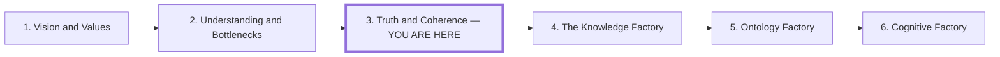

# Truth and Coherence

## Role in the Series

**Working title:** Truth and Coherence. Preserve the existing workspace slug and
canonical article until an explicit publication revision.

**Central question:** How do we recognize meaningful input and valuable output
when AI can make weak premises and answers look equally plausible?

**Central answer:** Meaningful input makes its premises, evidence, constraints,
omissions, and uncertainty inspectable, while valuable output survives
coherence, correspondence, and consequence tests against domain checks and
observed outcomes in relation to an explicit aim.

**Mechanism and stakes:** Information theory makes prediction, uncertainty, and
the contribution of context concrete; it does not establish truth or value.
Organizations therefore need shared evidence standards and local evaluation to
turn domain fluency into dependable, economically useful work.

**Organizational consequence:** Teams must be able to evaluate knowledge
locally and make their warrants, assumptions, and results inspectable across
the organization.

This is the series' epistemic bridge. *Vision and Values* owns the choice of
direction, human stakes, and normative authority. *Understanding and Bottlenecks*
establishes why bounded teams need complete learning loops. This third article
owns the shared tests that let those teams distinguish plausible language from
warranted claims and useful outcomes. Do not absorb the later articles' factory
metrics, ontology infrastructure, or governed automation loops here.

## Audience

Developers, technical leaders, and teams turning AI domain fluency into useful
products, services, and decisions.

## Preface and Series Position

Draft preface:

> The first article asks who supplies the direction; the second puts learning
> and decisions in bounded teams. This one asks what makes their judgments
> trustworthy. Picture a map laid over the terrain it
> claims to describe: its markings may agree with one another while missing
> something consequential on the ground. Philosophy of truth gives us ways to
> examine that relationship. Information theory explains how context shapes
> predictions. Together, they frame our examination of both the inputs we supply
> and the outputs we hope to turn into useful work.

Place the same compact series map after the preface and before section 1. Mark
the current position in text as well as visually; arrows indicate reading order.

The next article builds a repeatable factory around these teams and their
standards of judgment. Link the six entries to their stable article routes
in the eventual article; the current workspace keeps truth-and-inference.

## Argument Destination and Path

The reader should arrive able to evaluate an AI exchange as one inspectable
chain rather than two isolated texts: supplied premise → predicted answer →
domain checks → action → observed consequence. The three truth tests organize
that chain. Information theory explains the prediction step; domain practices
and observed outcomes determine whether the result deserves reliance.

| Movement | Change in the reader's understanding | Transition that earns the next section | Evidence and inference boundary | Visual work |
| --- | --- | --- | --- | --- |
| **1. Examine both sides of the exchange** | The prompt stops looking like neutral context and becomes a set of claims that can constrain or misdirect the answer. Fluency can preserve an error as easily as a valid premise. | If neither the input nor the output can grade itself, the reader needs independent questions for examining both. | The paired commercial requests are a composite demonstration, not evidence about model behavior in general. | No separate graph. The side-by-side requests provide the concrete contrast; adding a motif here would only restate it. |
| **2. Philosophy of truth provides a map** | One vague judgment of “correctness” separates into coherence within a representation, correspondence with observations, and consequences in use. Repeated use of those tests can also stabilize a shared term without making it universally true. | The three tests say what to ask. Variant 02 then gives the next section a concrete object to explain: a term of art whose definitions and corrections have acquired continuity inside a domain. | Source the philosophical accounts independently. Treat consequence as a pragmatic test of use, not proof that whatever succeeds is true or good; people still judge which effects matter. Refinement and discipline are practices that may use several truth tests, not two additional theories of truth. | Keep the map-and-terrain graph for the three tests. End the section with shared motif Variant 02, **Refinement and discipline establish a term of art**, so the argument visibly moves from evaluating claims to stabilizing domain language. |
| **3. Information theory makes prediction concrete** | A term of art becomes compressed context rather than a magic token: when its distinctions are learned or supplied, it can narrow likely continuations; when they are absent, the same fluency can miss the goal. Confidence remains conditional probability, not independent confirmation. | Once prediction is separated from validation, the reader needs to see the domain mechanisms that can reject a plausible continuation. | Shannon entropy, surprisal, conditional prediction, and cross-entropy need primary or standard technical sources. Variant 02b and the toy prompt are conceptual comparisons, not measured model results; embeddings represent input, while the model generates text. | Open with Variant 02b, **Short input, useful output—or just more tokens**. Its grounded and ungrounded lanes replace the planned standalone route-distribution graph. Keep any probabilities in the worked example small and technical rather than creating another top-level illustration. |
| **4. Domain practices supply ways to detect error** | Abstract truth tests become concrete rejectors: definitions, proofs, measurements, types, tests, runtime behavior, expert review, and customer evidence establish different kinds of warrant. | Passing local checks can establish bounded correctness without establishing value. The reader must follow a checked output into use, effects, and cost. | Code can illustrate executable checks. The broader claim that a model's learned domain fluency reflects those checks remains task-specific and requires evidence; do not generalize from code to every domain. | Reuse the three test icons beside the relevant checks if needed, but add no standalone graph. A second constraint stack would duplicate the classification rather than advance it. |
| **5. Turn domain fluency into commercial value** | Value moves from impressive output to an evaluated outcome: accepted mappings, correction effort, saved work, and total delivery cost. | A single evaluated case reveals the organizational requirement: teams need repeatable standards and visible warrants rather than a central reviewer's intuition. | The import-mapping case remains explicitly illustrative unless a sourced case supplies real costs and results. It demonstrates a possible value mechanism, not measured ROI. | The route-that-survives-use graph earns its place by connecting the same input and prediction icons to tests, human review, customer outcomes, cost, and revision. It visualizes why generation alone is not value. |
| **6. Build organizational standards for knowing** | Evaluation becomes a distributed practice: teams can expose premises, apply local checks, observe consequences, and revise shared context without hiding uncertainty. | The teams now have shared standards of judgment. How do they turn those standards into repeatable execution and verified outcomes? That is the handoff to *The Knowledge Factory*. | Present the organizational practices as the article's prescriptive inference from the preceding mechanism, not as a proven universal operating model. | Close in prose with the reusable practice. Repeated icons may label the steps, but another loop diagram would repeat the section rather than add reasoning. |

## Outline

### 1. Examine Both Sides of the Exchange

Open with two requests about the same commercial problem: one embeds an
untested diagnosis; the other supplies observations, constraints, and an open
question. Trace how the inputs shape what can count as a good answer.

- Evaluate input definitions, evidence, relevance, omissions, and uncertainty.
- Evaluate output claims, consistency, evidence, and consequences.
- An eloquent answer can faithfully develop a mistaken premise.
- Ask what would expose an error on either side.

### 2. Philosophy of Truth Provides a Map

Use coherence, correspondence, and consequence as three organizing tests:

- **Coherence:** Do claims fit together within the stated model and rules?
- **Correspondence:** Do they fit observations beyond that representation?
- **Consequence:** What happens when people act on the claim? Does it produce
  the intended result, for whom, under which conditions, and at what cost?

Consequence is the pragmatic test and may be the most important one for action.
It also requires the most explicit human judgment: evidence can reveal what
happened, but people must decide which effects matter, whose experience counts,
which tradeoffs are acceptable, and whether the result is worth repeating.
Keep pragmatic success, commercial success, and truth distinct; none
automatically establishes the others.

Formal, empirical, operational, and relational cases illustrate the map. Keep
the philosophical distinctions visible without building four competing essays.

End by showing how repeated practice can stabilize domain language. Refinement
contributes definition, evidence, and correction; discipline contributes
continuity, clarification, and specification. Together they can establish a
term of art with a stable boundary inside a domain. Do not map refinement or
discipline one-to-one onto a truth test: each may draw on coherence,
correspondence, and consequence. Place shared motif Variant 02 here so the
section hands Section 3 a concrete term whose predictive role can be explained.

### 3. Information Theory Makes Prediction Concrete

Open from the selected motif's follow-up contrast. A short label can address a
shared set of domain distinctions, but the label does not contain those
distinctions or guarantee a useful result. Variant 02b compares a term used with
shared understanding against an ambiguous label whose fluent expansion misses
the goal. Use that contrast to motivate the mechanism rather than to claim a
measured gain.

Explain how context changes a distribution over possible continuations:

- entropy describes uncertainty within the specified distribution;
- surprisal expresses how unexpected an observation is under that distribution;
- conditional prediction uses context to change expectations; and
- cross-entropy measures prediction against observed continuations.

Use one short worked example to show how a domain definition constrains an
answer. A confident prediction can still rely on a false premise. Statistical
predictability supplies no independent guarantee of correspondence.

Put equations and next-token loss mechanics in optional developer popovers.

### 4. Domain Practices Supply Ways to Detect Error

Definitions, proofs, measurements, types, tests, and operational consequences
give different domains different ways to reject claims.

- Code supplies a case with several mechanically checkable constraints.
- Keep the hash-sort example once, explaining what each check establishes.
- Requirements, architecture, costs, and customer value still require judgment.
- Treat the relationship between learned domain fluency and these practices as
  a claim needing evidence, not a guarantee of model reliability.

### 5. Turn Domain Fluency into Commercial Value

Follow one explicitly illustrative case: a paid tool that drafts mappings
between a customer's import data and a known application schema.

1. Supply domain definitions, representative data, exceptions, and requirements.
2. Generate candidate mappings and expose uncertain interpretations.
3. Test constraints and have the domain owner evaluate ambiguous meanings.
4. Measure accepted imports, correction effort, and the customer's saved work.
5. Compare revenue with generation, review, integration, and support costs.

Connect good input, fluent output, evaluation, and a potential profit mechanism.
Use no invented measured results or assumption that fluency ensures profit.
Replace the composite with a sourced case if available.

### 6. Build Organizational Standards for Knowing

Teams need to evaluate their own work and communicate what warrants their
conclusions. A central reviewer cannot be the sole source of confidence.

- Agree on definitions, evidence standards, and acceptance criteria.
- Keep claims connected to sources, assumptions, uncertainty, and scope.
- Give teams local evaluation tools and access to relevant consequences.
- Preserve challenges and counterexamples; resolve disagreements through
  evidence and explicit decision rights.
- Revisit shared assumptions when local results contradict them.

Close with a reusable practice: inspect input → generate → discriminate among
claims → act within the evidence → observe → revise shared context.

## Supporting Material and Research Obligations

| Planned move | Current locator | Status and limit |
| --- | --- | --- |
| Separate truth tests | [Pre-MDX source list](../notes/pre-mdx-markdown.md#sources) and the [existing research review](../research/research-review.md) | The correspondence and pragmatic accounts provide starting locators. Add a dedicated source for coherence before publication. The review predates this outline and does not substantiate its new information-theory, code-constraint, or domain-fluency sections. |
| Explain conditional prediction | Shannon's 1948 and 1951 papers, Bengio et al. (2003), and Vaswani et al. (2017), all linked in the [pre-MDX source list](../notes/pre-mdx-markdown.md#sources) | These support entropy, language prediction, learned representations, and transformer mechanics. Verify the exact worked example separately; do not present toy probabilities as measurements. |
| Show domain rejection mechanisms | The Lean 4 documentation, TypeScript Handbook, *Introduction to Algorithms*, and Evans's *Domain-Driven Design Reference* in the [pre-MDX source list](../notes/pre-mdx-markdown.md#sources) | These support particular checks and domain-language practices. They do not establish that learned model fluency reliably inherits those checks. |
| Contrast locally closed code work with open strategy or product judgment | [Evaluative closure note](../notes/evaluative-closure-code-and-strategy.md) | This is an article argument and example inventory, not independent empirical evidence. Keep claims bounded to well-specified tasks. |
| Connect evaluation to commercial value and organizational practice | This outline's import-mapping composite and the closing synthesis | No measured case currently supports ROI or a universal organization design. Keep the case illustrative and the organizational standard explicitly prescriptive unless research supplies stronger evidence. |

- Use the [existing review](../research/research-review.md) only as a source map
  for its stated topics; follow its primary links and preserve its limitations.
- Source philosophical accounts on their own terms. Information theory
  illustrates prediction; it does not settle philosophical theories of truth.
- Keep coherence, correspondence, consequence, meaning, and usefulness
  distinct even when they support one another.
- Verify the worked information-theory example and label the commercial case
  as illustrative unless actual costs and outcomes can be sourced.
- Preserve the warning that domain fluency is task-specific.

## Figure Plan

Use two visual languages deliberately. The selected shared AI Factory motif
provides continuity across the series and explains how practice stabilizes a
term that can guide inference. The article-local map tested against terrain
then distinguishes representation, observation, action, and consequence. Do
not redraw the selected shared motif in Mermaid.

### Selected Shared Motif: Variant 02

Treat the browser-selected `section#motif-02` as one two-part bridge across
sections 2 and 3. Keep the panels adjacent even if the Section 3 heading falls
between them. Review-sheet locator: **02 / Variant 02 / Continuity check — The
stabilizing state: practice gives a boundary enough continuity to be shared.**

| Variant and placement | Required labels | Argumentative job and limit |
| --- | --- | --- |
| **02 — `refinement-and-discipline-to-term-of-art`**, at the end of section 2 | Eyebrow: **REFINEMENT + DISCIPLINE**. Title: **Refinement and discipline establish a term of art**. Stations: **Idea — shared meaning** and **Term of art — consistent within a domain**. Inputs: **Discipline — continuity · clarification · specification** and **Refinement — definition · evidence · correction**. Relationship: **ESTABLISHES**. Axis: **MEANING POTENTIAL / REFINEMENT + DISCIPLINE / STABLE TERM**. | Shows the stabilizing state between a meaningful idea and a reusable domain expression. It does not show that a stable term corresponds to reality or produces a good consequence; the surrounding prose must retain those tests. |
| **02b — `understanding-in-embedding-space`**, at the opening of section 3 | Eyebrow: **EMBEDDING SPACE / INFERENCE VALUE**. Title: **Short input, useful output—or just more tokens**. Columns: **SHORT INPUT / REPRESENTATION / GENERATION / EXPANDED OUTPUT**. Grounded lane: **WITH UNDERSTANDING**, **Short label — shared term of art**, **Embedding space**, **Understanding**, **Term of art**, **shared domain distinctions**, **Inference — guided by meaning**, **YIELDS**, **Useful expansion**, **Fits the intended result**, **more text · useful tokens**. Ungrounded lane: **WITHOUT UNDERSTANDING**, **Short label — unshared or ambiguous**, **No grounding**, **Loose meaning**, **context and criteria absent**, **Inference — fluent, not grounded**, **YIELDS**, **Excess output**, **Does not fit the goal**, **excess tokens · no added value**. Footer: **CONCEPTUAL CONTRAST · TOKEN MARKS ARE NOT COUNTS** and **VALUE ≠ VOLUME**. | Turns the stable term into the problem Section 3 explains: how short context can narrow prediction without independently establishing truth or value. Preserve the component caption's caveat that embeddings represent input, the model generates text, and value must be checked against the intended result. |

### Article-Local Map and Terrain Figures

Carry forward the landscape from *Vision and Values*, now focusing on
representations, observations, actions, and consequences. Develop it through
two article-local illustrations.

Use a stable visual grammar across those illustrations: an input card for the
supplied premise, branching routes for predicted continuations, a terrain marker
for external observation, a traveler for action, and a consequence marker for
the resulting effect or cost. Reuse an icon only when it still denotes the same
part of the argument. Sections 1, 4, and 6 deliberately receive no standalone
graph because their examples, checks, and closing practice already carry the
reasoning in prose.

| Illustration and placement | What it shows | Intended takeaway |
| --- | --- | --- |
| **A consistent map, a missing crossing**, after section 2 | Internally compatible routes, an observation that contradicts a claimed crossing, and the consequences for a traveler who acts on the map. | Coherence asks whether the map fits itself, correspondence whether it fits the terrain, and consequence what happens when someone relies on it. |
| **A route that survives use**, in section 5 | The import-mapping case from input definitions through candidate mappings, tests, domain review, customer results, and revised context. | Commercial value depends on evaluated outcomes and the cost of producing them. |

Use Mermaid for the two article-local comparisons and flows. Keep any toy
probabilities in the section 3 worked example explicitly illustrative, avoid
invented measurements, and distinguish rejection from revision in feedback
paths. Repeat the input/model/observation symbols only within the map-and-terrain
figures; the shared motif keeps its existing icon grammar. The compact series
map is navigation, outside these explanatory figures.

## Handoff

*The Knowledge Factory* asks how teams turn these standards of judgment into
repeatable execution, verified outcomes, and reusable learning.
