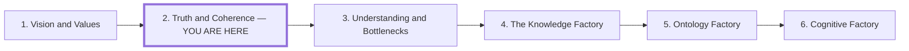

# Truth and Coherence

## Role in the Series

**Working title:** Truth and Coherence. Preserve the existing workspace slug and
canonical article until an explicit publication revision.

**Question:** How do we recognize good input and good output?

**Thesis:** Philosophy of truth gives us a map for examining claims; information
theory makes prediction, uncertainty, and the contribution of context concrete.
Useful AI work requires examining supplied premises as carefully as generated
answers. Organizations need shared evidence standards and local evaluation to
turn domain fluency into dependable, economically useful work.

**Organizational question:** How can teams evaluate knowledge independently and
make their reasoning inspectable across the organization?

## Audience

Developers, technical leaders, and teams turning AI domain fluency into useful
products, services, and decisions.

## Preface and Series Position

Draft preface:

> The first article asks who supplies the direction. This one asks how we judge
> the information used to pursue it. Picture a map laid over the terrain it
> claims to describe: its markings may agree with one another while missing
> something consequential on the ground. Philosophy of truth gives us ways to
> examine that relationship. Information theory explains how context shapes
> predictions. Together, they frame our examination of both the inputs we supply
> and the outputs we hope to turn into useful work.

Place the same compact series map after the preface and before section 1. Mark
the current position in text as well as visually; arrows indicate reading order.

The next article asks how people and teams develop and distribute the capacity
to make these judgments. Link the six entries to their stable article routes
in the eventual article; the current workspace keeps truth-and-inference.

## Outline

### 1. Examine Both Sides of the Exchange

Open with two requests about the same commercial problem: one embeds an
untested diagnosis; the other supplies observations, constraints, and an open
question. Trace how the inputs shape what can count as a good answer.

- Evaluate input definitions, evidence, relevance, omissions, and uncertainty.
- Evaluate output claims, consistency, evidence, and consequences.
- An eloquent answer can faithfully develop a mistaken premise.
- Ask what would expose an error on either side.

### 2. Philosophy of Truth Provides a Map

Use coherence and correspondence as the main organizing distinction:

- **Coherence:** Do claims fit together within the stated model and rules?
- **Correspondence:** Do they fit observations beyond that representation?

Use pragmatic inquiry to ask how claims hold up in use. Distinguish usefulness,
commercial success, and truth; none automatically establishes the others.

Formal, empirical, operational, and relational cases illustrate the map. Keep
the philosophical distinctions visible without building four competing essays.

### 3. Information Theory Makes Prediction Concrete

Explain how context changes a distribution over possible continuations:

- entropy describes uncertainty within the specified distribution;
- surprisal expresses how unexpected an observation is under that distribution;
- conditional prediction uses context to change expectations; and
- cross-entropy measures prediction against observed continuations.

Use one short worked example to show how a domain definition constrains an
answer. A confident prediction can still rely on a false premise. Statistical
predictability supplies no independent guarantee of correspondence.

Put equations and next-token loss mechanics in optional developer popovers.

### 4. Domain Practices Supply Ways to Detect Error

Definitions, proofs, measurements, types, tests, and operational consequences
give different domains different ways to reject claims.

- Code supplies a case with several mechanically checkable constraints.
- Keep the hash-sort example once, explaining what each check establishes.
- Requirements, architecture, costs, and customer value still require judgment.
- Treat the relationship between learned domain fluency and these practices as
  a claim needing evidence, not a guarantee of model reliability.

### 5. Turn Domain Fluency into Commercial Value

Follow one explicitly illustrative case: a paid tool that drafts mappings
between a customer's import data and a known application schema.

1. Supply domain definitions, representative data, exceptions, and requirements.
2. Generate candidate mappings and expose uncertain interpretations.
3. Test constraints and have the domain owner evaluate ambiguous meanings.
4. Measure accepted imports, correction effort, and the customer's saved work.
5. Compare revenue with generation, review, integration, and support costs.

Connect good input, fluent output, evaluation, and a potential profit mechanism.
Use no invented measured results or assumption that fluency ensures profit.
Replace the composite with a sourced case if available.

### 6. Build Organizational Standards for Knowing

Teams need to evaluate their own work and communicate what warrants their
conclusions. A central reviewer cannot be the sole source of confidence.

- Agree on definitions, evidence standards, and acceptance criteria.
- Keep claims connected to sources, assumptions, uncertainty, and scope.
- Give teams local evaluation tools and access to relevant consequences.
- Preserve challenges and counterexamples; resolve disagreements through
  evidence and explicit decision rights.
- Revisit shared assumptions when local results contradict them.

Close with a reusable practice: inspect input → generate → discriminate among
claims → act within the evidence → observe → revise shared context.

## Supporting Material and Research Obligations

- Use the [existing review](../research/research-review.md) as a source map;
  follow its primary links and preserve its evidence limitations.
- Source philosophical accounts on their own terms. Information theory
  illustrates prediction; it does not settle philosophical theories of truth.
- Keep coherence, correctness, meaning, and usefulness distinct.
- Verify the worked information-theory example and label the commercial case
  as illustrative unless actual costs and outcomes can be sourced.
- Preserve the warning that domain fluency is task-specific.

## Figure Plan

**Recurring motif: a map tested against its terrain.** Carry forward the
landscape from *Vision and Values*, now focusing on representations, predictions,
and observations. Develop it through three illustrations.

| Illustration and placement | What it shows | Intended takeaway |
| --- | --- | --- |
| **A consistent map, a missing crossing**, after section 2 | Internally compatible routes alongside an observation that contradicts a claimed crossing. | Internal coherence and correspondence ask different questions. |
| **Context changes the predicted route**, in section 3 | Candidate continuations before and after supplying a domain definition, with an external observation shown separately. | Context shapes prediction; confidence alone does not validate the supplied premise. |
| **A route that survives use**, in section 5 | The import-mapping case from input definitions through candidate mappings, tests, domain review, customer results, and revised context. | Commercial value depends on evaluated outcomes and the cost of producing them. |

Use Mermaid for the conceptual comparisons and flows. Label any toy probabilities
as illustrative, avoid invented measurements, and distinguish rejection from
revision in the feedback paths. Repeat the input/model/observation symbols and
use captions to connect the metaphor to the actual domain. The compact series
map is navigation, outside these three explanatory figures.

## Handoff

*Understanding and Bottlenecks* asks how to develop expertise and distribute
judgment when teams produce work faster than central figures can evaluate it.
