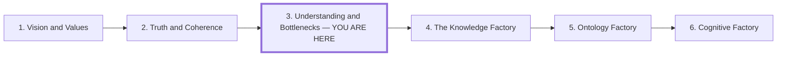

# Understanding and Bottlenecks

## Role in the Series

**Central question:** How should we develop expertise and organize work when AI
generation outruns human evaluation and absorption?

**Central answer:** Move complete learning loops—not merely production—from a
central authority into bounded teams, then give those teams shared intent,
explicit interfaces, decision rights, and protected time to build and revise
their judgment.

**This article's job:** *Vision and Values* establishes who chooses direction,
and *Truth and Coherence* establishes how claims are tested. This third article
shows where the capacity to interpret those claims and act on them must live: in
teams close enough to evidence and consequences to learn. It ends with the
organizational requirements for responsible local judgment.

**Boundaries with the rest of the series:** Do not turn this article into the
factory architecture, ontology specification, or automation design developed
later. *The Knowledge Factory* owns the operating system and throughput
scorecard around these teams; *Ontology Factory* owns precise, reusable semantic
context; *Cognitive Factory* owns governed signal-to-action automation. This
article owns the human and organizational bottleneck that those systems must not
recreate.

## Audience

Technical experts reconsidering their role, and leaders organizing teams whose
ability to generate work is outpacing their ability to evaluate and absorb it.

## Preface and Series Position

Draft preface:

> The previous articles establish shared direction and ways to judge
> information. Now the question becomes organizational: where can understanding
> develop quickly enough to guide action? Imagine every local observation and
> decision traveling through one command point. As work accelerates, that point
> becomes a queue. This article argues that teams need bounded authority to
> complete their own learning loops—and the shared intent, interfaces, and deep
> work that keep those local decisions compatible with the larger system.

Place the same compact series map after the preface and before section 1. Mark
the current position in text as well as visually; arrows indicate reading order.

The next article develops the working system around these teams. Link the six
entries to their stable article routes in the eventual article, keeping the
same order and titles as the other prefaces.

## Argument Spine

1. AI expands generation faster than people and institutions can evaluate,
   explain, and absorb what it produces.
2. Keeping interpretation and approval in one central expert converts that
   human scarcity into an organizational queue.
3. Delegating production alone cannot remove the queue; teams need authority to
   complete a bounded loop from evidence through consequence and revision.
4. Shared design philosophy, explicit interfaces, and escalation rules make
   those local loops compatible without recentralizing every decision.
5. Shared concepts make judgment portable, but compression must remain open to
   examples, assumptions, tests, and counterexamples.
6. Protected deep work lets people build and revise those models; the
   destination is an organization with distributed, corrigible judgment rather
   than merely distributed generation.

Each section must resolve the problem introduced by the preceding section. The
article should not present autonomy, design philosophy, compression, and deep
work as adjacent virtues; each is a necessary response to the bottleneck already
established.

## Outline

### 1. Generation Scales; Understanding Does Not

**Reader movement:** Begin with apparently different AI-era experiences and
reveal the same structural mismatch beneath them: more output arrives than a
person or institution can responsibly qualify and absorb. The reader should
leave this section seeing the bottleneck as evaluation and understanding, not
as a shortage of generation or a generic fear of automation.

Open cold with four quick cuts. Give each one or two sentences before explaining
the shared mechanism:

1. **Mathematical breakthroughs that almost no one has absorbed.** AI-assisted
   systems can generate or verify results faster than the mathematical community
   can explain, evaluate, teach, and incorporate them. Use Tao's “proof
   indigestion” and the unit-distance result; do not literally claim that no one
   understands a result whose proof has received expert review.
2. **Developer burnout beside celebrated output gains.** A 442-developer study
   associates GenAI adoption with higher job demands and burnout. A separate
   industry survey reports that respondents perceive review and validation as a
   downstream bottleneck even while individual productivity improves. Do not
   claim historic-record burnout or measured organization-wide productivity.
3. **Meat proxies playing the AI slot machine.** A developer pulls the lever,
   skims the tokens, retries, and supplies the judgment the system lacks. Aim the
   deliberately abrasive phrase at a work design that reduces people to
   generators and filters, not at the people trapped inside it. Keep the
   slot-machine comparison structural rather than clinical.
4. **Your PR reviewer will not understand the PR better than you didn't.** A
   generated change moves the interpretation problem downstream. A reviewer
   without the author's context, tests, and causal model cannot manufacture
   understanding from a larger diff; review redistributes the bottleneck rather
   than resolving it.

Land the barrage in one sentence: generation scaled; understanding, evaluation,
and absorption did not. Then acknowledge the insecurity of experts watching
work that once required years of practice become easier to produce without
treating it as a universal diagnosis or proof that expertise has lost value.

**Evidence:** Tao's “proof indigestion” account and the unit-distance case
support the distinction between generation, verification, explanation, and
community absorption. The 442-developer and 319-worker studies support limited
claims about reported workload and changing cognitive work. The GitLab survey
supports only a reported shift toward review and validation. Gambling research
grounds reward uncertainty, not an equivalence between prompting and addiction.

**Inference to earn:** These cases do not prove one universal causal law. They
make a bounded organizational diagnosis plausible: AI can lower the cost of
candidate output without proportionally lowering the cost of interpretation,
integration, or adoption.

**Transition:** If understanding is scarce, the next question is where the
organization places it. The common answer—one senior expert or architect—turns
scarcity into a queue.

**Visual decision:** Do not add a decorative AI or burnout icon. Use the existing
AI Factory motif variant `understanding-in-embedding-space` under the working
reference label **Without understanding / excess output** only if the comparison
between grounded expansion and token volume helps unify the four scenes.

### 2. The Central Architect Becomes the Queue

**Reader movement:** Convert the general scarcity into an organizational
mechanism. The reader should see why adding generators while retaining a single
interpretation and approval point can slow the whole system.

Use an explicitly hypothetical architect who delegates components to several
AI-assisted teams but retains every design, interpretation, and approval
decision.

- Teams produce changes and discover new conditions faster than the architect
  can absorb them. Their local understanding develops while decisions wait.
- Delegating execution leaves judgment centralized. More generators can
  increase the work waiting for interpretation and integration.
- Rubber-stamping makes approval meaningless; repeated escalation stalls work.
- Bound the claim: central expertise remains useful, but requiring consequential
  local decisions to pass through one mind limits throughput.

**Evidence and status:** This is a mechanism and thought experiment, not yet a
measured universal. Use the downstream-review survey as corroborating perception
evidence, and support stronger claims about central review, team learning, or
decision latency with organizational research or a sourced case before
publication.

**Inference to earn:** The relevant unit of delegation cannot be implementation
alone. If the same person must interpret every result and authorize every next
step, execution has moved but the learning loop has not.

**Transition:** The solution is not “remove the architect.” It is to move a
complete, bounded learning loop closer to the evidence while keeping system-level
responsibilities explicit.

**Argumentative visual:** Establish the upper topology of **Where understanding
lives** in prose here: the same team markers feed discoveries, decisions, and
exceptions toward one gate. Reserve the complete before/after comparison until
section 4 has earned the alternative. The graph matters because topology—not the
personality of the architect—is the claim.

### 3. Distribute Complete Learning Loops

**Reader movement:** Replace the false choice between central control and
uncoordinated autonomy with a specific alternative. The reader should understand
autonomy as responsibility for learning from consequences within a bounded
remit.

Give each team a bounded outcome, enough context and authority to choose an
approach, and responsibility for evaluating what happens.

- Each team can investigate → decide → act → evaluate → revise within its remit.
- Keep input quality, direction, partner assumptions, and downstream effects
  visible; teams own the consequences of their choices.
- Supply shared intent, evidence standards, and operational feedback.
- Establish how teams resolve conflicting commitments and escalate effects
  beyond their boundaries. Local autonomy still requires system coordination.

Use Caesar's account of the Nervii battle as a historical illustration:
experienced soldiers and lieutenants acted without waiting for commands when
urgency and terrain prevented complete central direction. The same account
describes Caesar coordinating endangered units. Cite
[*Gallic War* II.20–26](https://classics.mit.edu/Caesar/gallic.2.2.html).

**Evidence:** Caesar's primary account provides the narrative details. It is a
self-interested ancient military source and an analogy for trained local
initiative, not evidence that Caesar invented decentralized command or that a
modern software organization should copy a battlefield hierarchy.

**Inference to earn:** Local action becomes responsible when people share
purpose, practice judgment before crisis, and remain connected to coordination.
For the article's modern claim, this is a design proposal that still needs
organizational evidence.

**Transition:** Giving teams complete loops creates a new risk: locally sensible
decisions can conflict at system boundaries. The next section supplies the
compatibility mechanism.

**Visual decision:** Do not add a battle illustration. The narrative carries the
analogy, and a second military image would distract from the organizational
mechanism developed next.

### 4. Design Philosophy Makes Local Decisions Compatible

**Reader movement:** Show how teams can act independently without forcing every
decision back through the center. The reader should leave with a concrete
distinction between local discretion, cross-team agreement, and escalation.

Shared principles and models help teams interpret unfamiliar situations while
explicit boundaries keep decisions compatible with neighboring systems.

Define responsibility, inputs and outputs, invariants, failure behavior,
observability, rollback, and ownership. Use one explicitly illustrative
cross-team interface change to show:

- what the owning team may decide locally;
- which assumptions and guarantees neighboring teams depend on;
- what evidence can justify a bounded exception;
- who coordinates a change that crosses ownership; and
- what signal requires pause, rollback, or escalation.

Black boxes are useful when the relevant boundary can be understood and tested.
Require deeper investigation as consequence, coupling, opacity, or
irreversibility increases. Disagree-and-commit needs a bounded wager and a way
to detect failure; unresolved evidence and ethical boundaries still matter.
System architecture remains an ongoing coordination responsibility.

**Evidence and status:** The interface case is illustrative unless replaced by a
sourced organizational case. Treat the list above as a prescriptive design
model, not as findings already demonstrated by the article's current evidence.

**Inference to earn:** Shared philosophy aligns interpretation; explicit
interfaces bound authority; feedback reveals when either is wrong. Together
they coordinate complete local loops without recreating a universal approval
gate.

**Transition:** Even well-bounded teams cannot reason from every detail at once.
They need compact shared concepts—but compact concepts can erase the very
distinctions that make boundaries trustworthy.

**Argumentative visual:** Place the complete **Where understanding lives**
comparison after the interface example. Use the implemented AI Factory motif
variant `central-queue-to-bounded-loops`: the upper lane routes all work through
one interpretation gate; the lower lane reuses exactly the same teams, gives
each one an understand-act-evaluate-revise loop, and draws only shared intent and
named cross-team interfaces. The before/after topology should make the change
legible without implying that teams become isolated.

### 5. Make Shared Models Compact—and Reopenable

**Reader movement:** Move from organizational structure to the cognitive
practice that lets teams carry and share judgment. The reader should see
compression as a practical necessity with explicit loss and scope, not as proof
of a literal theory of human cognition.

Develop the idea of mapping morphemes and meaningful terms to abstract patterns
as a learning practice. Distinguish linguistic units from conceptual chunks and
model tokens.

- Work through “idempotent”: connect the term to repeated requests, a concrete
  operation, a test, and a counterexample. Check the word's history before
  adding a morpheme breakdown.
- Show how a shared concept can spare teams from reconstructing explanations
  while retaining access to examples and assumptions.
- Make ingestion active: identify a claim, connect it to a model, test the
  connection, and record what would break it.
- Treat cognitive compression as shorthand with loss and scope; shared
  vocabulary can conceal incompatible interpretations.

**Evidence and status:** Linguistic definitions can support the morpheme
example. Claims about chunking, comprehension, or memory need learning-science
research before publication. Until then, present the section's method as a
proposed practice and avoid asserting a neurological mechanism.

**Inference to earn:** Distributed judgment depends on concepts that travel,
but trustworthy concepts must remain inspectable. A term becomes useful shared
context only when people can reopen it into cases, evidence, assumptions,
tests, and limits.

**Transition:** Reopenable models still demand attention. If teams spend all of
their time generating and triaging output, they cannot perform the investigation
that keeps compressed knowledge honest.

**Argumentative visual:** Place **A model that can be opened** here. Begin with
the shared-map icon used in the organizational graphs, then expand one concept
node into examples, assumptions, tests, counterexamples, and a revision edge.
This graph earns its place by revealing the information hidden by compression;
label it as a learning practice, not a neurological model.

### 6. Protect the Work That Develops Judgment

**Reader movement:** Complete the answer. The reader should understand that
distributed authority is viable only when people have time to investigate,
test, mentor, and revise the shared models on which local decisions depend.

Autonomy requires people capable of sustained investigation. Protect time to
build, test, and revise the models that make fast decisions possible.

- Pair compressed summaries with deep examination of difficult cases.
- Cap concurrent generated work so teams can evaluate and absorb it.
- Give experts time for design, investigation, mentoring, and model revision.
- Evaluate collaborators by the context, judgment, and evidence they contribute.
- Retain reasons, counterexamples, and consequences in shared organizational
  knowledge so the next team can build on what was learned.

**Evidence:** The current developer studies support limited claims about
reported job demands, cognitive load, autonomy, and learning resources. They do
not establish a universal throughput limit or prove that one specific allocation
of deep-work time prevents burnout.

**Inference and prescription:** A team cannot own a learning loop if its work
design rewards only generation. Capacity limits, protected investigation, and
retained rationale are proposed organizational responses to the bottleneck;
state them as such unless stronger intervention evidence is added.

**Destination:** Return to the opening scenes. The expert's role has not
disappeared; it has moved from being the sole producer or approver to developing
shareable models, setting and challenging boundaries, interpreting evidence,
and learning from consequences. Close on independent teams capable of
responsible judgment, with shared direction and visible relationships between
their work.

**Visual decision:** Do not add a fourth explanatory figure. Close in prose by
naming what changed in the three planned figures: ungrounded output can miss the
goal; work can queue at one interpretation node or move through bounded local
loops; and a compact shared model must remain open to revision.

## Evidence Map and Research Obligations

| Planned claim | Evidence or locator | Status and limit |
| --- | --- | --- |
| Generation, verification, explanation, and absorption can become distinct bottlenecks. | Terence Tao, *Mathematics in the Age of AI*; OpenAI unit-distance case; Leiden Declaration. | Use the mathematical case to expose the stages. Do not imply that reviewed results are understood by no one or that formal verification supplies significance. |
| AI-assisted work can shift effort toward verification and stewardship. | Lee et al., CHI 2025, 319-worker survey; GitLab, *2026 AI Accountability Report*, 1,528-person Harris Poll survey; [workload research](../research/ai-generation-cognitive-load-and-burnout.md). | Preserve self-report and sponsorship limits. The surveys do not directly measure review quality or prove that every generated PR is harder to review. |
| GenAI adoption can accompany higher demands, burnout, and task-dependent cognitive load. | Feng, Afroz, and Sarma, ICSE-SEIS 2026, 442-developer study; Brandebusemeyer et al., 2026 preprint; [workload research](../research/ai-generation-cognitive-load-and-burnout.md). | Preserve association, preprint, and task-dependence limits. Keep cognitive load, fatigue, burnout, and insecurity distinct. |
| Uncertain rewards can intensify repeated behavior. | Zack, St. George, and Clark, 2020 review; [workload research](../research/ai-generation-cognitive-load-and-burnout.md). | Supports only the structure of the slot-machine analogy. Do not diagnose prompting or use dopamine as shorthand. |
| Trained local initiative can coexist with coordination. | Caesar, [*Gallic War* II.20–26](https://classics.mit.edu/Caesar/gallic.2.2.html). | Primary historical account and analogy only; attribute it and preserve its limitations. |
| Centralized review can become a throughput bottleneck, while bounded teams can learn locally. | Current thought experiment plus survey perception evidence. | Research gap. Add organizational research or a sourced case before presenting this as a general empirical result. |
| Compact concepts can support comprehension and recall when they remain connected to examples and tests. | No adequate local source yet. | Research gap. Source cognitive chunking, comprehension, and sustained attention before presenting the practice as established learning science. |

## Figure Plan

**Recurring motif: teams connected through a shared, inspectable map.** The
recurring icons are not decoration. Reusing the same teams, work-item cards,
map, and boundary markers lets the reader compare where understanding and
decision authority reside at each stage of the argument.

| Illustration and placement | Relationship it makes visible | Argument advanced |
| --- | --- | --- |
| **Without understanding / excess output**, after the shared mechanism in section 1 or where compression is introduced in section 5 | Existing motif variant `understanding-in-embedding-space`: a grounded label supports useful expansion while an ungrounded label produces fluent excess that misses the goal. | Output volume is not understanding or value; use this existing figure only once, where the comparison best advances the prose. |
| **Where understanding lives**, after the interface example in section 4 | New motif variant `central-queue-to-bounded-loops`: the same teams first route work through one interpretation gate, then own bounded learning loops connected by shared intent and explicit interfaces. | The organizational bottleneck changes when complete learning loops—not production alone—are distributed. |
| **A model that can be opened**, in section 5 | One shared-map concept expands into examples, assumptions, evidence, tests, counterexamples, and a revision edge. | Cognitive compression supports distributed judgment only when the compressed model remains inspectable and corrigible. |

Use the shared AI Factory motif component for the first two figures and Mermaid
for the concept expansion only if a reusable component is unnecessary. Preserve
the same number and identity of teams across both lanes of **Where understanding
lives** so the structural change is legible. Show cross-team decisions
explicitly. Reuse an icon only when its meaning remains stable across figures.
Use Caesar as narrative rather than a fourth battle illustration. The compact
series map is navigation, outside the three explanatory figures.

## Handoff

*The Knowledge Factory* begins after this article has established where judgment
must live. It develops context, generation, evaluation, and retained learning as
an operating system around bounded teams; it must preserve their complete
learning loops rather than recreate one director as the integration bottleneck.
