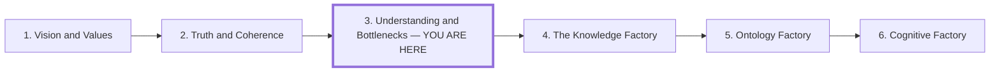

# Understanding and Bottlenecks

## Role in the Series

**Question:** How should we develop expertise and organize work when generation
outruns evaluation?

**Thesis:** AI can accelerate implementation and local discovery beyond a
central director's capacity to understand and approve them. Organizations must
distribute understanding, evaluation, and decision authority alongside execution.
Autonomous teams need shared intent, design philosophy, explicit boundaries,
and time to build deep expertise and learn from consequences.

**Organizational question:** How can decentralized teams act on what they learn
while preserving the integrity of the larger system?

## Audience

Technical experts reconsidering their role, and leaders organizing teams whose
ability to generate work is outpacing their ability to absorb it.

## Preface and Series Position

Draft preface:

> The previous articles establish shared direction and ways to judge information.
> Now the question becomes organizational: who can understand and act on what
> teams discover? Imagine every local observation and decision traveling through
> one command point. As work accelerates, that point becomes a queue. This
> article explores how autonomous teams can develop local understanding while
> coordinating through shared models and boundaries—and why the deep work needed
> to develop that judgment becomes part of organizational design.

Place the same compact series map after the preface and before section 1. Mark
the current position in text as well as visually; arrows indicate reading order.

The next article develops the working system around these teams. Link the six
entries to their stable article routes in the eventual article, keeping the
same order and titles as the other prefaces.

## Outline

### 1. The Landscape Shifts Beneath Expertise

Open cold with four quick cuts. Give each one or two sentences before explaining
the shared mechanism:

1. **Mathematical breakthroughs that almost no one has absorbed.** AI-assisted
   systems can generate or verify results faster than the mathematical community
   can explain, evaluate, teach, and incorporate them. Use Tao's “proof
   indigestion” and the unit-distance result; do not literally claim that no one
   understands a result whose proof has received expert review.
2. **Developer burnout beside record output.** A 442-developer study associates
   GenAI adoption with higher job demands and burnout even as organizations
   celebrate faster production. Do not say burnout is at a historic record
   without a comparable longitudinal measure.
3. **Meat proxies playing the AI slot machine.** A developer pulls the lever,
   skims the tokens, retries, and supplies the judgment the system lacks. Aim the
   deliberately abrasive phrase at a work design that reduces people to
   generators and filters, not at the people trapped inside it. Keep the
   slot-machine comparison structural rather than clinical.
4. **Your PR reviewer will not understand the PR better than you didn't.** A
   generated change moves the interpretation problem downstream. A reviewer
   without the author's context, tests, and causal model cannot manufacture
   understanding from a larger diff; review redistributes the bottleneck rather
   than resolving it.

Land the barrage in one sentence: generation scaled; understanding, evaluation,
and absorption did not. Then acknowledge the insecurity of experts watching
work that once required years of practice become easier to produce without
treating it as a universal diagnosis or proof that expertise has lost value.

- Separate faster implementation from understanding, evaluation, and integration.
- Distinguish qualified work exceeding absorption from generation exceeding
  evaluation; they demand different responses.
- Use workload and critical-thinking research with its study limitations.
- Ask how expertise develops around models, boundaries, and consequences.

### 2. The Central Architect Becomes the Queue

Use an illustrative architect who delegates components to several AI-assisted
teams but retains every design, interpretation, and approval decision.

- Teams produce changes and discover new conditions faster than the architect
  can absorb them. Their local understanding develops while decisions wait.
- Delegating execution leaves judgment centralized. More generators can
  increase the work waiting for interpretation and integration.
- Rubber-stamping makes approval meaningless; repeated escalation stalls work.
- Bound the claim: central expertise remains useful, but requiring consequential
  local decisions to pass through one mind limits throughput.

### 3. Distribute Complete Learning Loops

Give autonomous teams a bounded outcome, enough context and authority to choose
an approach, and responsibility for evaluating what happens.

- Each team can investigate → decide → act → evaluate → revise within its remit.
- Keep input quality, direction, partner assumptions, and downstream effects
  visible; teams own the consequences of their choices.
- Supply shared intent, evidence standards, and operational feedback.
- Establish how teams resolve conflicting commitments and escalate effects
  beyond their boundaries. Local autonomy still requires system coordination.

Use Caesar's account of the Nervii battle as a historical illustration:
experienced soldiers and lieutenants acted without waiting for commands when
urgency and terrain prevented complete central direction. The same account
describes Caesar coordinating endangered units. Cite
[*Gallic War* II.20–26](https://classics.mit.edu/Caesar/gallic.2.2.html).
This is Caesar's own account and an analogy for trained local initiative; it
does not establish that he invented decentralized command.

### 4. Design Philosophy Makes Independent Decisions Compatible

Shared principles and models help teams interpret unfamiliar situations while
explicit boundaries keep decisions compatible with neighboring systems.

Define responsibility, inputs and outputs, invariants, failure behavior,
observability, rollback, and ownership. Use one cross-team interface change to
show which decisions remain local and which require joint agreement. System
architecture remains an ongoing coordination responsibility.

Black boxes are useful when the relevant boundary can be understood and tested.
Require deeper investigation as consequence, coupling, opacity, or
irreversibility increases. Disagree-and-commit needs a bounded wager and a way
to detect failure; unresolved evidence and ethical boundaries still matter.

### 5. Learn to Ingest and Compress Information

Develop the idea of mapping morphemes and meaningful terms to abstract patterns
as a learning practice. Distinguish linguistic units from conceptual chunks and
model tokens; do not assert a literal cognitive mechanism without evidence.

- Work through “idempotent”: connect the term to repeated requests, a concrete
  operation, a test, and a counterexample. Check the word's history before
  adding a morpheme breakdown.
- Show how a shared concept can spare teams from reconstructing explanations
  while retaining access to examples and assumptions.
- Make ingestion active: identify a claim, connect it to a model, test the
  connection, and record what would break it.
- Treat cognitive compression as a shorthand with loss and scope; shared
  vocabulary can also conceal incompatible interpretations.

### 6. Preserve Deep Work and Develop Judgment

Autonomy requires people capable of sustained investigation. Protect time to
build, test, and revise the models that make fast decisions possible.

- Pair compressed summaries with deep examination of difficult cases.
- Cap concurrent generated work so teams can evaluate and absorb it.
- Give experts time for design, investigation, mentoring, and model revision.
- Evaluate collaborators by the context, judgment, and evidence they contribute.
- Retain reasons, counterexamples, and consequences in shared organizational
  knowledge so the next team can build on what was learned.

Close on independent teams capable of responsible judgment, with shared
direction and visible relationships between their work.

## Supporting Material and Research Obligations

- Preserve association and self-report limits of the 442-developer and
  319-worker studies in the [workload research](../research/ai-generation-cognitive-load-and-burnout.md).
- Use the GitLab accountability survey only as evidence that respondents report
  review and validation becoming a downstream bottleneck; an industry-sponsored
  perception survey does not prove that every generated PR is harder to review.
- Support the central-review bottleneck and decentralized-team argument with
  organizational research or cases; the proposed mechanism does not establish
  that every organization should use the same structure.
- Keep Caesar's account attributed and distinguish local initiative from claims
  of historical innovation or a modern organizational equivalent.
- Research cognitive chunking, comprehension, and sustained attention before
  treating compression and deep work as established learning science.
- Keep cognitive load, fatigue, burnout, and insecurity distinct. Any retained
  slot-machine analogy needs its existing clinical guardrails.

## Figure Plan

**Recurring motif: teams connected through a shared map.** Reuse the earlier
team and map symbols, changing the focus to where understanding and decisions
reside. Develop the motif through three illustrations.

| Illustration and placement | What it shows | Intended takeaway |
| --- | --- | --- |
| **The central queue**, in section 2 | Several teams route discoveries and decisions through one architect; pending work accumulates at that point. | Delegated execution can leave evaluation and judgment centralized. |
| **Local loops, shared boundaries**, after section 4 | The same teams each investigate, decide, act, and evaluate, with shared intent and explicit cross-team coordination paths. | Autonomy requires local judgment and visible system responsibilities. |
| **A model that can be opened**, across sections 5–6 | A compact concept expands into examples, assumptions, tests, and counterexamples; sustained investigation revises the shared model. | Cognitive compression remains useful when teams can examine and improve what it summarizes. |

Use Mermaid for the network and expansion diagrams. Keep the same number of
teams in the first two figures so the organizational change is legible. Show
cross-team decisions explicitly. Label the third as a learning practice, not a
neurological mechanism. Use Caesar as the supporting narrative rather than
adding a fourth battle illustration. The compact series map is separate
navigation, outside the three explanatory figures.

## Handoff

*The Knowledge Factory* develops context, generation, evaluation, and retained
learning across these teams. Its architecture must preserve local judgment
rather than recreate a single director as the integration bottleneck.
