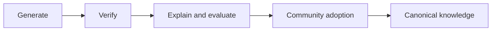

# Understanding Is the Bottleneck

## Editorial Status

The title remains unchanged. This outline is centered on understanding as a
general human and organizational capability: how people turn abundant output
into a useful model, evaluate what matters, and keep solutioning connected to
evidence and customer experience.

## Overview

AI makes drafts, analyses, prototypes, and implementations abundant. The scarce
organizational capability is increasingly the ability to interpret that output:
to understand what a team has learned, connect it to customer experience, frame
the right problem, and determine which proposed solution deserves a test.

Producing more answers does not resolve this bottleneck. People must listen
across roles, separate evidence from interpretation, preserve consequential
disagreement, and build a working model that others can test and revise. The
useful output is not merely another artifact. It is a greater shared capacity
to reason and act.

This requires technical and product judgment, but it also requires empathy.
Customers do not experience a roadmap, architecture, or ticket queue. They
experience a situation. A team cannot reliably solve for them unless it remains
close to that situation and can recognize which consequences matter.

## Core Thesis

When producing output is expensive, execution limits progress. When plausible
output becomes abundant, shared understanding limits progress.

People and teams respond by strengthening their ability to:

- observe customers and systems more accurately;
- distinguish evidence from interpretation;
- name the problem before converging on a solution;
- surface important disagreements and missing context;
- translate insight into testable action;
- learn from consequences; and
- retain that learning so the next decision starts from a stronger model.

The advantage comes from making solutioning more capable and distributed while
keeping meaning, evidence, and accountability intact.

## Relationship to the Series

This is the third essay:

1. **Goals, Solutions, and Value** establishes the human stakes that make an
   opportunity worth pursuing.
2. **Truth, Entropy, and Inference** explains why AI can be fluent and coherent
   in some domains while remaining weakly grounded in others.
3. **Understanding Is the Bottleneck** defines the human and organizational
   capability needed to direct and evaluate abundant output.
4. **The Knowledge Factory** turns that capability into an organizational
   operating system.

## Intended Reader

Developers, designers, researchers, product practitioners, founders, and
leaders who use AI-generated work or help a group improve its decisions and
problem-solving capacity.

## Key Terms

- **Understanding:** a provisional working model of the relevant people,
  entities, relationships, causes, constraints, and consequences that supports
  better prediction and action.
- **Solutioning:** the collective capability to frame a problem, generate
  interventions, test them, and revise the model—not merely the act of proposing
  features.
- **Distillation:** compressing many observations into a useful model while
  preserving uncertainty, dissent, provenance, and consequential detail.
- **Evaluative closure:** enough relevant understanding, evidence, criteria, and
  authority to accept, revise, reject, or stop without pretending to have
  certainty.
- **Customer empathy:** disciplined contact with how a situation is experienced,
  including the customer's goals, costs, habits, fears, incentives, and trust.

## Editorial Guardrails

- Do not present an expert, leader, or AI system as an oracle that possesses
  understanding on behalf of everyone else.
- Do not romanticize empathy as intuition. It must be informed by observation,
  evidence, participation, and correction.
- Do not use “solutioning” to mean premature brainstorming before the problem is
  understood.
- Do not argue for endless analysis. Action and feedback are part of
  understanding.
- AI can contribute to interpretation and discovery; the narrower claim is that
  people and institutions remain accountable for which model guides action.
- Attribute claims from Terence Tao's talk to Tao, and distinguish the recorded
  lecture, the accompanying essay, and the article's application of the example
  to organizational understanding.

## Section Notes

### 1. When Verification Outruns Understanding

Open with AI-assisted mathematics because it provides an unusually clean case
of output becoming abundant while understanding remains scarce. Mathematical
work can separate three operations that ordinary knowledge work often blends:

1. **Generation:** produce candidate conjectures, proofs, counterexamples,
   programs, and intermediate lemmas.
2. **Verification:** determine whether an artifact satisfies stated formal
   constraints through expert review, tests, or a proof assistant.
3. **Interpretation and adoption:** determine whether the formalization matches
   the intended question, what the result teaches, why it matters, how it should
   be explained, and whether it belongs in the field's reusable knowledge.

Terence Tao's 2026 ICM talk,
[“Mathematics in the Age of AI”](https://www.simonsfoundation.org/2026/08/13/fields-medalist-terence-tao-on-artificial-intelligence-and-why-we-do-math/),
and the accompanying
[essay](https://arxiv.org/abs/2608.16753) provide the organizing example. Tao
asks the mathematical community to assume that AI will perform a meaningful
share of research-level tasks, then examine the harder question this abundance
exposes: what are the actual goals and values of mathematical work?

Solving or verifying a proof is only the beginning of the pipeline. The result
must still be explained, evaluated, attributed, reviewed, connected to other
work, taught, and eventually incorporated into the field's canonical knowledge.
If proof generation accelerates faster than those downstream practices, the
community develops what Tao calls **proof indigestion**: candidate proofs outrun
verification, verified proofs outrun explanation, and published work outruns
collective absorption.

A formal certificate can establish that a derivation follows from encoded
definitions and axioms. It cannot by itself establish that the encoding
faithfully represents the informal question, that the result is significant,
or that anyone has developed a transferable understanding of why it works. Tao
proposes a practical test: authors should be able to give a clear, correct, and
properly attributed expert talk about a result before it is treated as complete,
even when the proof has been formally verified.

The recent OpenAI unit-distance result gives the opening a concrete case. Its
proof was checked by external mathematicians, while OpenAI's own account still
concludes that people choose important problems and interpret their
significance: [“An OpenAI model has disproved a central conjecture in discrete
geometry”](https://openai.com/index/model-disproves-discrete-geometry-conjecture/).
The [Leiden Declaration on Artificial Intelligence and
Mathematics](https://leidendeclaration.ai/) adds the institutional requirements:
correctness must sit alongside understanding, depth, attribution, transparency,
and human direction of research.

This connects directly to **Truth, Entropy, and Inference**. Mathematics is
unusually pattern-dense and mechanically constrained, so AI systems can search
and verify candidate work at extraordinary scale. The case then reveals the
next bottleneck: even where correctness can be checked, someone must interpret
what the output means, decide what deserves attention, connect it to existing
knowledge, and make it usable by other people.

The opening question becomes:

> **What becomes scarce when a system can produce more correct work than a
> community can understand, evaluate, and absorb?**

That is not only a question for mathematicians. Every organization can produce
more research summaries, analyses, specifications, designs, and code than its
people can integrate into a responsible model of what to do next. Formal
verification makes the boundary unusually visible; understanding is the general
organizational bottleneck.

### 2. What Understanding Adds

After the opening, widen to a team producing more than ever: research summaries,
dashboards, customer transcripts, prototypes, pull requests, and AI-generated
options. The team's problem is no longer a lack of artifacts. It is an inability
to determine what all the artifacts mean together.

Moving from output to understanding requires five operations:

1. listen for evidence and lived stakes;
2. separate observations from proposed explanations;
3. name the consequential relationships and disagreements;
4. return a clearer, testable problem frame to the team; and
5. expand who can reason from that frame.

The result is not merely a decision. It is a provisional model that increases
the group's capacity to predict, test, and solve.

### 3. Distillation Is Not Summarization

A summary makes material shorter. Distillation identifies which distinctions
must survive compression for a decision to remain sound.

Good distillation preserves:

- whose experience is represented;
- what was directly observed;
- what is inferred;
- what remains disputed;
- which constraints are hard or negotiable;
- which tradeoffs are being accepted; and
- what evidence would overturn the current model.

AI can summarize at scale. People must determine the criteria by which a
summary becomes meaningful context for the present decision.

### 4. Keep Problem Framing Close to the Work

Extract the solvable structure from noisy organizational experience without
extracting the right to solve from the people closest to the work.

The failure mode is a gate: teams collect evidence, but only a small authority
layer may frame problems or authorize solutions. This destroys context,
increases queueing, and teaches engineers to wait for tasks.

The alternative is shared capability. Teams receive the context, decision
boundaries, problem-framing tools, and authority needed to propose and test
solutions inside explicit constraints.

### 5. Build Shared Problem-Solving Capacity

Describe practices that make understanding easier to build and share:

- problem briefs that distinguish symptoms, causes, stakes, and assumptions;
- shared domain vocabulary;
- decision records with evidence and rejected alternatives;
- pre-mortems and adversarial review;
- customer contact across product, design, and engineering;
- small experiments with explicit learning goals;
- retrospectives that update the model, not only the process; and
- coaching that asks better questions before supplying answers.

The goal is for more people to recognize a poorly framed request, surface a
missing constraint, and connect technical choices to customer consequences.

### 6. Empathy Is Part of the Evidence System

Customer empathy is how teams remain connected to stakes that do not appear in
telemetry alone. A metric can show abandonment; empathy helps investigate the
confusion, fear, broken trust, interrupted workflow, or competing obligation
behind it.

Empathy should be operationalized through contact:

- interviews and observation;
- support and sales evidence;
- usability sessions;
- participation in the workflow where possible;
- attention to non-users and excluded users; and
- follow-up after a solution changes behavior.

The point is not that customers dictate features. It is that solutioning begins
with an accountable interpretation of their situation.

### 7. Five Dimensions of Product Understanding

Use a compact model:

1. **Human:** goals, experience, behavior, trust, and consequences.
2. **Domain:** entities, relationships, rules, exceptions, and language.
3. **System:** architecture, dependencies, state, failure modes, and operations.
4. **Economic:** incentives, opportunity cost, distribution, and sustainability.
5. **Epistemic:** evidence quality, uncertainty, assumptions, and disconfirming
   tests.

No one person needs every fact. The group needs enough shared understanding
across these dimensions to predict what an intervention will change and
recognize when the prediction fails.

### 8. AI Can Accelerate Understanding—and Simulate It

AI can search, cluster observations, generate hypotheses, identify missing
questions, compare explanations, and propose tests. These are real
contributions to understanding.

It can also generate a polished explanation before the organization has earned
the model. Fluency can conceal missing customer contact, weak evidence, or an
undefined term. Therefore every important synthesis should expose:

- its source evidence;
- its assumptions;
- plausible competing explanations;
- its confidence and limits; and
- the next observation that would discriminate among alternatives.

### 9. Understanding Is Organizational, Not Merely Individual

An insight trapped in one person's head is a throughput constraint. Shared
understanding becomes visible through language, models, decisions, tests,
interfaces, and repeated behavior.

The organization needs mechanisms that let teams retrieve why a decision was
made, trace concepts to evidence, see where contexts differ, and update the
model after outcomes arrive. This is the bridge to the knowledge factory.

### 10. Action Completes the Loop

Understanding is demonstrated by better prediction and revision, not by the
feeling of clarity. Teams must act at a scale that makes learning affordable,
observe the result, and update their shared model.

Use the loop:

> Observe → interpret → frame → propose → test → experience consequences →
> revise.

The discipline is to improve the loop's fidelity and speed without allowing
speed to erase meaningful context.

### 11. Understanding Is a Skill to Look For

As generated output becomes cheaper, the ability to turn it into a grounded,
testable model becomes more valuable. Organizations should look for, develop,
and reward people who can:

- synthesize across customer, product, engineering, and business evidence;
- teach problem framing and experimental reasoning;
- distribute decisions with clear constraints;
- protect contact between builders and customers;
- make assumptions and disagreement inspectable;
- build durable context rather than presentation theater; and
- recognize when AI-generated coherence has outrun comprehension.

This capability is not confined to management. It may appear in an engineer who
finds the missing constraint, a designer who connects behavior to lived
experience, a support specialist who recognizes a recurring causal pattern, or
a researcher who distinguishes evidence from a compelling story. Leadership is
one place to look for the skill, but the organizational advantage comes from
making it common across roles.

## Visual Notes

1. **Proof abundance:** generation → verification → explanation and evaluation →
   community adoption → canonical knowledge, with bottlenecks accumulating at
   each downstream stage.
2. **Correctness versus understanding:** a formally verified artifact contrasted
   with the human work required to interpret, teach, value, and reuse it.
3. **Understanding as a multiplier:** team signals flow through distillation and
   return as shared context, clearer boundaries, and greater team autonomy.
4. **Gated versus distributed solutioning:** a queue through one decision-maker
   contrasted with multiple teams operating inside shared context.
5. **The understanding loop:** observe → interpret → frame → test → revise.

## Experiment TODOs

- [ ] Create a test app with tasks that are computationally simple but difficult
  for a person to complete. Identify the points where the user cannot proceed—the
  “user can't” experience—then have AI redesign that experience and evaluate
  whether the intervention helps the user succeed.

## Research Queue

- Terence Tao's ICM lecture and accompanying essay on the goals and values of
  mathematical research, the proof pipeline, proof indigestion, and the
  expert-talk test. Attribute quotations to the correct version.
- The primary paper and external mathematical review for the OpenAI
  unit-distance result; keep generation, formal verification, independent
  checking, significance, and attribution distinct.
- The Leiden Declaration's recommendations on verification, understanding,
  transparency, attribution, and human direction of mathematical work.
- Research on how expert communities turn individually correct results into
  shared, teachable, cumulative knowledge.

## Candidate Closing Line

> In an age of abundant answers, the scarce skill is building enough shared
> understanding to know what deserves to be solved—and whether an answer
> survives contact with the world.
