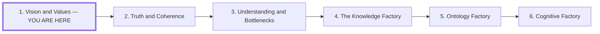

# Vision and Values

## Role in the Series

**Question:** How do we retain strategic agency when AI can supply a convincing
direction for almost anything?

**Core claim:** You will lose on strategy if you defer to AI.

**Thesis:** An organization that substitutes model advice for strategic judgment
risks surrendering the distinctions, commitments, and understanding that could
give it an advantage. AI can support research and reasoning; people must develop
the vision, choose tradeoffs, and remain accountable for results. Shared intent
lets teams exercise that judgment independently.

**Organizational question:** How can autonomous teams pursue a shared strategy
without waiting for one central figure to interpret every situation?

## Audience

People shaping product, strategy, design, or engineering work with AI, including
leaders responsible for the direction of multiple teams.

## Preface and Series Position

Draft preface:

> This series asks how people and organizations can turn AI capability into
> valuable work. We begin with strategic agency: the ability to choose a
> direction, explain why it matters, and revise it through experience. Imagine
> several teams navigating the same terrain. AI can propose routes; the
> organization must decide which destination is worth reaching and which costs
> it will accept. This article develops that distinction from plausible advice
> to shared intent that teams can act on independently.

Place the compact series map immediately after the preface and before section 1.
Use the same six titles and order in each article; label the current position
in text as well as visually. The arrows indicate reading order.

The next article examines how we judge the information used to choose and test
those routes. In the eventual article, link all six entries to their stable
article routes; preserve the existing truth-and-inference slug.

## Outline

### 1. You Will Lose on Strategy if You Defer to AI

Open with the failed nine-hour planning example: plausible recommendations
accumulate while the team contributes too little judgment about what matters.

- Use strategy research to establish the work of choosing a strategy: diagnosis,
  distinctive commitments, tradeoffs, and coordinated action.
- Trace the proposed failure mechanism from omitted local understanding to
  plausible defaults, undifferentiated choices, and consequences.
- Establish the core claim through that mechanism. Advice studies do not prove
  that every AI-assisted strategy loses in competition.

### 2. Advice Can Feel Specific Before It Becomes Useful

The Barnum effect explains how broadly applicable advice can feel personally
insightful. The recipient may supply specificity the answer has never earned.

- Compare one generic recommendation across two situations requiring different
  choices; identify the missing distinction.
- Separate perceived specificity, sycophancy, factual error, and deception.
- Domain fluency can make advice persuasive before its strategic relevance is
  established. Develop its productive use in *Truth and Coherence*.

### 3. Language Carries Only Part of What We Mean

Words such as “quality,” “growth,” and “trust” can conceal different priorities,
experiences, and acceptable sacrifices. Connect linguistic gaps to subjective
meaning: what does an outcome mean to those who want it and those who bear costs?

- Make tacit priorities visible through examples, counterexamples, and actual
  tradeoffs. Use “maximize engagement” as a compact case.
- Keep preference, truth, value, and successful action distinct.
- Keep the practical argument about representations and accountability
  independent of an unproved claim about machine consciousness.

### 4. Explain Why the Chosen Action Should Matter

Connect values to a causal account: what change should this action produce,
for whom, and under which conditions?

- Use the causal ladder as supporting material: observation, intervention, and
  counterfactual questions in one strategic example.
- Causal predictions help examine choices; values determine which effects are
  desirable and which costs are acceptable.
- Training, system instructions, and product incentives also shape model advice.
  Examine inherited defaults when they conflict with local goals.

### 5. Make Strategic Intent Usable Throughout the Organization

Teams need enough understanding of the strategy to interpret situations the
original plan never anticipated. Requiring every interpretation to travel
through one director limits independent judgment.

Make the following shared and contestable:

- the desired future, diagnosis, and reasons for pursuing it;
- priorities, non-goals, and unacceptable tradeoffs;
- local decision rights and commitments that affect other teams;
- assumptions and evidence that would change the direction; and
- a route for teams to challenge strategy with what they learn.

Use two teams facing different choices to show how shared intent guides
compatible action. Label the example as a composite unless sourced.

### 6. Develop and Contribute Strategic Judgment

Close on understanding the situation, making commitments, explaining reasons,
and revising them when consequences disagree.

- AI can research, compare, challenge, and generate options within this work.
- Decision authority can be distributed; accountability must remain explicit.
- Preserve dissent and corrigibility. Human judgment can fail too.
- Use a compact context contract to express this reasoning; completing a
  template does not supply a strategy.

## Supporting Material and Research Obligations

- Start with the [strategy review](research/research-review.md) and
  [series source audit](research/ai-factory-series-sources-audit.md); verify the
  underlying sources before claiming measured competitive consequences.
- Preserve distinctions and limits in the
  [Barnum research](research/barnum-effect-and-ai-advice.md).
- Source the causal ladder. A plausible causal story does not establish that an
  intervention works or which effects an organization should value.
- Verify any TypeSafe/Jev attribution before retaining it. Do not present
  engagement as every model's literal objective.
- Keep governing versus instrumental decisions and the possibility that a
  coherent value hierarchy can still be wrong.

## Figure Plan

**Recurring motif: teams navigating a landscape.** Introduce it in the preface
and develop it through three illustrations. Reuse the terrain, team markers,
and destination symbols so the reader can see what changes.

| Illustration and placement | What it shows | Intended takeaway |
| --- | --- | --- |
| **Plausible routes**, after section 2 | The same generic route recommendation applied to two teams with different destinations and constraints. | Advice needs situational distinctions before it can guide a choice. |
| **Choosing the destination**, after section 4 | A desired outcome, competing routes, explicit sacrifices, and uncertain causal links between actions and effects. | Values choose what matters; causal reasoning examines how to reach it. |
| **Shared direction, local routes**, in section 5 | Teams choose local paths under shared intent and report obstacles that can revise the plan. | Strategic alignment can support independent judgment. |

Use Mermaid for the semantic compositions. Treat routes as conceptual choices,
not measured distances or guaranteed outcomes. Captions explain each new
distinction; the preface map is separate navigation, outside the three figures.

## Handoff

*Truth and Coherence* asks how people and teams recognize good inputs and outputs
while testing the claims on which their strategy depends.
