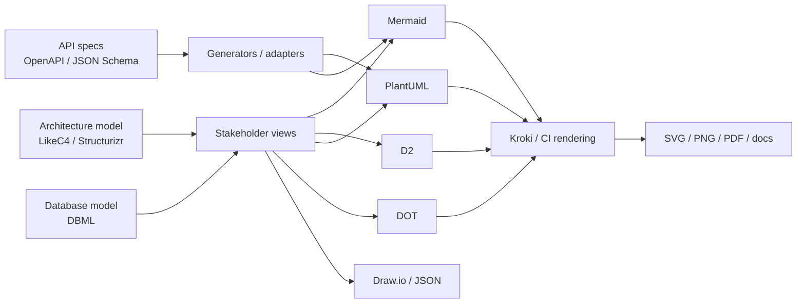
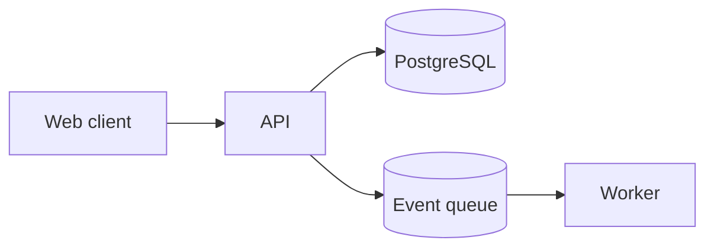
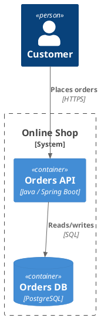
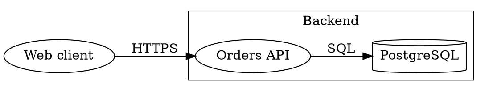
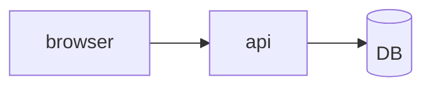
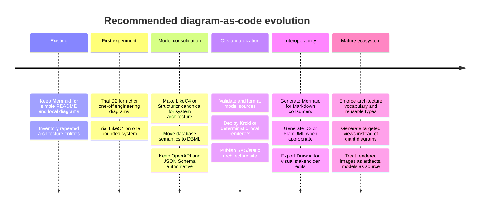

# Textual System-Design Languages and Diagramming Ecosystems Beyond Mermaid and ERDs

## Executive summary

The most important conclusion is that **“a better Mermaid” is not one product category**. There are at least four substantially different things you may want from a diagramming system:

1. a **concise diagram language** that is easier to read and factor than Mermaid;
2. a **modeling language** where architecture entities are defined once and projected into many views;
3. a **specialized schema language** for databases or APIs;
4. a **rendering/collaboration layer** that lets several syntaxes coexist.

That distinction matters because Mermaid is fundamentally very good at **diagram-as-code**—a text block closely corresponds to a particular visual—but it has much weaker facilities for defining an architecture model once, creating reusable semantic types, splitting that model across files, and generating many stakeholder-specific views. The C4 tooling guidance makes essentially the same distinction: model-based tools let elements and relationships be defined once and reused/queryed across multiple diagrams, whereas pure diagramming languages tend to duplicate “boxes and lines” between views. citeturn5search0turn5search1

**My strongest overall recommendation is a small ecosystem rather than one universal DSL:**

| Need | Recommended first choice | Why |
|---|---|---|
| General-purpose “Mermaid, but more programmable/readable” | **D2** | Classes, variables, imports, globs, containers, separate style/content, multiple layout engines, CLI/watch mode, editor plugins. citeturn21view0turn21view1turn21view2 |
| Long-lived system architecture | **LikeC4** | Model-first DSL, custom semantic element kinds, model projections, excellent LSP/IDE workflow, Git/CI validation, JSON/Draw.io export, and code generation to Mermaid, DOT, D2, and PlantUML. citeturn22view0turn22view1 |
| Strict/reference C4 architecture governance | **Structurizr DSL** | C4 reference implementation, archetypes, includes, workspace extension, documentation/ADRs, scripting/plugins, and broad exporters. citeturn16search12turn22view2turn22view3 |
| Database schemas / ERDs | **DBML + dbdiagram** | Purpose-built schema-as-code, reusable `TablePartial`s, named views, Git-oriented CLI, editor preview, SQL interop. citeturn9search0turn9search1turn9search2 |
| UML / very broad established ecosystem | **PlantUML + C4-PlantUML** | Powerful preprocessor/includes, standard libraries, many diagram types, years of editor/build-system integrations, C4 macros. citeturn1search1turn16search21turn17search4 |
| Multi-language CI rendering | **Kroki** | One render API for Mermaid, D2, PlantUML/C4, Graphviz, DBML, Nomnoml, Excalidraw, diagrams.net and many others; self-hostable. citeturn17search11turn4search15 |
| Huge graph/layout backend | **Graphviz/DOT** | DOT is a durable interchange target and Graphviz offers several layout engines, including `sfdp` specifically intended for large graphs. citeturn4search12turn4search18 |
| Programmatic/cloud-topology diagrams | **Diagrams for Python** | Actual Python abstractions—functions, loops, classes, reusable modules—plus extensive cloud/Kubernetes icon sets and Graphviz rendering. citeturn16search6turn6search0 |
| Collaborative hand-edited final diagrams | **draw.io** or **Excalidraw** | Both have strong interactive editing; draw.io has unusually good import/export and structured XML/JSON, while Excalidraw excels at rapid collaborative whiteboarding. citeturn19search8turn19search13turn17search5 |
| Enterprise synchronous visual collaboration | **Lucidchart** | Real-time collaboration, integrations, APIs/extensions, data imports and ER tooling, but less Git/text-centric. citeturn18search1turn19search0turn19search3 |
| Interactive layout of very large graph data | **yEd / yEd Live** | Excellent automatic graph-layout portfolio and GraphML/JSON/GML/TGF/basic-DOT ingestion, although yEd itself should not be used as an automated CI renderer under its application license. citeturn18search0turn18search3 |

For your particular requirements, I would investigate **LikeC4 and D2 first**, then **Structurizr DSL**, while retaining Mermaid as an output/embedding language rather than necessarily making it the source of truth. LikeC4 is particularly interesting because its CLI can generate **Mermaid, DOT, D2, PlantUML, Draw.io, and JSON** from the same architecture model. That makes it much closer to an architectural intermediate representation than to “yet another diagram syntax.” citeturn22view1

A particularly compelling target architecture is:



In other words: **treat Mermaid as one renderer-facing representation, not necessarily the highest-level authoring language.**

## The architectural distinction that matters

Mermaid, D2, PlantUML and DOT are often grouped together as “diagrams as code,” but their abstraction levels are quite different. Mermaid explicitly optimizes for text-defined diagrams embedded in documentation; it now has dedicated architecture-diagram syntax, configurable layouts including ELK, and a very broad integration ecosystem. Mermaid’s CLI can also transform Markdown containing Mermaid into generated assets. citeturn0search0turn0search4turn20search13

Where Mermaid starts feeling limiting is **semantic reuse**. You can reuse surrounding Markdown/templates or generate Mermaid programmatically, but the Mermaid grammar itself is not comparable to a programming language with imports/classes/functions, nor to a model-first architecture DSL whose elements live independently of particular diagrams. Its extension ecosystem is strongest around editors, documentation systems, rendering, themes and integrations rather than arbitrary user-defined additions to the language grammar. That is an inference from Mermaid's documented syntax/configuration and integration model. citeturn0search2turn0search6turn0search7

D2 is almost exactly the next step along the **diagram-language** axis. It explicitly provides imports, variables, globs, classes, containers, an autoformatter and a language API. D2’s design documentation says that content and visual design should be separable and that imports can modularize a diagram into several files. It is deliberately optimized for software documentation rather than every conceivable chart type. citeturn21view0turn21view1turn21view2turn21view3

LikeC4 and Structurizr move another step upward: **you author the architecture model, then define views over it**. LikeC4 merges `.c4`/`.likec4` files into a single model and separates `specification`, `model`, and `views`; a project can naturally split services, externals, specifications and views into separate files. Structurizr similarly stores a model plus multiple views, documentation and architecture decision records, and its DSL adds archetypes, includes, scripts/plugins and workspace extension. citeturn22view0turn2search26turn22view2turn22view3

This leads to a useful continuum:

| Abstraction level | Representative forms | What the source primarily describes |
|---|---|---|
| Low-level graph | DOT | Nodes, edges, clusters and rendering attributes |
| Diagram DSL | Mermaid, D2, Nomnoml, PlantUML | One visual/interaction structure |
| Domain-specific schema DSL | DBML | A database schema plus selected ERD views |
| Architecture-model DSL | LikeC4, Structurizr DSL | Systems/components/relationships independent of individual diagrams |
| General programming language | Python Diagrams | Arbitrary program that generates a graph |
| Structured visual model | draw.io XML/JSON, Excalidraw JSON | Editable visual scene/document |
| External specification | OpenAPI, JSON Schema | API/data semantics that can be transformed into diagrams |

The **model-first layer is the most significant upgrade** for system design. C4 itself is notation/tool independent and defines systems, containers, components and code as different abstraction levels, along with supporting landscape, dynamic and deployment views. citeturn5search1

There is also no reason for a textual architecture ecosystem to insist on one renderer. Kroki demonstrates the opposite model: its unified API currently handles Mermaid, D2, PlantUML/C4, Graphviz, DBML, Nomnoml, Excalidraw, diagrams.net experimentally, and many more syntaxes. citeturn17search11turn17search7

## Comparative landscape

The ratings below are **relative to your stated system-design requirements**, not generic product scores. `A` means unusually strong/native support, `B` means useful but incomplete or dependent on adjacent tooling, and `C` means weak/non-core. Scalability is qualitative because the projects do not publish directly comparable benchmarks.

| Tool / language | Abstraction & reuse | Editor / collaboration | Git, CI & docs | Interop & outputs | Large-diagram story | License / deployment | Overall fit |
|---|---|---|---|---|---|---|---|
| **[Mermaid](https://mermaid.js.org/)** | **C+**. Subgraphs, architecture/ER/UML-like syntaxes and configuration, but little native language-level modularity/templates. | **A-**. Live Editor, Mermaid Chart, VS Code/JetBrains and extensive integrations. | **A**. Excellent Markdown fit; `mermaid-cli` works locally/CI. | **B-**. Excellent embeddability; SVG/PNG/PDF tooling, but weak as interchange/model IR. | **B**. ELK helps complex diagrams; default config has `maxEdges: 500`. | Core OSS; local/browser/CLI plus commercial Mermaid Chart. | **Keep as ubiquitous presentation syntax**, not necessarily your architecture source of truth. citeturn0search2turn0search3turn0search7turn20search13 |
| **[D2](https://d2lang.com/)** | **A**. Classes, variables, imports, globs, containers, composition and language API. | **A-**. Official VS Code/Vim support, preview, playground and formatting; less first-party synchronous collaboration than SaaS canvas tools. | **A**. CLI/watch mode, stdin/stdout and doc-oriented design. | **B+**. SVG/PNG/PDF and additional composition formats; community integrations, but not intended as a universal converter. | **B+** for architecture diagrams; authors explicitly say D2 is not intended for graph-theory-scale ~1000-node visualizations. | MPL-2.0; offline/self-hosted CLI. | **Best direct “Mermaid++” candidate.** citeturn21view2turn21view3turn12search4 |
| **[LikeC4](https://likec4.dev/)** | **A+**. Custom element/relationship kinds, one merged model, predicates, views and deployment model. | **A**. First-party VS Code integration, validation, completion, navigation, rename, preview and LSP. | **A+**. `validate`, `format --check`, static sites, Vite/React/Web Components, GitHub Actions. | **A+**. Generates Mermaid, DOT, D2 and PlantUML; exports Draw.io and JSON. | **A-** conceptually through projected views; local Graphviz recommended for better performance on large Draw.io exports. | MIT; CLI/static-site/Docker friendly. | **Best modern architecture-model DSL for your criteria.** citeturn22view0turn22view1turn11search2 |
| **[Structurizr DSL](https://docs.structurizr.com/dsl)** | **A+**. C4 model, archetypes, includes, workspace extension, expressions, scripts/plugins, docs and ADRs. | **A-**. Web UI/local/server plus VS Code and community language-server tooling. | **A+**. Designed for Git/versioned workspaces and automation. | **A**. Exporters include Mermaid, PlantUML, C4-PlantUML, static HTML, PNG/SVG and workspace JSON. | **A-** through model/view decomposition rather than putting everything on one canvas. | Free/open local tooling; current self-hosted `server` has an open-core/build-from-source path and licensed prebuilt enterprise offering. | **Best rigorous/reference C4 ecosystem.** citeturn22view2turn22view3turn2search10turn15search5turn15search2 |
| **[PlantUML](https://plantuml.com/)** | **A-**. Preprocessor variables, procedures/functions, includes, JSON preprocessing, themes and a large standard library. | **A-**. Mature integrations across VS Code, IntelliJ, Eclipse, Emacs, docs systems and web server. | **A**. Straightforward CLI/server automation and many build/documentation integrations. | **A-** for UML ecosystem; external generators connect OpenAPI and source-code models. | **B+**. Mature automatic layout, although it remains diagram-oriented rather than model/view-oriented. | Multi-licensed; self-hostable PlantUML Server. | **Best established textual UML ecosystem.** citeturn1search1turn16search1turn16search13turn10search9 |
| **[C4-PlantUML](https://github.com/plantuml-stdlib/C4-PlantUML)** | **A** within C4. Reusable macros/stereotypes for system, container, component, dynamic and deployment diagrams. | **A-**, inherited from PlantUML. | **A**, inherited from PlantUML. | **B+**. C4 ↔ PlantUML; Structurizr can export into it. | **B+**. Good for controlled C4 views, less ideal as one huge system graph. | MIT. Repo remained active in 2026. | **Excellent if your team already knows PlantUML.** citeturn4search2turn17search4turn2search10 |
| **[Graphviz / DOT](https://graphviz.org/)** | **C+**. Subgraphs/clusters and extensive attributes but no native application-level type/template system comparable with D2/LikeC4. | **C+** as an authoring environment; usually consumed through external editors/tools. | **A**. Stable, scriptable command-line foundation. | **A** as a graph/layout backend and interchange target; SVG/PDF/images. | **A+**. Multiple specialized layout engines; `sfdp` is designed for large graphs. | EPL-2.0 since 2026; local/self-hosted. | **Best renderer/layout substrate, not best human architecture DSL.** citeturn4search3turn4search14turn4search18turn10search3 |
| **[Diagrams for Python](https://diagrams.mingrammer.com/)** | **A** because the abstraction mechanism is Python itself: functions, loops, classes and modules. | **B+**. Any Python IDE plus an official browser playground with preview/autocomplete. | **A**. Natural unit tests/build scripts/repo integration. | **B+**. Graphviz-based; can emit PNG/JPEG/SVG/PDF/DOT; huge cloud/Kubernetes provider vocabulary. | **B+** depending on Graphviz/layout and program structure. | MIT; fully local/open source. | **Best when architecture generation needs real programming logic.** citeturn16search6turn6search0turn6search6 |
| **[DBML / dbdiagram](https://dbml.dbdiagram.io/)** | **A+** for relational data. Reusable `TablePartial`, aliases, constraints/indexes and as-code diagram views. | **A** for database work. VS Code live ERD and hosted dbdiagram collaboration. | **A**. CLI supports schema/layout synchronization and CI-oriented workflows. | **A** for SQL/schema interop, **C** for general architecture formats. | **B+**; specialized views help avoid one monolithic ERD. | DBML is open-source; dbdiagram is commercial SaaS with free/paid tiers and paid capabilities. | **Best complement to an architecture DSL for database design.** citeturn9search0turn9search1turn8search3turn9search2 |
| **[Nomnoml](https://nomnoml.com/)** | **B**. Very concise UML-like language, custom classifier styles and `#import`. | **B**. Lightweight browser editor; CLI/package available. | **B**. Easy source control, less sophisticated CI/editor ecosystem. | **C+**. Mostly its own UML syntax/rendering. | **C+**. Best for modest diagrams. | MIT. | **Attractive minimalist syntax, but ecosystem is much smaller than D2/PlantUML.** citeturn8search0turn16search3 |
| **[Kroki](https://kroki.io/)** | **—**. It is a renderer gateway rather than a DSL. | **B**. APIs and integrations rather than a canonical editor. | **A+**. Ideal centralized CI/doc-site rendering service. | **A+** for accepting many syntaxes, though it **renders rather than semantically translating** among them. | **A- operationally**, configurable concurrency/timeouts; underlying renderer limitations still apply. | MIT; public service or Docker/self-managed deployment. | **Strongest glue layer for a polyglot diagram strategy.** citeturn17search11turn4search13turn16search27 |
| **[Excalidraw](https://excalidraw.com/)** | **C** as a textual language; JSON is structured scene data rather than a pleasant hand-authored DSL. | **A+**. Excellent realtime collaborative sketching/whiteboarding. | **B**. JSON files and VS Code integration can be versioned, but diffs are not comparable to a concise DSL. | **B+**. JSON/PNG/SVG and newer PDF/PPTX offerings; SDK/API integration. | **B-** for large engineered graphs; optimized for human whiteboarding. | OSS editor is MIT and self-hostable; Excalidraw+ currently lists $6/user/month annually, with self-hosting documentation also available. | **Best collaborative sketch layer alongside, not instead of, architecture-as-code.** citeturn17search5turn17search29turn18search2turn18search12 |
| **[draw.io / diagrams.net](https://www.drawio.com/)** | **B**. Templates/libraries plus structured XML/JSON, but not primarily a textual DSL. | **A**. Mature general visual editor. | **B+**. GitHub/GitLab storage and structured files are useful; automation is possible but less elegant than source DSLs. | **A+**. Imports Mermaid, SQL, Lucidchart, VSDX and more; exports XML/JSON/PNG/SVG/PDF/HTML. | **B+** with strong manual control. | Apache-2.0 open source; browser, desktop and deployable web editor. | **Best editable visual interchange/escape hatch.** citeturn19search8turn19search13turn17search2 |
| **[Lucidchart](https://lucid.co/lucidchart)** | **B+**. Templates, data-driven shapes, Extension API and Standard Import; less source-first. | **A+**. Real-time team collaboration is core. | **B**. REST API/integrations enable automation, but Git plaintext is not the primary workflow. | **B+**. APIs, standard JSON import, SQL schema import and conventional visual exports. | **B+** as a managed visual application. | Commercial SaaS. | **Best when simultaneous business/engineering collaboration matters more than Git-native text.** citeturn18search1turn19search1turn19search3turn19search14 |
| **[yEd / yEd Live](https://www.yworks.com/products/yed-live)** | **B**. Structured graph model, grouping/custom palettes rather than source-language abstraction. | **A-**. Excellent interactive editing and automatic layouts; not positioned as simultaneous textual collaboration. | **C+**. yEd desktop's license explicitly disallows use in an automated process. | **A-**. GraphML plus JSON/GML/TGF/basic DOT imports; PNG/SVG/PDF output in yEd Live. | **A+**. yWorks explicitly positions its automatic layouts for large data sets. | yEd/yEd Live free to use under proprietary terms; yFiles is the commercial SDK route. | **Excellent exploratory/large-graph visualizer, weak choice for CI rendering.** citeturn18search0turn18search3 |

A useful takeaway from that table is that **D2 and LikeC4 solve different problems despite superficially competing with each other**. D2 says “describe a diagram more cleanly and programmatically”; LikeC4 says “describe the architecture and derive diagrams from it.” Structurizr takes the latter approach even further into architecture governance and documentation. citeturn21view3turn22view0turn16search28

## Syntax and workflow examples

The differences are clearer in source code than in feature checklists.

**Mermaid baseline.** Modern Mermaid has more architecture capability than it used to: architecture diagrams became an explicit syntax, ELK can be selected for more complex layouts, and the Live Editor/editor integrations make it exceptionally convenient for docs. citeturn0search4turn0search3turn0search2



The advantage is obvious: essentially no ceremony. The downside appears when “API” needs to be defined in fifteen diagrams with consistent technology metadata, styles and relationships.

You can render experiments in the official [Mermaid Live Editor](https://mermaid.live/).

**D2: turn repeated visual conventions into reusable language constructs.** D2 classes aggregate attributes, variables use `${...}` substitutions, imports modularize sources, and globs can apply changes across sets of objects. citeturn21view0turn21view1turn21view2

A representative D2 style is:

```d2
classes: {
  service: {
    shape: rectangle
    style.stroke-width: 2
  }
  datastore: {
    shape: cylinder
  }
}

client: Web client

api: API {
  class: service
}

db: PostgreSQL {
  class: datastore
}

worker: Worker {
  class: service
}

client -> api: HTTPS
api -> db: SQL
api -> worker: enqueue
```

Instead of encoding different shapes through punctuation such as Mermaid's `[(...)]`, D2 generally favors explicit properties. Its authors explicitly describe that readability tradeoff in the design rationale. citeturn21view3

A larger repo can conceptually become:

```text
architecture/
  model.d2
  styles.d2
  payments.d2
  identity.d2
  production.d2
```

with imports separating content, sub-systems and styling. D2 explicitly supports splitting models and views into imported files. citeturn21view2turn21view3

The official [D2 playground](https://play.d2lang.com/) is useful for evaluating the authoring experience.

**LikeC4: move the source of truth above the diagram.** LikeC4 explicitly separates specifications, models and views, and merges all `.c4`/`.likec4` files in a project into one architecture model. citeturn22view0

A representative model looks conceptually like this:

```text
specification {
  element actor
  element system
  element service
  element database

  relationship uses
  relationship reads
}

model {
  customer = actor "Customer"

  shop = system "Online Shop" {
    api = service "API"
    db  = database "Orders DB"
  }

  customer -> shop.api "uses"
  shop.api -> shop.db "reads/writes"
}

views {
  view context {
    include customer
    include shop
    include customer -> shop.api
  }

  view backend {
    include shop.*
  }
}
```

The important difference is not punctuation. It is that `shop.api` is **one model entity**, while `context` and `backend` are projections. Add another view and you do not redefine the API.

The same model can then feed several downstream ecosystems:

```bash
likec4 validate
likec4 format --check

likec4 gen mermaid
likec4 gen dot
likec4 gen d2
likec4 gen plantuml

likec4 export json -o architecture.json
likec4 export drawio -o diagrams/
```

Those generators and CI-oriented validation/formatting commands are first-party CLI functionality. citeturn22view1

That combination—**semantic source + multiple textual output languages**—is unusually well aligned with your interoperability requirement.

**Structurizr: create your organization's own vocabulary on top of C4.** Structurizr's archetypes specifically exist to reduce duplication and let teams build a ubiquitous architecture language. An archetype can extend a container and set default technology/tags, and archetypes can extend other archetypes. citeturn22view2

```text
workspace {
    model {
        archetypes {
            application = container {
                technology "Java"
                tag "Application"
            }

            springService = application {
                technology "Spring Boot"
            }

            datastore = container {
                technology "PostgreSQL"
                tag "Data Store"
            }
        }

        commerce = softwareSystem "Commerce" {
            orders = springService "Orders API"
            db = datastore "Orders DB"

            orders -> db "Reads and writes"
        }
    }

    views {
        container commerce {
            include *
            autoLayout
        }
    }
}
```

For modularity, the DSL has an explicit `!include` that accepts a local file, directory or HTTPS URL. citeturn22view3

```text
!include architecture/archetypes.dsl
!include architecture/platform
!include architecture/external-systems.dsl
```

Structurizr also supports workspace extension, model expressions, documentation and ADRs, and exporters to Mermaid, PlantUML and C4-PlantUML, making it more of an architecture-documentation environment than a diagram renderer. citeturn14search0turn14search8turn16search8turn2search10

**PlantUML: use a macro/preprocessor ecosystem rather than inventing new grammar.** PlantUML has variables, procedures/functions, includes, themes, JSON preprocessing and a substantial standard library. citeturn1search1turn16search21

With C4-PlantUML, the source becomes semantically stronger than ordinary PlantUML:



C4-PlantUML provides macros for context, container, component, dynamic, deployment and sequence-style architecture diagrams while retaining PlantUML's existing editor/rendering ecosystem. citeturn4search2turn17search4

The official [PlantUML Web Server](https://www.plantuml.com/) gives browser editing and PNG/SVG rendering, and the project documents integrations with VS Code, IntelliJ, Eclipse and many other environments. citeturn16search9turn16search5

**Graphviz/DOT: excellent target language, less pleasant source language.**



DOT provides subgraphs/clusters and a very rich graph/node/edge attribute system; Graphviz then supplies several interchangeable layout engines. What it does **not** give you natively is the model/type/import layer of LikeC4 or D2, so it is usually more attractive as an intermediate/rendering language or generated artifact. citeturn4search3turn4search0turn4search12

This is why LikeC4 exporting DOT is valuable: you can keep semantic source and still use Graphviz as a layout backend. citeturn22view1

**Python Diagrams: replace a DSL's abstraction system with a real programming language.**

```python
from diagrams import Diagram, Cluster
from diagrams.aws.compute import ECS
from diagrams.aws.database import RDS
from diagrams.aws.integration import SQS

with Diagram("Orders", show=False, outformat="svg"):
    with Cluster("Backend"):
        api = ECS("orders-api")
        queue = SQS("orders")
        worker = ECS("worker")
        db = RDS("postgres")

        api >> queue >> worker
        worker >> db
```

The decisive advantage is that a repeated architecture pattern can simply become a Python function or class:

```python
def async_service(name):
    api = ECS(f"{name}-api")
    queue = SQS(f"{name}-queue")
    worker = ECS(f"{name}-worker")
    api >> queue >> worker
    return api, worker
```

Diagrams supports major cloud/Kubernetes/on-premises provider objects, uses Graphviz underneath, works in notebooks, and can generate PNG/JPEG/SVG/PDF/DOT. Its browser playground runs the package using Pyodide and adds node search/autocomplete and shareable previews. citeturn16search6turn6search0turn6search6

The tradeoff is that a Python program is not a clean declarative interchange format. It is excellent for generation but less accessible to non-Python readers and generic tooling.

**DBML: do not force an architecture language to also be your database schema language.** DBML's newer `TablePartial` mechanism gives exactly the sort of reusable schema fragment usually missing from diagram-only ER syntax. citeturn9search0turn8search1

```text
TablePartial audit_fields {
  created_at timestamp
  updated_at timestamp
}

Table users {
  id bigint [pk]
  email varchar [unique]

  ~audit_fields
}

Table orders {
  id bigint [pk]
  user_id bigint [ref: > users.id]

  ~audit_fields
}
```

DBML has also moved toward model/view separation: its Diagram Views feature lets teams keep named, source-controlled subsets of a schema for different audiences rather than maintaining one giant physical ERD. citeturn9search1

For a large system I would strongly prefer:

```text
architecture/*.c4      # systems/services/dependencies
database/*.dbml        # logical/physical data model
openapi/*.yaml         # API contracts
events/*.json          # JSON Schema / AsyncAPI if applicable
```

over forcing all those semantic domains into Mermaid.

**Nomnoml: minimal syntax with lightweight reuse.** Nomnoml deliberately keeps textual syntax visually close to the UML it generates and provides imports and custom classifiers. citeturn16search3turn8search0

```text
#direction: right
#.service: fill=#eee visual=class

[<service> Orders API]
[<database> Orders DB]

[Orders API] -> [Orders DB]
```

It is appealing when Mermaid feels verbose in UML contexts, but D2 and PlantUML have much deeper tooling ecosystems.

**Kroki: make the syntax choice a per-diagram decision.**

A CI system does not have to know how to install and invoke every renderer independently. A self-hosted Kroki instance exposes a common service while delegating to the appropriate underlying engine. It currently supports Mermaid, D2, PlantUML/C4, Graphviz, DBML, Nomnoml, Excalidraw and many other formats. citeturn17search11turn4search15

The useful conceptual workflow becomes:

```text
docs/
  architecture/
    context.c4
    sequence.puml
    dataflow.d2
    schema.dbml
    dependency-graph.dot

                    |
                    v

              Kroki service

                    |
                    v

       SVG / PNG / PDF documentation
```

Crucially, Kroki is **not** a syntax converter. It makes multiple syntaxes operationally uniform.

## Interoperability, editors, LSPs, and scaling

**LikeC4 currently has the strongest first-party language-tooling story of the model-oriented options.** Its CLI exposes an actual Language Server Protocol server over stdio, Node IPC, socket or pipe, while the VS Code integration provides validation, semantic syntax support, previews, completion, navigation, references, rename and hover capabilities. The same toolchain offers format checking and semantic validation suitable for CI. citeturn22view1turn11search2

That gives you a workflow much closer to application development than conventional diagram editing:

```bash
# developer
likec4 dev

# pre-commit / CI
likec4 format --check
likec4 validate

# site generation
likec4 build

# interoperability artifacts
likec4 gen mermaid
likec4 gen d2
likec4 gen plantuml
likec4 export json
```

LikeC4 can also generate typed data, React components and Web Components and has a Vite integration, which is especially attractive for MDX/React documentation sites where an architecture view should be an interactive application component rather than a static SVG. citeturn22view1turn13search5turn13search3

**D2 has good editor support but a different philosophy.** There is an official VS Code extension with diagram preview, formatting and Markdown-snippet rendering, plus official Vim support and community integrations such as tree-sitter tooling, Obsidian, mdBook and a Structurizr-to-D2 exporter. A third-party D2 LSP is available, but it should be treated as community tooling rather than a core D2 language-server contract comparable with LikeC4's. citeturn12search0turn12search10turn12search3

D2 also makes an unusually explicit scalability distinction: it targets software diagrams that fit conceptually on a whiteboard and does **not** claim to be the right visualization system once a diagram becomes graph-theory scale; its documentation uses roughly 1,000 nodes as the kind of threshold where another class of tool may make more sense. citeturn21view3

That honesty makes a useful architectural rule:

> **Use model projections to prevent architecture diagrams from becoming enormous; use Graphviz/yEd when the purpose genuinely is to inspect an enormous graph.**

Graphviz's `dot` handles hierarchical directed graphs, while `neato`, `fdp`, `sfdp` and `circo` address other graph structures. `sfdp` is specifically a scalable multilevel force-directed algorithm for large graphs. citeturn4search12turn4search18

yEd takes the interactive counterpart: yWorks explicitly says its automatic-layout algorithms can arrange large data sets and offers hierarchical, organic, tree, circular, orthogonal, radial and other layouts. yEd Live can ingest GraphML, JSON, GML, TGF and basic DOT. citeturn18search0

**PlantUML remains exceptionally strong where ecosystem breadth beats language elegance.** The official documentation lists integrations spanning VS Code, IntelliJ, Eclipse, Emacs, LaTeX, AsciiDoc, Sphinx, Doxygen, build tools and source-code generation workflows. PlantUML's standard library supplies reusable assets such as cloud-provider libraries, and C4-PlantUML adds an architecture semantic layer without abandoning PlantUML tooling. citeturn16search5turn20search27turn16search21

PlantUML also has a meaningful OpenAPI bridge. The separate `openapi-to-plantuml` project converts OpenAPI 3.0 YAML/JSON into PlantUML class diagrams and provides Java/Maven integration, while the official OpenAPI Generator project includes a PlantUML documentation generator. citeturn20search0turn20search19

Mermaid has a corresponding community `openapi-mermaid` package that generates Mermaid documentation from OpenAPI descriptions. This is useful, but it is a community adapter rather than core Mermaid functionality. citeturn20search2

For **JSON Schema/OpenAPI generally**, I would resist expecting the diagram DSL itself to understand every contract language. A better architecture is:

```text
OpenAPI ----------> purpose-specific generator ----\
JSON Schema ------> purpose-specific generator -----+--> Mermaid / PlantUML / D2 / DOT
database schema --> DBML / schema importer --------/
source code ------> dependency analyzer ----------/
```

This preserves the API/schema specification as the source of truth instead of duplicating it manually into a diagram.

**Structurizr's community/editor ecosystem is also noteworthy.** Its tooling catalog includes VS Code support, a C4 DSL language server, IntelliJ/tree-sitter-related tools and integrations with documentation ecosystems such as Asciidoctor, Docusaurus and MkDocs. Its DSL can pull Markdown/AsciiDoc documentation directly into a workspace using `!docs`. citeturn14search2turn16search8

**Mermaid's editor ecosystem remains a reason not to abandon it.** There is an official VS Code preview extension and Mermaid Chart VS Code integration, and Mermaid's integrations catalog covers a very large set of documentation and knowledge-management environments. Mermaid CLI can convert `.mmd` sources or transform Markdown containing Mermaid into generated asset references. citeturn11search0turn11search3turn0search6turn20search13

There are also emerging community attempts to improve Mermaid tooling. One example is **Merman**, a Rust/headless Mermaid implementation with LSP-related ambitions; given its recency, I would treat such projects as experimental rather than build an organizational architecture standard around them yet. citeturn11search13

For a polyglot repo, **Kroki is arguably more important than any individual editor plugin**. Its current configuration exposes server-level concurrency/timeouts and per-renderer limits; for Mermaid, for example, the configured/default edge limit remains relevant because Kroki is invoking Mermaid rather than replacing its rendering semantics. citeturn4search13

A practical tooling matrix would therefore be:

| Source | Editor/LSP | Local preview | CI validation/rendering | Docs path |
|---|---|---|---|---|
| `.c4` / `.likec4` | LikeC4 VS Code + native LSP | `likec4 dev` | `validate`, `format --check`, export/build | Static site, React, Web Components, generated Mermaid/D2 |
| `.d2` | Official D2 VS Code/Vim; optional community LSP | VS Code / `d2 --watch` | D2 CLI or Kroki | Pre-generated SVG or D2 integrations |
| `.dsl` Structurizr | VS Code/community C4 DSL LSP | Structurizr `local` | Structurizr commands/export | Structurizr site/docs, exported Mermaid/PlantUML |
| `.puml` | PlantUML VS Code/IDE plugins | Plugin/server | PlantUML CLI/server or Kroki | Most major docs generators |
| `.mmd` | Mermaid VS Code / Mermaid Chart | Live Editor | `mmdc` or Kroki | Native in GitHub/GitLab and many Markdown stacks |
| `.dbml` | Official dbdiagram VS Code extension | Live ERD | DBML/dbdiagram CLI | dbdocs / embedded DBML links |
| `.dot` | Generic Graphviz extensions | Graphviz | `dot`, `sfdp`, Kroki | Generated SVG |
| `.py` | Any Python LSP | Diagrams playground/script | Python CI | Generated SVG/PNG/PDF |

The facts behind those editor/CLI capabilities come from the respective LikeC4, D2, Structurizr, PlantUML, Mermaid, DBML and Graphviz toolchains. citeturn22view1turn12search0turn14search2turn16search5turn20search13turn8search3turn4search14

## Recommendations by use case

**For solo authoring: start with D2.**

D2 is the tool I would hand to somebody who says: *“I like Mermaid's textual immediacy, but I keep wishing it had imports, variables, reusable styles/types and more explicit syntax.”* Its classes aggregate attributes; variables are scoped and support substitutions; imports split source across files; globs operate on sets of objects; it supports several layout engines; and it has an autoformatter and official editor extensions. citeturn21view0turn21view1turn21view2

I would keep Mermaid for small diagrams that are trivial enough not to benefit from those features:

```text
< ~20 nodes and documentation-local?
        |
       yes ------> Mermaid
        |
        no
        v
Repeated concepts/styles or multiple files?
        |
       yes ------> D2
```

That avoids turning “standardization” into “everything must use the most sophisticated DSL.”

**For system architecture shared across a team: use LikeC4.**

Your criterion list is almost a description of LikeC4's current product direction: model-first architecture, user-defined semantic kinds, multiple project files merged into one model, views/predicates, a real language server, validation, format checks, static website generation, React/Web Components, JSON/Draw.io export, and generators for Mermaid/DOT/D2/PlantUML. citeturn22view0turn22view1

A repo layout I would use is:

```text
architecture/
  specs.c4
  externals/
    payment-providers.c4
    identity-providers.c4
  platform/
    gateway.c4
    observability.c4
  services/
    orders.c4
    catalog.c4
    payments.c4
  views/
    landscape.c4
    checkout.c4
    operations.c4
```

Because LikeC4 merges project sources into one model, service ownership can align with files/directories without forcing every diagram to duplicate those service definitions. citeturn22view0

**For governance-heavy C4 / architecture documentation: choose Structurizr DSL.**

Structurizr has the advantage of being directly tied to the C4 reference ecosystem and treats the workspace as more than diagrams: model, views, documentation and ADRs can coexist. Archetypes give you organizational vocabulary, `!include` gives modularity, workspace extension supports reuse across workspaces, and scripts/plugins permit deeper customization. citeturn2search26turn22view2turn22view3turn16search32

For example, an enterprise could define:

```text
springService
eventConsumer
postgresDatastore
externalSaaS
tier1System
regulatedDataStore
```

as architecture-domain archetypes instead of forcing every author to remember styling/tagging conventions. That is much more powerful than a template library consisting of copied diagram fragments. citeturn22view2

Current Structurizr deployment deserves a little care because the product architecture changed: the old cloud/Lite/CLI/on-premises lineup has been replaced/reworked in the “vNext” toolchain. Current documentation describes free `local` usage for local viewing/layout and a self-hosted `server`, with free/open functionality when built from source and licensed prebuilt enterprise functionality. citeturn3search10turn15search5turn15search2

**For documentation sites: LikeC4 + Mermaid/D2 output is the most interesting architecture.**

Rather than embedding one fixed raster image, LikeC4 can build a static architecture site, integrate into Vite/React, generate Web Components, or emit Mermaid/D2/etc. for a host documentation platform. citeturn22view1turn13search3turn13search5

For docs pages where native Markdown portability matters most, Mermaid still wins because of widespread Markdown integration. Mermaid's integrations catalog and CLI make it easy to render or embed without requiring your readers to know your upstream architecture language. citeturn0search6turn20search13

That suggests:

```text
LikeC4 = canonical architecture model

          |----> interactive LikeC4 architecture portal
          |
          |----> Mermaid for README / GitHub pages
          |
          |----> D2 SVG for polished engineering docs
          |
          `----> Draw.io for stakeholder hand-editing
```

LikeC4 already supports those Mermaid/D2/Draw.io branches directly. citeturn22view1

**For CI-driven generation: use Kroki as the rendering plane.**

A CI pipeline can accept `.mmd`, `.d2`, `.puml`, `.dot`, `.dbml` and other diagram sources without building a bespoke container for every syntax. Kroki is MIT-licensed, open source and available as Docker-based self-hosting, so it can sit inside an internal network if sending architecture source to an external service is unacceptable. citeturn17search11turn4search4turn16search27

Conceptually:

```yaml
# Pseudocode: exact CI syntax depends on your platform
steps:
  - validate architecture model
  - validate DBML/OpenAPI
  - render diagram sources through internal Kroki
  - fail if generation fails
  - publish SVGs/static architecture site
```

I would **not normally commit every generated SVG** unless your documentation platform requires it. Keeping canonical text/model sources plus deterministic generation avoids binary/source drift.

**For teams already standardized on PlantUML: do not migrate merely for novelty.**

PlantUML's preprocessor and standard library are much richer than Mermaid's reuse layer, C4-PlantUML gives it strong system-architecture semantics, and its editor/docs/build ecosystem is extremely broad. citeturn1search1turn16search21turn4search2

The main reason to prefer LikeC4 or Structurizr over PlantUML would be **model/view separation**, not rendering quality. A C4-PlantUML source generally still represents a diagram; LikeC4/Structurizr treat views as projections of a reusable architecture model. citeturn5search0turn22view0

**For ER/database design: pair the architecture DSL with DBML rather than force everything into C4/D2.**

DBML now has reusable table fragments and source-controlled diagram views, while dbdiagram's VS Code tooling provides live ERD preview. Its CLI increasingly supports Git/CI workflows around `.dbml` plus diagram-layout information. citeturn9search0turn9search1turn8search3turn9search2

The architecture DSL should say:

```text
Orders service -> Orders database
```

while DBML says:

```text
orders.customer_id -> customers.id
```

Those are different semantic layers and should usually remain so.

**For brainstorming and architecture-review meetings: use Excalidraw, then promote accepted structure to text.**

Excalidraw's OSS application is collaborative and MIT-licensed; it exports JSON/PNG/SVG, has an embeddable React component and can be self-hosted. Excalidraw+ adds managed team/workspace capabilities. citeturn17search5turn7search4turn18search12

A very effective process is:

```text
whiteboard discussion
      ↓
Excalidraw sketch
      ↓
accepted architectural decision
      ↓
LikeC4 / Structurizr canonical model
      ↓
generated stakeholder diagrams
```

That preserves the low-friction creative medium without turning hand-drawn scenes into long-term architectural truth.

**For visually polishing generated architecture: use draw.io as a controlled round trip.**

draw.io now has particularly strong interchange: it imports Mermaid and SQL as text-driven inputs in addition to draw.io/XML, Gliffy, VSDX and Lucidchart files, and exports XML, JSON, PNG, SVG, PDF and HTML. Its PNG/SVG/PDF formats can even embed the original diagram data for later editing. citeturn19search8turn19search13

LikeC4 goes further by supporting Draw.io export and a `--roundtrip` mechanism to preserve layout, colors and waypoints when exporting again. That is one of the more promising attempts to combine a text/model source of truth with a visual layout editor. citeturn22view1

**For business-heavy synchronous collaboration: Lucidchart is stronger than any DSL, but accept the tradeoff.**

Lucidchart's strengths are real-time collaboration, many integrations, APIs/extensions, database-schema import and programmatic standard JSON import. Its REST API can operate on documents and collaboration-related resources. citeturn18search1turn19search1turn19search3turn19search14

The cost is architectural: the primary artifact becomes a SaaS visual document rather than naturally diffable source code. For engineering-owned architecture I would usually keep LikeC4/Structurizr as canonical and use Lucid only where interactive stakeholder participation outweighs source-control purity.

**For very large automatically derived dependency graphs: stop asking an architecture DSL to solve the wrong problem.**

Graphviz and yEd are better choices when the task is truly “show me thousands of graph objects.” D2 explicitly says it is not targeting that graph-theory-scale case; Graphviz has scalable layout engines, while yEd advertises automated layout for large data sets. citeturn21view3turn4search18turn18search0

For architectural comprehension, though, the better answer to a 2,000-node diagram is often to **generate ten purposeful views**, not optimize rendering of the 2,000-node hairball.

## Migration from Mermaid and adoption roadmap

I would **not perform a wholesale Mermaid migration**. Mermaid's ubiquity in Markdown and its very low authoring cost remain major strengths. The sensible migration unit is the diagram that has outgrown Mermaid's abstraction model. citeturn0search2turn0search6

A practical rule is:

| Existing Mermaid situation | Action |
|---|---|
| Small one-off sequence/flowchart in README | **Leave it Mermaid** |
| Repeated styles/components across several diagrams | **Try D2** |
| Same services/entities duplicated across many architecture views | **Move canonical model to LikeC4 or Structurizr** |
| Large ERD maintained manually | **Move schema to DBML**, generate/view ERD from that |
| UML-heavy project with mature IDE/build integration | **Consider PlantUML**, especially C4-PlantUML |
| Automatically generated dependency graph | **Generate DOT / Graphviz** |
| Cloud diagram needs loops/templates/metadata from code | **Use Python Diagrams** |
| Need multiple DSLs rendered consistently in CI | **Put Kroki underneath them** |
| Stakeholders need to manually rearrange/edit | **Export to draw.io** or use Excalidraw/Lucid as review surface |

That recommendation follows the capabilities described by D2, LikeC4, Structurizr, DBML, PlantUML, Graphviz, Diagrams, Kroki and draw.io rather than requiring a single universal diagram language. citeturn21view2turn22view1turn22view2turn9search0turn4search18turn16search6turn17search11turn19search8

For **Mermaid → D2**, migration is conceptually straightforward because both are primarily diagram languages:



becomes roughly:

```d2
browser -> api
api -> db
db.shape: cylinder
```

The important migration opportunity is not merely transliteration. Immediately factor duplicated definitions into D2 classes/variables/imports so that the source actually becomes more maintainable. citeturn21view0turn21view1turn21view2

For **Mermaid → LikeC4**, do **not** translate diagram-by-diagram. First inventory the common nouns and relationships in all existing diagrams:

```text
People
  Customer
  Support agent

Systems
  Storefront
  Fulfillment
  Payments

Containers/services
  Web
  API Gateway
  Orders
  Inventory
  PostgreSQL
  Kafka

Relationships
  uses
  calls
  publishes
  consumes
  reads/writes
```

Then define those once in the model. Finally rebuild the existing Mermaid diagrams as LikeC4 views. This turns migration into architecture normalization rather than syntax conversion. Because LikeC4 can subsequently regenerate Mermaid, you can retain Mermaid wherever a documentation host expects it. citeturn22view0turn22view1

For **Mermaid → Structurizr**, the same principle applies, but use archetypes early. If twenty services are Spring Boot applications, that should become an organizational `springService` archetype rather than twenty manually repeated technology/tag properties. Structurizr explicitly designed archetypes to reduce such duplication and create team-specific ubiquitous language. citeturn22view2

For **Mermaid ERD → DBML**, migrate the actual schema semantics rather than the drawing. Once the DBML is authoritative, generate different ERD views for operational, developer or business audiences rather than maintaining different Mermaid copies of the same tables. `TablePartial` can centralize standard columns such as auditing/tenancy fields. citeturn9search0turn9search1

For **OpenAPI**, similarly avoid manually retyping endpoints into architecture diagrams. Keep OpenAPI authoritative and introduce adapters when a class/API view is needed. `openapi-to-plantuml` can generate PlantUML directly from OpenAPI 3.0, OpenAPI Generator has a PlantUML output, and community tooling exists for Mermaid output. citeturn20search0turn20search19turn20search2

The plugin/editor shortlist I would standardize is:

| Tool | Plugin / language tooling to install |
|---|---|
| LikeC4 | **Official LikeC4 VS Code extension + built-in LikeC4 LSP**. This is the strongest architecture-specific IDE stack evaluated here. citeturn11search2turn22view1 |
| D2 | **Official D2 VS Code extension**; official Vim support where relevant; optionally investigate community `lspd2` where true LSP behavior is needed. citeturn12search0turn12search2turn12search3 |
| Structurizr | Structurizr/C4 **VS Code tooling and community C4 DSL Language Server** listed in the official community-tooling catalog. citeturn14search2 |
| PlantUML | Mature **PlantUML IDE plugins** for VS Code/IntelliJ/Eclipse; use local PlantUML or a self-hosted server depending security requirements. citeturn16search1turn10search9 |
| Mermaid | **Mermaid VS Code preview** or Mermaid Chart extension; retain `mermaid-cli` for CI. citeturn11search0turn11search3turn20search13 |
| DBML | **dbdiagram VS Code extension** for live ERD/schema editing, paired with DBML/dbdiagram CLI in CI. citeturn8search3turn9search2 |
| Excalidraw | **Excalidraw VS Code extension** for `.excalidraw`/`.excalidraw.json` assets where repo-local sketches are desired. citeturn17search29 |
| Polyglot rendering | **Kroki** integration for the documentation system or an internal Kroki server so every editor does not dictate CI architecture. citeturn4search15turn17search11 |

The adoption path I would use over time is:



The strongest end-state, in my assessment, is therefore **not “replace Mermaid with X.”** It is:

```text
                         CANONICAL SEMANTICS

          LikeC4 / Structurizr      DBML       OpenAPI / JSON Schema
                   |                  |                 |
                   +------------------+-----------------+
                                      |
                            generated / projected
                                      |
          +-------------+-------------+-------------+-------------+
          |             |             |             |             |
       Mermaid          D2        PlantUML          DOT        Draw.io
          |             |             |             |             |
          +-------------+-------------+-------------+-------------+
                                      |
                             Kroki / build pipeline
                                      |
                         SVG / PNG / PDF / web/docs
```

**If choosing only one new tool to evaluate, choose LikeC4.** It covers the largest fraction of your requirements simultaneously: higher-level semantics, modular source, reusable architecture kinds, stakeholder views, first-party LSP/IDE support, Git/CI validation, static/interactive documentation, JSON and Draw.io exports, and generation into Mermaid, DOT, D2 and PlantUML. citeturn22view0turn22view1

**If choosing two, add D2.** LikeC4 becomes the architecture-model layer; D2 becomes the flexible engineering-diagram language for cases that are too rich for Mermaid but do not justify modeling an entire architecture. D2's classes, imports, scoped variables, globs, multiple layouts and clean software-documentation focus fill that role particularly well. citeturn21view0turn21view1turn21view2turn21view3

**If choosing a complete ecosystem, I would standardize on `LikeC4 + D2 + DBML + Mermaid + Kroki`, with `draw.io/Excalidraw` as visual escape hatches and `PlantUML/C4-PlantUML` retained where UML or its mature ecosystem provides clear value.** Structurizr is the main alternative to LikeC4 when strict C4 alignment, integrated architecture documentation/ADRs, archetypes, and architecture-governance workflows matter more than LikeC4's particularly strong modern IDE/code-generation experience. citeturn22view1turn21view2turn9search0turn17search11turn19search13turn4search2turn22view2
